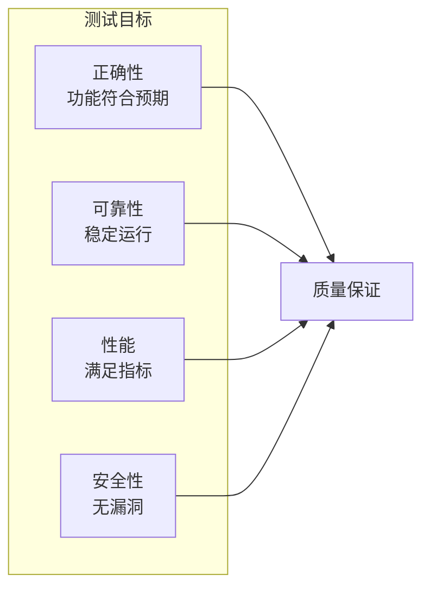
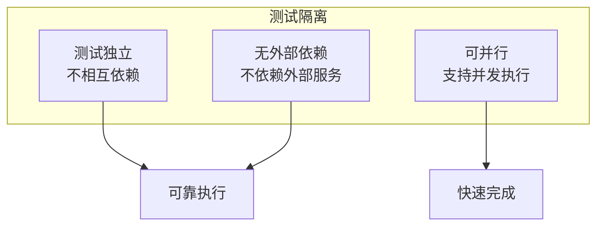
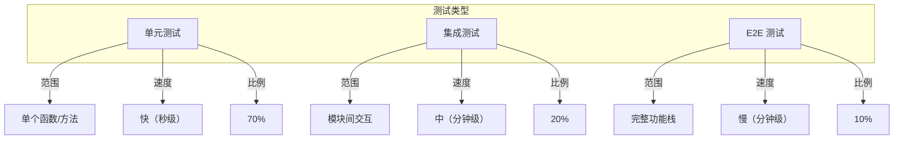
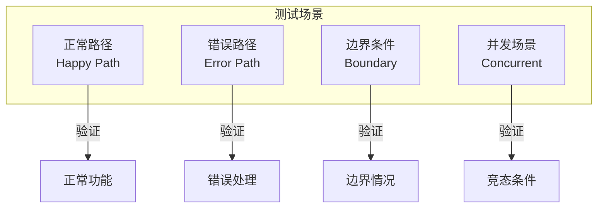

# 测试策略

本文档定义 DeP2P 的测试策略，包括测试原则、测试类型和最佳实践。

---

## 概述

### 测试目标



---

## 测试原则

### 1. 测试优先

| 原则 | 描述 |
|------|------|
| 新功能必须有测试 | 功能开发同时编写测试 |
| Bug 修复必须有回归测试 | 防止问题复现 |
| 重构前确保测试充分 | 安全重构的基础 |

### 2. 快速反馈

| 测试类型 | 执行时间 | 反馈周期 |
|---------|---------|---------|
| 单元测试 | 秒级 | 每次保存 |
| 集成测试 | 分钟级 | 每次提交 |
| E2E 测试 | 分钟级 | CI 流水线 |

### 3. 隔离性



### 4. 可重复性

- 相同输入产生相同结果
- 避免时间相关的失败
- 使用确定性种子
- 显式设置超时

---

## 测试类型

### 测试类型对比



### 单元测试

**目标**：验证单个函数/方法的正确性

**特点**：
- 快速执行（毫秒级）
- 高覆盖率
- 覆盖边界条件和错误路径

**示例**：

```go
func TestParseAddress(t *testing.T) {
    tests := []struct {
        name    string
        input   string
        want    *Address
        wantErr bool
    }{
        {
            name:  "valid ip4",
            input: "/ip4/127.0.0.1/udp/8000/quic-v1",
            want:  &Address{IP: net.ParseIP("127.0.0.1"), Port: 8000},
        },
        {
            name:    "invalid format",
            input:   "invalid",
            wantErr: true,
        },
    }
    
    for _, tt := range tests {
        t.Run(tt.name, func(t *testing.T) {
            got, err := ParseAddress(tt.input)
            if tt.wantErr {
                require.Error(t, err)
                return
            }
            require.NoError(t, err)
            assert.Equal(t, tt.want, got)
        })
    }
}
```

### 集成测试

**目标**：验证模块间的交互

**特点**：
- 测试多个组件协作
- 发现接口不匹配
- 验证数据流转

**示例**：

```go
func TestDiscoveryAddressBook(t *testing.T) {
    // 创建测试节点
    nodeA := testutils.NewTestNode(t)
    nodeB := testutils.NewTestNode(t)
    defer nodeA.Close()
    defer nodeB.Close()
    
    // 启动节点
    nodeA.Start(t)
    nodeB.Start(t)
    
    // 验证地址簿更新
    require.Eventually(t, func() bool {
        addrs := nodeA.AddressBook().Addrs(nodeB.ID())
        return len(addrs) > 0
    }, 10*time.Second, 100*time.Millisecond)
}
```

### E2E 测试

**目标**：验证完整的功能栈

**特点**：
- 模拟真实场景
- 验证用户路径
- 发现系统级问题

**示例**：

```go
func TestTwoNodesConnect(t *testing.T) {
    nodeA, nodeB := testutils.NewTestFacadeNodePair(t)
    defer testutils.CloseFacadeNodes(nodeA, nodeB)
    
    testutils.StartFacadeAndWait(t, 5*time.Second, nodeA, nodeB)
    
    ctx, cancel := context.WithTimeout(context.Background(), 10*time.Second)
    defer cancel()
    
    // 获取 nodeB 的可分享地址
    addrs := nodeB.Node.ShareableAddrs()
    require.NotEmpty(t, addrs)
    
    // nodeA 连接到 nodeB
    conn, err := nodeA.Node.ConnectToAddr(ctx, addrs[0])
    require.NoError(t, err)
    require.NotNil(t, conn)
    
    // 验证连接
    assert.Equal(t, nodeB.Node.ID(), conn.RemoteID())
}
```

---

## 测试方法

### 表驱动测试

```go
func TestConnectionSemantics(t *testing.T) {
    tests := []struct {
        name     string
        dialType string
        input    interface{}
        wantErr  error
    }{
        {
            name:     "DialByNodeID",
            dialType: "nodeID",
            input:    validNodeID,
            wantErr:  nil,
        },
        {
            name:     "DialByFullAddress",
            dialType: "fullAddr",
            input:    validFullAddr,
            wantErr:  nil,
        },
        {
            name:     "InvalidNodeID",
            dialType: "nodeID",
            input:    invalidNodeID,
            wantErr:  ErrConnectionFailed,
        },
    }
    
    for _, tt := range tests {
        t.Run(tt.name, func(t *testing.T) {
            // 执行测试
            err := testDial(tt.dialType, tt.input)
            
            // 验证结果
            if tt.wantErr != nil {
                require.ErrorIs(t, err, tt.wantErr)
            } else {
                require.NoError(t, err)
            }
        })
    }
}
```

### Mock 使用

```go
// 定义 Mock
type MockTransport struct {
    mock.Mock
}

func (m *MockTransport) Dial(ctx context.Context, addr Address) (Connection, error) {
    args := m.Called(ctx, addr)
    if args.Get(0) == nil {
        return nil, args.Error(1)
    }
    return args.Get(0).(Connection), args.Error(1)
}

// 使用 Mock
func TestEndpointConnect(t *testing.T) {
    mockTransport := new(MockTransport)
    mockTransport.On("Dial", mock.Anything, mock.Anything).Return(mockConn, nil)
    
    endpoint := NewEndpoint(mockTransport)
    conn, err := endpoint.Connect(context.Background(), nodeID)
    
    require.NoError(t, err)
    mockTransport.AssertExpectations(t)
}
```

### 测试工具

| 工具 | 用途 | 位置 |
|------|------|------|
| `testutils.NewTestNode` | 创建测试节点 | `tests/testutils/node.go` |
| `testutils.NewTestFacadeNode` | 创建 Facade 节点 | `tests/testutils/facade_node.go` |
| `testutils.WaitFor` | 等待条件满足 | `tests/testutils/wait.go` |
| `testutils.VerifyNoLeaks` | 检测 Goroutine 泄漏 | `tests/testutils/leak.go` |

---

## 测试场景

### 场景覆盖



### 正常路径

验证功能在正常情况下的行为：

```go
func TestConnect_Success(t *testing.T) {
    // 正常连接场景
    conn, err := node.Connect(ctx, peerID)
    require.NoError(t, err)
    require.NotNil(t, conn)
}
```

### 错误路径

验证错误情况下的处理：

```go
func TestConnect_Failure(t *testing.T) {
    // 连接失败场景
    _, err := node.Connect(ctx, invalidPeerID)
    require.Error(t, err)
    require.ErrorIs(t, err, ErrConnectionFailed)
}
```

### 边界条件

验证边界情况：

```go
func TestConnect_Timeout(t *testing.T) {
    ctx, cancel := context.WithTimeout(context.Background(), 1*time.Millisecond)
    defer cancel()
    
    _, err := node.Connect(ctx, peerID)
    require.ErrorIs(t, err, context.DeadlineExceeded)
}
```

### 并发场景

验证并发安全：

```go
func TestConnect_Concurrent(t *testing.T) {
    var wg sync.WaitGroup
    for i := 0; i < 10; i++ {
        wg.Add(1)
        go func() {
            defer wg.Done()
            conn, err := node.Connect(ctx, peerID)
            require.NoError(t, err)
            conn.Close()
        }()
    }
    wg.Wait()
}
```

---

## 测试数据

### 测试数据准备

| 类型 | 方法 | 示例 |
|------|------|------|
| 固定数据 | 常量定义 | `validNodeID`, `validAddr` |
| 随机数据 | 生成器 | `testutils.RandomNodeID()` |
| 文件数据 | JSON/YAML | `testdata/peers.json` |

### 测试数据清理

```go
func TestWithCleanup(t *testing.T) {
    // 创建资源
    node := createTestNode(t)
    
    // 注册清理
    t.Cleanup(func() {
        node.Close()
    })
    
    // 执行测试
    // ...
}
```

---

## 最佳实践

### 测试命名

| 格式 | 示例 |
|------|------|
| `Test{Function}_{Scenario}` | `TestConnect_Success` |
| `Test{Feature}_{Condition}_{Result}` | `TestRealm_NotMember_ReturnsError` |

### 测试结构

```go
func TestFunction(t *testing.T) {
    // Arrange: 准备测试数据
    input := prepareInput()
    expected := prepareExpected()
    
    // Act: 执行被测函数
    actual := Function(input)
    
    // Assert: 验证结果
    assert.Equal(t, expected, actual)
}
```

### 避免的模式

| 模式 | 问题 | 替代方案 |
|------|------|---------|
| 测试间共享状态 | 相互影响 | 每个测试独立 |
| 硬编码超时 | 不稳定 | 使用配置 |
| 依赖执行顺序 | 脆弱 | 独立测试 |
| 忽略错误 | 隐藏问题 | 显式检查 |

---

## 相关文档

- [测试追踪概述](README.md)
- [覆盖率要求](coverage.md)
- [测试分层](test-plan.md)
- [测试代码](../../tests/README.md)
