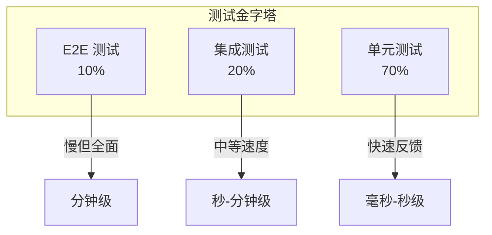
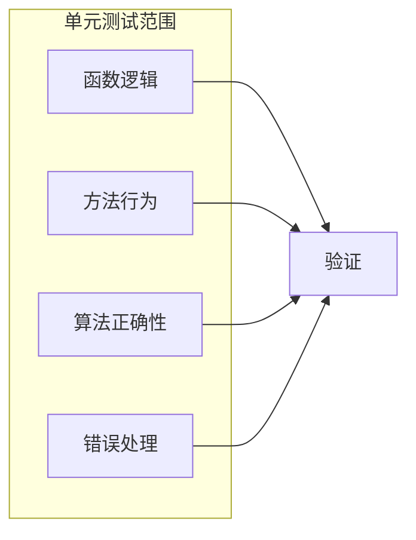
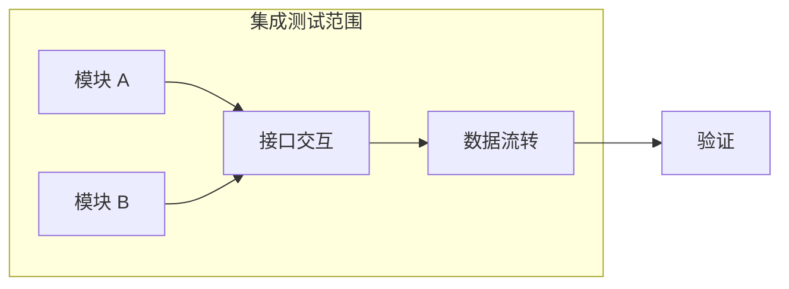
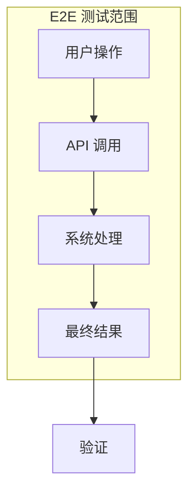
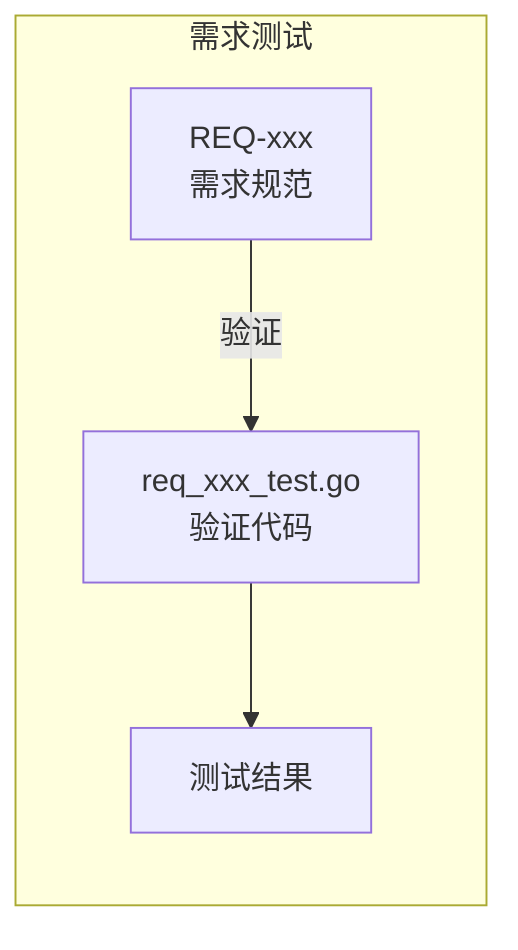
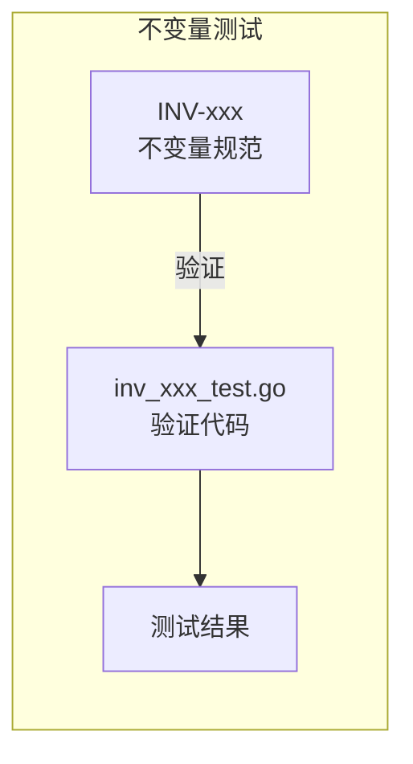
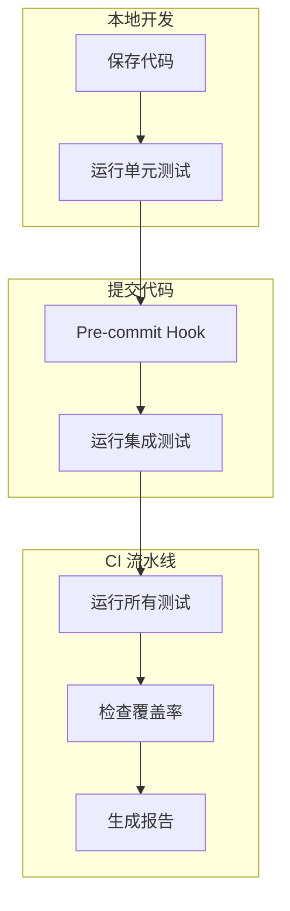
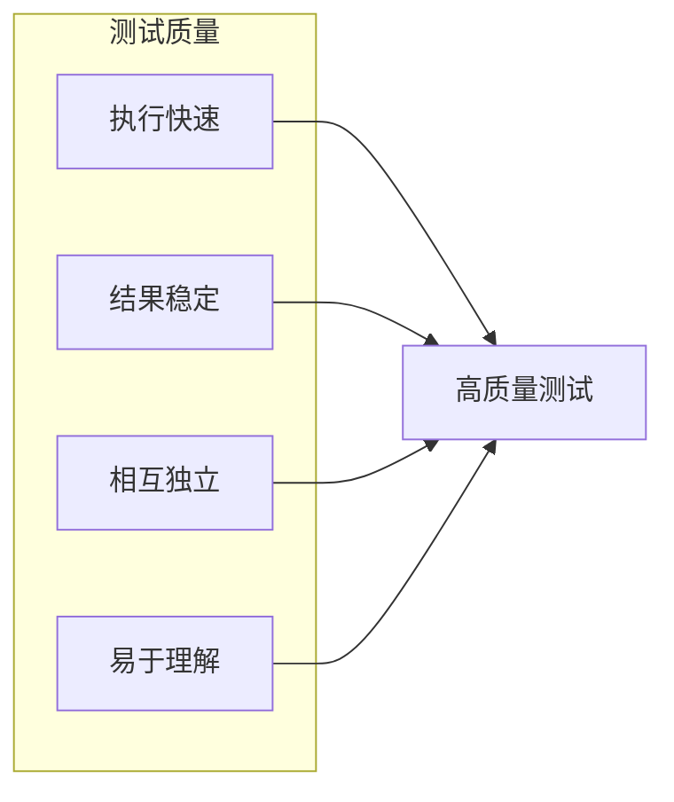

# 测试计划

本文档定义 DeP2P 的测试分层策略和测试执行计划。

---

## 概述

### 测试金字塔



### 测试层次

| 层次 | 占比 | 执行时间 | 触发时机 |
|------|------|---------|---------|
| 单元测试 | 70% | 毫秒-秒 | 每次保存 |
| 集成测试 | 20% | 秒-分钟 | 每次提交 |
| E2E 测试 | 10% | 分钟 | CI 流水线 |

---

## 单元测试

### 测试范围

单元测试验证单个函数/方法的正确性：



### 测试位置

| 模块 | 测试文件位置 | 示例 |
|------|-------------|------|
| identity | `internal/core/identity/*_test.go` | `identity_test.go` |
| transport | `internal/core/transport/*_test.go` | `quic/quic_test.go` |
| security | `internal/core/security/*_test.go` | `tls/tls_test.go` |
| discovery | `internal/core/discovery/*_test.go` | `dht/dht_test.go` |
| realm | `internal/core/realm/*_test.go` | `realm_test.go` |
| messaging | `internal/core/messaging/*_test.go` | `service_test.go` |

### 测试工具

```go
import (
    "testing"
    
    "github.com/stretchr/testify/assert"
    "github.com/stretchr/testify/require"
    "github.com/stretchr/testify/mock"
)

// 使用 assert 进行断言
func TestFunction(t *testing.T) {
    result := Function(input)
    assert.Equal(t, expected, result)
}

// 使用 require 进行必要检查
func TestCritical(t *testing.T) {
    result, err := CriticalFunction(input)
    require.NoError(t, err)
    require.NotNil(t, result)
}

// 使用 mock 进行依赖模拟
func TestWithMock(t *testing.T) {
    mockDep := new(MockDependency)
    mockDep.On("Method", mock.Anything).Return(expectedResult, nil)
    
    result := TestedFunction(mockDep)
    mockDep.AssertExpectations(t)
}
```

### 运行命令

```bash
# 运行所有单元测试
go test ./internal/...

# 运行特定模块测试
go test ./internal/core/identity/...

# 带覆盖率运行
go test ./internal/... -cover

# 详细输出
go test ./internal/... -v
```

---

## 集成测试

### 测试范围

集成测试验证模块间的交互：



### 测试位置

| 测试场景 | 位置 | 说明 |
|---------|------|------|
| Discovery + AddressBook | `tests/integration/discovery_addressbook_test.go` | 发现与地址簿集成 |
| Endpoint + ConnMgr | `tests/integration/endpoint_connmgr_test.go` | 端点与连接管理集成 |
| Transport + Security | `tests/integration/transport_security_test.go` | 传输与安全层集成 |

### 测试示例

```go
// tests/integration/discovery_addressbook_test.go
func TestDiscoveryAddressBookIntegration(t *testing.T) {
    // 创建测试环境
    nodeA := testutils.NewTestNode(t)
    nodeB := testutils.NewTestNode(t)
    defer nodeA.Close()
    defer nodeB.Close()
    
    // 启动节点
    require.NoError(t, nodeA.Start())
    require.NoError(t, nodeB.Start())
    
    // 连接节点
    ctx, cancel := context.WithTimeout(context.Background(), 10*time.Second)
    defer cancel()
    
    _, err := nodeA.Connect(ctx, nodeB.ID())
    require.NoError(t, err)
    
    // 验证地址簿更新
    require.Eventually(t, func() bool {
        addrs := nodeA.AddressBook().Addrs(nodeB.ID())
        return len(addrs) > 0
    }, 5*time.Second, 100*time.Millisecond)
}
```

### 运行命令

```bash
# 运行所有集成测试
go test ./tests/integration/... -v

# 运行特定集成测试
go test ./tests/integration/... -run TestDiscoveryAddressBook -v
```

---

## E2E 测试

### 测试范围

E2E 测试验证完整的功能栈：



### 测试位置

| 测试场景 | 位置 | 说明 |
|---------|------|------|
| 本机连接 | `tests/e2e/local_test.go` | 本机多节点连接 |
| Echo 协议 | `tests/e2e/echo_test.go` | Echo 协议测试 |
| 安全层 | `tests/e2e/security_test.go` | TLS/Noise 测试 |
| 多路复用 | `tests/e2e/muxer_test.go` | Yamux 测试 |
| 发现服务 | `tests/e2e/discovery_test.go` | DHT/mDNS 测试 |
| Relay 中继 | `tests/e2e/relay_test.go` | 中继功能测试 |
| NAT 穿透 | `tests/e2e/nat_test.go` | NAT 穿透测试 |
| Realm | `tests/e2e/realm_test.go` | Realm 隔离测试 |
| PubSub | `tests/e2e/pubsub_test.go` | 发布订阅测试 |
| 矩阵测试 | `tests/e2e/matrix_test.go` | Transport x Security 组合 |
| 压力测试 | `tests/e2e/stress_test.go` | 高负载测试 |
| 性能测试 | `tests/e2e/benchmark_test.go` | 性能基准 |

### 测试示例

```go
// tests/e2e/local_test.go
func TestTwoNodesConnect(t *testing.T) {
    nodeA, nodeB := testutils.NewTestFacadeNodePair(t)
    defer testutils.CloseFacadeNodes(nodeA, nodeB)
    
    testutils.StartFacadeAndWait(t, 5*time.Second, nodeA, nodeB)
    
    ctx, cancel := context.WithTimeout(context.Background(), 10*time.Second)
    defer cancel()
    
    // 获取 nodeB 的可分享地址
    addrs := nodeB.Node.ShareableAddrs()
    require.NotEmpty(t, addrs, "nodeB 应有可分享地址")
    
    // nodeA 连接到 nodeB
    conn, err := nodeA.Node.ConnectToAddr(ctx, addrs[0])
    require.NoError(t, err)
    require.NotNil(t, conn)
    
    // 验证连接
    assert.Equal(t, nodeB.Node.ID(), conn.RemoteID())
}
```

### 运行命令

```bash
# 运行所有 E2E 测试
go test ./tests/e2e/... -v -timeout 10m

# 快速回归测试
go test ./tests/e2e/... -short -timeout 2m

# 运行压力测试
go test ./tests/e2e/... -run TestStress -timeout 5m

# 运行性能测试
go test ./tests/e2e/... -run Benchmark -bench . -benchtime 10s
```

---

## 需求测试

### 测试范围

需求测试验证需求规范的实现：



### 测试位置

| 需求 | 测试文件 | 说明 |
|------|---------|------|
| REQ-CONN-* | `tests/requirements/req_conn_*.go` | 连接相关需求 |
| REQ-REALM-* | `tests/requirements/req_realm_*.go` | Realm 相关需求 |
| REQ-ADDR-* | `tests/requirements/req_addr_*.go` | 地址相关需求 |
| REQ-BOOT-* | `tests/requirements/req_boot_*.go` | Bootstrap 相关需求 |
| REQ-DISC-* | `tests/requirements/req_disc_*.go` | 发现相关需求 |
| REQ-SEC-* | `tests/requirements/req_sec_*.go` | 安全相关需求 |
| REQ-RELAY-* | `tests/requirements/req_relay_*.go` | 中继相关需求 |

### 运行命令

```bash
# 运行所有需求测试
go test ./tests/requirements/... -v
```

---

## 不变量测试

### 测试范围

不变量测试验证系统不变量：



### 测试位置

| 不变量 | 测试文件 | 说明 |
|--------|---------|------|
| INV-001 | `tests/invariants/inv_001_identity_first_test.go` | 身份第一性 |
| INV-002 | `tests/invariants/inv_002_address_as_path_test.go` | 地址第二性 |
| INV-003 | `tests/invariants/inv_003_layer_exposure_test.go` | 层间暴露控制 |
| INV-004 | `tests/invariants/inv_004_connection_semantics_test.go` | 连接语义 |
| INV-005 | `tests/invariants/inv_005_shareableaddrs_verifieddirect_test.go` | 可分享地址 |

### 运行命令

```bash
# 运行所有不变量测试
go test ./tests/invariants/... -v
```

---

## 测试执行

### 执行流程



### 执行命令汇总

```bash
# 快速测试（开发时）
go test ./internal/... -short

# 完整测试（提交前）
go test ./... -timeout 10m

# CI 测试（带覆盖率）
go test ./... -coverprofile=coverage.out -timeout 15m

# 生成覆盖率报告
go tool cover -html=coverage.out -o coverage.html
```

---

## 测试维护

### 维护策略

| 策略 | 描述 |
|------|------|
| 定期审查 | 每月审查测试覆盖率 |
| 及时更新 | 功能变更时更新测试 |
| 清理冗余 | 移除无效测试 |
| 优化速度 | 保持测试快速执行 |

### 测试质量检查



---

## 相关文档

- [测试追踪概述](README.md)
- [测试策略](strategy.md)
- [覆盖率要求](coverage.md)
- [测试用例](cases/)
