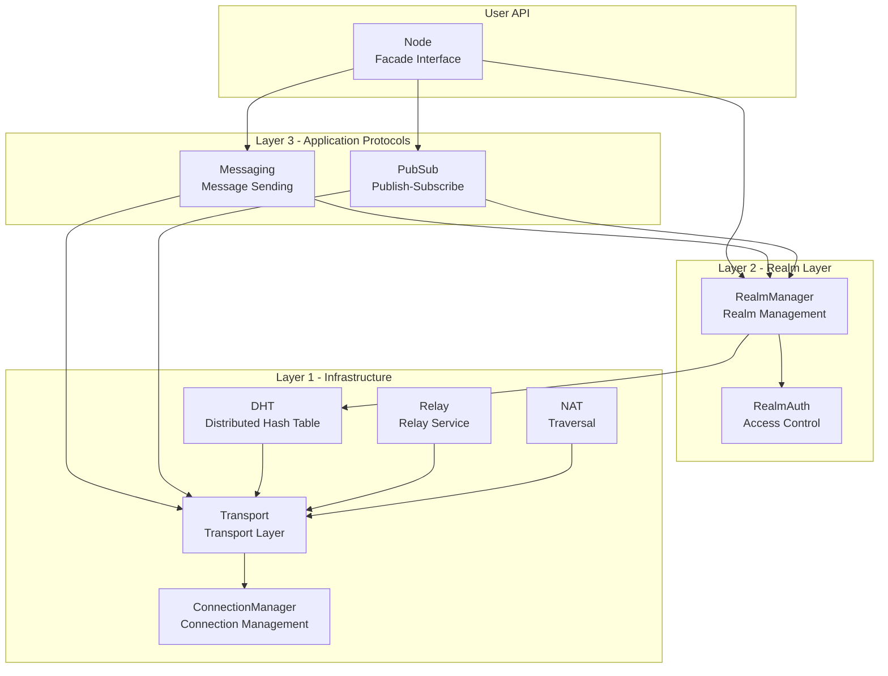
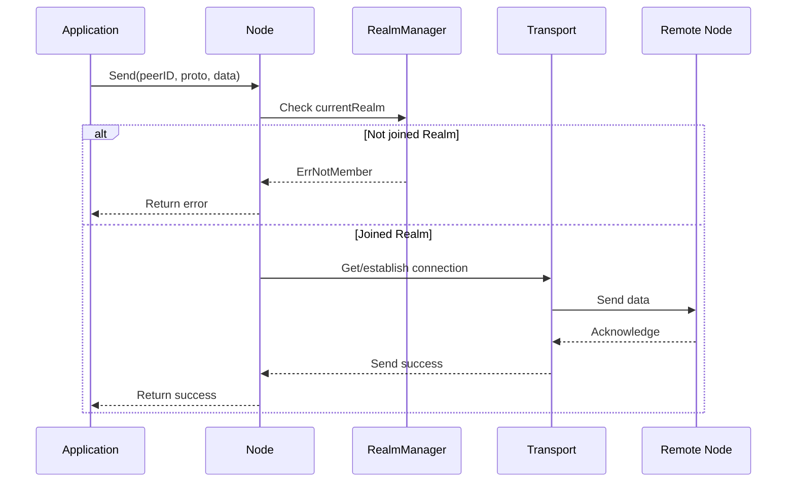
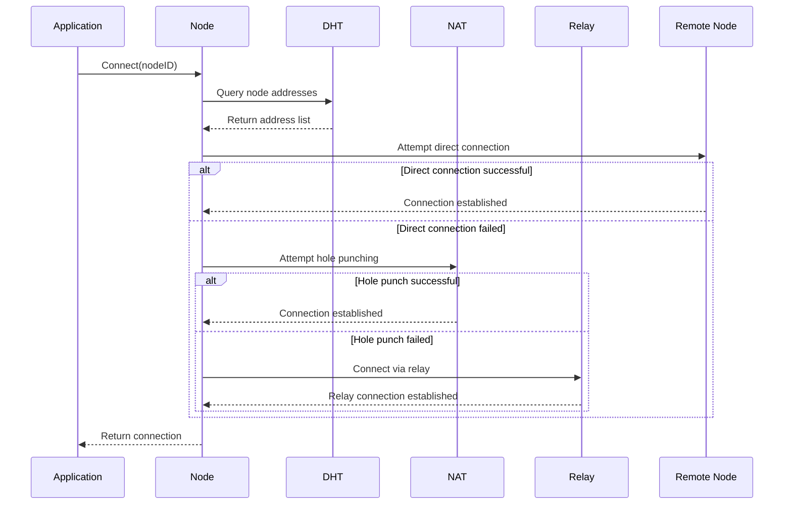

# Architecture Overview

This document introduces the system architecture design of DeP2P, helping you understand how components work together.

---

## Architecture Design Philosophy

```
┌─────────────────────────────────────────────────────────────────────┐
│                    DeP2P Architecture Philosophy                     │
├─────────────────────────────────────────────────────────────────────┤
│                                                                      │
│  1. Simple and Easy to Use                                           │
│     Make P2P connections as simple as calling a function             │
│                                                                      │
│  2. Shared Infrastructure + Business Isolation                       │
│     All nodes share DHT/Relay/NAT, while business layer is isolated │
│                                                                      │
│  3. Strict Single-Realm Model                                        │
│     Node belongs to one Realm at a time, zero business interaction   │
│     before Join                                                      │
│                                                                      │
│  4. Transparent Infrastructure                                       │
│     System layer completely transparent to users, no manual config   │
│                                                                      │
└─────────────────────────────────────────────────────────────────────┘
```

---

## Three-Layer Architecture Details

DeP2P adopts a three-layer architecture design, with each layer having clear responsibilities and boundaries:

### Layer 1: Infrastructure Layer

```
┌─────────────────────────────────────────────────────────────────────────────┐
│  Layer 1: Infrastructure Layer                                              │
├─────────────────────────────────────────────────────────────────────────────┤
│                                                                              │
│   ┌────────────────────────────────────────────────────────────────────┐    │
│   │                        Transport Subsystem                          │    │
│   │  ────────────────────────────────────────────────────────────────  │    │
│   │  • QUIC (Recommended) - Built-in encryption, mux, 0-RTT            │    │
│   │  • TCP               - Traditional environment compatibility       │    │
│   │  • WebSocket         - Browser compatibility                       │    │
│   │  • TLS/Noise         - Security layer                              │    │
│   └────────────────────────────────────────────────────────────────────┘    │
│                                                                              │
│   ┌─────────────┐  ┌─────────────┐  ┌─────────────┐  ┌─────────────┐       │
│   │  System DHT │  │   Relay     │  │     NAT     │  │  Bootstrap  │       │
│   │  ─────────  │  │  ─────────  │  │  ─────────  │  │  ─────────  │       │
│   │  Kademlia   │  │  Fallback   │  │  Address    │  │  Seed       │       │
│   │  Routing    │  │  channel    │  │  discovery  │  │  nodes      │       │
│   │  Discovery  │  │  when NAT   │  │  STUN/UPnP  │  │  DHT entry  │       │
│   │  Provider   │  │  fails      │  │  NAT type   │  │  point      │       │
│   └─────────────┘  └─────────────┘  └─────────────┘  └─────────────┘       │
│                                                                              │
│   Characteristic: Auto-ready on node start, completely transparent to user  │
│   Protocol Prefix: /dep2p/sys/...                                           │
│                                                                              │
└─────────────────────────────────────────────────────────────────────────────┘
```

### Layer 2: Realm Layer (Business Isolation)

```
┌─────────────────────────────────────────────────────────────────────────────┐
│  Layer 2: Realm Layer (Business Isolation)                                  │
├─────────────────────────────────────────────────────────────────────────────┤
│                                                                              │
│   ┌─────────────────────────────────────────────────────────────────────┐   │
│   │                        Realm Manager                                 │   │
│   │  ─────────────────────────────────────────────────────────────────  │   │
│   │  • JoinRealm(realmID)     Join specified Realm                      │   │
│   │  • LeaveRealm()           Leave current Realm                       │   │
│   │  • CurrentRealm()         Get current Realm                         │   │
│   │  • SwitchRealm(realmID)   Switch to another Realm (atomic)          │   │
│   └─────────────────────────────────────────────────────────────────────┘   │
│                                                                              │
│   ┌────────────────┐  ┌────────────────┐  ┌────────────────┐               │
│   │   Membership   │  │ Access Control │  │   RealmAuth    │               │
│   │   ──────────  │  │   ──────────  │  │   ──────────  │               │
│   │   Peer list    │  │   Public      │  │   Signature    │               │
│   │   Online state │  │   Protected   │  │   verification │               │
│   │   Service disc │  │   Private     │  │   Credential   │               │
│   └────────────────┘  └────────────────┘  └────────────────┘               │
│                                                                              │
│   Characteristic: User explicit operation, strict single-Realm              │
│   Protocol Prefix: /dep2p/sys/realm/...                                     │
│                                                                              │
└─────────────────────────────────────────────────────────────────────────────┘
```

### Layer 3: Application Protocols

```
┌─────────────────────────────────────────────────────────────────────────────┐
│  Layer 3: Application Protocols                                             │
├─────────────────────────────────────────────────────────────────────────────┤
│                                                                              │
│   ┌─────────────────────────────────┐  ┌─────────────────────────────────┐ │
│   │      Stream Protocols           │  │       PubSub Protocols          │ │
│   │  ─────────────────────────────  │  │  ─────────────────────────────  │ │
│   │                                  │  │                                  │ │
│   │  Send(peerID, proto, data)      │  │  Publish(topic, data)           │ │
│   │  └─ One-way send, no response   │  │  └─ Publish to topic            │ │
│   │                                  │  │                                  │ │
│   │  Request(peerID, proto, req)    │  │  Subscribe(topic, handler)      │ │
│   │  └─ Request-response pattern    │  │  └─ Subscribe to topic          │ │
│   │                                  │  │                                  │ │
│   │  OpenStream(peerID, proto)      │  │  Query(topic, query)            │ │
│   │  └─ Bidirectional stream        │  │  └─ Query topic data            │ │
│   │                                  │  │                                  │ │
│   └─────────────────────────────────┘  └─────────────────────────────────┘ │
│                                                                              │
│   [!] Must JoinRealm first, otherwise returns ErrNotMember                  │
│   Protocol Prefix: /dep2p/app/...                                           │
│                                                                              │
└─────────────────────────────────────────────────────────────────────────────┘
```

---

## Core Components Overview



### Node (Facade Interface)

Node is the main entry point for users to interact with DeP2P, providing a simple API:

```go
type Node interface {
    // Basic info
    ID() NodeID                    // Get node ID
    ListenAddrs() []Multiaddr      // Get listen addresses
    Close() error                  // Close node
    
    // Realm management
    Realm() RealmManager           // Get Realm manager
    
    // Connection management
    Connect(ctx, nodeID) (Conn, error)           // Connect to node
    ConnectToAddr(ctx, addr) (Conn, error)       // Connect to address
    
    // Messaging (requires JoinRealm)
    Send(ctx, peerID, proto, data) error         // One-way send
    Request(ctx, peerID, proto, req) (Response, error)  // Request-response
    
    // Protocol handlers
    SetStreamHandler(proto, handler)             // Set stream handler
    
    // PubSub (requires JoinRealm)
    Publish(ctx, topic, data) error              // Publish
    Subscribe(topic, handler) (Subscription, error)  // Subscribe
}
```

### ConnectionManager

The connection manager is responsible for managing connections between nodes:

```
┌─────────────────────────────────────────────────────────────────────────────┐
│                     ConnectionManager Responsibilities                       │
├─────────────────────────────────────────────────────────────────────────────┤
│                                                                              │
│  Watermark Control                                                           │
│  ─────────────────                                                          │
│  • LowWatermark   - Don't trim when connection count is below this          │
│  • HighWatermark  - Trigger trimming when connection count exceeds this     │
│                                                                              │
│  Connection Protection                                                       │
│  ────────────────────                                                       │
│  • Mark important connections (won't be trimmed)                            │
│  • Bootstrap connection protection                                          │
│  • Active connection protection                                             │
│                                                                              │
│  Trimming Strategy                                                           │
│  ─────────────────                                                          │
│  • Prioritize trimming idle connections                                     │
│  • Prioritize trimming non-Realm connections                                │
│  • Keep recently active connections                                         │
│                                                                              │
└─────────────────────────────────────────────────────────────────────────────┘
```

---

## User Perspective: Three Steps

From the user's perspective, using DeP2P only requires three steps:

```mermaid
flowchart LR
    subgraph Step1 [Step 1: Start Node]
        Create["node, _ := dep2p.New(ctx, preset)\n_ = node.Start(ctx)"]
        L1Ready["Layer 1 auto-ready"]
        Create --> L1Ready
    end
    
    subgraph Step2 [Step 2: Join Realm]
        Join["realm, _ := node.Realm(\"name\")\n_ = realm.Join(ctx)"]
        L2Ready["Layer 2 access granted"]
        Join --> L2Ready
    end
    
    subgraph Step3 [Step 3: Business Communication]
        Send["node.Send(ctx, peerID, proto, data)"]
        Publish["node.Publish(ctx, topic, data)"]
    end
    
    Step1 --> Step2
    Step2 --> Step3
```

### Complete Example

```go
package main

import (
    "context"
    "fmt"
    "log"
    
    "github.com/dep2p/go-dep2p"
)

func main() {
    ctx := context.Background()
    
    // ==========================================
    // Step 1: Start Node
    // ==========================================
    // Layer 1 Infrastructure auto-ready:
    // - Transport layer ready
    // - DHT joined network
    // - NAT address discovery
    // - Bootstrap connections established
    node, err := dep2p.New(ctx, dep2p.WithPreset(dep2p.PresetDesktop))
    if err != nil {
        log.Fatalf("Failed to create node: %v", err)
    }
    if err := node.Start(ctx); err != nil {
        log.Fatalf("Failed to start node: %v", err)
    }
    defer node.Close()
    
    fmt.Printf("Node ID: %s\n", node.ID())
    fmt.Printf("Listen Addresses: %v\n", node.ListenAddrs())
    
    // ==========================================
    // Step 2: Join Realm
    // ==========================================
    // Layer 2 Realm Layer:
    // - Execute RealmAuth verification
    // - Set currentRealm
    // - Can discover peers within Realm
    realm, err := node.Realm("my-app-realm")
    if err != nil {
        log.Fatalf("Failed to get Realm: %v", err)
    }
    if err := realm.Join(ctx); err != nil {
        log.Fatalf("Failed to join Realm: %v", err)
    }
    fmt.Printf("Joined Realm: %s\n", realm.ID())
    
    // ==========================================
    // Step 3: Business Communication
    // ==========================================
    // Layer 3 Application Protocols:
    // - Register protocol handlers
    // - Send messages
    // - Publish-subscribe
    
    // Register protocol handler
    node.SetStreamHandler("/my-app/echo/1.0", func(s dep2p.Stream) {
        defer s.Close()
        buf := make([]byte, 1024)
        n, _ := s.Read(buf)
        s.Write(buf[:n])  // Echo back
    })
    
    // Send message to other nodes
    // remoteNodeID := "..." // Other node's ID
    // node.Send(ctx, remoteNodeID, "/my-app/echo/1.0", []byte("Hello!"))
    
    // Publish message to topic
    // node.Publish(ctx, "my-app-topic", []byte("Broadcast message"))
    
    fmt.Println("Node is ready, waiting for messages...")
    select {} // Keep running
}
```

---

## Data Flow

### Message Sending Flow



### Connection Establishment Flow



---

## Key Design Decisions

### 1. Why QUIC?

| Feature | Description |
|---------|-------------|
| **Built-in Encryption** | TLS 1.3, no extra security layer needed |
| **Multiplexing** | Native stream multiplexing, no yamux/mplex needed |
| **0-RTT** | Fast connection establishment |
| **Connection Migration** | Connection doesn't break when IP changes |

### 2. Why Strict Single-Realm?

| Reason | Description |
|--------|-------------|
| **Simplified State Management** | One node one Realm, clear state |
| **Prevent Cross-Realm Leakage** | Business data won't accidentally cross Realms |
| **Controllable Resources** | Connection count, discovery scope predictable |

### 3. Why Transparent Layer 1?

| Reason | Description |
|--------|-------------|
| **Lower Barrier to Entry** | Users don't need to understand DHT/NAT/Relay |
| **Auto Optimization** | System automatically chooses optimal connection path |
| **Reduce Configuration Errors** | Default config works for most scenarios |

---

## Preset Configurations

DeP2P provides multiple preset configurations for different scenarios:

```
┌─────────────────────────────────────────────────────────────────────────────┐
│                        Preset Configuration Comparison                       │
├─────────────────────────────────────────────────────────────────────────────┤
│                                                                              │
│  Preset          │ Conn Limit │ DHT  │ Relay │ Use Case                     │
│  ────────────────┼────────────┼──────┼───────┼──────────────────────────────│
│  PresetMobile    │ 20/50      │ ✅   │ ✅    │ Mobile, tablets, low resource │
│  PresetDesktop   │ 50/100     │ ✅   │ ✅    │ PC, laptops, default config   │
│  PresetServer    │ 200/500    │ ✅   │ ✅    │ Server nodes, high performance│
│  PresetMinimal   │ 10/20      │ ❌   │ ❌    │ Testing, LAN, minimal config  │
│                                                                              │
└─────────────────────────────────────────────────────────────────────────────┘
```

---

## Next Steps

- [Comparison with Other Libraries](comparison.md) - Learn differences between DeP2P and libp2p/iroh
- [Core Concepts](core-concepts.md) - Deep dive into core concepts
- [5-Minute Quickstart](../getting-started/quickstart.md) - Hands-on practice
- [Create Your First Node](../getting-started/first-node.md) - Detailed node configuration
