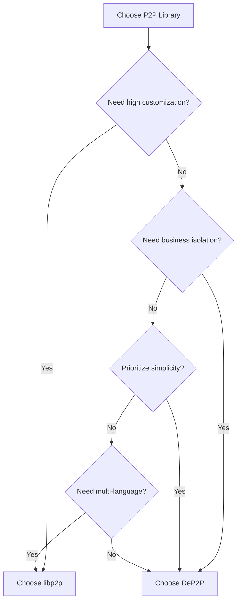
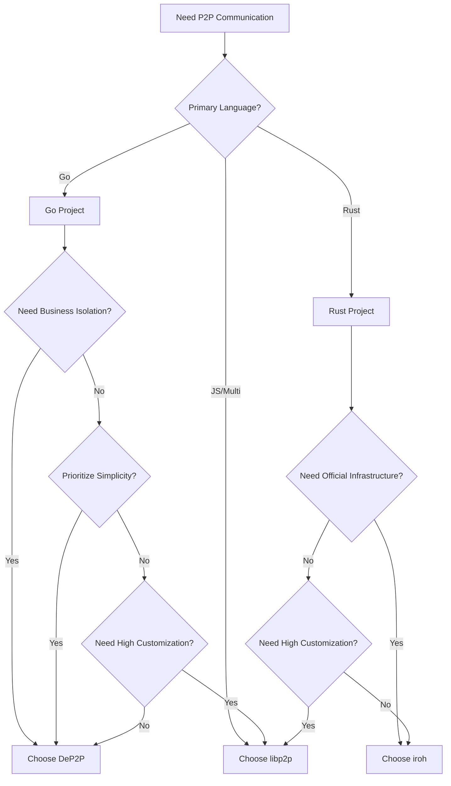

# Comparison with Other Libraries

This document compares DeP2P with mainstream P2P libraries (libp2p, iroh) to help you choose the right library.

---

## Project Overview

| Project | Language | Main Applications | Features |
|---------|----------|-------------------|----------|
| **DeP2P** | Go | Blockchain, distributed apps | Simple API, Realm isolation |
| **libp2p** | Go/Rust/JS | IPFS, Filecoin, Ethereum 2.0 | Modular, protocol-rich |
| **iroh** | Rust | iroh-net, Dumbpipe | Simple API, MagicSock |

---

## DeP2P vs libp2p

### Core Comparison

```
┌─────────────────────────────────────────────────────────────────────────────┐
│                        DeP2P vs libp2p                                       │
├─────────────────────────────────────────────────────────────────────────────┤
│                                                                              │
│  DeP2P                                   libp2p                              │
│  ──────────────────                      ──────────────────                  │
│                                                                              │
│  ✅ Simple API                           ⚠️ Complex API                      │
│  node.Send(nodeID, data)                 Need to configure Host, Transport, │
│  3 lines to connect                      Muxer, Security, Discovery...      │
│                                                                              │
│  ✅ Realm Business Isolation             ⚠️ PSK (weak isolation)             │
│  Different business networks isolated    Need to manually manage isolation  │
│  Shared infrastructure                                                       │
│                                                                              │
│  ✅ Preset Configuration                 ⚠️ Detailed configuration needed    │
│  WithPreset(PresetDesktop)               Need to configure each component   │
│                                                                              │
│  ✅ Gentle learning curve                ⚠️ Steep learning curve             │
│  Simple concepts, quick start            Many concepts, deep understanding  │
│                                                                              │
│  ⚠️ Moderate customization               ✅ Highly customizable              │
│  Suitable for most scenarios             Fully pluggable, replaceable parts │
│                                                                              │
│  ⚠️ New ecosystem                        ✅ Mature ecosystem                  │
│  Developing                              Many production cases              │
│                                                                              │
└─────────────────────────────────────────────────────────────────────────────┘
```

### Feature Comparison Table

| Feature | DeP2P | libp2p |
|---------|-------|--------|
| **Transport** | QUIC (primary) | TCP, QUIC, WebSocket, WebTransport |
| **Encryption** | TLS 1.3 | TLS 1.3, Noise Protocol |
| **Multiplexing** | QUIC native | yamux, mplex, QUIC |
| **Peer Discovery** | DHT, mDNS | DHT, mDNS, Rendezvous, Bootstrap |
| **NAT Traversal** | STUN, hole punch, relay | AutoNAT, Relay, Hole Punching, UPnP |
| **Message Patterns** | Stream, Request, PubSub | Stream, Request-Response, GossipSub |
| **Business Isolation** | Realm ✅ | PSK (weak) |
| **Connection Mgmt** | Watermark + Protection | ConnectionManager + ResourceManager |
| **API Complexity** | Low | High |
| **Learning Curve** | Gentle | Steep |

### Code Comparison

**DeP2P Start Node:**

```go
// DeP2P: 3 lines to start node and join network
node, _ := dep2p.StartNode(ctx, dep2p.WithPreset(dep2p.PresetDesktop))
node.Realm().JoinRealm(ctx, "my-realm")
node.Send(ctx, peerID, "/my/protocol", data)
```

**libp2p Start Node:**

```go
// libp2p: Need to configure multiple components
host, _ := libp2p.New(
    libp2p.ListenAddrStrings("/ip4/0.0.0.0/tcp/0"),
    libp2p.Transport(tcp.NewTCPTransport),
    libp2p.Transport(quic.NewTransport),
    libp2p.Security(noise.ID, noise.New),
    libp2p.Security(tls.ID, tls.New),
    libp2p.Muxer(yamux.ID, yamux.DefaultTransport),
    libp2p.NATPortMap(),
    libp2p.EnableRelay(),
    libp2p.EnableHolePunching(),
    // ... more configuration
)
defer host.Close()

// Still need to manually configure DHT, PubSub, etc.
dht, _ := dht.New(ctx, host)
ps, _ := pubsub.NewGossipSub(ctx, host)
```

### Selection Guidance



| Choose DeP2P if... | Choose libp2p if... |
|--------------------|---------------------|
| Need quick start | Need high customization |
| Need business network isolation | Need multi-language support |
| Prioritize simple API | Need specific transport protocols |
| Go project | Need mature ecosystem |

---

## DeP2P vs iroh

### Core Comparison

```
┌─────────────────────────────────────────────────────────────────────────────┐
│                        DeP2P vs iroh                                         │
├─────────────────────────────────────────────────────────────────────────────┤
│                                                                              │
│  DeP2P                                   iroh                                │
│  ──────────────────                      ──────────────────                  │
│                                                                              │
│  ✅ Go Native                            ⚠️ Rust (needs FFI)                 │
│  Direct use in Go projects               Go projects need bindings          │
│                                                                              │
│  ✅ Realm Business Isolation             ❌ No business isolation            │
│  Multi-tenant network isolation          Need to implement yourself         │
│                                                                              │
│  ✅ Three-Layer Architecture             ✅ Simple API                       │
│  Layer 1 transparent                     Endpoint API                        │
│  Layer 2 explicit                                                            │
│  Layer 3 business                                                            │
│                                                                              │
│  ⚠️ Self-built infrastructure            ✅ Official relay network           │
│  Need to deploy Bootstrap/Relay          Can use n0 infrastructure          │
│                                                                              │
│  ⚠️ Standard DHT                         ✅ DNS discovery + pkarr            │
│  Kademlia DHT                            Better for public network discovery│
│                                                                              │
└─────────────────────────────────────────────────────────────────────────────┘
```

### Feature Comparison Table

| Feature | DeP2P | iroh |
|---------|-------|------|
| **Language** | Go | Rust |
| **Transport** | QUIC | QUIC |
| **Connection Strategy** | Direct → Hole punch → Relay | MagicSock smart path |
| **Peer Discovery** | DHT, mDNS | DNS, DHT (optional), Local Swarm |
| **Business Isolation** | Realm ✅ | None |
| **Official Infrastructure** | None | Relay network |
| **API Complexity** | Low | Low |

### Code Comparison

**DeP2P Start Node:**

```go
// DeP2P (Go)
node, _ := dep2p.StartNode(ctx, dep2p.WithPreset(dep2p.PresetDesktop))
node.Realm().JoinRealm(ctx, "my-realm")
node.Send(ctx, peerID, "/my/protocol", data)
```

**iroh Start Node:**

```rust
// iroh (Rust)
let endpoint = Endpoint::builder()
    .discovery(DnsDiscovery::n0_dns())
    .bind()
    .await?;

let conn = endpoint.connect(node_id, ALPN).await?;
let mut send = conn.open_uni().await?;
send.write_all(data).await?;
```

### Selection Guidance

| Choose DeP2P if... | Choose iroh if... |
|--------------------|-------------------|
| Go project | Rust project |
| Need business isolation | Need official infrastructure |
| Need three-layer architecture | Need MagicSock smart paths |
| Self-built network | Using public nodes |

---

## Capability Comparison Table

### Complete Comparison

| Capability | DeP2P | libp2p | iroh |
|------------|-------|--------|------|
| **Transport** | QUIC (primary) | Multiple | QUIC |
| **Encryption** | TLS 1.3 | TLS/Noise | QUIC TLS |
| **Multiplexing** | QUIC native | yamux/mplex | QUIC native |
| **Peer Discovery** | DHT/mDNS | DHT/mDNS/Rendezvous | DNS/DHT |
| **NAT Traversal** | STUN/hole punch/relay | AutoNAT/Relay | MagicSock |
| **Message Patterns** | Stream/Req/PubSub | Same | Stream |
| **Business Isolation** | Realm ✅ | PSK (weak) | None |
| **Connection Mgmt** | Watermark/Protection | Complete | Simple |
| **API Complexity** | Low | High | Low |
| **Learning Curve** | Gentle | Steep | Gentle |
| **Language** | Go | Go/Rust/JS | Rust |
| **Ecosystem Maturity** | Developing | Mature | Developing |

### DeP2P Unique Capabilities

| Capability | Description |
|------------|-------------|
| **Realm Business Isolation** | Multi-tenant network isolation, shared infrastructure, no cross-Realm data leakage |
| **Three-Layer Architecture** | Layer 1 transparent (system), Layer 2 explicit (Realm), Layer 3 business (app protocols) |
| **Strict Single-Realm** | Node can only belong to one Realm at a time, clear state, controllable resources |
| **Preset Configuration** | Works out of the box, adapts to different scenarios (Mobile/Desktop/Server/Minimal) |
| **Identity First** | All connections target NodeID, IP/port are just dial paths |

---

## Selection Decision Tree



---

## Migration Guide

### Migrating from libp2p to DeP2P

1. **Replace Host with Node**
   - libp2p `Host` → DeP2P `Node`
   - Use `dep2p.WithPreset()` instead of detailed configuration

2. **Add Realm**
   - Call `JoinRealm()` before using business APIs
   - This is the core difference in DeP2P

3. **Adjust Message Sending**
   - libp2p `host.NewStream()` → DeP2P `node.Send()` or `node.Request()`

4. **Simplify PubSub**
   - libp2p `pubsub.NewGossipSub()` → DeP2P `node.Subscribe()` / `node.Publish()`

```go
// Before (libp2p)
host, _ := libp2p.New(/* lots of config */)
dht, _ := dht.New(ctx, host)
ps, _ := pubsub.NewGossipSub(ctx, host)
topic, _ := ps.Join("my-topic")
topic.Publish(ctx, data)

// After (DeP2P)
node, _ := dep2p.StartNode(ctx, dep2p.WithPreset(dep2p.PresetDesktop))
node.Realm().JoinRealm(ctx, "my-realm")
node.Publish(ctx, "my-topic", data)
```

---

## Summary

```
┌─────────────────────────────────────────────────────────────────────────────┐
│                        Selection Guidance Summary                            │
├─────────────────────────────────────────────────────────────────────────────┤
│                                                                              │
│  Choose DeP2P if:                                                            │
│  ─────────────────                                                          │
│  ✅ Go project                                                               │
│  ✅ Need business network isolation (Realm)                                  │
│  ✅ Prioritize simple and easy API                                           │
│  ✅ Need quick start                                                         │
│  ✅ Blockchain, distributed app scenarios                                    │
│                                                                              │
│  Choose libp2p if:                                                           │
│  ─────────────────                                                          │
│  ✅ Need high customization                                                  │
│  ✅ Need multi-language support (Go/Rust/JS)                                 │
│  ✅ Need specific transport protocols                                        │
│  ✅ Need mature ecosystem and production cases                               │
│                                                                              │
│  Choose iroh if:                                                             │
│  ─────────────────                                                          │
│  ✅ Rust project                                                             │
│  ✅ Need official relay infrastructure                                       │
│  ✅ Need MagicSock smart path selection                                      │
│  ✅ Simple point-to-point communication                                      │
│                                                                              │
└─────────────────────────────────────────────────────────────────────────────┘
```

---

## Next Steps

- [What is DeP2P](what-is-dep2p.md) - Learn about DeP2P's vision and positioning
- [Core Concepts](core-concepts.md) - Deep dive into core concepts
- [Architecture Overview](architecture-overview.md) - Understand system architecture
- [5-Minute Quickstart](../getting-started/quickstart.md) - Hands-on practice
