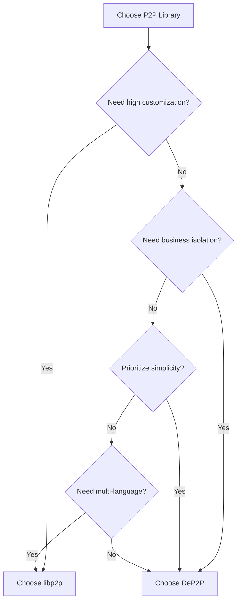
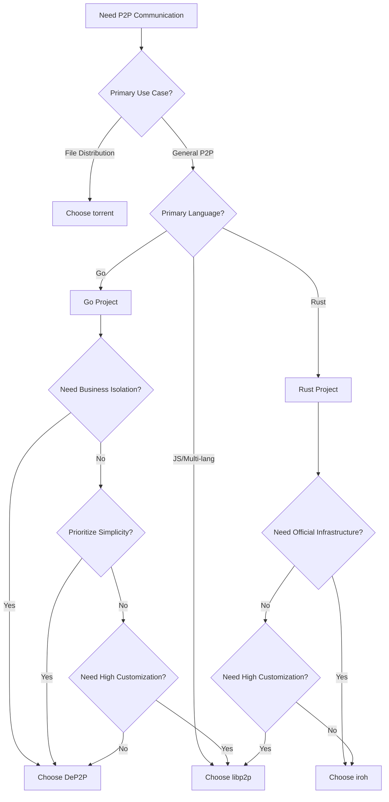

# Comparison with Other Libraries

This document compares DeP2P with mainstream P2P libraries (libp2p, iroh, torrent) to help you choose the right library.

> **Data Source**: Code metrics in this document are based on [scc](https://github.com/boyter/scc) tool statistics, dated 2026-01-29.

---

## Table of Contents

- [Project Overview](#project-overview)
- [Code Size Comparison](#code-size-comparison)
- [DeP2P vs libp2p](#dep2p-vs-libp2p)
- [DeP2P vs iroh](#dep2p-vs-iroh)
- [DeP2P vs torrent](#dep2p-vs-torrent)
- [Capability Comparison Table](#capability-comparison-table)
- [Decision Tree](#decision-tree)
- [Migration Guide](#migration-guide)
- [Summary](#summary)

---

## Project Overview

| Project | Language | Positioning | Main Applications | Features |
|---------|----------|-------------|-------------------|----------|
| **DeP2P** | Go | General P2P library | Blockchain, distributed apps | Simple API, Realm isolation, 3-layer architecture |
| **libp2p** | Go/Rust/JS | Modular P2P stack | IPFS, Filecoin, Ethereum 2.0 | Highly modular, protocol-rich, mature ecosystem |
| **iroh** | Rust | Lightweight P2P library | iroh-net, Dumbpipe | Simple API, MagicSock, official infrastructure |
| **torrent** | Go | BitTorrent implementation | File distribution, P2P downloads | BT protocol focused, mature DHT |

---

## Code Size Comparison

### Methodology

```bash
# Using scc tool (https://github.com/boyter/scc)
# Excluded directories: .git, .github, vendor, node_modules
# Statistics date: 2026-01-29

scc --exclude-dir .git,.github,vendor,node_modules --include-ext go <project_path>
scc --exclude-dir .git,.github,vendor,node_modules --include-ext rs <project_path>
```

### Core Data Comparison

| Project | Language | Files | Code Lines | Total Lines | Complexity | Comment Rate |
|---------|----------|------:|----------:|------------:|-----------:|-----------:|
| **DeP2P** | Go | 961 | 160,645 | 250,535 | 29,191 | 18.9% |
| **go-libp2p** | Go | 582 | 92,063 | 117,940 | 17,168 | 8.1% |
| **torrent** | Go | 390 | 35,879 | 43,703 | 5,858 | 7.6% |
| **iroh** | Rust | 124 | 30,071 | 41,557 | 1,813 | 17.3% |

**Metric Definitions**:
- **Code Lines**: Executable code lines, excluding comments and blank lines
- **Total Lines**: All lines including code, comments, and blank lines
- **Complexity**: Cyclomatic complexity, reflecting code branching and logic complexity
- **Comment Rate**: Comment lines / Total lines, reflecting documentation level

### Data Interpretation

```
┌─────────────────────────────────────────────────────────────────────────────┐
│                      Code Size Visual Comparison                            │
├─────────────────────────────────────────────────────────────────────────────┤
│                                                                             │
│  Code Lines (10K)                                                           │
│  ────────────────                                                           │
│  DeP2P      ████████████████████████████████  161K lines                    │
│  go-libp2p  ██████████████████████            92K lines                     │
│  torrent    ███████                           36K lines                     │
│  iroh       ██████                            30K lines                     │
│                                                                             │
│  Comment Rate                                                               │
│  ────────────────                                                           │
│  DeP2P      ████████████████████  18.9%  (Well documented)                  │
│  iroh       █████████████████     17.3%  (Well documented)                  │
│  go-libp2p  ████████              8.1%   (Code-focused)                     │
│  torrent    ████████              7.6%   (Code-focused)                     │
│                                                                             │
└─────────────────────────────────────────────────────────────────────────────┘
```

**Key Insights**:

1. **Reasons for Size Differences**
   - DeP2P has larger codebase due to complete 3-layer architecture implementation, detailed tests and examples
   - go-libp2p uses highly modular design, with core library lean and features spread across submodules
   - torrent focuses on BitTorrent protocol with clear scope
   - iroh uses Rust with higher code density, focusing on connection layer

2. **Comment Rate Comparison**
   - DeP2P and iroh have higher comment rates (17-19%), well documented
   - go-libp2p and torrent have lower comment rates (7-8%), rely more on external documentation

3. **Complexity Analysis**
   - DeP2P has higher complexity, reflecting broader feature coverage
   - iroh has lowest complexity, design prioritizes simplicity

### Important Notes

> **Code Lines ≠ Project Quality**
> 
> Code size is for reference only and should not be the primary basis for library selection. Consider:
> - Whether features meet your needs
> - Whether API design fits your preferences
> - Community activity and maintenance status
> - Documentation completeness and learning curve

---

## DeP2P vs libp2p

### Core Comparison

```
┌─────────────────────────────────────────────────────────────────────────────┐
│                        DeP2P vs libp2p                                       │
├─────────────────────────────────────────────────────────────────────────────┤
│                                                                              │
│  DeP2P                                   libp2p                              │
│  ──────────────────                      ──────────────────                  │
│                                                                              │
│  ✅ Simple API                           ⚠️ Complex API                      │
│  realm.Messaging().Send(ctx, nodeID, data)  Need to configure Host,         │
│  3 steps: start→join→send                Transport, Muxer, Security...      │
│                                                                              │
│  ✅ Realm Business Isolation             ⚠️ PSK (weak isolation)             │
│  Different business networks isolated    Need to manually manage isolation  │
│  Shared infrastructure                                                       │
│                                                                              │
│  ✅ Preset Configuration                 ⚠️ Detailed configuration needed    │
│  WithPreset(PresetDesktop)               Need to configure each component   │
│                                                                              │
│  ✅ Gentle learning curve                ⚠️ Steep learning curve             │
│  Simple concepts, quick start            Many concepts, deep understanding  │
│                                                                              │
│  ⚠️ Moderate customization               ✅ Highly customizable              │
│  Suitable for most scenarios             Fully pluggable, replaceable parts │
│                                                                              │
│  ⚠️ New ecosystem                        ✅ Mature ecosystem                  │
│  Developing                              Many production cases              │
│                                                                              │
└─────────────────────────────────────────────────────────────────────────────┘
```

### Feature Comparison Table

| Feature | DeP2P | libp2p |
|---------|-------|--------|
| **Code Size** | 161K lines | 92K lines (core) |
| **Transport** | QUIC (primary) | TCP, QUIC, WebSocket, WebTransport |
| **Encryption** | TLS 1.3 | TLS 1.3, Noise Protocol |
| **Multiplexing** | QUIC native | yamux, mplex, QUIC |
| **Peer Discovery** | DHT, mDNS | DHT, mDNS, Rendezvous, Bootstrap |
| **NAT Traversal** | STUN, Hole punching, Relay | AutoNAT, Relay, Hole Punching, UPnP |
| **Messaging** | Stream, Request, PubSub | Stream, Request-Response, GossipSub |
| **Business Isolation** | Realm ✅ | PSK (weak) |
| **Connection Management** | Watermark + Protection | ConnectionManager + ResourceManager |
| **API Complexity** | Low | High |
| **Learning Curve** | Gentle | Steep |

### Code Comparison

**DeP2P Start Node:**

```go
// DeP2P: 3 lines of code to start node and join network
node, _ := dep2p.New(ctx, dep2p.WithPreset(dep2p.PresetDesktop))
_ = node.Start(ctx)
realm, _ := node.Realm("my-realm")
_ = realm.Join(ctx)
realm.Messaging().Send(ctx, peerID, "/my/protocol", data)
```

**libp2p Start Node:**

```go
// libp2p: Need to configure multiple components
host, _ := libp2p.New(
    libp2p.ListenAddrStrings("/ip4/0.0.0.0/tcp/0"),
    libp2p.Transport(tcp.NewTCPTransport),
    libp2p.Transport(quic.NewTransport),
    libp2p.Security(noise.ID, noise.New),
    libp2p.Security(tls.ID, tls.New),
    libp2p.Muxer(yamux.ID, yamux.DefaultTransport),
    libp2p.NATPortMap(),
    libp2p.EnableRelay(),
    libp2p.EnableHolePunching(),
    // ... more configuration
)
defer host.Close()

// Still need to manually configure DHT, PubSub, etc.
dht, _ := dht.New(ctx, host)
ps, _ := pubsub.NewGossipSub(ctx, host)
```

### Selection Advice



| Choose DeP2P if... | Choose libp2p if... |
|--------------------|---------------------|
| Need quick start | Need high customization |
| Need business network isolation | Need multi-language support |
| Prioritize simple API | Need specific transport protocols |
| Go project | Need mature ecosystem |

---

## DeP2P vs iroh

### Core Comparison

```
┌─────────────────────────────────────────────────────────────────────────────┐
│                        DeP2P vs iroh                                         │
├─────────────────────────────────────────────────────────────────────────────┤
│                                                                              │
│  DeP2P                                   iroh                                │
│  ──────────────────                      ──────────────────                  │
│                                                                              │
│  ✅ Go Native                            ⚠️ Rust (needs FFI)                 │
│  Direct use in Go projects               Go projects need bindings          │
│                                                                              │
│  ✅ Realm Business Isolation             ❌ No business isolation             │
│  Multi-tenant network isolation          Need to implement yourself         │
│                                                                              │
│  ✅ Three-layer Architecture             ✅ Simple API                        │
│  Layer 1 transparent                     Endpoint API                        │
│  Layer 2 explicit                                                            │
│  Layer 3 business                                                            │
│                                                                              │
│  ⚠️ Self-hosted infrastructure           ✅ Official relay network           │
│  Need to deploy Bootstrap/Relay          Can use n0 infrastructure          │
│                                                                              │
│  ⚠️ Standard DHT                         ✅ DNS discovery + pkarr             │
│  Kademlia DHT                            Better for public discovery         │
│                                                                              │
└─────────────────────────────────────────────────────────────────────────────┘
```

### Feature Comparison Table

| Feature | DeP2P | iroh |
|---------|-------|------|
| **Code Size** | 161K lines (Go) | 30K lines (Rust) |
| **Language** | Go | Rust |
| **Transport** | QUIC | QUIC |
| **Connection Strategy** | Direct → Hole punch → Relay | MagicSock smart path |
| **Peer Discovery** | DHT, mDNS | DNS, DHT (optional), Local Swarm |
| **Business Isolation** | Realm ✅ | None |
| **Official Infrastructure** | None | Relay network |
| **API Complexity** | Low | Low |
| **Comment Rate** | 18.9% | 17.3% |

### Code Comparison

**DeP2P Start Node:**

```go
// DeP2P (Go)
node, _ := dep2p.New(ctx, dep2p.WithPreset(dep2p.PresetDesktop))
_ = node.Start(ctx)
realm, _ := node.Realm("my-realm")
_ = realm.Join(ctx)
realm.Messaging().Send(ctx, peerID, "/my/protocol", data)
```

**iroh Start Node:**

```rust
// iroh (Rust)
let endpoint = Endpoint::builder()
    .discovery(DnsDiscovery::n0_dns())
    .bind()
    .await?;

let conn = endpoint.connect(node_id, ALPN).await?;
let mut send = conn.open_uni().await?;
send.write_all(data).await?;
```

### Selection Advice

| Choose DeP2P if... | Choose iroh if... |
|--------------------|-------------------|
| Go project | Rust project |
| Need business isolation | Need official infrastructure |
| Need three-layer architecture | Need MagicSock smart path |
| Self-hosted network | Using public nodes |

---

## DeP2P vs torrent

### Core Comparison

```
┌─────────────────────────────────────────────────────────────────────────────┐
│                        DeP2P vs torrent                                      │
├─────────────────────────────────────────────────────────────────────────────┤
│                                                                              │
│  DeP2P                                   torrent                             │
│  ──────────────────                      ──────────────────                  │
│                                                                              │
│  ✅ General P2P library                  ⚠️ BitTorrent focused               │
│  Suitable for various P2P scenarios      Focused on file distribution       │
│                                                                              │
│  ✅ Realm Business Isolation             ⚠️ Info Hash isolation              │
│  Multi-tenant network isolation          Content hash based isolation       │
│                                                                              │
│  ✅ Multiple messaging modes             ⚠️ Block exchange primarily         │
│  Stream/Request/PubSub                   Piece exchange protocol            │
│                                                                              │
│  ⚠️ No built-in file distribution        ✅ Mature file distribution         │
│  Need to implement yourself              Complete BitTorrent implementation │
│                                                                              │
│  ⚠️ Generic DHT implementation           ✅ BT DHT optimized                  │
│  Standard Kademlia                       Optimized for BT scenarios         │
│                                                                              │
└─────────────────────────────────────────────────────────────────────────────┘
```

### Feature Comparison Table

| Feature | DeP2P | torrent |
|---------|-------|---------|
| **Code Size** | 161K lines | 36K lines |
| **Positioning** | General P2P library | BitTorrent client library |
| **Transport** | QUIC | TCP, uTP |
| **Peer Discovery** | DHT, mDNS | BT DHT, Tracker, PEX |
| **Messaging** | Stream, Request, PubSub | Piece exchange |
| **File Distribution** | Need to implement | Native support |
| **Business Isolation** | Realm | Info Hash |
| **Comment Rate** | 18.9% | 7.6% |

### Selection Advice

| Choose DeP2P if... | Choose torrent if... |
|--------------------|---------------------|
| General P2P communication needs | Focus on file distribution |
| Need multiple messaging modes | Need BitTorrent compatibility |
| Need business isolation | Content-addressed storage |
| Blockchain/IM scenarios | PCDN/downloader scenarios |

---

## Capability Comparison Table

### Complete Comparison

| Capability | DeP2P | libp2p | iroh | torrent |
|------------|-------|--------|------|---------|
| **Language** | Go | Go/Rust/JS | Rust | Go |
| **Code Lines** | 161K | 92K | 30K | 36K |
| **Transport** | QUIC (primary) | Multiple | QUIC | TCP/uTP |
| **Encryption** | TLS 1.3 | TLS/Noise | QUIC TLS | MSE |
| **Multiplexing** | QUIC native | yamux/mplex | QUIC native | None |
| **Peer Discovery** | DHT/mDNS | DHT/mDNS/Rendezvous | DNS/DHT | DHT/Tracker/PEX |
| **NAT Traversal** | STUN/Hole punch/Relay | AutoNAT/Relay | MagicSock | uTP/Relay |
| **Messaging** | Stream/Req/PubSub | Same | Stream | Piece |
| **Business Isolation** | Realm ✅ | PSK (weak) | None | Info Hash |
| **Connection Management** | Watermark/Protection | Complete | Simple | Complete |
| **API Complexity** | Low | High | Low | Medium |
| **Learning Curve** | Gentle | Steep | Gentle | Medium |
| **Ecosystem Maturity** | Developing | Mature | Developing | Mature |
| **Comment Rate** | 18.9% | 8.1% | 17.3% | 7.6% |

### DeP2P Unique Capabilities

| Capability | Description |
|------------|-------------|
| **Realm Business Isolation** | Multi-tenant network isolation, shared infrastructure, business data never leaks across Realms |
| **Three-layer Architecture** | Layer 1 transparent (system), Layer 2 explicit (Realm), Layer 3 business (application protocols) |
| **Strict Single Realm** | Node can only belong to one Realm at a time, clear state, controllable resources |
| **Preset Configuration** | Out-of-box ready, adapts to different scenarios (Mobile/Desktop/Server/Minimal) |
| **Identity First** | All connections target NodeID, IP/port is just the dial path |

---

## Decision Tree



---

## Migration Guide

### Migrating from libp2p to DeP2P

1. **Replace Host with Node**
   - libp2p `Host` → DeP2P `Node`
   - Use `dep2p.WithPreset()` instead of detailed configuration

2. **Add Realm**
   - Call `JoinRealm()` before using business APIs
   - This is the core difference in DeP2P

3. **Adjust Message Sending**
   - libp2p `host.NewStream()` → DeP2P `realm.Messaging().Send()` or `realm.Messaging().Request()`

4. **Simplify PubSub**
   - libp2p `pubsub.NewGossipSub()` → DeP2P `realm.PubSub().Subscribe()` / `realm.PubSub().Publish()`

```go
// Before (libp2p)
host, _ := libp2p.New(/* lots of config */)
dht, _ := dht.New(ctx, host)
ps, _ := pubsub.NewGossipSub(ctx, host)
topic, _ := ps.Join("my-topic")
topic.Publish(ctx, data)

// After (DeP2P)
node, _ := dep2p.New(ctx, dep2p.WithPreset(dep2p.PresetDesktop))
_ = node.Start(ctx)
realm, _ := node.Realm("my-realm")
_ = realm.Join(ctx)
realm.PubSub().Publish(ctx, "my-topic", data)
```

---

## Summary

```
┌─────────────────────────────────────────────────────────────────────────────┐
│                         Selection Recommendations                            │
├─────────────────────────────────────────────────────────────────────────────┤
│                                                                              │
│  Choose DeP2P if:                                                            │
│  ─────────────────                                                          │
│  ✅ Go project                                                               │
│  ✅ Need business network isolation (Realm)                                  │
│  ✅ Prioritize simple and easy-to-use API                                    │
│  ✅ Need quick start                                                         │
│  ✅ Blockchain, distributed application scenarios                            │
│                                                                              │
│  Choose libp2p if:                                                           │
│  ─────────────────                                                          │
│  ✅ Need high customization                                                  │
│  ✅ Need multi-language support (Go/Rust/JS)                                 │
│  ✅ Need specific transport protocols                                        │
│  ✅ Need mature ecosystem and production cases                               │
│                                                                              │
│  Choose iroh if:                                                             │
│  ─────────────────                                                          │
│  ✅ Rust project                                                             │
│  ✅ Need official relay infrastructure                                       │
│  ✅ Need MagicSock smart path selection                                      │
│  ✅ Simple point-to-point communication                                      │
│                                                                              │
│  Choose torrent if:                                                          │
│  ─────────────────                                                          │
│  ✅ Focus on file distribution scenarios                                     │
│  ✅ Need BitTorrent protocol compatibility                                   │
│  ✅ PCDN, downloader scenarios                                               │
│  ✅ Content-addressed storage                                                │
│                                                                              │
└─────────────────────────────────────────────────────────────────────────────┘
```

---

## Next Steps

- [What is DeP2P](what-is-dep2p.md) - Understand DeP2P's vision and positioning
- [Core Concepts Overview](core-concepts.md) - Deep dive into core concepts
- [Architecture Overview](architecture-overview.md) - Understand system architecture
- [5-minute Quickstart](../getting-started/quickstart.md) - Hands-on practice
