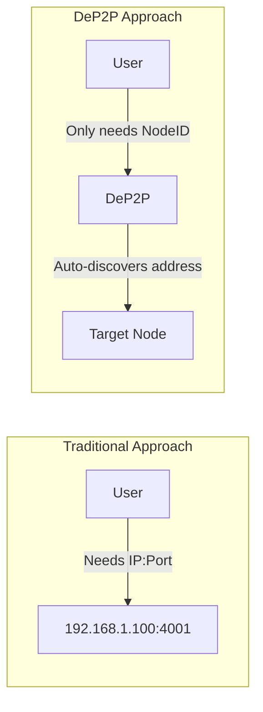
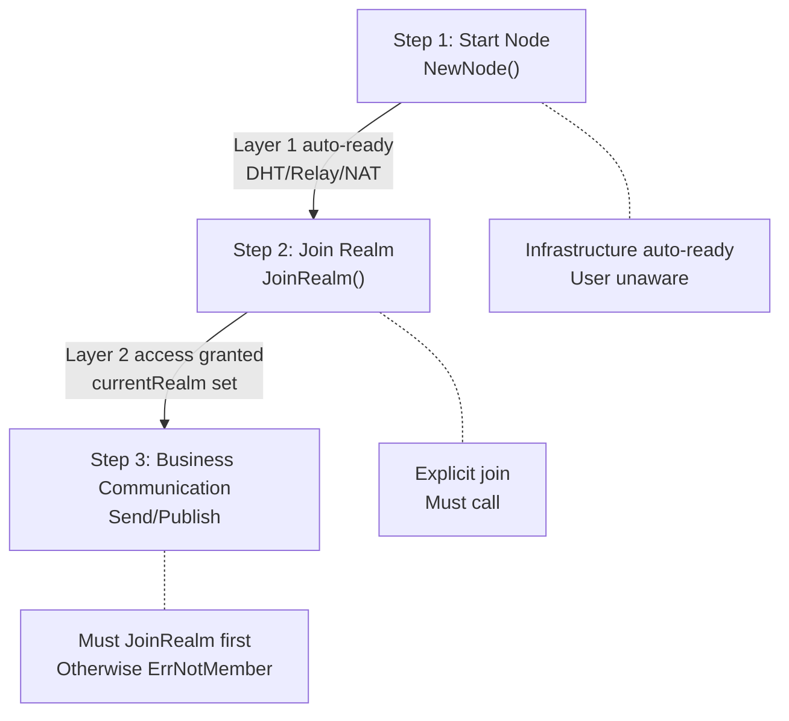
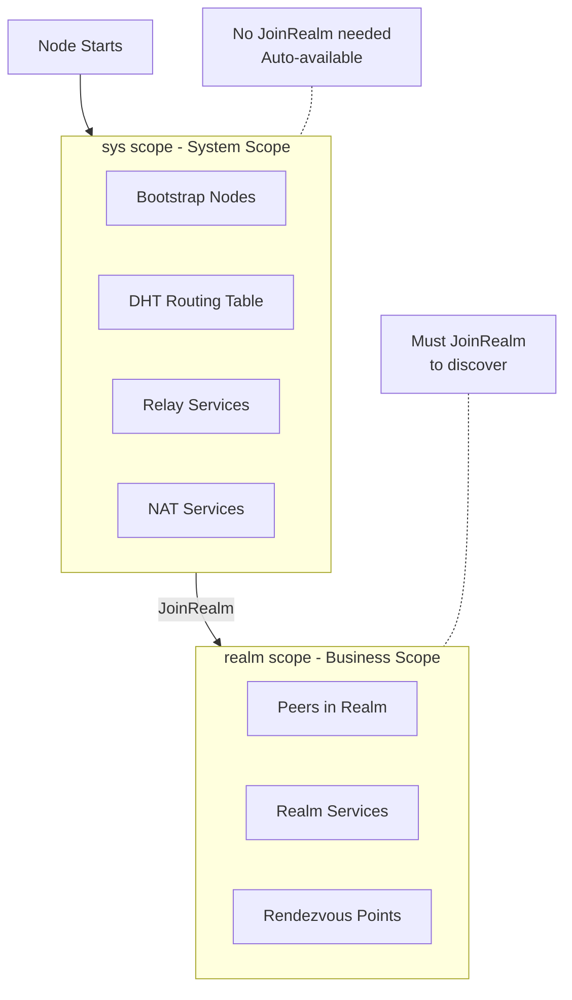
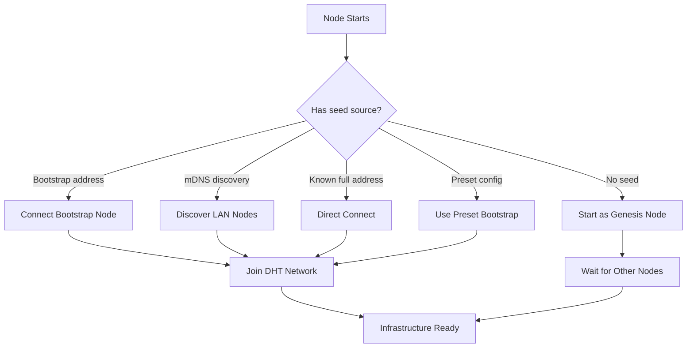

# Core Concepts

This document introduces the core concepts of DeP2P: Identity First, Three-Layer Architecture, Realm Isolation, and Discovery Scopes.

---

## Identity First

> **Core Invariant**: In DeP2P, there is **no such thing as a "pure IP connection"**; all connections target a **NodeID**, and IP/port are merely **Dial Addresses (connection path hints)**.

This is the core distinction between DeP2P and traditional networking libraries.

```
┌─────────────────────────────────────────────────────────────────────────────┐
│                    Identity First Principle                                  │
├─────────────────────────────────────────────────────────────────────────────┤
│                                                                              │
│   Traditional: connect("192.168.1.100:4001")  // Connect to address         │
│   DeP2P:       connect(nodeID)                 // Connect to identity        │
│                                                                              │
│   ✅ Correct Understanding of DeP2P:                                         │
│   ─────────────────────────────────                                         │
│   • Connection target is always NodeID (public key identity)                │
│   • IP/port are just Dial Addresses (connection path hints)                 │
│   • Any connection MUST verify RemoteIdentity == ExpectedNodeID             │
│                                                                              │
│   ❌ Non-existent Concepts:                                                  │
│   ─────────────────────────                                                 │
│   • "Pure IP connection" (Wrong! No identity target)                        │
│   • "Identity-less connection" (Wrong! DeP2P doesn't support this)          │
│                                                                              │
└─────────────────────────────────────────────────────────────────────────────┘
```

### Why Identity First?



| Advantage | Description |
|-----------|-------------|
| **Simplified Usage** | Users don't need to know the peer's IP address |
| **Dynamic Network Adaptation** | When IP changes, identity stays the same, connection adapts automatically |
| **Security** | Identity is automatically verified on connection, prevents MITM attacks |
| **Flexibility** | Supports multiple connection paths (direct → hole punch → relay) with auto fallback |

---

## Three Deterministic Connection Semantics (DialBy)

DeP2P provides three deterministic connection semantics. All connections must be established through one of these three methods:

```
┌─────────────────────────────────────────────────────────────────────────────┐
│                    DialBy: Three Connection Semantics                        │
├─────────────────────────────────────────────────────────────────────────────┤
│                                                                              │
│  1. DialByNodeID                                                             │
│     ─────────────────────────────────────────────────────────────────────   │
│     API:     Connect(nodeID)                                                 │
│     Input:   NodeID                                                          │
│     Use:     Regular business (DHT address lookup)                          │
│     Rec:     ✅ Recommended (most common)                                    │
│                                                                              │
│  2. DialByFullAddress                                                        │
│     ─────────────────────────────────────────────────────────────────────   │
│     API:     ConnectToAddr(fullAddr)                                         │
│     Input:   Full Address (includes NodeID and address)                     │
│     Use:     Cold start/sharing/Bootstrap                                   │
│     Rec:     ✅ Recommended                                                  │
│                                                                              │
│  3. DialByNodeIDWithDialAddrs                                                │
│     ─────────────────────────────────────────────────────────────────────   │
│     API:     ConnectWithAddrs(nodeID, addrs)                                 │
│     Input:   NodeID + Dial Address                                           │
│     Use:     Advanced/Operations/Controlled environment                     │
│     Rec:     ❌ Hidden (not recommended for regular users)                   │
│                                                                              │
└─────────────────────────────────────────────────────────────────────────────┘
```

### Usage Examples

```go
// 1. DialByNodeID (Recommended)
// Only need NodeID, DeP2P auto-discovers address via DHT
conn, err := node.Connect(ctx, remoteNodeID)

// 2. DialByFullAddress (Cold start scenarios)
// Full address includes NodeID, commonly used for Bootstrap or sharing
fullAddr := "/ip4/1.2.3.4/udp/4001/quic-v1/p2p/QmRemoteNodeID..."
conn, err := node.ConnectToAddr(ctx, fullAddr)

// 3. DialByNodeIDWithDialAddrs (Advanced scenarios)
// Know the peer's address, but still verify identity
addrs := []string{"/ip4/1.2.3.4/udp/4001/quic-v1"}
conn, err := node.ConnectWithAddrs(ctx, remoteNodeID, addrs)
```

---

## Three-Layer Architecture

DeP2P adopts a **three-layer architecture** design, which is the only layering scheme used throughout the library:

```
┌─────────────────────────────────────────────────────────────────────────────┐
│                           DeP2P Three-Layer Architecture                     │
├─────────────────────────────────────────────────────────────────────────────┤
│                                                                              │
│  ┌───────────────────────────────────────────────────────────────────────┐  │
│  │  Layer 3: Application Protocols                                        │  │
│  │  ═══════════════════════════════════════════════════════════════════  │  │
│  │                                                                        │  │
│  │   ┌─────────────────────────────┐  ┌─────────────────────────────┐   │  │
│  │   │      Stream Protocols       │  │     PubSub Protocols        │   │  │
│  │   │  ─────────────────────────  │  │  ─────────────────────────  │   │  │
│  │   │  Send: One-way send         │  │  Publish: Topic publish     │   │  │
│  │   │  Request: Request-Response  │  │  Subscribe: Topic subscribe │   │  │
│  │   │  OpenStream: Bidirectional  │  │  Query: Topic query         │   │  │
│  │   └─────────────────────────────┘  └─────────────────────────────┘   │  │
│  │                                                                        │  │
│  │   [!] Must join Realm first, returns ErrNotMember if not joined       │  │
│  │                                                                        │  │
│  └───────────────────────────────────────────────────────────────────────┘  │
│                                       │                                      │
│                                       ▼                                      │
│  ┌───────────────────────────────────────────────────────────────────────┐  │
│  │  Layer 2: Realm Layer (Business Isolation)                             │  │
│  │  ═══════════════════════════════════════════════════════════════════  │  │
│  │                                                                        │  │
│  │   ┌──────────────┐  ┌──────────────┐  ┌──────────────┐               │  │
│  │   │   Realm A    │  │   Realm B    │  │   Realm C    │               │  │
│  │   │ (Blockchain) │  │   (GameFi)   │  │  (Storage)   │               │  │
│  │   │  ─────────  │  │  ─────────  │  │  ─────────  │               │  │
│  │   │ Membership  │  │ Membership  │  │ Membership  │               │  │
│  │   │  Access Ctl │  │  Access Ctl │  │  Access Ctl │               │  │
│  │   │  RealmAuth  │  │  RealmAuth  │  │  RealmAuth  │               │  │
│  │   └──────────────┘  └──────────────┘  └──────────────┘               │  │
│  │                                                                        │  │
│  │   [*] User explicitly joins, strict single-Realm (one at a time)      │  │
│  │                                                                        │  │
│  └───────────────────────────────────────────────────────────────────────┘  │
│                                       │                                      │
│                                       ▼                                      │
│  ┌───────────────────────────────────────────────────────────────────────┐  │
│  │  Layer 1: Infrastructure Layer                                         │  │
│  │  ═══════════════════════════════════════════════════════════════════  │  │
│  │                                                                        │  │
│  │   ┌──────────────────────────────────────────────────────────────┐   │  │
│  │   │  Transport: QUIC / TCP / WebSocket + TLS/Noise Security       │   │  │
│  │   └──────────────────────────────────────────────────────────────┘   │  │
│  │                                                                        │  │
│  │   ┌────────────┐  ┌────────────┐  ┌────────────┐  ┌──────────────┐  │  │
│  │   │ System DHT │  │   Relay    │  │    NAT     │  │   Bootstrap  │  │  │
│  │   │  Routing   │  │  Fallback  │  │  Discovery │  │    Nodes     │  │  │
│  │   └────────────┘  └────────────┘  └────────────┘  └──────────────┘  │  │
│  │                                                                        │  │
│  │   [~] Auto-ready on node start, completely transparent to user        │  │
│  │                                                                        │  │
│  └───────────────────────────────────────────────────────────────────────┘  │
│                                                                              │
└─────────────────────────────────────────────────────────────────────────────┘
```

### Layer Responsibilities and User Awareness

| Layer | Name | Responsibility | User Awareness | Protocol Prefix |
|-------|------|----------------|----------------|-----------------|
| **Layer 3** | Application Protocols | Stream protocols, PubSub | Fully aware | `/dep2p/app/...` |
| **Layer 2** | Realm Layer | Business isolation, membership, RealmAuth | Active operation | `/dep2p/sys/realm/...` |
| **Layer 1** | Infrastructure | Transport/Security/DHT/Relay/NAT | Transparent | `/dep2p/sys/...` |

### Three-Step Flow



---

## Realm Business Isolation

Realm is one of the core concepts in DeP2P, used to implement business network isolation.

```
┌─────────────────────────────────────────────────────────────────────────────┐
│                           Realm Business Isolation Model                     │
├─────────────────────────────────────────────────────────────────────────────┤
│                                                                              │
│   ┌─────────────────────────────────────────────────────────────────────┐   │
│   │                    Shared Infrastructure (Layer 1)                   │   │
│   │              DHT Routing  │  Relay  │  NAT Traversal                 │   │
│   └─────────────────────────────────────────────────────────────────────┘   │
│                                    │                                         │
│         ┌──────────────────────────┼──────────────────────────┐             │
│         │                          │                          │             │
│         ▼                          ▼                          ▼             │
│   ┌───────────┐             ┌───────────┐             ┌───────────┐        │
│   │  Realm A  │             │  Realm B  │             │  Realm C  │        │
│   │ Blockchain│             │   GameFi  │             │  Storage  │        │
│   ├───────────┤             ├───────────┤             ├───────────┤        │
│   │ Isolated  │             │ Isolated  │             │ Isolated  │        │
│   │ Discovery │             │ Discovery │             │ Discovery │        │
│   │ PubSub    │             │ PubSub    │             │ PubSub    │        │
│   │ Access Ctl│             │ Access Ctl│             │ Access Ctl│        │
│   └───────────┘             └───────────┘             └───────────┘        │
│        ▲                         ▲                         ▲               │
│        │                         │                         │               │
│   Cannot discover B/C       Cannot discover A/C       Cannot discover A/B  │
│                                                                              │
└─────────────────────────────────────────────────────────────────────────────┘
```

### Realm Types

| Type | Description | Join Method | Use Case |
|------|-------------|-------------|----------|
| **Public** | Open Realm | Any node can join | Open community, public services |
| **Protected** | Protected Realm | Requires signature/credential | Membership services, consortium chains |
| **Private** | Private Realm | Requires invitation or whitelist | Enterprise internal, private networks |

### Strict Single-Realm Rule

```go
// ❌ Wrong: Attempting to join multiple Realms simultaneously
realmA, _ := node.Realm("realm-a")
_ = realmA.Join(ctx)
realmB, _ := node.Realm("realm-b")
_ = realmB.Join(ctx)  // Returns ErrAlreadyJoined

// ✅ Correct: Leave first, then join
realmA, _ := node.Realm("realm-a")
_ = realmA.Join(ctx)
realmA.Leave(ctx)
realmB, _ := node.Realm("realm-b")
_ = realmB.Join(ctx)  // OK
```

---

## Discovery Scopes

DeP2P divides peer discovery into two scopes: **sys scope (system scope)** and **realm scope (business scope)**.

```
┌─────────────────────────────────────────────────────────────────────────────┐
│                        Discovery Scope Model                                 │
├─────────────────────────────────────────────────────────────────────────────┤
│                                                                              │
│   sys scope (System Scope)              realm scope (Business Scope)         │
│   ────────────────────────              ────────────────────────             │
│   ├── DHT routing table neighbors       ├── Peers within Realm              │
│   ├── Bootstrap nodes                   ├── Realm service providers         │
│   ├── Relay / NAT services              └── Realm Rendezvous points         │
│   └── System Providers (sys/*)                                              │
│                                                                              │
│   Characteristics:                      Characteristics:                     │
│   ────────────────                      ────────────────                     │
│   • Does not require JoinRealm          • Must JoinRealm to access          │
│   • namespace: short form (relay)       • key: dep2p/v1/realm/{id}/...      │
│   • Can discover many peers, but        • Only discovers business peers     │
│     no guarantee they belong to           within same Realm                 │
│     any specific Realm                                                      │
│                                                                              │
└─────────────────────────────────────────────────────────────────────────────┘
```

> **Note**: sys scope / realm scope are **discovery scopes**, which are different concepts from the three-layer architecture (Layer 1/2/3).

### Discovery Flow



---

## Five Network Bootstrap Scenarios

> **Important Conclusion**: You cannot cold-start DHT with just a NodeID. A node must have at least one "seed source".

```
┌─────────────────────────────────────────────────────────────────────────────┐
│                        Five Network Bootstrap Scenarios                      │
├─────────────────────────────────────────────────────────────────────────────┤
│                                                                              │
│  Scenario 1: Genesis Node                                                    │
│  ─────────────────────────────────────────────────────────                  │
│  Desc:   First node in network, no need to connect to others                │
│  Config: WithBootstrapPeers() // empty list                                 │
│                                                                              │
│  Scenario 2: Direct Connection to Known Address                              │
│  ─────────────────────────────────────────────────────────                  │
│  Desc:   Full address known (includes NodeID)                               │
│  API:    ConnectToAddr()                                                     │
│                                                                              │
│  Scenario 3: NodeID Only                                                     │
│  ─────────────────────────────────────────────────────────                  │
│  Desc:   Only know public key, requires DHT to be connected                 │
│  API:    Connect(nodeID)                                                     │
│  Prereq: Must have existing DHT connection                                  │
│                                                                              │
│  Scenario 4: LAN Discovery                                                   │
│  ─────────────────────────────────────────────────────────                  │
│  Desc:   Discover LAN nodes via mDNS                                        │
│  Config: Auto-enabled                                                        │
│                                                                              │
│  Scenario 5: Preset Bootstrap                                                │
│  ─────────────────────────────────────────────────────────                  │
│  Desc:   Use preset config, auto-connect to public bootstrap nodes         │
│  Config: WithPreset(PresetDesktop/Mobile/Server)                            │
│                                                                              │
└─────────────────────────────────────────────────────────────────────────────┘
```

### Bootstrap Flow



---

## Core Invariants

DeP2P defines several core invariants. These are hard constraints of the system design:

| Invariant | Description |
|-----------|-------------|
| **INV-001: Identity First** | All connections must target a NodeID, no "pure IP connections" exist |
| **INV-002: Strict Single-Realm** | A node can only belong to one Realm at a time |
| **INV-003: Layer 3 Requires Realm** | Must JoinRealm before calling application protocol layer APIs, otherwise returns ErrNotMember |
| **INV-004: Mandatory Identity Verification** | Any connection must verify RemoteIdentity == ExpectedNodeID |
| **INV-005: Layer 1 Transparency** | Infrastructure layer is completely transparent to users, no manual configuration needed |

---

## Next Steps

- [Architecture Overview](architecture-overview.md) - Detailed system architecture design
- [Comparison with Other Libraries](comparison.md) - Learn differences between DeP2P and libp2p/iroh
- [Create Your First Node](../getting-started/first-node.md) - Hands-on node creation
- [Join Your First Realm](../getting-started/first-realm.md) - Understand Realm operations
