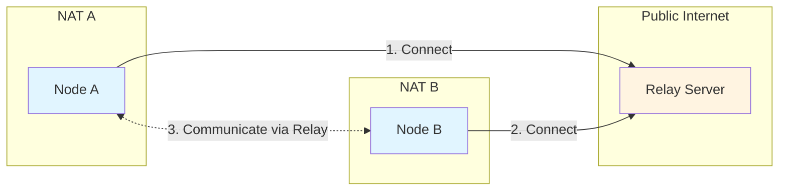
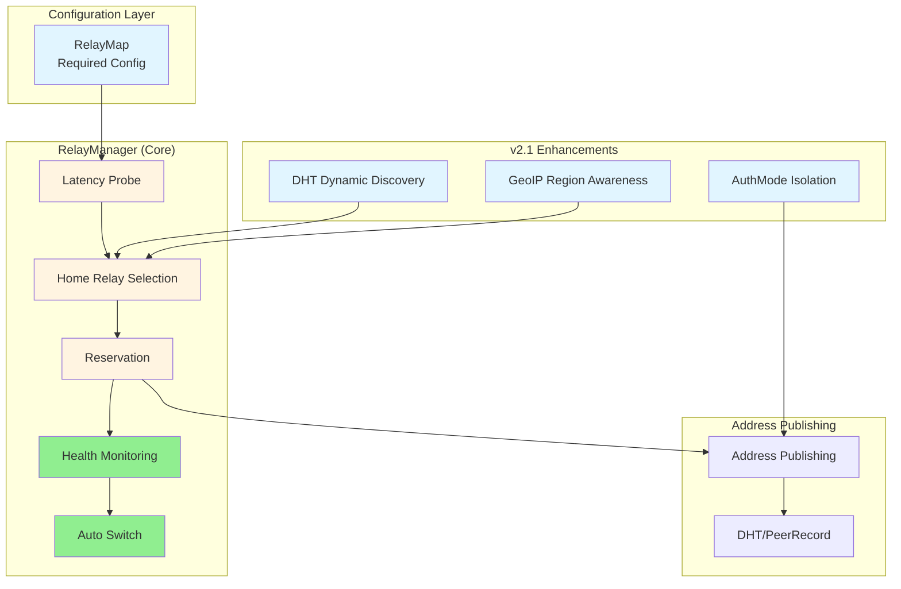
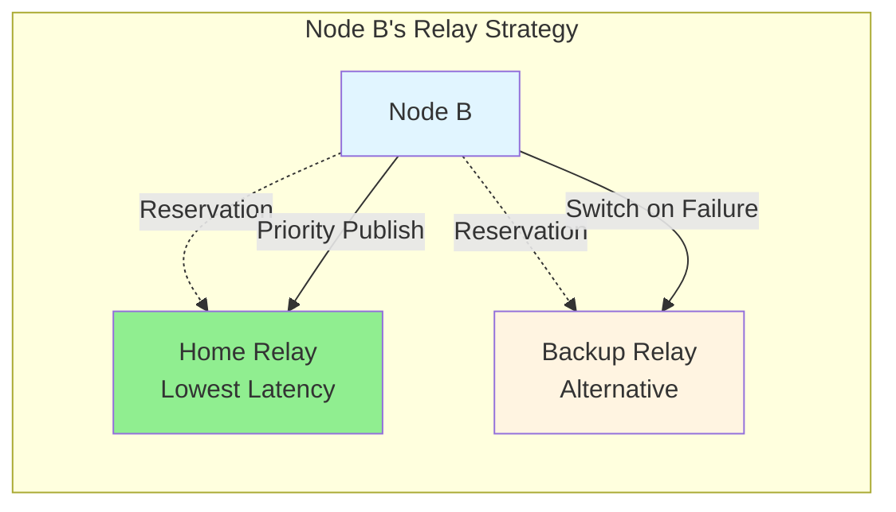
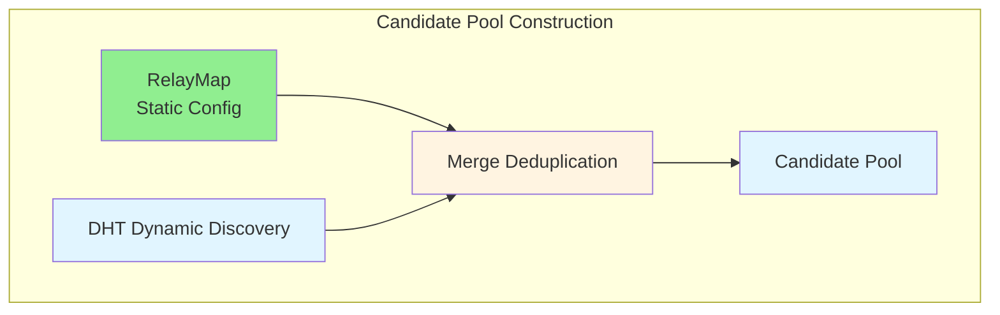
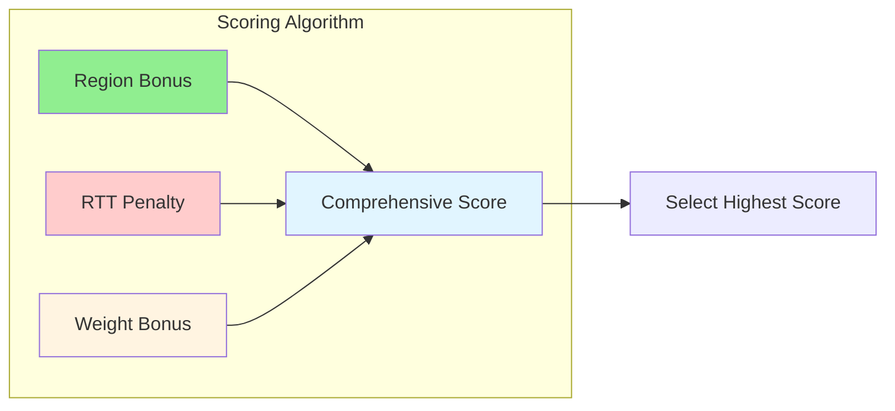
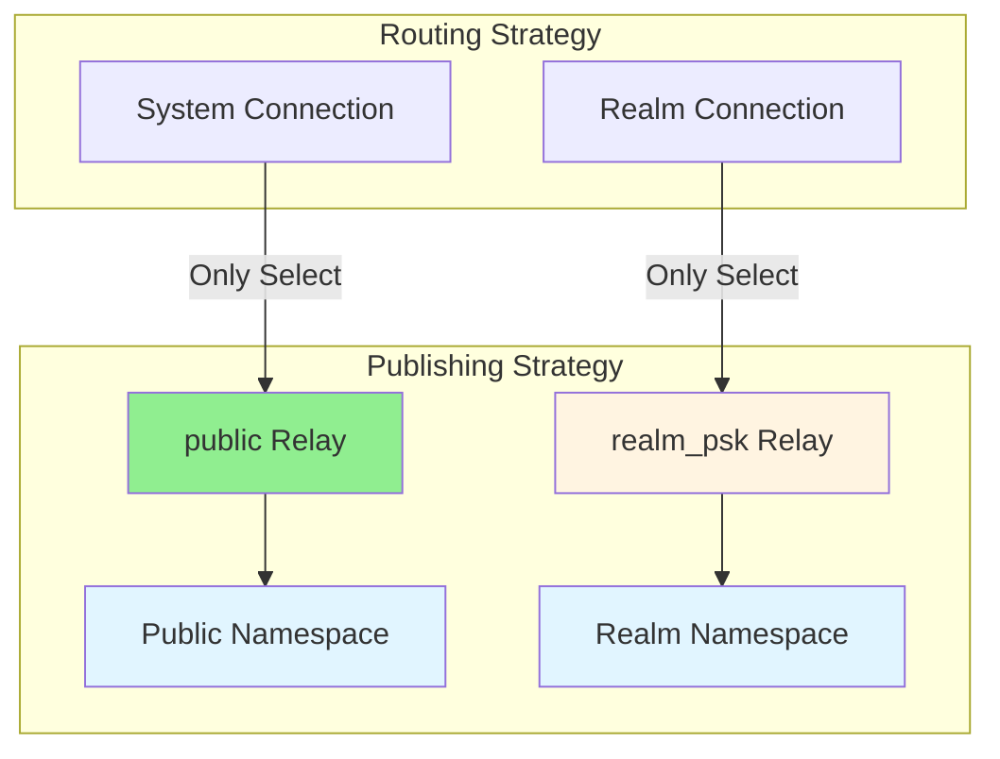

# Relay Architecture

**Last Updated**: 2025-12-31  
**Version**: v2.0/v2.1

---

## 1. What is Relay?

Relay is a server used for NAT traversal in P2P networks. When two nodes cannot establish a direct connection (e.g., both behind NAT), traffic can be forwarded through a Relay server.



---

## 2. Why Relay?

### 2.1 NAT Traversal Challenges

In P2P networks, many nodes are behind NAT (Network Address Translation) and cannot be directly connected by external nodes. Common NAT traversal methods include:

| Method | Description | Success Rate |
|--------|-------------|-------------|
| **UDP Hole Punching** | Exploit NAT port mapping patterns | ~70% |
| **UPnP/NAT-PMP** | Automatic mapping via router protocols | ~30% |
| **Relay** | Forward via third-party server | ~99% |

When direct methods fail, Relay is the last resort.

### 2.2 How Relay Works

The **Circuit Relay v2 protocol** defines how Relay works:

1. **Reservation**: The callee (Node B) reserves resources on the Relay
2. **Address Publishing**: Node B's Relay address is published to DHT for discovery
3. **Connection Establishment**: The caller (Node A) connects to Node B via Relay

```mermaid
sequenceDiagram
    participant A as Node A
    participant DHT as DHT
    participant Relay as Relay Server
    participant B as Node B
    
    Note over B,Relay: 1. Reservation Phase
    B->>Relay: Reserve()
    Relay-->>B: Reservation OK
    
    Note over B,DHT: 2. Address Publishing Phase
    B->>DHT: Publish Relay Address<br/>/p2p/Relay/p2p-circuit/p2p/B
    
    Note over A,Relay: 3. Connection Establishment Phase
    A->>DHT: FindPeer(B)
    DHT-->>A: Return B's Address<br/>(including Relay address)
    A->>Relay: Connect(B)
    Relay->>Relay: Check B's Reservation
    Relay->>B: Establish Relay Connection
    B-->>Relay: Connection Confirmed
    Relay-->>A: Connection Success
    
    A<-->B: Communicate via Relay
```

---

## 3. dep2p Relay v2.0/v2.1 Architecture

### 3.1 Core Design Philosophy

dep2p Relay v2.0/v2.1 adopts the **RelayMap + RelayManager** architecture, referencing best practices from iroh and go-libp2p:

| Design Principle | Description |
|------------------|-------------|
| **Reliability First** | Mandatory RelayMap configuration ensures redundancy |
| **Performance Optimization** | Latency testing at startup, select optimal Relay |
| **Automatic Failover** | Health monitoring + automatic switching |
| **Region Awareness** | v2.1 supports location-based routing |
| **Security Isolation** | v2.1 supports public/private Relay isolation |

### 3.2 Architecture Components



### 3.3 Home Relay Strategy

**Home Relay**: The primary Relay for a node, with the following characteristics:

- ✅ Selected via latency testing at startup (lowest latency)
- ✅ Address prioritized for DHT publishing
- ✅ Continuous health monitoring
- ✅ Automatic failover to Backup on failure

**Backup Relay**: Alternative Relay for failover



---

## 4. v2.1 Enhanced Features

### 4.1 Dynamic Discovery

**Design**: Hybrid architecture of RelayMap (mandatory) + DHT dynamic discovery (mandatory)

- **RelayMap**: Provides minimum available set (at least 2)
- **DHT Dynamic Discovery**: Automatically discovers more candidate Relays
- **Merge Deduplication**: Config priority, DHT supplements



### 4.2 Region-Aware Routing

**Design**: Comprehensive scoring based on GeoIP and RelayMapEntry.Region

**Scoring Factors**:
- Region affinity (same region +50, same continent +20)
- RTT latency (lower is better)
- Weight configuration (administrator adjustment)



### 4.3 AuthMode Public-Private Separation

**Design**: Address publishing and routing strategies based on AuthMode

| AuthMode | Description | Address Publishing | Routing Rules |
|----------|-------------|-------------------|---------------|
| **public** | Public Relay | Public namespace | Available for system/Realm connections |
| **realm_psk** | Private Relay | Realm namespace | Only available for Realm connections |



---

## 5. Key Concepts

### 5.1 RelayMap

**Definition**: Predefined Relay server set configuration

**Requirements**:
- At least 2 entries (ensures redundancy)
- Each entry contains NodeID and addresses
- Optional: Region, Weight, RealmID, AuthMode

### 5.2 RelayManager

**Responsibility**: Manages node's Relay connections and Reservations

**Lifecycle**:
1. **Start**: Latency probe → Select Home Relay → Establish Reservation
2. **Run**: Health monitoring → Failover → Address publishing
3. **Stop**: Cancel Reservation → Cleanup resources

### 5.3 Reservation

**Definition**: Resource slot reserved by a node on a Relay

**Characteristics**:
- Has TTL (usually 1 hour), requires periodic refresh
- Limited quantity (each Relay usually 128-1024 slots)
- Callee must hold Reservation

---

## 6. Performance Metrics

### 6.1 Target Metrics

| Metric | v1.x | v2.0 | v2.1 |
|--------|------|------|------|
| Relay Success Rate | ~85% | ≥ 98% | ≥ 99% |
| Startup to Reachable Time | Uncertain | ≤ 15s | ≤ 10s |
| Failover Time | No guarantee | ≤ 30s | ≤ 20s |

### 6.2 Resource Consumption

- **Reservation Count**: 1 Home + 1 Backup (v2.0)
- **Health Monitoring Overhead**: Latency test every 30s
- **DHT Discovery Overhead**: Once at startup, refresh every 10 minutes at runtime

---

## 7. Reference Documents

- [Usage Guide](../how-to/use-relay.md) - How to configure and use Relay
- [Architecture Design](../../design/architecture/relay-v2.md) - Detailed architecture design
- [Requirements](../../design/requirements/REQ-RELAY-001.md) - Requirements specification

