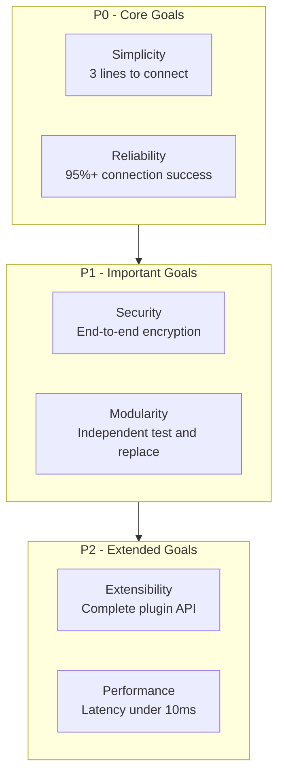
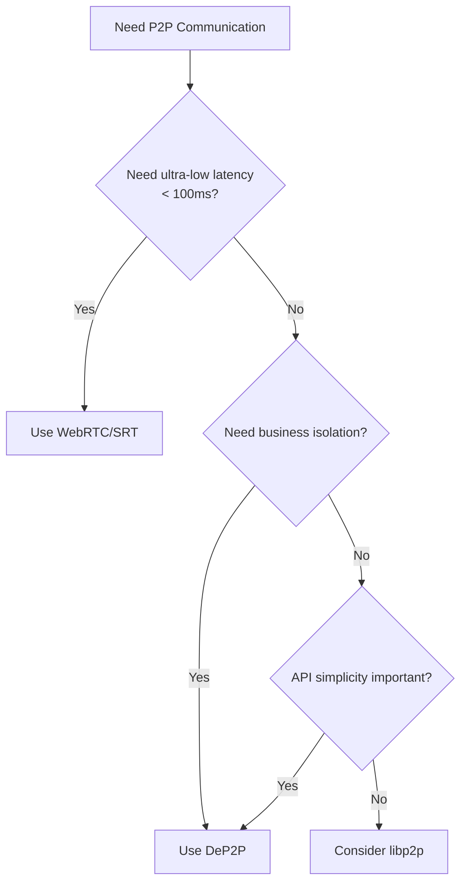

# What is DeP2P

This document introduces the core vision, design goals, and use cases of DeP2P.

---

## Core Vision

```
┌─────────────────────────────────────────────────────────────────────┐
│                                                                      │
│   Make P2P connections as simple as calling a function:             │
│   just provide a NodeID and send a message                          │
│                                                                      │
└─────────────────────────────────────────────────────────────────────┘
```

> **NodeID** = Base58 encoded representation of a public key identity. Users only need to share NodeID, no need to worry about IP addresses.

DeP2P aims to be a **simple, reliable, and secure** P2P networking library, allowing developers to focus on business logic without worrying about complex networking details.

---

## Why Choose DeP2P?

Traditional P2P libraries have many pain points. DeP2P provides solutions for these problems:

```
┌─────────────────────────────────────────────────────────────────────┐
│                    5 Problems DeP2P Solves                           │
├─────────────────────────────────────────────────────────────────────┤
│                                                                      │
│  Problem 1: API Too Complex                                          │
│  ─────────────────────────────                                       │
│  Traditional: Configure Host, Transport, Muxer, Security, Discovery │
│  DeP2P:      realm.Messaging().Send(ctx, nodeID, data)  // 3 steps: start→join→send │
│                                                                      │
│  Problem 2: Network Pollution                                        │
│  ─────────────────────────────                                       │
│  Public Net: Connect bootstrap → routing table fills with junk      │
│  DeP2P:      Realm isolation → only discover relevant peers         │
│                                                                      │
│  Problem 3: Cold Start Difficulty                                    │
│  ─────────────────────────────                                       │
│  Private Net: Must build all infrastructure yourself                │
│  DeP2P:       Share DHT/Relay, isolate by Realm                     │
│                                                                      │
│  Problem 4: Unknown Peer State                                       │
│  ─────────────────────────────                                       │
│  Traditional: Don't know if peer is offline/crashed/unstable        │
│  DeP2P:       Three-state model + graceful shutdown + heartbeat     │
│                                                                      │
│  Problem 5: Resource Out of Control                                  │
│  ─────────────────────────────                                       │
│  Unlimited:  Connection count explodes, resources exhausted         │
│  DeP2P:      Connection mgmt + watermark trimming + protection      │
│                                                                      │
└─────────────────────────────────────────────────────────────────────┘
```

---

## Core Features

| Feature | Description |
|---------|-------------|
| **Simple API** | Send messages with one line of code, no complex configuration |
| **Identity First** | Connect by NodeID (public key), not IP address |
| **Realm Isolation** | Independent business networks, avoid peer pollution |
| **Smart Connectivity** | Auto NAT traversal, address discovery, transparent relay fallback |
| **Peer State Awareness** | Three-state model + heartbeat detection, transparent network status |
| **Connection Management** | Watermark control + important connection protection + auto trimming |
| **QUIC First** | Modern transport protocol with built-in encryption and multiplexing |
| **Zero Config Start** | Sensible defaults, works out of the box |

---

## Design Goals

DeP2P's design goals are organized into three priority levels:



### P0 - Core Goals (Must Implement)

| Goal | Description | Acceptance Criteria |
|------|-------------|---------------------|
| **Simplicity** | Users only need NodeID to connect, library handles NAT/traversal/relay | 3 lines of code to connect |
| **Reliability** | Multiple connection paths with auto fallback (direct → hole punch → relay) | 95%+ connection success rate |

### P1 - Important Goals (Should Implement)

| Goal | Description | Acceptance Criteria |
|------|-------------|---------------------|
| **Security** | Built-in TLS/Noise encryption, public key based authentication | E2E encrypted, unforgeable identity |
| **Modularity** | Minimal core, pluggable features, clear dependencies | Each module independently testable |

### P2 - Extended Goals (Can Implement)

| Goal | Description | Acceptance Criteria |
|------|-------------|---------------------|
| **Extensibility** | Support custom transport, protocols, discovery mechanisms | Complete plugin API |
| **Performance** | Low latency, high throughput | Latency < 10ms, throughput > 100MB/s |

---

## Design Principles

### 1. Simple Over Complex

- API design pursues minimalism, hide implementation complexity
- Sensible defaults, works out of the box
- Progressive configuration, simple cases stay simple

```go
// Simplest start: two lines of code
node, _ := dep2p.New(ctx, dep2p.WithPreset(dep2p.PresetDesktop))
_ = node.Start(ctx)

// Add more configuration only when needed
node, _ := dep2p.New(ctx,
    dep2p.WithPreset(dep2p.PresetDesktop),
    dep2p.WithIdentity(myKey),           // optional
    dep2p.WithListenPort(8000),          // optional
)
_ = node.Start(ctx)
```

### 2. Explicit Over Implicit

- Clear error handling, never swallow errors
- Clear dependencies, no circular dependencies
- Clear lifecycle management

```go
// Explicit Realm joining, no auto-join
realm, err := node.Realm("my-realm")
if err != nil {
    return err // Error explicitly returned
}
if err := realm.Join(ctx); err != nil {
    return err // Error explicitly returned
}

// Calling business API without joining Realm returns clear error
err = realm.Messaging().Send(ctx, peerID, "/my/protocol", data)
// If not joined Realm, err == ErrNotMember (clearly explains why)
```

### 3. Composition Over Inheritance

- Small interfaces, big composition
- Features implemented through composition, not inheritance
- Plugin-style extension

```go
// Components can be used and tested independently
transport := quic.NewTransport(...)
discovery := dht.NewDiscovery(...)
node := dep2p.NewNode(transport, discovery, ...)
```

### 4. Security First

- Encrypted by default, plaintext optional
- Mandatory identity verification
- Defensive programming

```go
// All connections encrypted by default
// Identity automatically verified on connection
conn, _ := node.Connect(ctx, remoteNodeID)
// conn is encrypted, and remoteNodeID is verified
```

---

## Use Cases

### Core Scenarios (Recommended)

| Scenario | Description |
|----------|-------------|
| Distributed App Messaging | Inter-node RPC, event notifications, state sync |
| Blockchain/DeFi Networks | Transaction broadcast, block sync, consensus communication |
| File Transfer and Sharing | P2P file sync, distributed storage |
| Real-time Collaboration | Collaborative editing, multiplayer game state sync |

### Suitability Assessment

```
┌─────────────────────────────────────────────────────────────────────┐
│                    DeP2P Suitability Assessment                      │
├─────────────────────────────────────────────────────────────────────┤
│                                                                      │
│  ✅ Highly Suitable                                                  │
│  ─────────────────────────────────────────                          │
│  • Blockchain / DeFi     → Realm isolation + peer discovery         │
│  • GameFi               → Low latency + business isolation          │
│  • Distributed Storage  → Can coexist with other Realms             │
│  • Instant Messaging    → Simple API + reliable transport           │
│                                                                      │
│  ⚠️ Partially Suitable (Evaluate)                                    │
│  ─────────────────────────────────────────                          │
│  • IoT                  → Resource usage may be high                │
│  • Video on Demand/HLS  → Acceptable latency, watch buffering       │
│  • Non-real-time Live   → Occasional stutter, keep keyframes short  │
│                                                                      │
│  ❌ Not Suitable                                                     │
│  ─────────────────────────────────────────                          │
│  • Ultra-low latency live (<100ms) → QUIC retransmission adds delay │
│  • Real-time video conferencing    → Needs unreliable transport     │
│  • Cloud gaming                    → Extremely latency sensitive    │
│                                                                      │
└─────────────────────────────────────────────────────────────────────┘
```

### Decision Tree



---

## Non-Goals

The following are **not** design goals of DeP2P:

| Non-Goal | Description |
|----------|-------------|
| **No built-in business protocols** | Provides application protocol framework, but no built-in file sharing, chat, etc. |
| **Not blockchain-specific** | Can be used for blockchain, but designed as general-purpose P2P library |
| **Not chasing extreme performance** | Prioritize correctness and usability, performance is secondary |
| **Not all transports** | Prioritize QUIC support, other transports added as needed |
| **No unreliable transport** | Based on QUIC reliable transport, not suitable for drop-don't-retransmit scenarios |

---

## One-Minute Overview

```go
package main

import (
    "context"
    "fmt"
    "github.com/dep2p/go-dep2p"
)

func main() {
    ctx := context.Background()
    
    // 1. Start node (infrastructure layer auto-ready)
    node, _ := dep2p.New(ctx, dep2p.WithPreset(dep2p.PresetDesktop))
    _ = node.Start(ctx)
    defer node.Close()
    
    // 2. Join business network (required)
    realm, _ := node.Realm("my-app")
    _ = realm.Join(ctx)
    
    // 3. Send message (only need NodeID)
    realm.Messaging().Send(ctx, remoteNodeID, "/my/protocol/1.0", []byte("Hello!"))
    
    fmt.Println("It's that simple!")
}
```

---

## Next Steps

- [Core Concepts](core-concepts.md) - Deep dive into Identity First, Three-Layer Architecture, Realm
- [Architecture Overview](architecture-overview.md) - Understand system architecture design
- [Comparison with Other Libraries](comparison.md) - Learn differences between DeP2P and libp2p/iroh
- [5-Minute Quickstart](../getting-started/quickstart.md) - Hands-on practice
