# How to Contribute

Thank you for your interest in DeP2P! We welcome contributions of all kinds.

---

## Welcome Contributors

```
┌─────────────────────────────────────────────────────────────────────┐
│                                                                      │
│           🎉 Welcome to the DeP2P Open Source Community!             │
│                                                                      │
│      Whether you're an experienced developer or just starting out,  │
│              we welcome your participation and contributions.        │
│                                                                      │
└─────────────────────────────────────────────────────────────────────┘
```

---

## Ways to Contribute

```mermaid
flowchart TB
    subgraph Ways [Ways to Contribute]
        Code["💻 Code"]
        Docs["📚 Documentation"]
        Issues["🐛 Issue Reports"]
        Review["👀 Code Review"]
        Community["💬 Community Support"]
    end
    
    Code --> PR["Pull Request"]
    Docs --> PR
    Issues --> Discussion["Discussion & Confirmation"]
    Review --> Quality["Quality Assurance"]
    Community --> Help["Helping Others"]
```



### 💻 Code Contributions

- Fix bugs
- Implement new features
- Optimize performance
- Improve tests

### 📚 Documentation Contributions

- Fix errors
- Add explanations
- Translate documentation
- Add examples

### 🐛 Issue Reports

- Report bugs
- Suggest new features
- Discuss design issues

### 👀 Code Review

- Review Pull Requests
- Provide constructive feedback

### 💬 Community Support

- Answer questions
- Share usage experiences

---

## Contribution Workflow

```mermaid
flowchart TD
    Start["Start Contributing"] --> Fork["1. Fork Repository"]
    Fork --> Clone["2. Clone Locally"]
    Clone --> Branch["3. Create Branch"]
    Branch --> Develop["4. Develop & Test"]
    Develop --> Commit["5. Commit Changes"]
    Commit --> Push["6. Push Branch"]
    Push --> PR["7. Create Pull Request"]
    PR --> Review["8. Code Review"]
    Review --> Merge["9. Merge"]
    Merge --> Done["Contribution Complete 🎉"]
```



### 1. Fork Repository

Fork the DeP2P repository to your GitHub account.

### 2. Clone Locally

```bash
git clone https://github.com/YOUR_USERNAME/go-dep2p.git
cd go-dep2p
```

### 3. Create Branch

```bash
# Feature branch
git checkout -b feature/your-feature-name

# Bug fix branch
git checkout -b fix/issue-number-description
```

**Branch Naming Convention**:
| Type | Format | Example |
|------|--------|---------|
| Feature | `feature/<description>` | `feature/add-relay-support` |
| Fix | `fix/<issue>-<description>` | `fix/123-connection-leak` |
| Docs | `docs/<description>` | `docs/update-api-reference` |
| Refactor | `refactor/<description>` | `refactor/simplify-discovery` |

### 4. Develop & Test

```bash
# Install dependencies
go mod download

# Run tests
go test ./...

# Run linter
golangci-lint run
```

### 5. Commit Changes

```bash
git add .
git commit -m "feat: add new relay feature"
```

**Commit Message Convention**:
| Type | Description |
|------|-------------|
| `feat` | New feature |
| `fix` | Bug fix |
| `docs` | Documentation update |
| `style` | Code formatting (no functional change) |
| `refactor` | Refactoring |
| `test` | Test related |
| `chore` | Build/tooling related |

### 6. Push Branch

```bash
git push origin feature/your-feature-name
```

### 7. Create Pull Request

- Create a Pull Request on GitHub
- Write a clear title and description
- Link related issues

### 8. Code Review

- Respond to review comments
- Make changes based on feedback
- Stay patient and friendly

### 9. Merge

Once approved, maintainers will merge your contribution.

---

## Code of Conduct

We are committed to creating a friendly, inclusive community environment. Please:

- **Be respectful**: Use friendly and professional language
- **Accept feedback**: Constructively accept and provide feedback
- **Focus on goals**: Focus on what's best for the community
- **Show empathy**: Understand others' perspectives and experiences

### Unacceptable Behavior

- Using discriminatory language or imagery related to gender, race, etc.
- Personal attacks or insulting comments
- Public or private harassment
- Publishing others' private information without permission

---

## Getting Help

If you encounter issues while contributing:

| Channel | Purpose |
|---------|---------|
| [GitHub Issues](https://github.com/dep2p/go-dep2p/issues) | Bug reports, feature requests |
| [GitHub Discussions](https://github.com/dep2p/go-dep2p/discussions) | Questions, idea sharing |

---

## Contributor Recognition

We appreciate every contributor! All contributors are recorded in the project's Contributors list.

### Contribution Type Badges

| Badge | Contribution Type |
|-------|-------------------|
| 💻 | Code contributions |
| 📖 | Documentation |
| 🐛 | Bug reports |
| 💡 | Ideas/suggestions |
| 👀 | Code review |
| 🔧 | Tools/infrastructure |

---

## Quick Links

| Document | Description |
|----------|-------------|
| [Development Setup](development-setup.md) | How to set up development environment |
| [Code Style](code-style.md) | Code style and conventions |
| [Design Docs](design-docs.md) | Project design documentation navigation |

---

## First Time Contributing?

Not sure where to start? You can:

1. **Check "good first issue" labels**: These issues are suitable for new contributors
2. **Improve documentation**: Find errors or unclear parts in documentation
3. **Add tests**: Increase test coverage
4. **Answer questions**: Help other users in Discussions


---

Thank you for considering contributing to DeP2P! Every contribution matters.
