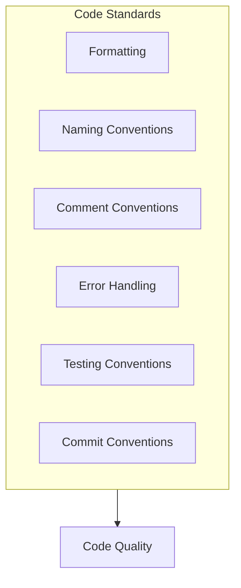
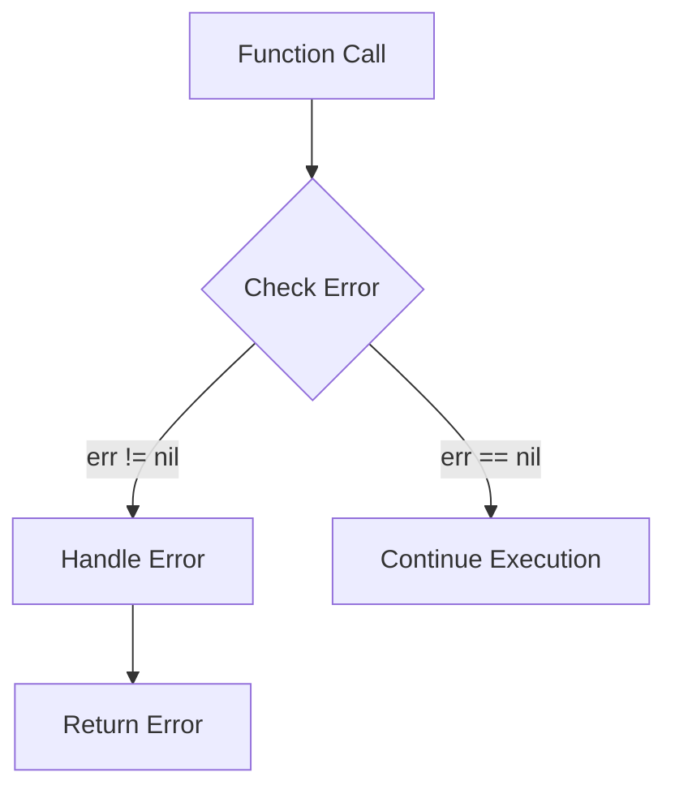
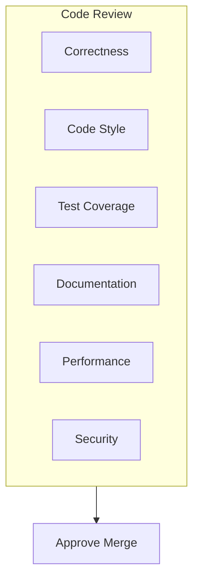

# Code Style Guide

This document defines the code style and best practices for the DeP2P project.

---

## Overview



---

## Go Code Style

### Formatting Tools

Use `gofmt` or `goimports` to format code:

```bash
# Using gofmt
gofmt -w .

# Using goimports (recommended, auto-manages imports)
goimports -w .
```

### Code Linting

Use `golangci-lint` for code checking:

```bash
golangci-lint run
```

**Enabled Linters**:
- `gofmt` - Format checking
- `govet` - Static analysis
- `errcheck` - Error checking
- `staticcheck` - Static analysis
- `gosimple` - Simplification suggestions
- `ineffassign` - Ineffective assignments
- `unused` - Unused code

---

## Naming Conventions

### Package Names

```go
// Good package names
package relay
package discovery
package connmgr

// Avoid these package names
package util      // Too generic
package common    // Too generic
package misc      // Meaningless
```

### Variable Names

```go
// Good variable names
var nodeID types.NodeID
var connCount int
var isConnected bool
var maxRetries int

// Avoid these variable names
var n types.NodeID    // Too short
var nodeIdentifier    // Too long
var node_id           // Don't use underscores
```

### Constant Names

```go
// Use camelCase
const (
    MaxConnections    = 100
    DefaultTimeout    = 30 * time.Second
    ProtocolVersion   = "1.0.0"
)

// Avoid ALL_CAPS (not recommended in Go)
const MAX_CONNECTIONS = 100  // Not recommended
```

### Function Names

```go
// Good function names
func Connect(ctx context.Context, nodeID NodeID) error
func GetConnection(nodeID NodeID) (Connection, bool)
func IsConnected(nodeID NodeID) bool

// Avoid these function names
func DoConnect()      // "Do" prefix is usually redundant
func ConnectToNode()  // Redundant suffix
```

### Interface Names

```go
// Single-method interfaces use -er suffix
type Reader interface {
    Read(p []byte) (n int, err error)
}

type Connector interface {
    Connect(ctx context.Context, nodeID NodeID) error
}

// Multi-method interfaces use descriptive names
type Connection interface {
    RemoteID() NodeID
    Close() error
}
```

---

## Comment Conventions

### Package Comments

```go
// Package relay implements DeP2P's relay functionality.
//
// Relay allows nodes behind NAT to communicate through
// public relay nodes.
// Main components include:
//   - RelayClient: Relay client
//   - RelayServer: Relay server
//   - CircuitDialer: Circuit dialer
package relay
```

### Function Comments

```go
// Connect connects to the specified node.
//
// Automatically finds addresses from AddressBook/Discovery and connects.
// If a connection to the node already exists, returns the existing connection.
//
// Parameters:
//   - ctx: Context, supports timeout and cancellation
//   - nodeID: Target node ID
//
// Returns:
//   - Connection: The established connection
//   - error: Error if connection fails
//
// Example:
//
//	conn, err := node.Connect(ctx, targetID)
//	if err != nil {
//	    log.Fatal(err)
//	}
//	defer conn.Close()
func (n *Node) Connect(ctx context.Context, nodeID NodeID) (Connection, error)
```

### Type Comments

```go
// Node is the main user entry point for DeP2P.
//
// Node wraps the underlying Endpoint, providing a more friendly high-level API.
// Supports the following features:
//   - Connection management (Connect, Disconnect)
//   - Messaging (Send, Request, Publish, Subscribe)
//   - Address management (ShareableAddrs, BootstrapCandidates)
type Node struct {
    // ...
}
```

### TODO Comments

```go
// TODO(username): Describe work to be done
// FIXME(username): Describe issue to be fixed
// NOTE: Important notes
// DEPRECATED: Deprecated, describe alternative
```

---

## Error Handling Conventions

### Error Definition

```go
// Use errors.New for simple errors
var ErrNotConnected = errors.New("not connected")

// Use custom error types for more information
type ConnectionError struct {
    NodeID NodeID
    Cause  error
}

func (e *ConnectionError) Error() string {
    return fmt.Sprintf("connection to %s failed: %v", e.NodeID, e.Cause)
}

func (e *ConnectionError) Unwrap() error {
    return e.Cause
}
```

### Error Handling

```go
// Good error handling
conn, err := node.Connect(ctx, targetID)
if err != nil {
    return fmt.Errorf("connect to %s: %w", targetID, err)
}

// Use errors.Is to check errors
if errors.Is(err, ErrNotConnected) {
    // Handle specific error
}

// Use errors.As to get error details
var connErr *ConnectionError
if errors.As(err, &connErr) {
    log.Printf("Failed to connect to %s", connErr.NodeID)
}
```

### Error Check Order



```go
// Recommended: Handle error first
result, err := doSomething()
if err != nil {
    return err
}
// Use result...

// Avoid: Handle success case first
result, err := doSomething()
if err == nil {
    // Use result...
} else {
    return err
}
```

---

## Testing Conventions

### Test Files

```go
// File: connection_test.go

func TestConnect(t *testing.T) {
    // Arrange
    node := createTestNode(t)
    defer node.Close()
    
    // Act
    conn, err := node.Connect(ctx, targetID)
    
    // Assert
    require.NoError(t, err)
    assert.Equal(t, targetID, conn.RemoteID())
}
```

### Table-Driven Tests

```go
func TestParseAddress(t *testing.T) {
    tests := []struct {
        name    string
        input   string
        want    Address
        wantErr bool
    }{
        {
            name:  "valid IPv4",
            input: "/ip4/192.168.1.1/udp/4001",
            want:  expectedAddr,
        },
        {
            name:    "invalid format",
            input:   "invalid",
            wantErr: true,
        },
    }
    
    for _, tt := range tests {
        t.Run(tt.name, func(t *testing.T) {
            got, err := ParseAddress(tt.input)
            if tt.wantErr {
                require.Error(t, err)
                return
            }
            require.NoError(t, err)
            assert.Equal(t, tt.want, got)
        })
    }
}
```

### Benchmark Tests

```go
func BenchmarkConnect(b *testing.B) {
    node := createTestNode(b)
    defer node.Close()
    
    b.ResetTimer()
    for i := 0; i < b.N; i++ {
        conn, _ := node.Connect(ctx, targetID)
        conn.Close()
    }
}
```

---

## Commit Message Conventions

### Format

```
<type>(<scope>): <subject>

<body>

<footer>
```

### Types

| Type | Description |
|------|-------------|
| `feat` | New feature |
| `fix` | Bug fix |
| `docs` | Documentation update |
| `style` | Code formatting (no functional change) |
| `refactor` | Refactoring |
| `perf` | Performance optimization |
| `test` | Test related |
| `chore` | Build/tooling related |

### Examples

```
feat(relay): add auto-relay discovery

Implement automatic relay node discovery using DHT.
This allows nodes behind NAT to automatically find
and use relay nodes.

Closes #123
```

```
fix(connection): prevent goroutine leak on timeout

The connection goroutine was not properly cleaned up
when context timeout occurred. Add defer cleanup to
ensure goroutine exits.

Fixes #456
```

---

## Code Review Checklist



### Review Points

- [ ] **Correctness**
  - Code implements requirements correctly
  - Edge cases are handled properly
  - Error cases are handled appropriately

- [ ] **Code Style**
  - Follows project code standards
  - Clear and accurate naming
  - No unused code

- [ ] **Testing**
  - Adequate unit tests
  - Tests cover main scenarios
  - Tests pass

- [ ] **Documentation**
  - Public APIs are documented
  - Complex logic is explained
  - README updated (if needed)

- [ ] **Performance**
  - No obvious performance issues
  - Reasonable resource usage
  - No memory leaks

- [ ] **Security**
  - No sensitive information leaks
  - Input is validated
  - Permission checks are correct

---

## Code Organization

### File Structure

```go
// Recommended file structure
package mypackage

import (
    // Standard library
    "context"
    "fmt"
    
    // Third-party libraries
    "github.com/stretchr/testify/require"
    
    // Internal project packages
    "github.com/dep2p/go-dep2p/pkg/types"
)

// Constants
const (
    DefaultTimeout = 30 * time.Second
)

// Variables
var (
    ErrNotFound = errors.New("not found")
)

// Type definitions
type MyType struct {
    // ...
}

// Constructors
func NewMyType() *MyType {
    // ...
}

// Methods
func (m *MyType) DoSomething() error {
    // ...
}

// Package-level functions
func HelperFunction() {
    // ...
}
```

---

## Related Documentation

- [How to Contribute](README.md)
- [Development Setup](development-setup.md)
- [Design Docs](design-docs.md)
