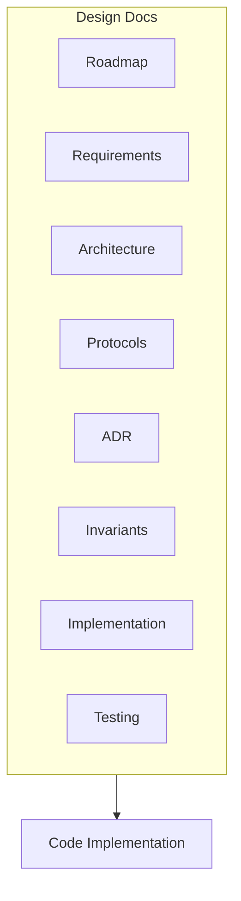
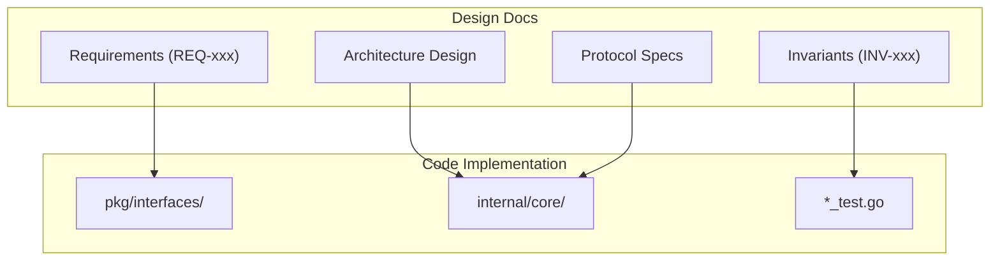

# Design Documentation Navigation

This document helps you understand and use DeP2P's design documentation.

---

## Overview

DeP2P uses design documents to record architectural decisions, protocol specifications, and implementation details. Design documents are located in the `design/` directory.



---

## Design Documentation Structure

Complete design documentation structure:

```
design/
├── README.md                 # Design doc navigation
├── roadmap.md                # Version milestones
│
├── requirements/             # Requirements specification
│   ├── README.md
│   ├── index.yaml            # Requirements index
│   └── REQ-*.md              # Specific requirements
│
├── architecture/             # Architecture design
│   ├── README.md
│   ├── overview.md           # Architecture overview
│   ├── layers.md             # Three-layer architecture
│   ├── components.md         # Core components
│   └── interactions.md       # Component interactions
│
├── protocols/                # Protocol specifications
│   ├── README.md
│   ├── foundation/           # Foundation layer protocols
│   ├── transport/            # Transport layer protocols
│   ├── network/              # Network layer protocols
│   └── application/          # Application layer protocols
│
├── adr/                      # Architecture Decision Records
│   ├── README.md
│   └── 0001-*.md             # Decision records
│
├── invariants/               # System invariants
│   ├── README.md
│   └── INV-*.md              # Invariant definitions
│
├── implementation/           # Implementation mapping
│   ├── README.md
│   ├── module-map.md         # Module mapping
│   └── status.md             # Implementation status
│
└── testing/                  # Test tracking
    ├── README.md
    ├── strategy.md           # Test strategy
    └── cases/                # Test cases
```

---

## How to Read Design Docs

### Reading Order


**Recommended Reading Order**:

1. **Architecture Overview** (`architecture/overview.md`)
   - Understand overall design approach
   - Understand design goals

2. **Three-Layer Architecture** (`architecture/layers.md`)
   - Understand layered design
   - Understand each layer's responsibilities

3. **Core Components** (`architecture/components.md`)
   - Understand main components
   - Understand component relationships

4. **Protocol Specifications** (`protocols/`)
   - Deep dive into specific protocols
   - Understand communication details

5. **Architecture Decisions** (`adr/`)
   - Understand decision backgrounds
   - Understand trade-offs

---

## Key Design Documents

### Architecture Design

| Document | Description |
|----------|-------------|
| `architecture/overview.md` | Architecture overview, design goals and principles |
| `architecture/layers.md` | Three-layer architecture (foundation, network, application) |
| `architecture/components.md` | Core component descriptions |
| `architecture/interactions.md` | Component interaction flows |

### Protocol Specifications

| Document | Description |
|----------|-------------|
| `protocols/foundation/identity.md` | Identity protocol |
| `protocols/foundation/addressing.md` | Addressing protocol |
| `protocols/transport/quic.md` | QUIC transport |
| `protocols/transport/relay.md` | Relay protocol |
| `protocols/network/discovery.md` | Discovery protocol |
| `protocols/network/nat.md` | NAT traversal |
| `protocols/application/messaging.md` | Messaging protocol |
| `protocols/application/realm.md` | Realm protocol |

### Architecture Decision Records (ADR)

| Document | Description |
|----------|-------------|
| `adr/0001-identity-first.md` | Identity-first design |
| `adr/0002-realm-isolation.md` | Realm isolation design |
| `adr/0003-relay-first-connect.md` | Relay-first connection strategy |

---

## Relationship Between Design Docs and Code



### Requirements → API

Each requirement (REQ-xxx) corresponds to specific API design:

```
REQ-REALM-001 → pkg/interfaces/realm/realm.go
```

### Architecture → Implementation

Architecture design corresponds to directory structure:

```
Three-Layer Architecture:
  Foundation → internal/core/identity/
  Network → internal/core/discovery/
  Application → internal/core/realm/
```

### Protocols → Implementation

Protocol specifications correspond to implementations:

```
protocols/transport/relay.md → internal/core/relay/
protocols/network/discovery.md → internal/core/discovery/
```

### Invariants → Tests

System invariants must have corresponding tests:

```
INV-001-identity-first → internal/core/identity/*_test.go
INV-002-realm-membership → internal/core/realm/*_test.go
```

---

## Numbering System

### Requirements (REQ-xxx)

```
REQ-<category>-<number>

Examples:
REQ-CONN-001    # Connection-related requirement
REQ-REALM-001   # Realm-related requirement
REQ-DISC-001    # Discovery-related requirement
```

### Invariants (INV-xxx)

```
INV-<number>-<description>

Examples:
INV-001-identity-first
INV-002-realm-membership
INV-003-connection-security
```

### Architecture Decisions (ADR-xxxx)

```
<number>-<description>.md

Examples:
0001-identity-first.md
0002-realm-isolation.md
```

---

## Contributing Design Docs

### Adding New Requirements

1. Add entry to `requirements/index.yaml`
2. Create `requirements/REQ-xxx.md` file
3. Fill in requirement details

### Adding Architecture Decisions

1. Determine next number
2. Create `adr/<number>-<description>.md`
3. Fill in using ADR template

### ADR Template

```markdown
# ADR <number>: <title>

## Status

[Proposed | Accepted | Deprecated | Superseded]

## Context

Describe the background and problem for this decision.

## Decision

Describe the decision made.

## Consequences

Describe the positive and negative consequences of this decision.
```

---

## Quick Links

| Resource | Link |
|----------|------|
| Design Docs Root | [design/README.md](../../../design/README.md) |
| Architecture Overview | [design/architecture/overview.md](../../../design/architecture/overview.md) |
| Protocol Specs | [design/protocols/README.md](../../../design/protocols/README.md) |
| Architecture Decisions | [design/adr/README.md](../../../design/adr/README.md) |

---

## Related Documentation

- [How to Contribute](README.md)
- [Development Setup](development-setup.md)
- [Code Style](code-style.md)
