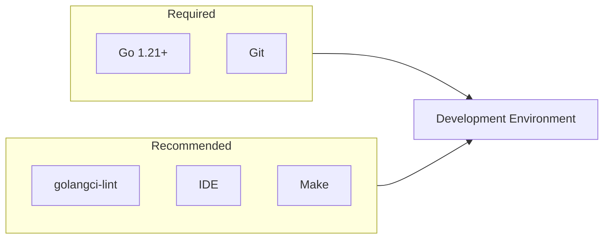
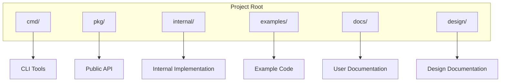
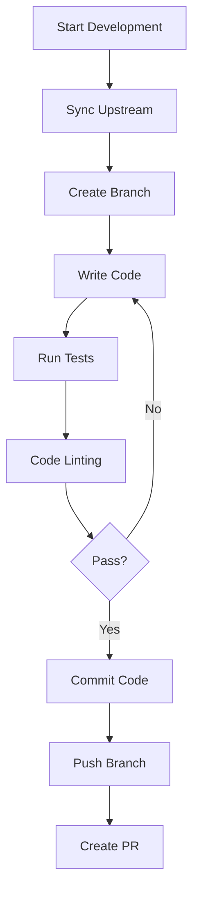

# Development Environment Setup

This document guides you through setting up the DeP2P development environment.

---

## Requirements



### Required Tools

| Tool | Version | Description |
|------|---------|-------------|
| **Go** | 1.21+ | Programming language |
| **Git** | 2.0+ | Version control |

### Recommended Tools

| Tool | Purpose |
|------|---------|
| **golangci-lint** | Static code analysis |
| **VS Code / GoLand** | IDE |
| **Make** | Build automation |
| **Docker** | Integration testing |

---

## Check Environment

### Check Go Version

```bash
go version
# Example output: go version go1.21.0 darwin/arm64
```

If version is below 1.21, upgrade Go:

```bash
# macOS (using Homebrew)
brew install go

# Linux (using official package)
wget https://go.dev/dl/go1.21.0.linux-amd64.tar.gz
sudo tar -C /usr/local -xzf go1.21.0.linux-amd64.tar.gz
export PATH=$PATH:/usr/local/go/bin
```

### Check Git

```bash
git version
# Example output: git version 2.39.0
```

---

## Clone Repository

```bash
# Clone repository
git clone https://github.com/dep2p/go-dep2p.git
cd go-dep2p

# Add upstream remote (if forked)
git remote add upstream https://github.com/dep2p/go-dep2p.git
```

---

## Install Dependencies

```bash
# Download dependencies
go mod download

# Verify dependencies
go mod verify

# Tidy dependencies
go mod tidy
```

---

## Project Structure



```
go-dep2p/
├── cmd/                      # Executable programs
│   └── dep2p/
│       └── main.go
│
├── pkg/                      # Public packages (exported)
│   ├── types/                # Basic types
│   ├── interfaces/           # Interface definitions
│   └── dep2p/                # User API
│
├── internal/                 # Internal implementation
│   ├── app/                  # Application orchestration
│   ├── config/               # Configuration management
│   └── core/                 # Core components
│
├── examples/                 # Example code
├── docs/                     # User documentation
├── design/                   # Design documentation
│
├── go.mod                    # Go module file
├── go.sum                    # Dependency checksums
├── Makefile                  # Build scripts
└── README.md                 # Project description
```

---

## Build Project

### Using go build

```bash
# Build all packages
go build ./...

# Build CLI tool
go build -o bin/dep2p ./cmd/dep2p
```

### Using Makefile

```bash
# Build
make build

# Clean
make clean
```

---

## Run Tests

### Run All Tests

```bash
go test ./...
```

### Run Tests for Specific Package

```bash
go test ./internal/core/...
```

### Tests with Coverage

```bash
go test -cover ./...

# Generate coverage report
go test -coverprofile=coverage.out ./...
go tool cover -html=coverage.out
```

### Run Benchmarks

```bash
go test -bench=. ./...
```

---

## Code Linting

### Install golangci-lint

```bash
# macOS
brew install golangci-lint

# Linux
curl -sSfL https://raw.githubusercontent.com/golangci/golangci-lint/master/install.sh | sh -s -- -b $(go env GOPATH)/bin

# Or using go install
go install github.com/golangci/golangci-lint/cmd/golangci-lint@latest
```

### Run Linter

```bash
golangci-lint run

# Or using Makefile
make lint
```

---

## IDE Configuration

### VS Code

Recommended extensions:
- **Go** (official extension)
- **Go Test Explorer**
- **Error Lens**

`.vscode/settings.json` configuration:

```json
{
    "go.useLanguageServer": true,
    "go.lintTool": "golangci-lint",
    "go.lintOnSave": "package",
    "go.formatTool": "goimports",
    "editor.formatOnSave": true,
    "[go]": {
        "editor.codeActionsOnSave": {
            "source.organizeImports": true
        }
    }
}
```

### GoLand

1. Open **Settings** → **Go** → **Go Modules**
   - Enable Go Modules integration

2. Open **Settings** → **Tools** → **File Watchers**
   - Add `gofmt` or `goimports` watcher

3. Open **Settings** → **Editor** → **Inspections**
   - Enable Go-related inspections

---

## Debug Configuration

### VS Code launch.json

```json
{
    "version": "0.2.0",
    "configurations": [
        {
            "name": "Debug Main",
            "type": "go",
            "request": "launch",
            "mode": "debug",
            "program": "${workspaceFolder}/cmd/dep2p",
            "args": []
        },
        {
            "name": "Debug Test",
            "type": "go",
            "request": "launch",
            "mode": "test",
            "program": "${workspaceFolder}/internal/core/...",
            "args": ["-test.v"]
        }
    ]
}
```

### Using delve

```bash
# Install delve
go install github.com/go-delve/delve/cmd/dlv@latest

# Debug
dlv debug ./cmd/dep2p

# Debug tests
dlv test ./internal/core/...
```

---

## Development Workflow



### Sync Upstream

```bash
git fetch upstream
git rebase upstream/main
```

### Daily Development

```bash
# 1. Create branch
git checkout -b feature/my-feature

# 2. Develop...

# 3. Test
go test ./...

# 4. Lint
golangci-lint run

# 5. Commit
git add .
git commit -m "feat: add my feature"

# 6. Push
git push origin feature/my-feature
```

---

## Common Issues

### Dependency Issues

**Problem**: `go mod download` fails

**Solution**:
```bash
# Set proxy
go env -w GOPROXY=https://proxy.golang.org,direct

# Or for private modules
go env -w GOPRIVATE=github.com/dep2p/*
```

---

### Test Failures

**Problem**: Tests require network access

**Solution**:
```bash
# Skip tests that need network
go test -short ./...
```

---

### Lint Errors

**Problem**: golangci-lint reports errors

**Solution**:
```bash
# View detailed errors
golangci-lint run --verbose

# Auto-fix some issues
golangci-lint run --fix
```

---

### Port Conflicts

**Problem**: Test ports are in use

**Solution**:
```bash
# Find process using port
lsof -i :4001

# Kill process
kill -9 <PID>
```

---

## Related Documentation

- [How to Contribute](README.md)
- [Code Style](code-style.md)
- [Design Docs](design-docs.md)
