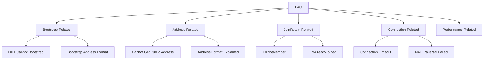

# FAQ

This document summarizes common questions and solutions for using DeP2P.

---

## Question Categories



---

## Bootstrap Related

### Q: DHT cannot bootstrap, node cannot discover other nodes

**Cause**: DHT cannot bootstrap without seeds.

**Solutions**:

1. **Use preset configuration** (Recommended):
```go
node, _ := dep2p.New(ctx, dep2p.WithPreset(dep2p.PresetDesktop))
_ = node.Start(ctx)
// PresetDesktop/Mobile/Server includes default Bootstrap nodes
```

2. **Manually configure Bootstrap nodes**:
```go
bootstrapPeers := []string{
    "/ip4/1.2.3.4/udp/4001/quic-v1/p2p/5Q2STWvBFn...",
}
node, _ := dep2p.New(ctx,
    dep2p.WithPreset(dep2p.PresetDesktop),
    dep2p.WithBootstrapPeers(bootstrapPeers),
)
_ = node.Start(ctx)
```

3. **LAN scenario**: mDNS automatically discovers nodes on the same network
```go
// mDNS is enabled by default, no extra configuration needed
```

### Q: What is the Bootstrap address format?

**Answer**: Bootstrap addresses must use **Full Address** format, including `/p2p/<NodeID>`:

```
✅ Correct format:
/ip4/1.2.3.4/udp/4001/quic-v1/p2p/5Q2STWvBFn...
/dns4/bootstrap.example.com/udp/4001/quic-v1/p2p/5Q2STWvBFn...

❌ Wrong format (missing NodeID):
/ip4/1.2.3.4/udp/4001/quic-v1
```

### Q: How to start as a genesis node?

**Answer**: A genesis node is the first node in the network, no Bootstrap needed:

```go
node, _ := dep2p.New(ctx,
    dep2p.WithPreset(dep2p.PresetServer),
    dep2p.WithBootstrapPeers(nil),  // Explicitly set to empty
)
_ = node.Start(ctx)

// Print shareable address for other nodes to use as Bootstrap
addrs, _ := node.WaitShareableAddrs(ctx)
fmt.Println("Bootstrap address:", addrs)
```

---

## Address Related

### Q: Cannot get public address

**Causes**:
1. NAT detection takes time
2. Relay support needed
3. Port blocked by firewall

**Solutions**:

```go
// 1. Wait for some time
time.Sleep(3 * time.Second)
fmt.Println("Advertised addresses:", node.AdvertisedAddrs())

// 2. Use WaitShareableAddrs to wait for verification
ctx, cancel := context.WithTimeout(context.Background(), 30*time.Second)
defer cancel()
addrs, err := node.WaitShareableAddrs(ctx)
if err != nil {
    // Timeout: may not have public reachability
    fmt.Println("Use Relay address as fallback")
}

// 3. Ensure Relay is enabled
node, _ := dep2p.New(ctx,
    dep2p.WithPreset(dep2p.PresetDesktop),
    dep2p.WithRelay(true),  // Enable Relay
)
_ = node.Start(ctx)
```

### Q: What's the difference between ListenAddrs and AdvertisedAddrs?

**Answer**:

| Method | Returns | Purpose |
|--------|---------|---------|
| `ListenAddrs()` | Local binding address (e.g., `0.0.0.0:4001`) | Local listening |
| `AdvertisedAddrs()` | Externally advertised addresses (public/Relay) | Share with other nodes |

```go
fmt.Println("Listen:", node.ListenAddrs())
// [/ip4/0.0.0.0/udp/4001/quic-v1]

fmt.Println("Advertised:", node.AdvertisedAddrs())
// [/ip4/203.x.x.x/udp/4001/quic-v1, /ip4/.../p2p-circuit/p2p/...]
```

### Q: What is a Full Address?

**Answer**: Full Address includes the `/p2p/<NodeID>` suffix:

```
Full Address:
/ip4/192.168.1.1/udp/4001/quic-v1/p2p/5Q2STWvBFn...
                                      ↑
                                   NodeID part

Dial Address:
/ip4/192.168.1.1/udp/4001/quic-v1
```

- **Full Address**: Used for Bootstrap, sharing with users
- **Dial Address**: Internal dialing/routing only

---

## JoinRealm Related

### Q: Getting ErrNotMember error

**Cause**: Calling business API without joining Realm.

**Solution**:

```go
// ❌ Wrong
node, _ := dep2p.New(ctx, dep2p.WithPreset(dep2p.PresetDesktop))
_ = node.Start(ctx)
err := node.Send(ctx, peerID, "/dep2p/app/chat/1.0.0", data)
// err == ErrNotMember

// ✅ Correct
node, _ := dep2p.New(ctx, dep2p.WithPreset(dep2p.PresetDesktop))
_ = node.Start(ctx)
realm, _ := node.Realm("my-realm")  // Join Realm first
_ = realm.Join(ctx)
err := realm.Messaging().Send(ctx, peerID, "/dep2p/app/chat/1.0.0", data)
// err == nil
```

### Q: Getting ErrAlreadyJoined error

**Cause**: Already in a Realm, trying to join another.

**Solution**:

```go
// Check current state
current := node.Realm().CurrentRealm()
if current != "" {
    // Leave current Realm first
    realm, _ := node.Realm(current)
    realm.Leave(ctx)
}
// Then join new Realm
realm, _ := node.Realm("new-realm")
_ = realm.Join(ctx)
```

### Q: Why must JoinRealm be explicit?

**Answer**: This is DeP2P's **mandatory isolation design**:

1. **Security**: Prevent cross-Realm data leakage
2. **Clarity**: Users know exactly which business network they're in
3. **Simplicity**: No need to pass `realmID` on every call

---

## Connection Related

### Q: Connection timeout

**Possible causes**:
1. Target node is offline
2. Network unreachable
3. NAT traversal failed
4. DHT cannot find address

**Troubleshooting steps**:

```go
// 1. Check if DHT is ready
time.Sleep(5 * time.Second)  // Wait for DHT initialization

// 2. Use full address to connect (skip DHT)
fullAddr := "/ip4/1.2.3.4/udp/4001/quic-v1/p2p/5Q2STWvBFn..."
conn, err := node.ConnectToAddr(ctx, fullAddr)

// 3. Check error type
if errors.Is(err, context.DeadlineExceeded) {
    fmt.Println("Connection timeout")
}
```

### Q: NAT traversal failed

**Answer**: DeP2P uses **reachability-first** design, NAT traversal failure automatically uses Relay:

```go
// Ensure Relay is enabled
node, _ := dep2p.New(ctx,
    dep2p.WithPreset(dep2p.PresetDesktop),
    dep2p.WithRelay(true),
)
_ = node.Start(ctx)

// Relay acts as fallback, ensuring connectivity
// Connection flow: Direct attempt → Failed → Auto Relay
```

### Q: How to determine if connection is direct or relayed?

**Answer**: Check remote address:

```go
conn, _ := node.Connect(ctx, remoteID)
remoteAddr := conn.RemoteMultiaddr()

// If address contains /p2p-circuit/, it's a relay connection
if strings.Contains(remoteAddr.String(), "/p2p-circuit/") {
    fmt.Println("Connected via Relay")
} else {
    fmt.Println("Direct connection")
}
```

---

## Performance Related

### Q: Too many connections

**Answer**: Adjust connection manager watermarks:

```go
node, _ := dep2p.New(ctx,
    dep2p.WithPreset(dep2p.PresetDesktop),
    dep2p.WithConnectionLimits(30, 60),  // Lower limits
)
_ = node.Start(ctx)
```

### Q: High memory usage

**Answer**:
1. Use `PresetMobile` or `PresetMinimal`
2. Reduce connection count
3. Periodically clean inactive connections

```go
// Use low-resource preset
node, _ := dep2p.New(ctx, dep2p.WithPreset(dep2p.PresetMobile))
_ = node.Start(ctx)
```

---

## Debugging Tips

### Enable verbose logging

```go
// Set log level (using environment variable)
// export DEP2P_LOG_LEVEL=debug
```

### Check node status

```go
fmt.Printf("Node ID: %s\n", node.ID())
fmt.Printf("Listen Addresses: %v\n", node.ListenAddrs())
fmt.Printf("Advertised Addresses: %v\n", node.AdvertisedAddrs())
fmt.Printf("Current Realm: %s\n", node.Realm().CurrentRealm())
```

---

## More Resources

- [Installation](installation.md) - Installation and environment setup
- [5-Minute Quickstart](quickstart.md) - Quick start guide
- [Create Your First Node](first-node.md) - Node configuration details
- [Join Your First Realm](first-realm.md) - Realm usage guide
- [Core Concepts](../concepts/core-concepts.md) - Deep dive into architecture
