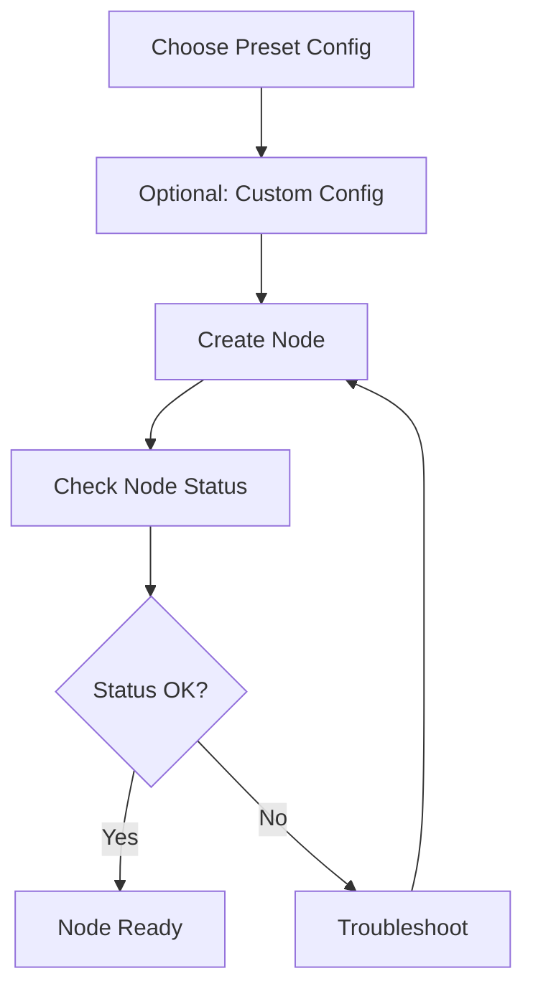

# Create Your First Node

This document provides detailed instructions on creating and configuring your first DeP2P node.

---

## Node Creation Flow



---

## Using Preset Configurations (Recommended)

### Basic Creation

```go
package main

import (
    "context"
    "fmt"
    "log"
    
    "github.com/dep2p/go-dep2p"
)

func main() {
    ctx := context.Background()
    
    // Create node with Desktop preset
    node, err := dep2p.StartNode(ctx, dep2p.WithPreset(dep2p.PresetDesktop))
    if err != nil {
        log.Fatalf("Failed to create node: %v", err)
    }
    defer node.Close()
    
    // Print node information
    fmt.Printf("Node ID: %s\n", node.ID())
    fmt.Printf("Listen Addresses: %v\n", node.ListenAddrs())
}
```

### Preset Configuration Comparison

| Preset | Scenario | Connections | NAT | Relay | Liveness | Description |
|--------|----------|-------------|-----|-------|----------|-------------|
| `PresetMobile` | Mobile | 20/50 | ✅ | ✅ | ✅ | Power-saving |
| `PresetDesktop` | Desktop | 50/100 | ✅ | ✅ | ✅ | Recommended |
| `PresetServer` | Server | 200/500 | ✅ | ✅ | ✅ | Can be relay |
| `PresetMinimal` | Testing | 10/20 | ❌ | ❌ | ❌ | Minimal |
| `PresetTest` | Unit Test | 5/10 | ❌ | ❌ | ✅ | Fast testing |

---

## Custom Configuration

### Specify Listen Port

```go
node, err := dep2p.StartNode(ctx,
    dep2p.WithPreset(dep2p.PresetDesktop),
    dep2p.WithListenPort(4001),  // Specify port
)
```

### Use Fixed Identity

By default, a new temporary identity is generated on each startup. For fixed identity (recommended for servers):

```go
// Method 1: Use identity file (Recommended)
node, err := dep2p.StartNode(ctx,
    dep2p.WithPreset(dep2p.PresetServer),
    dep2p.WithIdentityFile("./node.key"),  // Auto-generated on first run
)

// Method 2: Programmatic key generation
key, err := dep2p.GenerateKey()
if err != nil {
    log.Fatal(err)
}

node, err := dep2p.StartNode(ctx,
    dep2p.WithPreset(dep2p.PresetDesktop),
    dep2p.WithIdentity(key),
)
```

### Configure Connection Limits

```go
node, err := dep2p.StartNode(ctx,
    dep2p.WithPreset(dep2p.PresetDesktop),
    dep2p.WithConnectionLimits(100, 200),  // LowWater, HighWater
)
```

### Configure Bootstrap Peers

```go
bootstrapPeers := []string{
    "/ip4/1.2.3.4/udp/4001/quic-v1/p2p/5Q2STWvBFn...",
    "/dns4/bootstrap.example.com/udp/4001/quic-v1/p2p/5Q2STWvBFn...",
}

node, err := dep2p.StartNode(ctx,
    dep2p.WithPreset(dep2p.PresetDesktop),
    dep2p.WithBootstrapPeers(bootstrapPeers),
)
```

> ⚠️ **Note**: Bootstrap addresses must use full format (including `/p2p/<NodeID>`).

---

## Node Status Check

### Basic Information

```go
// Node ID (public key identity, Base58 encoded)
fmt.Printf("Node ID: %s\n", node.ID())

// Local listen addresses
fmt.Printf("Listen Addresses: %v\n", node.ListenAddrs())

// Advertised addresses (others can use to connect to you)
fmt.Printf("Advertised Addresses: %v\n", node.AdvertisedAddrs())
```

### Check Subsystems

```go
// Check Realm manager
if rm := node.Realm(); rm != nil {
    fmt.Printf("Current Realm: %s\n", rm.CurrentRealm())
}

// Check Endpoint
if ep := node.Endpoint(); ep != nil {
    fmt.Printf("Endpoint ready\n")
}

// Check Connection manager
if cm := node.ConnectionManager(); cm != nil {
    fmt.Printf("Connection manager ready\n")
}
```

---

## Complete Example

```go
package main

import (
    "context"
    "fmt"
    "log"
    "os"
    "os/signal"
    "syscall"
    
    "github.com/dep2p/go-dep2p"
)

func main() {
    ctx, cancel := context.WithCancel(context.Background())
    defer cancel()
    
    // Capture interrupt signal
    signalCh := make(chan os.Signal, 1)
    signal.Notify(signalCh, syscall.SIGINT, syscall.SIGTERM)
    go func() {
        <-signalCh
        fmt.Println("\nShutting down node...")
        cancel()
    }()
    
    // Create node
    node, err := dep2p.StartNode(ctx,
        dep2p.WithPreset(dep2p.PresetDesktop),
        dep2p.WithListenPort(4001),
    )
    if err != nil {
        log.Fatalf("Failed to create node: %v", err)
    }
    defer node.Close()
    
    // Print node information
    fmt.Println("=== DeP2P Node Started ===")
    fmt.Printf("Node ID: %s\n", node.ID())
    fmt.Println()
    
    fmt.Println("Listen Addresses:")
    for i, addr := range node.ListenAddrs() {
        fmt.Printf("  [%d] %s\n", i+1, addr)
    }
    fmt.Println()
    
    fmt.Println("Press Ctrl+C to exit")
    
    // Wait for exit
    <-ctx.Done()
    fmt.Println("Node closed")
}
```

---

## Address Format

DeP2P uses Multiaddr format for addresses:

| Address Type | Format Example | Description |
|--------------|----------------|-------------|
| IPv4 + QUIC | `/ip4/192.168.1.1/udp/4001/quic-v1` | Local/LAN |
| IPv6 + QUIC | `/ip6/::1/udp/4001/quic-v1` | IPv6 address |
| DNS + QUIC | `/dns4/node.example.com/udp/4001/quic-v1` | DNS resolution |
| Full Address | `/ip4/.../udp/4001/quic-v1/p2p/<NodeID>` | With identity |

> 💡 **Tip**: `ListenAddrs()` returns local binding addresses, `AdvertisedAddrs()` returns externally connectable addresses.

---

## Common Issues

### Q: Port already in use

```bash
# Error: bind: address already in use
```

**Solution**:

```go
// Use random port
node, _ := dep2p.StartNode(ctx,
    dep2p.WithPreset(dep2p.PresetDesktop),
    dep2p.WithListenPort(0),  // 0 = random port
)
```

### Q: Node ID changes on each startup

**Cause**: Using temporary identity by default.

**Solution**:

```go
// Use identity file for persistence
node, _ := dep2p.StartNode(ctx,
    dep2p.WithPreset(dep2p.PresetServer),
    dep2p.WithIdentityFile("./node.key"),
)
```

### Q: Cannot get public address

**Cause**: NAT detection takes time, or Relay support needed.

**Solution**:

```go
// Wait for address to be ready
time.Sleep(3 * time.Second)
fmt.Println("Advertised Addresses:", node.AdvertisedAddrs())
```

---

## Next Steps

- [Join Your First Realm](first-realm.md) - Join business network
- [FAQ](faq.md) - More answers
- [Preset Reference](../reference/presets.md) - Detailed preset documentation
