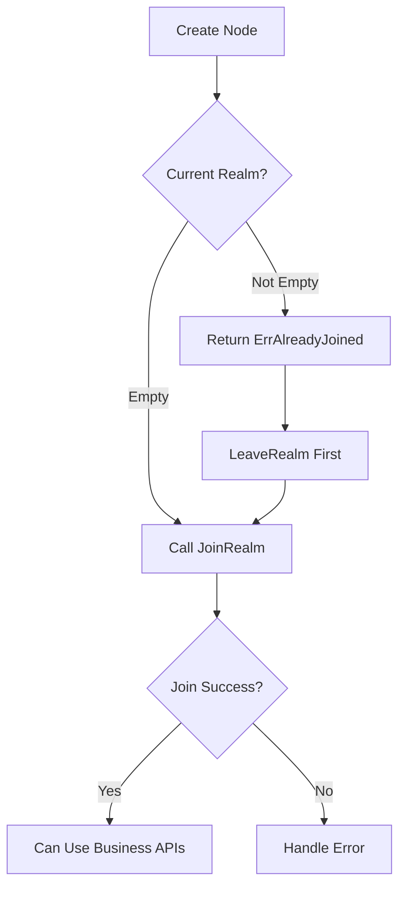

# Join Your First Realm

This document introduces the Realm concept and how to join your first Realm.

---

## What is Realm?

Realm is DeP2P's **business isolation tenant**, similar to:

- Kubernetes Namespace
- Cloud VPC (Virtual Private Cloud)
- Database Schema

```
┌─────────────────────────────────────────────────────────────────────────┐
│                         Realm Business Isolation                        │
├─────────────────────────────────────────────────────────────────────────┤
│                                                                          │
│   ┌─────────────┐    ┌─────────────┐    ┌─────────────┐                 │
│   │  Realm A    │    │  Realm B    │    │  Realm C    │                 │
│   │  Blockchain │    │  GameFi     │    │  Storage    │                 │
│   │  Mainnet    │    │  Testnet    │    │  Network    │                 │
│   │             │    │             │    │             │                 │
│   │ ├─ Discovery│    │ ├─ Discovery│    │ ├─ Discovery│                 │
│   │ ├─ Messaging│    │ ├─ Messaging│    │ ├─ Messaging│                 │
│   │ └─ PubSub   │    │ └─ PubSub   │    │ └─ PubSub   │                 │
│   └─────────────┘    └─────────────┘    └─────────────┘                 │
│          │                 │                  │                          │
│          └─────────────────┴──────────────────┘                          │
│                            │                                             │
│   ┌────────────────────────┴────────────────────────────────────────┐   │
│   │              System Infrastructure (Shared DHT/Relay/NAT)        │   │
│   └─────────────────────────────────────────────────────────────────┘   │
│                                                                          │
└─────────────────────────────────────────────────────────────────────────┘
```

---

## Why Realm?

### Core Principles

1. **Each node can only join one Realm at a time**  
   Strict single-Realm model to avoid confusion and security issues.

2. **Business APIs require JoinRealm first**  
   The following APIs require joining a Realm:
   - `Node.Send` / `Node.Request`
   - `Node.Publish` / `Node.Subscribe`

3. **System APIs are unrestricted**  
   The following APIs don't require JoinRealm:
   - `Node.Connect` / `Node.ConnectToAddr`
   - `Node.ListenAddrs` / `Node.AdvertisedAddrs`
   - Discovery / NAT / Relay

### Use Cases

- **Isolate data between applications**: App A's messages won't be received by App B
- **Prevent cross-tenant attacks**: Malicious nodes cannot impersonate other Realm members
- **Simplify programming model**: Framework-level isolation, no need to pass `tenantID` every time

---

## Joining a Realm

### JoinRealm Flow



### Basic Usage

```go
package main

import (
    "context"
    "fmt"
    "log"
    
    "github.com/dep2p/go-dep2p"
)

func main() {
    ctx := context.Background()
    
    // Step 1: Create node
    node, err := dep2p.New(ctx, dep2p.WithPreset(dep2p.PresetDesktop))
    if err != nil {
        log.Fatal(err)
    }
    if err := node.Start(ctx); err != nil {
        log.Fatal(err)
    }
    defer node.Close()
    
    fmt.Printf("Node ID: %s\n", node.ID())
    fmt.Printf("Current Realm: '%s'\n", node.Realm().CurrentRealm())  // Output: ''
    
    // Step 2: Join Realm
    realm, err := node.Realm("my-blockchain-mainnet")
    if err != nil {
        log.Fatalf("Failed to get Realm: %v", err)
    }
    if err := realm.Join(ctx); err != nil {
        log.Fatalf("Failed to join Realm: %v", err)
    }
    
    fmt.Printf("Joined: %s\n", realm.ID())
    
    // Step 3: Now you can use business APIs
    fmt.Println("Ready to send messages!")
}
```

---

## Realm Types

DeP2P supports three Realm types:

| Type | Description | Join Method |
|------|-------------|-------------|
| **Public** | Anyone can join | `node.Realm(realmID)` + `realm.Join(ctx)` |
| **Protected** | Requires JoinKey | `node.Realm(realmID)` + `realm.Join(ctx)` |
| **Private** | Requires invitation | `node.Realm(realmID)` + `realm.Join(ctx)` |

### Public Realm

```go
// Anyone can join
realm, err := node.Realm("public-chat-room")
if err != nil {
    log.Fatalf("Failed to get Realm: %v", err)
}
err = realm.Join(ctx)
```

### Protected Realm

```go
// Create protected Realm (admin)
joinKey, err := node.Realm().CreateProtectedRealm(ctx, "vip-club")

// Join protected Realm (member, needs key)
realm, _ := node.Realm("vip-club")
err = realm.Join(ctx)
```

### Private Realm

```go
// Create invitation (existing member)
invite, err := node.Realm().CreateInvite(ctx, "team-internal", targetNodeID)

// Join with invitation (invitee)
realm, err := node.Realm("team-internal")
if err != nil {
    log.Fatalf("Failed to get Realm: %v", err)
}
err = realm.JoinWithInvite(ctx, invite)
```

---

## Switching Realms

**Strict Single-Realm**: A node can only be in one business Realm at a time.

```go
// Join mainnet
realmMainnet, _ := node.Realm("chain-mainnet")
_ = realmMainnet.Join(ctx)
fmt.Println(realmMainnet.ID())  // chain-mainnet

// Try to switch to testnet directly (will fail)
realmTestnet, _ := node.Realm("chain-testnet")
err := realmTestnet.Join(ctx)
// err == ErrAlreadyJoined

// Correct approach: Leave first, then Join
realmMainnet.Leave(ctx)
err = realmTestnet.Join(ctx)
fmt.Println(realmTestnet.ID())  // chain-testnet
```

---

## Common Errors

### ErrNotMember

Calling business API without joining Realm:

```go
// ❌ Wrong
node, _ := dep2p.New(ctx, dep2p.WithPreset(dep2p.PresetDesktop))
_ = node.Start(ctx)
err := node.Send(ctx, peerID, "/dep2p/app/chat/1.0.0", []byte("hello"))
fmt.Println(err)  // ErrNotMember

// ✅ Correct
node, _ := dep2p.New(ctx, dep2p.WithPreset(dep2p.PresetDesktop))
_ = node.Start(ctx)
realm, _ := node.Realm("my-realm")
_ = realm.Join(ctx)
err := realm.Messaging().Send(ctx, peerID, "/dep2p/app/chat/1.0.0", []byte("hello"))
fmt.Println(err)  // nil
```

### ErrAlreadyJoined

Already in a Realm, trying to join another:

```go
// ❌ Wrong
realmMainnet, _ := node.Realm("mainnet")
_ = realmMainnet.Join(ctx)
realmTestnet, _ := node.Realm("testnet")
err := realmTestnet.Join(ctx)
fmt.Println(err)  // ErrAlreadyJoined

// ✅ Correct
realmMainnet, _ := node.Realm("mainnet")
_ = realmMainnet.Join(ctx)
realmMainnet.Leave(ctx)  // Leave first
realmTestnet, _ := node.Realm("testnet")
err = realmTestnet.Join(ctx)
fmt.Println(err)  // nil
```

---

## Complete Example

```go
package main

import (
    "context"
    "fmt"
    "log"
    
    "github.com/dep2p/go-dep2p"
)

func main() {
    ctx := context.Background()
    
    // Create node
    node, err := dep2p.New(ctx, dep2p.WithPreset(dep2p.PresetDesktop))
    if err != nil {
        log.Fatal(err)
    }
    if err := node.Start(ctx); err != nil {
        log.Fatal(err)
    }
    defer node.Close()
    
    // Demonstrate Realm lifecycle
    fmt.Println("=== Realm Lifecycle Demo ===")
    
    // 1. Initial state
    fmt.Printf("1. Initial Realm: '%s'\n", node.Realm().CurrentRealm())
    
    // 2. Join Realm
    realm1, err := node.Realm("demo-realm")
    if err != nil {
        log.Fatal(err)
    }
    if err := realm1.Join(ctx); err != nil {
        log.Fatal(err)
    }
    fmt.Printf("2. After joining: '%s'\n", realm1.ID())
    
    // 3. Try to join again (will fail)
    realm2, _ := node.Realm("another-realm")
    err = realm2.Join(ctx)
    fmt.Printf("3. Duplicate join result: %v\n", err)
    
    // 4. Leave Realm
    if err := realm1.Leave(ctx); err != nil {
        log.Fatal(err)
    }
    fmt.Printf("4. After leaving: '%s'\n", node.Realm().CurrentRealm())
    
    // 5. Join new Realm
    realm3, err := node.Realm("new-realm")
    if err != nil {
        log.Fatal(err)
    }
    if err := realm3.Join(ctx); err != nil {
        log.Fatal(err)
    }
    fmt.Printf("5. New Realm: '%s'\n", realm3.ID())
}
```

Output:

```
=== Realm Lifecycle Demo ===
1. Initial Realm: ''
2. After joining: 'demo-realm'
3. Duplicate join result: ErrAlreadyJoined
4. After leaving: ''
5. New Realm: 'new-realm'
```

---

## Next Steps

- [FAQ](faq.md) - More answers
- [Core Concepts](../concepts/core-concepts.md) - Deep dive into Realm
- [Realm Tutorial](../tutorials/04-realm-application.md) - Build Realm applications
