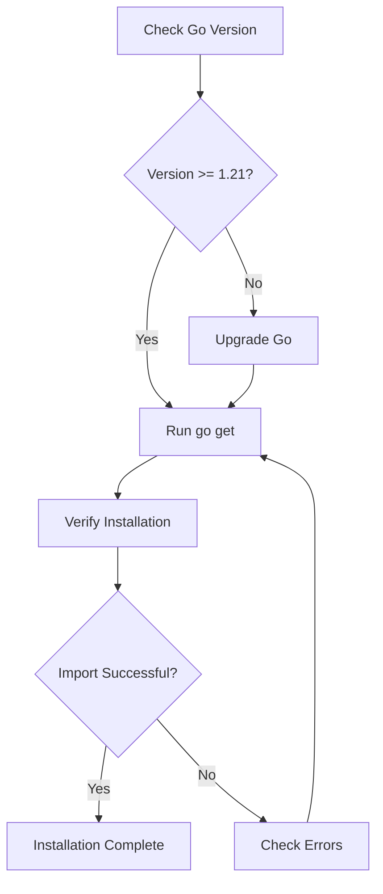

# Installation

This document will guide you through the installation and environment setup for DeP2P.

---

## Requirements

Before installing DeP2P, ensure your system meets the following requirements:

| Requirement | Version | Notes |
|-------------|---------|-------|
| **Go** | 1.21+ | Latest stable version recommended |
| **OS** | Linux / macOS / Windows | Cross-platform support |
| **Network** | UDP support | QUIC protocol requires UDP |

### Check Go Version

```bash
go version
# Example output: go version go1.21.0 darwin/arm64
```

> ⚠️ **Note**: If your Go version is below 1.21, please upgrade Go first.

---

## Installation Methods

### Method 1: Using go get (Recommended)

```bash
go get github.com/dep2p/go-dep2p
```

### Method 2: Using go mod

Add the dependency to your project:

```bash
# Initialize module (if not already initialized)
go mod init your-project

# Add dep2p dependency
go get github.com/dep2p/go-dep2p@latest
```

### Method 3: Build from Source

```bash
# Clone the repository
git clone https://github.com/dep2p/go-dep2p.git
cd go-dep2p

# Build
go build ./...

# Run tests
go test ./...
```

---

## Installation Flow



---

## Verify Installation

Create a simple test file to verify the installation:

```go
// main.go
package main

import (
    "fmt"
    
    "github.com/dep2p/go-dep2p"
)

func main() {
    fmt.Printf("DeP2P Version: %s\n", dep2p.Version)
    fmt.Println("Installation successful!")
}
```

Run the test:

```bash
go run main.go
# Output:
# DeP2P Version: v0.2.0-beta.1
# Installation successful!
```

---

## Project Structure

After installation, a typical project structure looks like:

```
your-project/
├── go.mod              # Go module file
├── go.sum              # Dependency checksum file
├── main.go             # Main program
└── ...
```

Your `go.mod` file should contain:

```
module your-project

go 1.21

require github.com/dep2p/go-dep2p v0.2.0-beta.1
```

---

## Common Issues

### Q: go get times out or fails

**A**: Try the following solutions:

```bash
# Set Go proxy (for users in China)
go env -w GOPROXY=https://goproxy.cn,direct

# Retry installation
go get github.com/dep2p/go-dep2p
```

### Q: Compilation error: package not found

**A**: Ensure you have properly initialized the Go module:

```bash
# Check if you're in a module
go env GOMOD
# If output is empty, initialize the module
go mod init your-project
go mod tidy
```

### Q: Runtime network errors

**A**: DeP2P uses QUIC protocol (based on UDP). Please ensure:

1. Firewall allows UDP traffic
2. Port is not in use
3. Network supports UDP (some enterprise networks may block it)

### Q: Dependency version conflicts

**A**: Update all dependencies to the latest version:

```bash
go get -u ./...
go mod tidy
```

---

## Next Steps

After installation, continue learning:

- [5-Minute Quickstart](quickstart.md) - Run your first example
- [Create Your First Node](first-node.md) - Learn about node creation
- [Core Concepts](../concepts/core-concepts.md) - Understand DeP2P in depth
