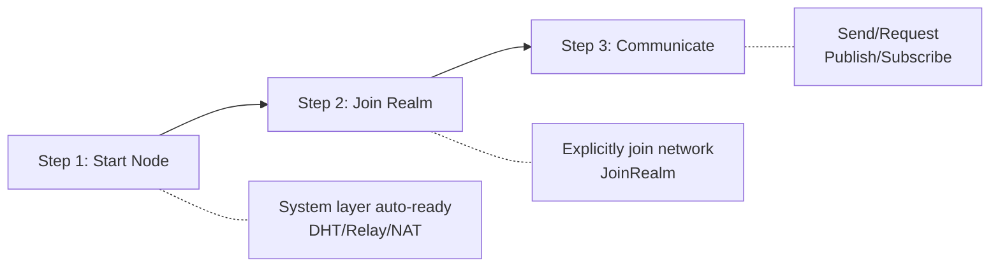

# 5-Minute Quickstart

This document will help you run your first DeP2P node in 5 minutes.

---

## Core Philosophy

```
┌─────────────────────────────────────────────────────────────────────┐
│                    DeP2P Core Philosophy                            │
├─────────────────────────────────────────────────────────────────────┤
│                                                                      │
│   Make P2P connection as simple as calling a function:              │
│   Give a public key, send a message                                 │
│                                                                      │
│   • Users only need to care about "who to connect"                  │
│   • Complex network details (NAT traversal, address discovery,      │
│     connection management) are handled automatically                │
│   • Simple for simple cases, extensible for complex ones            │
│                                                                      │
└─────────────────────────────────────────────────────────────────────┘
```

---

## Three-Step Process

Using DeP2P follows a simple three-step process:



```
┌─────────────────────────────────────────────────────────────────────────┐
│                      DeP2P Three Steps                                   │
├─────────────────────────────────────────────────────────────────────────┤
│  Step 1: NewNode()     Start node, system layer auto-ready              │
│  Step 2: JoinRealm()   Join business network (required!)                │
│  Step 3: Send/Publish  Use business APIs for communication             │
└─────────────────────────────────────────────────────────────────────────┘
```

---

## Minimal Example

### Create and Start a Node

```go
package main

import (
    "context"
    "fmt"
    "log"
    
    "github.com/dep2p/go-dep2p"
)

func main() {
    ctx := context.Background()
    
    // Step 1: Create node (one line of code)
    node, err := dep2p.StartNode(ctx, dep2p.WithPreset(dep2p.PresetDesktop))
    if err != nil {
        log.Fatalf("Failed to start node: %v", err)
    }
    defer node.Close()
    
    // Print node information
    fmt.Printf("Node ID: %s\n", node.ID())
    fmt.Printf("Listen Addresses: %v\n", node.ListenAddrs())
    
    // Step 2: Join business network (required!)
    if err := node.Realm().JoinRealm(ctx, "my-first-realm"); err != nil {
        log.Fatalf("Failed to join Realm: %v", err)
    }
    fmt.Printf("Joined: %s\n", node.Realm().CurrentRealm())
    
    // Step 3: Now you can use business APIs
    fmt.Println("Node is ready for communication!")
}
```

Run:

```bash
go run main.go
# Output:
# Node ID: 5Q2STWvBFn...  (Base58 encoded public key)
# Listen Addresses: [/ip4/0.0.0.0/udp/xxxxx/quic-v1]
# Joined: my-first-realm
# Node is ready for communication!
```

---

## Three-Layer Architecture

DeP2P uses a three-layer architecture design:

```
┌─────────────────────────────────────────────────────────────────────┐
│                    DeP2P Three-Layer Architecture                   │
├─────────────────────────────────────────────────────────────────────┤
│                                                                      │
│  Layer 3: Application Protocols                                     │
│           /dep2p/app/* protocols, stream/subscription messages      │
│           [!] Must join Realm before use                            │
│                                                                      │
│  Layer 2: Realm Layer (Business Isolation)                          │
│           Business isolation, member management, admission control  │
│           [*] Explicit join, strict single-Realm                    │
│                                                                      │
│  Layer 1: System Infrastructure                                     │
│           Transport/Security/DHT/Relay/NAT/Bootstrap                │
│           [~] Auto-ready on node start, transparent to users        │
│                                                                      │
└─────────────────────────────────────────────────────────────────────┘
```

---

## Preset Configurations

DeP2P provides multiple preset configurations for different scenarios:

| Preset | Use Case | Connection Limits | Description |
|--------|----------|-------------------|-------------|
| `PresetMobile` | Phone, Tablet | 20/50 | Low resource usage |
| `PresetDesktop` | PC, Laptop | 50/100 | Default configuration |
| `PresetServer` | Server | 200/500 | High performance |
| `PresetMinimal` | Testing | 10/20 | Minimal configuration |

```go
// Use preset
node, _ := dep2p.StartNode(ctx, dep2p.WithPreset(dep2p.PresetDesktop))

// Server scenario
node, _ := dep2p.StartNode(ctx, dep2p.WithPreset(dep2p.PresetServer))

// Mobile scenario
node, _ := dep2p.StartNode(ctx, dep2p.WithPreset(dep2p.PresetMobile))
```

---

## Identity First

> **Core Principle**: In DeP2P, the connection target is identity (NodeID), not address.

```
┌─────────────────────────────────────────────────────────────────────────────┐
│                    Identity First Principle                                  │
├─────────────────────────────────────────────────────────────────────────────┤
│                                                                              │
│   Traditional: connect("192.168.1.100:4001")  // Connect to address         │
│   DeP2P:       connect(nodeID)                 // Connect to identity       │
│                                                                              │
│   ✅ Correct understanding of DeP2P:                                        │
│   • Connection target is always NodeID (public key identity)                │
│   • IP/port is just Dial Address (routing hint)                             │
│   • Every connection verifies RemoteIdentity == ExpectedNodeID              │
│                                                                              │
└─────────────────────────────────────────────────────────────────────────────┘
```

---

## Common Errors

### ErrNotMember

```go
// ❌ Wrong: Call business API without JoinRealm
node, _ := dep2p.StartNode(ctx, dep2p.WithPreset(dep2p.PresetDesktop))
err := node.Send(ctx, peerID, "/dep2p/app/chat/1.0.0", data)
// err == ErrNotMember

// ✅ Correct: JoinRealm first
node, _ := dep2p.StartNode(ctx, dep2p.WithPreset(dep2p.PresetDesktop))
node.Realm().JoinRealm(ctx, "my-realm")
err := node.Send(ctx, peerID, "/dep2p/app/chat/1.0.0", data)
// err == nil
```

---

## Encountering Issues?

```
┌─────────────────────────────────────────────────────────────────────┐
│                    Encountering Issues? Quick Check                 │
├─────────────────────────────────────────────────────────────────────┤
│                                                                      │
│  ErrNotMember         → Call JoinRealmWithKey() first               │
│  Connection timeout   → Check network, enable Relay                 │
│  Invalid address      → Use ShareableAddrs() to get full address   │
│  Auth failed          → Ensure all members use the same realmKey    │
│                                                                      │
└─────────────────────────────────────────────────────────────────────┘
```

Detailed troubleshooting guides:
- [Troubleshooting](../how-to/troubleshooting.md) - Problem diagnosis and solutions
- [Error Codes Reference](../reference/error-codes.md) - Detailed explanation of all errors
- [API Constraints](../reference/api-defaults.md) - Core constraints and default behaviors

---

## Next Steps

- [Create Your First Node](first-node.md) - Learn about node configuration
- [Join Your First Realm](first-realm.md) - Understand Realm concept
- [FAQ](faq.md) - Solve common issues
- [Core Concepts](../concepts/core-concepts.md) - Deep dive into architecture
