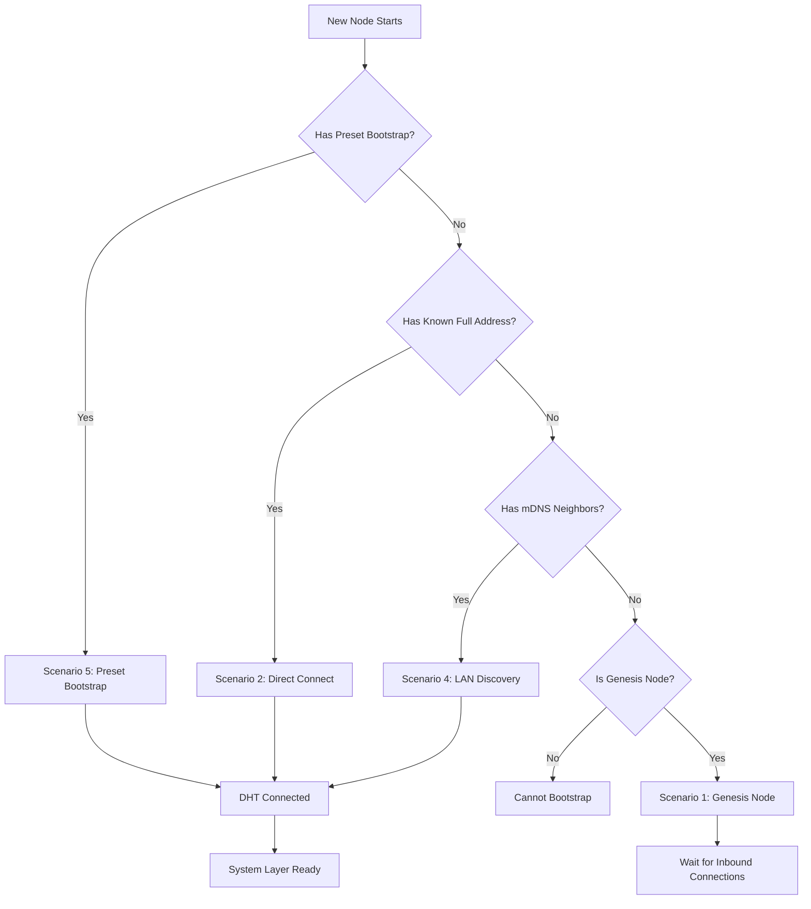
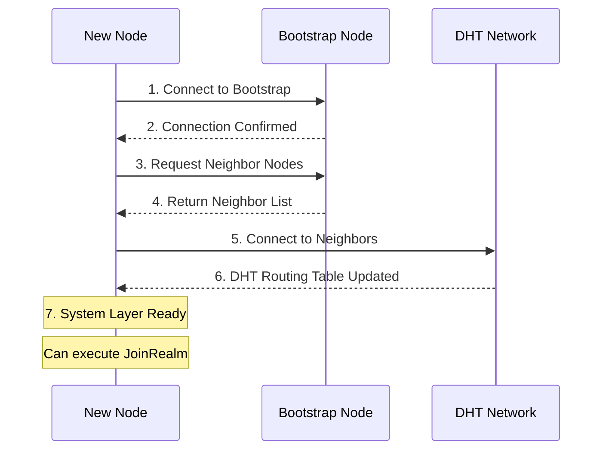

# How to Bootstrap Network

This guide answers: **How to bootstrap a new node into the DeP2P network?**

---

## Problem

```
┌─────────────────────────────────────────────────────────────────────┐
│                     What problem am I solving?                       │
├─────────────────────────────────────────────────────────────────────┤
│                                                                      │
│  "I started a new node, how do I join an existing network?"         │
│  "How to configure Bootstrap nodes?"                                 │
│  "How to start a genesis node?"                                      │
│                                                                      │
└─────────────────────────────────────────────────────────────────────┘
```

---

## Bootstrap Overview

Bootstrap solves the "chicken-and-egg" problem of P2P networks: to connect to nodes you need to know addresses, to know addresses you need to connect to the network first.



---

## Five Bootstrap Scenarios

| Scenario | Description | Configuration | DHT Dependency |
|----------|-------------|---------------|----------------|
| **Genesis Node** | First node in network | `WithBootstrapPeers(nil)` | No |
| **Direct Connect** | Known full address | `ConnectToAddr()` | No |
| **NodeID Only** | Only know public key | `Connect(nodeID)` | **Yes** |
| **LAN Discovery** | mDNS discovery | Automatic | No |
| **Preset Bootstrap** | Public nodes | `PresetDesktop/Server` | No |

---

## Scenario 1: Genesis Node (No Bootstrap)

When you are the first node in the network, no Bootstrap is needed.

```go
package main

import (
    "context"
    "fmt"
    "log"
    "os"
    "os/signal"
    "syscall"

    "github.com/dep2p/go-dep2p"
    "github.com/dep2p/go-dep2p/pkg/types"
)

func main() {
    ctx, cancel := context.WithCancel(context.Background())
    defer cancel()

    // Genesis node: explicitly pass nil for no Bootstrap
    node, err := dep2p.New(ctx,
        dep2p.WithPreset(dep2p.PresetServer),
        dep2p.WithBootstrapPeers(nil),  // Key: no Bootstrap
        dep2p.WithListenPort(4001),     // Fixed port
    )
    if err != nil {
        log.Fatalf("Failed to create node: %v", err)
    }
    defer node.Close()
    
    if err := node.Start(ctx); err != nil {
        log.Fatalf("Failed to start node: %v", err)
    }

    // Join Realm
    realm, _ := node.Realm("my-network")
    _ = realm.Join(ctx)

    fmt.Println("Genesis node started")
    fmt.Printf("NodeID: %s\n", node.ID())
    fmt.Println()
    fmt.Println("Other nodes can connect using these addresses:")
    for _, addr := range node.ListenAddrs() {
        fmt.Printf("  %s/p2p/%s\n", addr, node.ID())
    }

    // Wait for interrupt signal
    sigCh := make(chan os.Signal, 1)
    signal.Notify(sigCh, syscall.SIGINT, syscall.SIGTERM)
    <-sigCh
}
```

---

## Scenario 2: Using Preset Bootstrap

The simplest way, using built-in preset configurations.

```go
package main

import (
    "context"
    "fmt"
    "log"

    "github.com/dep2p/go-dep2p"
    "github.com/dep2p/go-dep2p/pkg/types"
)

func main() {
    ctx := context.Background()

    // PresetDesktop/PresetServer includes default Bootstrap nodes
    node, err := dep2p.New(ctx,
        dep2p.WithPreset(dep2p.PresetDesktop),  // Includes default Bootstrap
    )
    if err != nil {
        log.Fatalf("Failed to create node: %v", err)
    }
    defer node.Close()
    
    if err := node.Start(ctx); err != nil {
        log.Fatalf("Failed to start node: %v", err)
    }

    // Join Realm
    realm, _ := node.Realm("my-network")
    _ = realm.Join(ctx)

    fmt.Printf("Node started: %s\n", node.ID().ShortString())
    fmt.Println("Automatically connected to default Bootstrap nodes")
}
```

### Preset Configuration Comparison

| Preset | Bootstrap Nodes | Use Case |
|--------|-----------------|----------|
| `PresetMinimal` | None | Testing, genesis node |
| `PresetDesktop` | Yes | Desktop applications |
| `PresetServer` | Yes | Servers |
| `PresetMobile` | Yes | Mobile devices |

---

## Scenario 3: Custom Bootstrap Nodes

Specify your own Bootstrap nodes.

```go
package main

import (
    "context"
    "fmt"
    "log"

    "github.com/dep2p/go-dep2p"
    "github.com/dep2p/go-dep2p/pkg/types"
)

func main() {
    ctx := context.Background()

    // Custom Bootstrap nodes
    // Note: Must be Full Address (including /p2p/<NodeID>)
    bootstrapPeers := []string{
        "/ip4/1.2.3.4/udp/4001/quic-v1/p2p/5Q2STWvBFn...",
        "/dns4/bootstrap.example.com/udp/4001/quic-v1/p2p/5Q2STWvBFn...",
    }

    node, err := dep2p.New(ctx,
        dep2p.WithPreset(dep2p.PresetDesktop),
        dep2p.WithBootstrapPeers(bootstrapPeers...),  // Override default Bootstrap
    )
    if err != nil {
        log.Fatalf("Failed to create node: %v", err)
    }
    defer node.Close()
    
    if err := node.Start(ctx); err != nil {
        log.Fatalf("Failed to start node: %v", err)
    }

    realm, _ := node.Realm("my-network")
    _ = realm.Join(ctx)

    fmt.Printf("Node started: %s\n", node.ID().ShortString())
}
```

### Bootstrap Address Format Requirements

```
┌─────────────────────────────────────────────────────────────────────┐
│                Bootstrap Address Format Requirements                 │
├─────────────────────────────────────────────────────────────────────┤
│                                                                      │
│  ✅ Correct format (Full Address):                                   │
│     /ip4/1.2.3.4/udp/4001/quic-v1/p2p/5Q2STWvBFn...                 │
│     /dns4/bootstrap.example.com/udp/4001/quic-v1/p2p/5Q2STWvBFn...  │
│                                                                      │
│  ❌ Wrong format (Dial Address, missing /p2p/ suffix):               │
│     /ip4/1.2.3.4/udp/4001/quic-v1                                   │
│                                                                      │
│  ❌ Wrong format (Relay Address, cannot be used for Bootstrap):      │
│     /ip4/.../p2p/.../p2p-circuit/p2p/...                            │
│                                                                      │
└─────────────────────────────────────────────────────────────────────┘
```

---

## Scenario 4: Direct Connect to Known Address

When you already know the full address of a node.

```go
package main

import (
    "context"
    "fmt"
    "log"

    "github.com/dep2p/go-dep2p"
    "github.com/dep2p/go-dep2p/pkg/types"
)

func main() {
    ctx := context.Background()

    // Use Minimal preset (no default Bootstrap)
    node, err := dep2p.New(ctx,
        dep2p.WithPreset(dep2p.PresetMinimal),
    )
    if err != nil {
        log.Fatalf("Failed to create node: %v", err)
    }
    defer node.Close()
    
    if err := node.Start(ctx); err != nil {
        log.Fatalf("Failed to start node: %v", err)
    }

    realm, _ := node.Realm("my-network")
    _ = realm.Join(ctx)

    // Direct connect to known address
    targetAddr := "/ip4/192.168.1.100/udp/4001/quic-v1/p2p/5Q2STWvBFn..."
    conn, err := node.ConnectToAddr(ctx, targetAddr)
    if err != nil {
        log.Fatalf("Connection failed: %v", err)
    }

    fmt.Printf("Connected to: %s\n", conn.RemoteID().ShortString())
}
```

---

## Scenario 5: LAN mDNS Discovery

Nodes on the same LAN will discover each other automatically.

```go
package main

import (
    "context"
    "fmt"
    "log"
    "time"

    "github.com/dep2p/go-dep2p"
    "github.com/dep2p/go-dep2p/pkg/types"
)

func main() {
    ctx := context.Background()

    // mDNS is enabled by default
    node, err := dep2p.New(ctx,
        dep2p.WithPreset(dep2p.PresetDesktop),
    )
    if err != nil {
        log.Fatalf("Failed to create node: %v", err)
    }
    defer node.Close()
    
    if err := node.Start(ctx); err != nil {
        log.Fatalf("Failed to start node: %v", err)
    }

    realm, _ := node.Realm("my-network")
    _ = realm.Join(ctx)

    // Set connection notification
    node.Endpoint().SetConnectedNotify(func(conn dep2p.Connection) {
        fmt.Printf("Discovered and connected to LAN node: %s\n", conn.RemoteID().ShortString())
    })

    fmt.Println("Waiting for LAN nodes...")
    fmt.Println("Start another node on the same network for auto-discovery")
    
    time.Sleep(60 * time.Second)
}
```

---

## Bootstrap Flow



---

## Complete Example: Dynamic Bootstrap Addition

```go
package main

import (
    "context"
    "fmt"
    "log"
    "os"

    "github.com/dep2p/go-dep2p"
    "github.com/dep2p/go-dep2p/pkg/types"
)

func main() {
    ctx := context.Background()

    // Get Bootstrap address from environment variable or command line
    bootstrapAddr := os.Getenv("BOOTSTRAP_ADDR")
    
    var opts []dep2p.Option
    opts = append(opts, dep2p.WithPreset(dep2p.PresetDesktop))
    
    if bootstrapAddr != "" {
        // Use specified Bootstrap
        opts = append(opts, dep2p.WithBootstrapPeers(bootstrapAddr))
        fmt.Printf("Using Bootstrap: %s\n", bootstrapAddr)
    } else {
        // Use default Bootstrap
        fmt.Println("Using default Bootstrap nodes")
    }

    node, err := dep2p.New(ctx, opts...)
    if err != nil {
        log.Fatalf("Failed to create node: %v", err)
    }
    defer node.Close()
    
    if err := node.Start(ctx); err != nil {
        log.Fatalf("Failed to start node: %v", err)
    }

    realm, _ := node.Realm("my-network")
    _ = realm.Join(ctx)

    fmt.Printf("Node started: %s\n", node.ID().ShortString())
}
```

Run:

```bash
# Use default Bootstrap
go run main.go

# Use custom Bootstrap
BOOTSTRAP_ADDR="/ip4/1.2.3.4/udp/4001/quic-v1/p2p/5Q2STWvBFn..." go run main.go
```

---

## Troubleshooting

### Problem 1: Bootstrap Connection Failed

**Symptom**: `failed to connect to bootstrap peer`

**Possible causes**:
- Bootstrap node unreachable
- Wrong address format
- Firewall blocking connection

**Solutions**:

```go
// 1. Check address format
addr := "/ip4/1.2.3.4/udp/4001/quic-v1/p2p/5Q2STWvBFn..."
if !strings.Contains(addr, "/p2p/") {
    log.Fatal("Bootstrap address must contain /p2p/<NodeID>")
}

// 2. Test network connectivity
// Use nc or telnet to test UDP port
// nc -uzv 1.2.3.4 4001

// 3. Use multiple Bootstrap nodes
node, _ := dep2p.New(ctx,
    dep2p.WithBootstrapPeers(
        "/ip4/1.2.3.4/udp/4001/quic-v1/p2p/...",
        "/ip4/5.6.7.8/udp/4001/quic-v1/p2p/...",  // Backup
    ),
)
_ = node.Start(ctx)
```

### Problem 2: Cannot Discover Other Nodes

**Symptom**: Bootstrap connected successfully but cannot find other nodes

**Possible causes**:
- Other nodes not in the same Realm
- DHT routing table not synced
- Network isolation

**Solutions**:

```go
// 1. Ensure Realm consistency
realm, _ := node.Realm("my-network")
_ = realm.Join(ctx)

// 2. Wait for DHT sync
time.Sleep(5 * time.Second)

// 3. Check connection count
fmt.Printf("Current connections: %d\n", node.ConnectionCount())
```

### Problem 3: Genesis Node Cannot Be Discovered

**Symptom**: After genesis node starts, other nodes cannot connect

**Possible causes**:
- Listen address is private
- Firewall blocking inbound connections
- Wrong address shared

**Solutions**:

```go
// 1. Use public address
node, _ := dep2p.New(ctx,
    dep2p.WithPreset(dep2p.PresetServer),
    dep2p.WithListenPort(4001),
    dep2p.WithExternalAddrs("/ip4/PUBLIC_IP/udp/4001/quic-v1"),
)
_ = node.Start(ctx)

// 2. Get shareable address
addrs, _ := node.WaitShareableAddrs(ctx)
fmt.Println("Share this address:", addrs)
```

---

## Related Documentation

- [How to Share Address](share-address.md)
- [How to Use Relay](use-relay.md)
- [Peer Discovery](peer-discovery.md)
- [Quick Start](../getting-started/quickstart.md)
