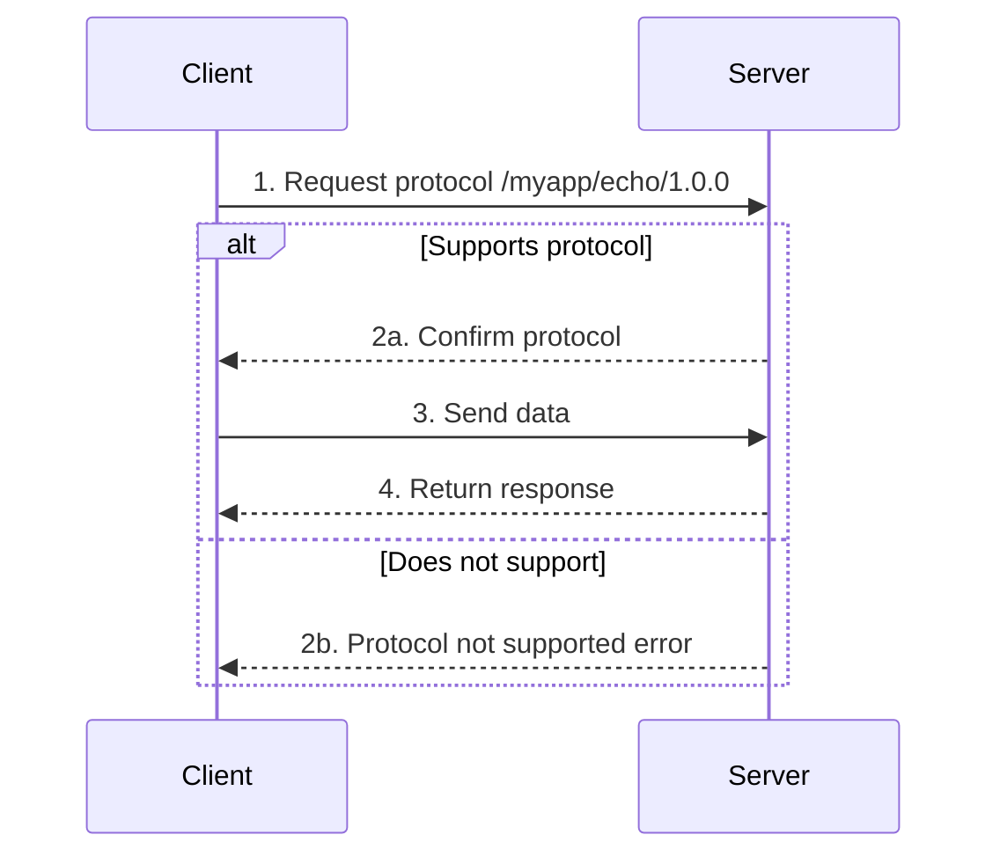
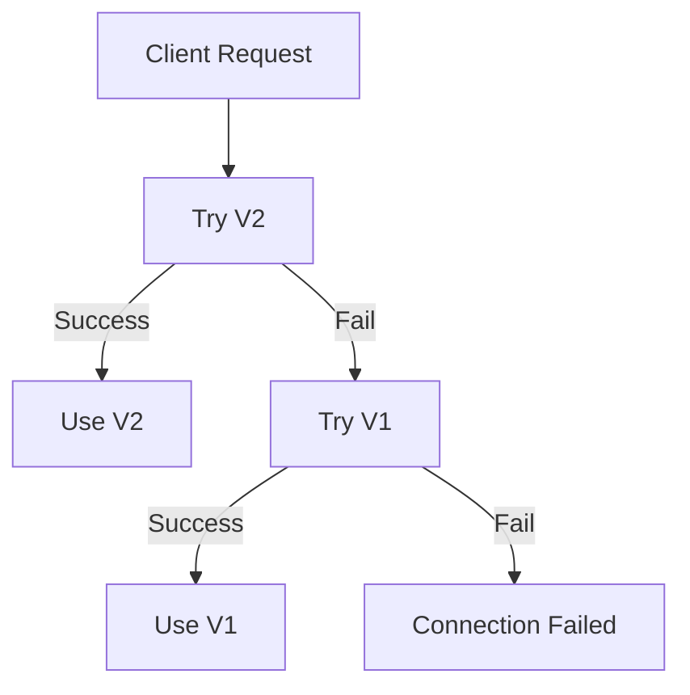

# Custom Protocols

This guide answers: **How to define and use custom protocols?**

---

## Problem

```
┌─────────────────────────────────────────────────────────────────────┐
│                     What problem am I solving?                       │
├─────────────────────────────────────────────────────────────────────┤
│                                                                      │
│  "How to define my own application protocol?"                       │
│  "How should I name protocol IDs?"                                   │
│  "How to handle protocol version upgrades?"                          │
│                                                                      │
└─────────────────────────────────────────────────────────────────────┘
```

---

## Protocol Identifier Specification

```
┌─────────────────────────────────────────────────────────────────────────────┐
│                       Protocol Identifier Format                             │
├─────────────────────────────────────────────────────────────────────────────┤
│                                                                              │
│  Format: /<namespace>/<protocol>/<version>                                  │
│                                                                              │
│  Examples:                                                                   │
│  • /myapp/chat/1.0.0          - Chat protocol v1.0.0                        │
│  • /myapp/file-transfer/2.0.0 - File transfer protocol v2.0.0              │
│  • /company/rpc/1.0.0         - Company RPC protocol                       │
│                                                                              │
│  Naming Rules:                                                               │
│  • Use lowercase letters and hyphens                                        │
│  • Use semantic versioning                                                   │
│  • Namespace should uniquely identify your application                      │
│                                                                              │
└─────────────────────────────────────────────────────────────────────────────┘
```

---

## Register Protocol Handler

### Basic Example

```go
package main

import (
    "context"
    "fmt"
    "io"
    "log"

    "github.com/dep2p/go-dep2p"
    "github.com/dep2p/go-dep2p/pkg/types"
)

// Define protocol ID
const myProtocol = "/myapp/echo/1.0.0"

func main() {
    ctx := context.Background()

    node, err := dep2p.New(ctx,
        dep2p.WithPreset(dep2p.PresetDesktop),
    )
    if err != nil {
        log.Fatalf("Failed to create node: %v", err)
    }
    defer node.Close()
    
    if err := node.Start(ctx); err != nil {
        log.Fatalf("Failed to start node: %v", err)
    }

    realm, _ := node.Realm(types.RealmID("my-network"))
    _ = realm.Join(ctx)

    // Register protocol handler
    node.Endpoint().SetProtocolHandler(myProtocol, func(stream dep2p.Stream) {
        defer stream.Close()
        
        // Read request
        buf := make([]byte, 1024)
        n, err := stream.Read(buf)
        if err != nil && err != io.EOF {
            log.Printf("Read error: %v", err)
            return
        }
        
        message := string(buf[:n])
        fmt.Printf("Received: %s\n", message)
        
        // Send response
        response := fmt.Sprintf("Echo: %s", message)
        stream.Write([]byte(response))
    })

    fmt.Printf("Node started: %s\n", node.ID())
    fmt.Printf("Protocol registered: %s\n", myProtocol)

    select {}
}
```

---

## Open Protocol Stream

```go
package main

import (
    "context"
    "fmt"
    "io"
    "log"

    "github.com/dep2p/go-dep2p"
    "github.com/dep2p/go-dep2p/pkg/types"
)

const myProtocol = "/myapp/echo/1.0.0"

func main() {
    ctx := context.Background()

    node, err := dep2p.New(ctx,
        dep2p.WithPreset(dep2p.PresetDesktop),
    )
    if err != nil {
        log.Fatalf("Failed to create node: %v", err)
    }
    defer node.Close()
    
    if err := node.Start(ctx); err != nil {
        log.Fatalf("Failed to start node: %v", err)
    }

    realm, _ := node.Realm(types.RealmID("my-network"))
    _ = realm.Join(ctx)

    // Connect to target node
    targetAddr := "/ip4/192.168.1.100/udp/4001/quic-v1/p2p/5Q2STWvBFn..."
    conn, err := node.ConnectToAddr(ctx, targetAddr)
    if err != nil {
        log.Fatalf("Connection failed: %v", err)
    }

    // Open protocol stream
    stream, err := conn.OpenStream(ctx, myProtocol)
    if err != nil {
        log.Fatalf("Failed to open stream: %v", err)
    }
    defer stream.Close()

    // Send message
    stream.Write([]byte("Hello, World!"))

    // Read response
    buf := make([]byte, 1024)
    n, err := stream.Read(buf)
    if err != nil && err != io.EOF {
        log.Fatalf("Read error: %v", err)
    }

    fmt.Printf("Response: %s\n", string(buf[:n]))
}
```

---

## Protocol Negotiation Flow



---

## Protocol Version Management

### Multi-Version Support

```go
package main

import (
    "context"
    "fmt"
    "io"
    "log"

    "github.com/dep2p/go-dep2p"
    "github.com/dep2p/go-dep2p/pkg/types"
)

// Define multiple versions
const (
    protocolV1 = "/myapp/chat/1.0.0"
    protocolV2 = "/myapp/chat/2.0.0"
)

func main() {
    ctx := context.Background()

    node, err := dep2p.New(ctx,
        dep2p.WithPreset(dep2p.PresetDesktop),
    )
    if err != nil {
        log.Fatalf("Failed to create node: %v", err)
    }
    defer node.Close()
    
    if err := node.Start(ctx); err != nil {
        log.Fatalf("Failed to start node: %v", err)
    }

    realm, _ := node.Realm(types.RealmID("my-network"))
    _ = realm.Join(ctx)

    // Register v1 handler (backward compatible)
    node.Endpoint().SetProtocolHandler(protocolV1, handleV1)
    
    // Register v2 handler (new version)
    node.Endpoint().SetProtocolHandler(protocolV2, handleV2)

    fmt.Println("Registered protocols:")
    fmt.Printf("  %s (legacy, compatible)\n", protocolV1)
    fmt.Printf("  %s (new version)\n", protocolV2)

    select {}
}

func handleV1(stream dep2p.Stream) {
    defer stream.Close()
    buf := make([]byte, 1024)
    n, _ := stream.Read(buf)
    fmt.Printf("[V1] Received: %s\n", buf[:n])
    stream.Write([]byte("V1 Response"))
}

func handleV2(stream dep2p.Stream) {
    defer stream.Close()
    buf := make([]byte, 1024)
    n, _ := stream.Read(buf)
    fmt.Printf("[V2] Received: %s\n", buf[:n])
    // V2 can have richer response format
    stream.Write([]byte(`{"version": 2, "message": "V2 Response"}`))
}
```

### Version Negotiation Strategy



---

## Complete Example: RPC Protocol

```go
package main

import (
    "context"
    "encoding/json"
    "fmt"
    "io"
    "log"

    "github.com/dep2p/go-dep2p"
    "github.com/dep2p/go-dep2p/pkg/types"
)

const rpcProtocol = "/myapp/rpc/1.0.0"

// RPC Request
type RPCRequest struct {
    Method string      `json:"method"`
    Params interface{} `json:"params"`
    ID     int         `json:"id"`
}

// RPC Response
type RPCResponse struct {
    Result interface{} `json:"result,omitempty"`
    Error  string      `json:"error,omitempty"`
    ID     int         `json:"id"`
}

func main() {
    ctx := context.Background()

    node, err := dep2p.New(ctx,
        dep2p.WithPreset(dep2p.PresetDesktop),
    )
    if err != nil {
        log.Fatalf("Failed to create node: %v", err)
    }
    defer node.Close()
    
    if err := node.Start(ctx); err != nil {
        log.Fatalf("Failed to start node: %v", err)
    }

    realm, _ := node.Realm(types.RealmID("my-network"))
    _ = realm.Join(ctx)

    // Register RPC handler
    node.Endpoint().SetProtocolHandler(rpcProtocol, handleRPC)

    fmt.Printf("RPC service started: %s\n", node.ID())
    fmt.Printf("Protocol: %s\n", rpcProtocol)

    select {}
}

func handleRPC(stream dep2p.Stream) {
    defer stream.Close()

    // Read request
    buf := make([]byte, 4096)
    n, err := stream.Read(buf)
    if err != nil && err != io.EOF {
        log.Printf("Read error: %v", err)
        return
    }

    // Parse request
    var req RPCRequest
    if err := json.Unmarshal(buf[:n], &req); err != nil {
        sendError(stream, "invalid request", 0)
        return
    }

    fmt.Printf("RPC call: %s(%v)\n", req.Method, req.Params)

    // Handle method
    var resp RPCResponse
    resp.ID = req.ID

    switch req.Method {
    case "add":
        params := req.Params.([]interface{})
        a, b := params[0].(float64), params[1].(float64)
        resp.Result = a + b
    case "echo":
        resp.Result = req.Params
    default:
        resp.Error = fmt.Sprintf("unknown method: %s", req.Method)
    }

    // Send response
    data, _ := json.Marshal(resp)
    stream.Write(data)
}

func sendError(stream dep2p.Stream, errMsg string, id int) {
    resp := RPCResponse{Error: errMsg, ID: id}
    data, _ := json.Marshal(resp)
    stream.Write(data)
}
```

---

## Troubleshooting

### Problem 1: Protocol Not Supported Error

**Possible causes**:
- Remote node hasn't registered the protocol
- Protocol ID typo
- Version mismatch

**Solutions**:

```go
// 1. Check protocol ID matches exactly
const protocol = "/myapp/chat/1.0.0"  // Ensure both sides match

// 2. Register handler before connecting
node.Endpoint().SetProtocolHandler(protocol, handler)

// 3. Try falling back to older version
stream, err := conn.OpenStream(ctx, "/myapp/chat/2.0.0")
if err != nil {
    // Try v1
    stream, err = conn.OpenStream(ctx, "/myapp/chat/1.0.0")
}
```

### Problem 2: Stream Read/Write Errors

**Possible causes**:
- Connection closed
- Remote closed stream
- Timeout

**Solutions**:

```go
// 1. Set read/write timeout
ctx, cancel := context.WithTimeout(context.Background(), 30*time.Second)
defer cancel()

stream, err := conn.OpenStream(ctx, protocol)

// 2. Handle EOF properly
n, err := stream.Read(buf)
if err == io.EOF {
    // Normal end
} else if err != nil {
    // Handle error
}

// 3. Ensure stream is closed
defer stream.Close()
```

---

## Best Practices

```
┌─────────────────────────────────────────────────────────────────────┐
│                   Protocol Design Best Practices                     │
├─────────────────────────────────────────────────────────────────────┤
│                                                                      │
│  1. Protocol ID Naming                                              │
│     • Use unique namespace (e.g., company/project name)             │
│     • Use semantic versioning                                        │
│     • Example: /mycompany/service/1.0.0                             │
│                                                                      │
│  2. Version Management                                              │
│     • Maintain backward compatibility                               │
│     • Register multiple versions simultaneously                     │
│     • Prefer new version, fall back to old                          │
│                                                                      │
│  3. Message Format                                                  │
│     • Use JSON or Protobuf                                          │
│     • Define clear request/response structures                      │
│     • Include version or type field                                 │
│                                                                      │
│  4. Error Handling                                                  │
│     • Handle all possible errors                                    │
│     • Set reasonable timeouts                                       │
│     • Properly close streams                                        │
│                                                                      │
│  5. Security Considerations                                         │
│     • Validate input data                                           │
│     • Limit message size                                            │
│     • Handle malicious data                                         │
│                                                                      │
└─────────────────────────────────────────────────────────────────────┘
```

---

## Related Documentation

- [Hello World Tutorial](../tutorials/01-hello-world.md)
- [Secure Chat Application](../tutorials/02-secure-chat.md)
- [How to Share Address](share-address.md)
- [Core Concepts](../concepts/core-concepts.md)
