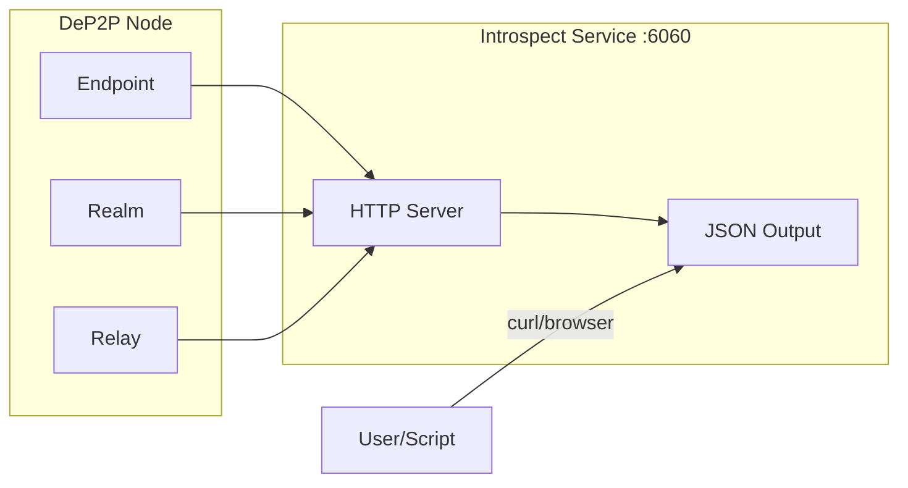

# Local Introspection Interface

This guide answers: **How to use the introspection interface to debug and monitor DeP2P nodes?**

---

## Problem

```
┌─────────────────────────────────────────────────────────────────────┐
│                    What Problem Am I Solving?                       │
├─────────────────────────────────────────────────────────────────────┤
│                                                                      │
│  "How to view complete node status?"                               │
│  "How to debug connection issues?"                                 │
│  "How to monitor Relay forwarding traffic?"                        │
│  "How to analyze performance issues?"                               │
│                                                                      │
└─────────────────────────────────────────────────────────────────────┘
```

---

## What is Introspection Interface

The introspection interface is a local HTTP service that provides diagnostic information in JSON format:



---

## Quick Start

### 1. Enable Introspection Service

```go
package main

import (
    "context"
    "fmt"
    "log"

    "github.com/dep2p/go-dep2p"
)

func main() {
    ctx := context.Background()

    node, err := dep2p.New(ctx,
        dep2p.WithPreset(dep2p.PresetDesktop),
        dep2p.WithIntrospect(true),  // Enable introspection service
    )
    if err != nil {
        log.Fatalf("Failed to create node: %v", err)
    }
    defer node.Close()
    
    if err := node.Start(ctx); err != nil {
        log.Fatalf("Failed to start node: %v", err)
    }

    fmt.Println("Introspection service started: http://127.0.0.1:6060/debug/introspect")
    
    select {}
}
```

### 2. Query Diagnostic Information

```bash
# Complete diagnostic report
curl http://127.0.0.1:6060/debug/introspect

# Node information
curl http://127.0.0.1:6060/debug/introspect/node

# Connection information
curl http://127.0.0.1:6060/debug/introspect/connections

# Realm information
curl http://127.0.0.1:6060/debug/introspect/realm

# Relay information
curl http://127.0.0.1:6060/debug/introspect/relay

# Health check
curl http://127.0.0.1:6060/health
```

---

## API Endpoints

### GET /debug/introspect

Returns complete diagnostic report:

```json
{
  "timestamp": "2025-12-28T10:00:00Z",
  "node": {
    "id": "12D3KooWAbCdEfGhIjKlMnOpQrStUvWxYz...",
    "id_short": "12D3KooWA",
    "public_key_type": "Ed25519",
    "uptime": 3600000000000,
    "started_at": "2025-12-28T09:00:00Z"
  },
  "connections": {
    "total": 15,
    "inbound": 8,
    "outbound": 7,
    "peers": ["12D3KooWB", "12D3KooWC"],
    "path_stats": {
      "direct": 10,
      "hole_punched": 2,
      "relayed": 3
    }
  },
  "addresses": {
    "listen_addrs": ["/ip4/0.0.0.0/udp/4001/quic-v1"],
    "advertised_addrs": ["/ip4/1.2.3.4/udp/4001/quic-v1"],
    "verified_direct_addrs": ["/ip4/1.2.3.4/udp/4001/quic-v1"]
  },
  "discovery": {
    "state": "Ready",
    "state_ready": true,
    "bootstrap_peers": 3,
    "known_peers": 50
  },
  "nat": {
    "type": "Symmetric",
    "port_mapping_available": false
  },
  "relay": {
    "enabled": true,
    "reserved_relays": 2
  },
  "realm": {
    "current_realm": "my-realm",
    "is_member": true,
    "member_count": 50
  }
}
```

### GET /debug/introspect/node

Basic node information:

| Field | Description |
|-------|-------------|
| `id` | Full node ID |
| `id_short` | Short format ID (for display) |
| `public_key_type` | Public key type (Ed25519/ECDSA) |
| `uptime` | Uptime (nanoseconds) |
| `started_at` | Start time |

### GET /debug/introspect/connections

Connection status information:

| Field | Description |
|-------|-------------|
| `total` | Total connections |
| `inbound` | Inbound connections |
| `outbound` | Outbound connections |
| `peers` | List of connected nodes |
| `path_stats.direct` | Direct connections |
| `path_stats.hole_punched` | Hole-punched connections |
| `path_stats.relayed` | Relayed connections |

### GET /debug/introspect/realm

Realm status information:

| Field | Description |
|-------|-------------|
| `current_realm` | Current Realm ID |
| `is_member` | Whether joined Realm |
| `member_count` | Known member count |
| `psk_stats` | PSK verification statistics |
| `topic_stats` | Topic statistics |

### GET /debug/introspect/relay

Relay status information:

| Field | Description |
|-------|-------------|
| `enabled` | Whether Relay client enabled |
| `reserved_relays` | Number of reserved relays |
| `relay_addrs` | List of relay addresses |
| `server_stats` | Relay server statistics (if enabled) |

### GET /health

Health check endpoint:

```json
{
  "status": "ok",
  "timestamp": "2025-12-28T10:00:00Z"
}
```

### GET /debug/pprof/*

Go pprof performance analysis endpoints for CPU, memory, goroutines, etc.:

```bash
# CPU profiling (30 seconds)
go tool pprof http://127.0.0.1:6060/debug/pprof/profile?seconds=30

# Memory profiling
go tool pprof http://127.0.0.1:6060/debug/pprof/heap

# Goroutine profiling
go tool pprof http://127.0.0.1:6060/debug/pprof/goroutine

# Block profiling
go tool pprof http://127.0.0.1:6060/debug/pprof/block
```

---

## Configuration Options

### Code Configuration

```go
// Enable introspection service (default address 127.0.0.1:6060)
dep2p.WithIntrospect(true)

// Custom listen address
dep2p.WithIntrospectAddr("127.0.0.1:9090")
```

### Configuration File

```json
{
  "introspect": {
    "enable": true,
    "addr": "127.0.0.1:6060"
  }
}
```

---

## Use Cases

### Case 1: Debug Connection Issues

Check connection path distribution:

```bash
curl -s http://127.0.0.1:6060/debug/introspect/connections | jq '.path_stats'
```

```json
{
  "direct": 10,
  "hole_punched": 2,
  "relayed": 3
}
```

If `relayed` ratio is too high, there may be NAT traversal issues.

### Case 2: Monitor Realm Members

Periodically check Realm member count:

```bash
watch -n 5 'curl -s http://127.0.0.1:6060/debug/introspect/realm | jq ".member_count"'
```

### Case 3: Analyze Performance Bottlenecks

Use pprof to analyze CPU usage:

```bash
# Collect 30-second CPU profile
go tool pprof -http=:8080 http://127.0.0.1:6060/debug/pprof/profile?seconds=30
```

### Case 4: Integrate with Monitoring System

Write script to periodically collect metrics:

```bash
#!/bin/bash
# collect_metrics.sh

while true; do
    timestamp=$(date +%s)
    data=$(curl -s http://127.0.0.1:6060/debug/introspect)
    
    connections=$(echo "$data" | jq '.connections.total')
    members=$(echo "$data" | jq '.realm.member_count')
    
    echo "${timestamp},connections=${connections},members=${members}"
    
    sleep 60
done
```

---

## Security Notice

```
┌─────────────────────────────────────────────────────────────────────┐
│                         ⚠️  Security Warning                        │
├─────────────────────────────────────────────────────────────────────┤
│                                                                      │
│  1. Default binding to 127.0.0.1, local access only                │
│     - Do not expose introspection port to public network            │
│     - Use SSH tunnel for remote access if needed                   │
│                                                                      │
│  2. pprof endpoints may leak sensitive information                  │
│     - Stack traces may contain sensitive data in memory             │
│     - Use with caution in production                                │
│                                                                      │
│  3. Recommended to use with firewall                                │
│     - Ensure port 6060 is only open to localhost                    │
│                                                                      │
└─────────────────────────────────────────────────────────────────────┘
```

### SSH Tunnel for Remote Access

```bash
# Create SSH tunnel on local machine
ssh -L 6060:127.0.0.1:6060 user@remote-server

# Then access locally
curl http://127.0.0.1:6060/debug/introspect
```

---

## Troubleshooting

### Problem 1: Cannot Access Introspection Endpoints

**Possible Causes**:
- Introspection service not enabled
- Port occupied

**Solution**:

```go
// Confirm introspection service enabled
node, _ := dep2p.New(ctx,
    dep2p.WithIntrospect(true),
)
_ = node.Start(ctx)

// Or use different port
node, _ := dep2p.New(ctx,
    dep2p.WithIntrospect(true),
    dep2p.WithIntrospectAddr("127.0.0.1:9090"),
)
_ = node.Start(ctx)
```

### Problem 2: Returns 503 Service Unavailable

**Possible Causes**:
- Core components not ready

**Solution**:
- Wait for node to fully start before accessing
- Check node logs to confirm startup status

---

## Best Practices

```
┌─────────────────────────────────────────────────────────────────────┐
│                    Introspection Service Best Practices              │
├─────────────────────────────────────────────────────────────────────┤
│                                                                      │
│  1. Development Environment                                        │
│     - Always enable introspection service                           │
│     - Use jq to format JSON output                                  │
│     - Combine with watch command for real-time monitoring          │
│                                                                      │
│  2. Production Environment                                         │
│     - Enable only when needed                                       │
│     - Use SSH tunnel for remote access                              │
│     - Periodically collect key metrics                              │
│                                                                      │
│  3. Monitoring Integration                                          │
│     - Write scripts to periodically collect /debug/introspect     │
│     - Push metrics to Prometheus/Grafana                            │
│     - Set up alerting rules                                         │
│                                                                      │
└─────────────────────────────────────────────────────────────────────┘
```

---

## Related Documentation

- [Observability (Logs/Metrics)](observability.md)
- [Troubleshooting](troubleshooting.md)
- [Peer Discovery](peer-discovery.md)

