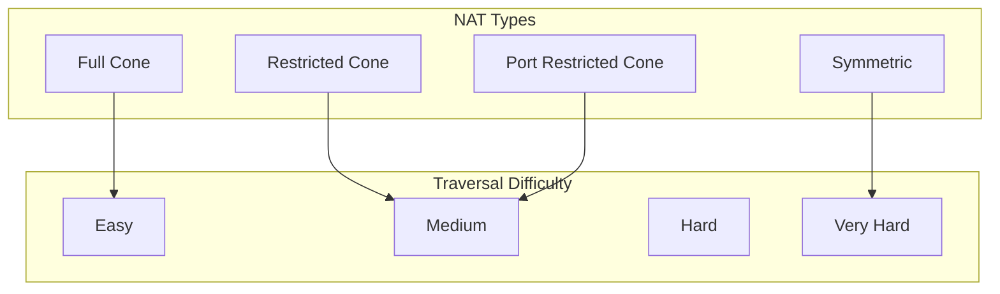
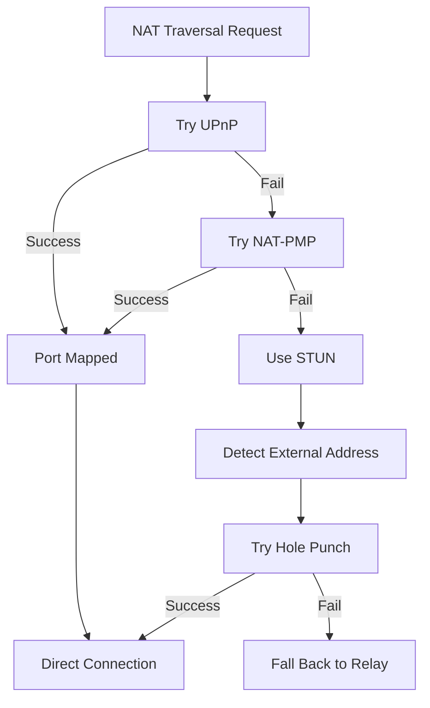
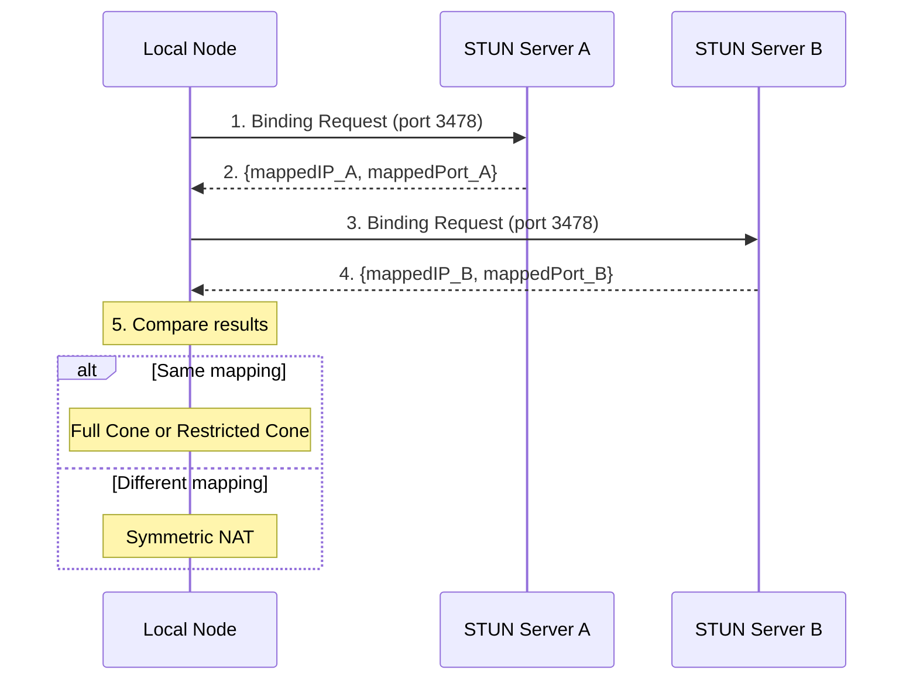

# NAT Traversal Configuration

This guide answers: **How to configure NAT traversal to improve node reachability?**

---

## Problem

```
┌─────────────────────────────────────────────────────────────────────┐
│                     What problem am I solving?                       │
├─────────────────────────────────────────────────────────────────────┤
│                                                                      │
│  "My node is behind NAT, other nodes can't connect directly"        │
│  "How to configure UPnP or NAT-PMP?"                                 │
│  "How to use Hole Punching?"                                         │
│                                                                      │
└─────────────────────────────────────────────────────────────────────┘
```

---

## NAT Type Explanation



### NAT Type Comparison

| NAT Type | Description | Difficulty | Hole Punch Success |
|----------|-------------|------------|-------------------|
| **Full Cone** | Same internal address maps to fixed external | Easy | High |
| **Restricted Cone** | Must send outbound first | Medium | Medium |
| **Port Restricted** | Port must also match | Medium | Medium |
| **Symmetric** | Different mapping per connection | Hard | Low |

---

## NAT Traversal Strategy



---

## Enable NAT Traversal

### Basic Configuration

```go
package main

import (
    "context"
    "fmt"
    "log"

    "github.com/dep2p/go-dep2p"
    "github.com/dep2p/go-dep2p/pkg/types"
)

func main() {
    ctx := context.Background()

    // NAT traversal enabled by default in Desktop preset
    node, err := dep2p.StartNode(ctx,
        dep2p.WithPreset(dep2p.PresetDesktop),
        dep2p.WithNAT(true),  // Explicitly enable NAT
    )
    if err != nil {
        log.Fatalf("Failed to start: %v", err)
    }
    defer node.Close()

    node.Realm().JoinRealm(ctx, types.RealmID("my-network"))

    fmt.Printf("Node started: %s\n", node.ID().ShortString())
    fmt.Println("NAT traversal enabled")
}
```

### NAT Configuration in Presets

| Preset | NAT | UPnP | AutoNAT | Hole Punch |
|--------|-----|------|---------|------------|
| `PresetMinimal` | ❌ | ❌ | ❌ | ❌ |
| `PresetDesktop` | ✅ | ✅ | ✅ | ✅ |
| `PresetServer` | ✅ | ✅ | ✅ | ✅ |
| `PresetMobile` | ✅ | ✅ | ✅ | ✅ |

---

## UPnP/NAT-PMP Configuration

Automatic port mapping configuration.

```go
package main

import (
    "context"
    "fmt"
    "log"
    "time"

    "github.com/dep2p/go-dep2p"
    "github.com/dep2p/go-dep2p/pkg/types"
)

func main() {
    ctx := context.Background()

    node, err := dep2p.StartNode(ctx,
        dep2p.WithPreset(dep2p.PresetDesktop),
        dep2p.WithNAT(true),
        // UPnP and NAT-PMP are automatically used when NAT is enabled
    )
    if err != nil {
        log.Fatalf("Failed to start: %v", err)
    }
    defer node.Close()

    node.Realm().JoinRealm(ctx, types.RealmID("my-network"))

    // Wait for NAT mapping to complete
    time.Sleep(5 * time.Second)

    // Check mapped addresses
    fmt.Println("Advertised addresses:")
    for _, addr := range node.AdvertisedAddrs() {
        fmt.Printf("  %s\n", addr)
    }
}
```

---

## STUN Server Configuration

STUN is used to detect external IP and NAT type.

```go
package main

import (
    "context"
    "fmt"
    "log"

    "github.com/dep2p/go-dep2p"
    "github.com/dep2p/go-dep2p/pkg/types"
)

func main() {
    ctx := context.Background()

    // Custom STUN servers (optional)
    // Defaults to Google STUN servers
    node, err := dep2p.StartNode(ctx,
        dep2p.WithPreset(dep2p.PresetDesktop),
        dep2p.WithNAT(true),
        // STUN servers are specified via internal config
    )
    if err != nil {
        log.Fatalf("Failed to start: %v", err)
    }
    defer node.Close()

    node.Realm().JoinRealm(ctx, types.RealmID("my-network"))

    fmt.Printf("Node started: %s\n", node.ID().ShortString())
}
```

### Default STUN Servers

```
stun:stun.l.google.com:19302
stun:stun1.l.google.com:19302
```

---

## Hole Punching Configuration

Hole punching is used to establish direct connections through NAT.

```go
package main

import (
    "context"
    "fmt"
    "log"

    "github.com/dep2p/go-dep2p"
    "github.com/dep2p/go-dep2p/pkg/types"
)

func main() {
    ctx := context.Background()

    // Hole Punching enabled by default in Desktop preset
    node, err := dep2p.StartNode(ctx,
        dep2p.WithPreset(dep2p.PresetDesktop),
        // EnableHolePunching configured via preset
    )
    if err != nil {
        log.Fatalf("Failed to start: %v", err)
    }
    defer node.Close()

    node.Realm().JoinRealm(ctx, types.RealmID("my-network"))

    fmt.Println("Hole Punching enabled")
    fmt.Println("System will auto-attempt hole punch to upgrade relay connections")
}
```

---

## Explicit External Address Declaration

When you know your public IP, you can declare it directly.

```go
package main

import (
    "context"
    "fmt"
    "log"

    "github.com/dep2p/go-dep2p"
    "github.com/dep2p/go-dep2p/pkg/types"
)

func main() {
    ctx := context.Background()

    // Public servers can explicitly declare external addresses
    node, err := dep2p.StartNode(ctx,
        dep2p.WithPreset(dep2p.PresetServer),
        dep2p.WithListenPort(4001),
        dep2p.WithExternalAddrs("/ip4/203.0.113.5/udp/4001/quic-v1"),
    )
    if err != nil {
        log.Fatalf("Failed to start: %v", err)
    }
    defer node.Close()

    node.Realm().JoinRealm(ctx, types.RealmID("my-network"))

    fmt.Println("External address declared")
    fmt.Println("Advertised addresses:")
    for _, addr := range node.AdvertisedAddrs() {
        fmt.Printf("  %s\n", addr)
    }
}
```

---

## NAT Detection Flow



---

## Complete NAT Traversal Flow

```
┌─────────────────────────────────────────────────────────────────────────────┐
│                        Complete NAT Traversal Flow                           │
├─────────────────────────────────────────────────────────────────────────────┤
│                                                                              │
│  1. On Startup                                                               │
│     ├─ Try UPnP port mapping                                                │
│     ├─ Try NAT-PMP port mapping                                             │
│     └─ Use STUN to detect external address                                  │
│                                                                              │
│  2. On Connection                                                            │
│     ├─ Try direct connection (if have public address)                       │
│     ├─ Try hole punch (if NAT type supports)                                │
│     └─ Fall back to relay                                                   │
│                                                                              │
│  3. Connection Upgrade                                                       │
│     ├─ After relay connection, auto-attempt hole punch                      │
│     └─ Switch to direct on hole punch success                               │
│                                                                              │
└─────────────────────────────────────────────────────────────────────────────┘
```

---

## Troubleshooting

### Problem 1: UPnP Not Working

**Possible causes**:
- Router doesn't support UPnP
- UPnP is disabled
- Firewall blocking

**Solutions**:

```bash
# 1. Check router settings, enable UPnP

# 2. Use tools to detect UPnP support
# miniupnpc tool

# 3. Manually configure port forwarding
# Add UDP port mapping in router admin interface
```

### Problem 2: Hole Punch Fails

**Possible causes**:
- Symmetric NAT
- Firewall too strict
- No coordination nodes available

**Solutions**:

```go
// Ensure relay is enabled as fallback
node, _ := dep2p.StartNode(ctx,
    dep2p.WithPreset(dep2p.PresetDesktop),
    dep2p.WithRelay(true),  // Ensure Relay enabled
)
```

### Problem 3: Cannot Get Public Address

**Possible causes**:
- Multiple NAT layers
- STUN servers unreachable
- All traversal methods failed

**Solutions**:

```go
// 1. Use Relay address
// System will auto-obtain Relay address

// 2. Manually declare address (if you know public IP)
node, _ := dep2p.StartNode(ctx,
    dep2p.WithExternalAddrs("/ip4/PUBLIC_IP/udp/4001/quic-v1"),
)

// 3. Check addresses
candidates := node.BootstrapCandidates()
for _, c := range candidates {
    fmt.Printf("Candidate: %s (%s)\n", c.Addr, c.Type)
}
```

---

## Best Practices

```
┌─────────────────────────────────────────────────────────────────────┐
│                    NAT Traversal Best Practices                      │
├─────────────────────────────────────────────────────────────────────┤
│                                                                      │
│  1. Use Desktop/Server preset                                       │
│     - Auto-enables all NAT traversal features                       │
│     - UPnP, AutoNAT, Hole Punching all enabled                      │
│                                                                      │
│  2. Always enable Relay                                             │
│     - As the last resort fallback                                   │
│     - Ensures connection in any case                                │
│                                                                      │
│  3. Public servers declare external address                         │
│     - Use WithExternalAddrs()                                       │
│     - Avoid relying on NAT detection                                │
│                                                                      │
│  4. Wait for address verification                                   │
│     - Use WaitShareableAddrs()                                      │
│     - NAT traversal takes time                                      │
│                                                                      │
│  5. Monitor NAT status                                              │
│     - Check advertised addresses                                    │
│     - Monitor connection success rate                               │
│                                                                      │
└─────────────────────────────────────────────────────────────────────┘
```

---

## Related Documentation

- [How to Use Relay](use-relay.md)
- [How to Share Address](share-address.md)
- [How to Bootstrap Network](bootstrap-network.md)
- [Cross-NAT Connection Tutorial](../tutorials/03-cross-nat-connect.md)
