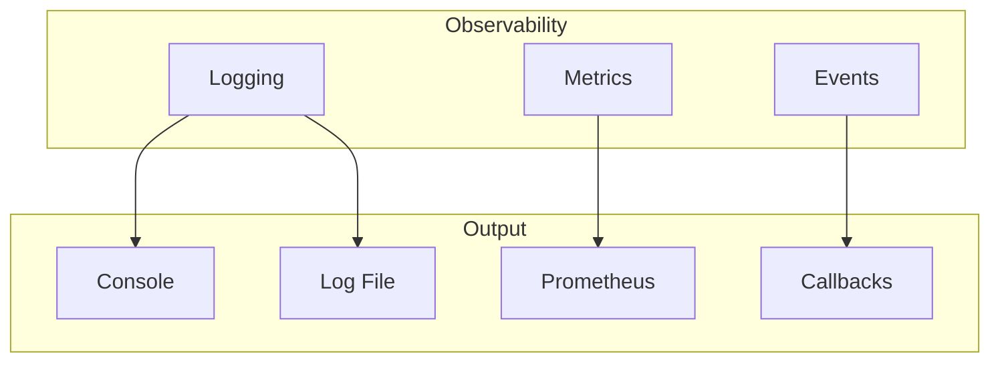
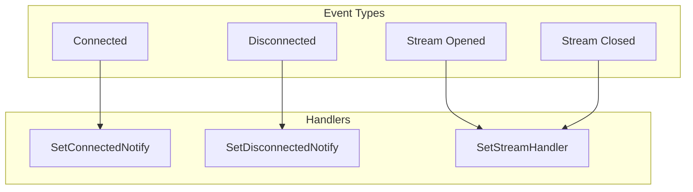

# Observability (Logging/Metrics)

This guide answers: **How to monitor and debug DeP2P nodes?**

---

## Problem

```
┌─────────────────────────────────────────────────────────────────────┐
│                     What problem am I solving?                       │
├─────────────────────────────────────────────────────────────────────┤
│                                                                      │
│  "How to view node runtime logs?"                                   │
│  "How to monitor node connection status?"                           │
│  "How to debug connection issues?"                                   │
│                                                                      │
└─────────────────────────────────────────────────────────────────────┘
```

---

## Observability Overview



---

## Logging Configuration

### Basic Logging Setup

```go
package main

import (
    "context"
    "fmt"
    "log"
    "os"

    "github.com/dep2p/go-dep2p"
    "github.com/dep2p/go-dep2p/pkg/types"
)

func main() {
    ctx := context.Background()

    // Set Go standard log output
    log.SetOutput(os.Stdout)
    log.SetFlags(log.LstdFlags | log.Lshortfile)

    node, err := dep2p.New(ctx,
        dep2p.WithPreset(dep2p.PresetDesktop),
    )
    if err != nil {
        log.Fatalf("Failed to create: %v", err)
    }
    defer node.Close()
    if err := node.Start(ctx); err != nil {
        log.Fatalf("Failed to start: %v", err)
    }

    realm, _ := node.Realm("my-network")
    _ = realm.Join(ctx)

    fmt.Printf("Node ID: %s\n", node.ID())
    
    select {}
}
```

### Log Levels

```go
// DeP2P uses slog for logging
// Log levels: Debug, Info, Warn, Error

import (
    "log/slog"
    "os"
)

// Set log level
func setupLogging() {
    // Debug level (verbose)
    handler := slog.NewTextHandler(os.Stdout, &slog.HandlerOptions{
        Level: slog.LevelDebug,
    })
    slog.SetDefault(slog.New(handler))
}

// Or use JSON format (production)
func setupJSONLogging() {
    handler := slog.NewJSONHandler(os.Stdout, &slog.HandlerOptions{
        Level: slog.LevelInfo,
    })
    slog.SetDefault(slog.New(handler))
}
```

---

## Connection Status Monitoring

### Set Connection Event Callbacks

```go
package main

import (
    "context"
    "fmt"
    "log"
    "time"

    "github.com/dep2p/go-dep2p"
    "github.com/dep2p/go-dep2p/pkg/types"
)

func main() {
    ctx := context.Background()

    node, err := dep2p.New(ctx,
        dep2p.WithPreset(dep2p.PresetDesktop),
    )
    if err != nil {
        log.Fatalf("Failed to create: %v", err)
    }
    defer node.Close()
    if err := node.Start(ctx); err != nil {
        log.Fatalf("Failed to start: %v", err)
    }

    // Connection established event
    node.Endpoint().SetConnectedNotify(func(conn dep2p.Connection) {
        fmt.Printf("📥 [%s] New connection: %s\n", 
            time.Now().Format("15:04:05"),
            conn.RemoteID().ShortString(),
        )
        fmt.Printf("   Remote address: %s\n", conn.RemoteAddr())
    })

    // Connection closed event
    node.Endpoint().SetDisconnectedNotify(func(conn dep2p.Connection) {
        fmt.Printf("📤 [%s] Disconnected: %s\n",
            time.Now().Format("15:04:05"),
            conn.RemoteID().ShortString(),
        )
    })

    realm, _ := node.Realm("my-network")
    _ = realm.Join(ctx)

    fmt.Println("Node monitoring started...")
    
    // Periodic stats output
    go printStats(node)

    select {}
}

func printStats(node dep2p.Node) {
    ticker := time.NewTicker(30 * time.Second)
    defer ticker.Stop()

    for range ticker.C {
        fmt.Printf("\n📊 Stats [%s]\n", time.Now().Format("15:04:05"))
        fmt.Printf("   Connections: %d\n", node.ConnectionCount())
        fmt.Printf("   Node ID: %s\n", node.ID().ShortString())
    }
}
```

---

## Event Notifications

### Monitoring Flow



### Complete Event Monitoring

```go
package main

import (
    "context"
    "fmt"
    "log"
    "sync/atomic"
    "time"

    "github.com/dep2p/go-dep2p"
    "github.com/dep2p/go-dep2p/pkg/types"
)

// Statistics counters
var (
    totalConnections    int64
    activeConnections   int64
    totalStreams        int64
    messagesReceived    int64
)

func main() {
    ctx := context.Background()

    node, err := dep2p.New(ctx,
        dep2p.WithPreset(dep2p.PresetDesktop),
    )
    if err != nil {
        log.Fatalf("Failed to create: %v", err)
    }
    defer node.Close()
    if err := node.Start(ctx); err != nil {
        log.Fatalf("Failed to start: %v", err)
    }

    // Set up all event monitoring
    setupEventHandlers(node)

    realm, _ := node.Realm("my-network")
    _ = realm.Join(ctx)

    fmt.Println("Event monitoring started")

    // Periodic metrics output
    go func() {
        for {
            time.Sleep(60 * time.Second)
            printMetrics()
        }
    }()

    select {}
}

func setupEventHandlers(node dep2p.Node) {
    // Connection events
    node.Endpoint().SetConnectedNotify(func(conn dep2p.Connection) {
        atomic.AddInt64(&totalConnections, 1)
        atomic.AddInt64(&activeConnections, 1)
        log.Printf("Connection established: %s", conn.RemoteID().ShortString())
    })

    node.Endpoint().SetDisconnectedNotify(func(conn dep2p.Connection) {
        atomic.AddInt64(&activeConnections, -1)
        log.Printf("Connection closed: %s", conn.RemoteID().ShortString())
    })

    // Protocol handler (with stats)
    node.Endpoint().SetProtocolHandler("/myapp/ping/1.0.0", func(stream dep2p.Stream) {
        defer stream.Close()
        atomic.AddInt64(&totalStreams, 1)
        atomic.AddInt64(&messagesReceived, 1)
        
        buf := make([]byte, 1024)
        stream.Read(buf)
        stream.Write([]byte("pong"))
    })
}

func printMetrics() {
    fmt.Println("\n═══════════════════════════════════════")
    fmt.Printf("📊 Node Metrics [%s]\n", time.Now().Format("2006-01-02 15:04:05"))
    fmt.Println("═══════════════════════════════════════")
    fmt.Printf("Total connections: %d\n", atomic.LoadInt64(&totalConnections))
    fmt.Printf("Active connections: %d\n", atomic.LoadInt64(&activeConnections))
    fmt.Printf("Total streams: %d\n", atomic.LoadInt64(&totalStreams))
    fmt.Printf("Messages received: %d\n", atomic.LoadInt64(&messagesReceived))
    fmt.Println("═══════════════════════════════════════")
}
```

---

## Debugging Tips

### 1. Check Node Status

```go
func debugNodeStatus(node dep2p.Node) {
    fmt.Println("═══════════════════════════════════════")
    fmt.Println("Node Status Check")
    fmt.Println("═══════════════════════════════════════")
    
    // Basic info
    fmt.Printf("Node ID:      %s\n", node.ID())
    fmt.Printf("Connections:  %d\n", node.ConnectionCount())
    
    // Listen addresses
    fmt.Println("\nListen Addresses:")
    for _, addr := range node.ListenAddrs() {
        fmt.Printf("  - %s\n", addr)
    }
    
    // Advertised addresses
    fmt.Println("\nAdvertised Addresses:")
    for _, addr := range node.AdvertisedAddrs() {
        fmt.Printf("  - %s\n", addr)
    }
    
    // Shareable addresses
    fmt.Println("\nShareable Addresses:")
    addrs := node.ShareableAddrs()
    if len(addrs) > 0 {
        for _, addr := range addrs {
            fmt.Printf("  - %s\n", addr)
        }
    } else {
        fmt.Println("  (no shareable addresses)")
    }
    
    fmt.Println("═══════════════════════════════════════")
}
```

### 2. Diagnose Connection Issues

```go
func diagnoseConnection(ctx context.Context, node dep2p.Node, targetAddr string) {
    fmt.Printf("Diagnosing connection: %s\n", targetAddr)
    fmt.Println("─────────────────────────────────────")
    
    start := time.Now()
    
    // Attempt connection
    conn, err := node.ConnectToAddr(ctx, targetAddr)
    
    elapsed := time.Since(start)
    
    if err != nil {
        fmt.Printf("❌ Connection failed (%v)\n", elapsed)
        fmt.Printf("   Error: %v\n", err)
        
        // Analyze error type
        switch {
        case strings.Contains(err.Error(), "timeout"):
            fmt.Println("   Suggestion: Check network connectivity or increase timeout")
        case strings.Contains(err.Error(), "refused"):
            fmt.Println("   Suggestion: Ensure target node is running and port is open")
        case strings.Contains(err.Error(), "no route"):
            fmt.Println("   Suggestion: Check NAT/firewall configuration")
        }
        return
    }
    
    fmt.Printf("✅ Connection successful (%v)\n", elapsed)
    fmt.Printf("   Remote ID: %s\n", conn.RemoteID())
    fmt.Printf("   Remote Address: %s\n", conn.RemoteAddr())
}
```

---

## Production Configuration

```go
package main

import (
    "context"
    "log/slog"
    "os"
    "time"

    "github.com/dep2p/go-dep2p"
    "github.com/dep2p/go-dep2p/pkg/types"
)

func main() {
    ctx := context.Background()

    // Production logging configuration
    setupProductionLogging()

    node, err := dep2p.New(ctx,
        dep2p.WithPreset(dep2p.PresetServer),
    )
    if err != nil {
        slog.Error("Failed to create node", "error", err)
        os.Exit(1)
    }
    defer node.Close()
    if err := node.Start(ctx); err != nil {
        slog.Error("Failed to start node", "error", err)
        os.Exit(1)
    }

    realm, _ := node.Realm("production")
    _ = realm.Join(ctx)

    // Set up monitoring
    setupMonitoring(node)

    slog.Info("Node started",
        "nodeID", node.ID().ShortString(),
        "listenAddrs", node.ListenAddrs(),
    )

    select {}
}

func setupProductionLogging() {
    // JSON format, suitable for log aggregation
    handler := slog.NewJSONHandler(os.Stdout, &slog.HandlerOptions{
        Level: slog.LevelInfo,
        ReplaceAttr: func(groups []string, a slog.Attr) slog.Attr {
            // Add timestamp formatting
            if a.Key == slog.TimeKey {
                return slog.String("timestamp", time.Now().UTC().Format(time.RFC3339))
            }
            return a
        },
    })
    slog.SetDefault(slog.New(handler))
}

func setupMonitoring(node dep2p.Node) {
    // Connection event logging
    node.Endpoint().SetConnectedNotify(func(conn dep2p.Connection) {
        slog.Info("Connection established",
            "remoteID", conn.RemoteID().ShortString(),
            "remoteAddr", conn.RemoteAddr().String(),
        )
    })

    node.Endpoint().SetDisconnectedNotify(func(conn dep2p.Connection) {
        slog.Info("Connection closed",
            "remoteID", conn.RemoteID().ShortString(),
        )
    })

    // Periodic health check
    go func() {
        ticker := time.NewTicker(5 * time.Minute)
        defer ticker.Stop()

        for range ticker.C {
            slog.Info("Health check",
                "connections", node.ConnectionCount(),
                "uptime", time.Since(time.Now()),
            )
        }
    }()
}
```

---

## Troubleshooting

### Problem 1: No Log Output

**Solutions**:

```go
// Ensure log handler is set
import "log/slog"

handler := slog.NewTextHandler(os.Stdout, &slog.HandlerOptions{
    Level: slog.LevelDebug,  // Set to Debug level
})
slog.SetDefault(slog.New(handler))
```

### Problem 2: Event Callbacks Not Triggering

**Checklist**:

```go
// 1. Ensure callbacks are set before starting
node.Endpoint().SetConnectedNotify(callback)  // Before JoinRealm

// 2. Ensure callback doesn't panic
node.Endpoint().SetConnectedNotify(func(conn dep2p.Connection) {
    defer func() {
        if r := recover(); r != nil {
            log.Printf("Callback panic: %v", r)
        }
    }()
    // Processing logic
})
```

---

## Best Practices

```
┌─────────────────────────────────────────────────────────────────────┐
│                    Observability Best Practices                      │
├─────────────────────────────────────────────────────────────────────┤
│                                                                      │
│  1. Log Levels                                                      │
│     • Development: Debug                                            │
│     • Production: Info or Warn                                      │
│     • Temporarily switch to Debug when debugging                    │
│                                                                      │
│  2. Structured Logging                                              │
│     • Use slog for structured logging                               │
│     • Use JSON format in production                                 │
│     • Include nodeID, remoteID and other context                    │
│                                                                      │
│  3. Event Monitoring                                                │
│     • Monitor all connect/disconnect events                         │
│     • Record execution time for key operations                      │
│     • Set alert thresholds                                          │
│                                                                      │
│  4. Metrics Collection                                              │
│     • Periodically output key metrics like connections              │
│     • Integrate Prometheus (if needed)                              │
│     • Monitor trends                                                │
│                                                                      │
└─────────────────────────────────────────────────────────────────────┘
```

---

## Related Documentation

- [Local Introspection Interface](introspection.md)
- [Troubleshooting](troubleshooting.md)
- [Peer Discovery](peer-discovery.md)
- [NAT Traversal Configuration](nat-traversal.md)
- [Core Concepts](../concepts/core-concepts.md)
