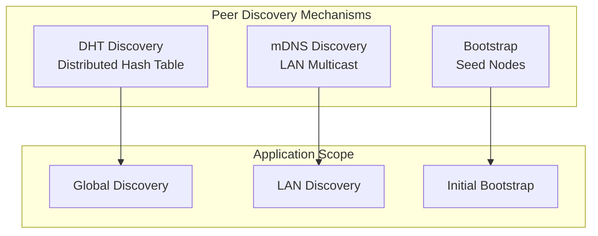
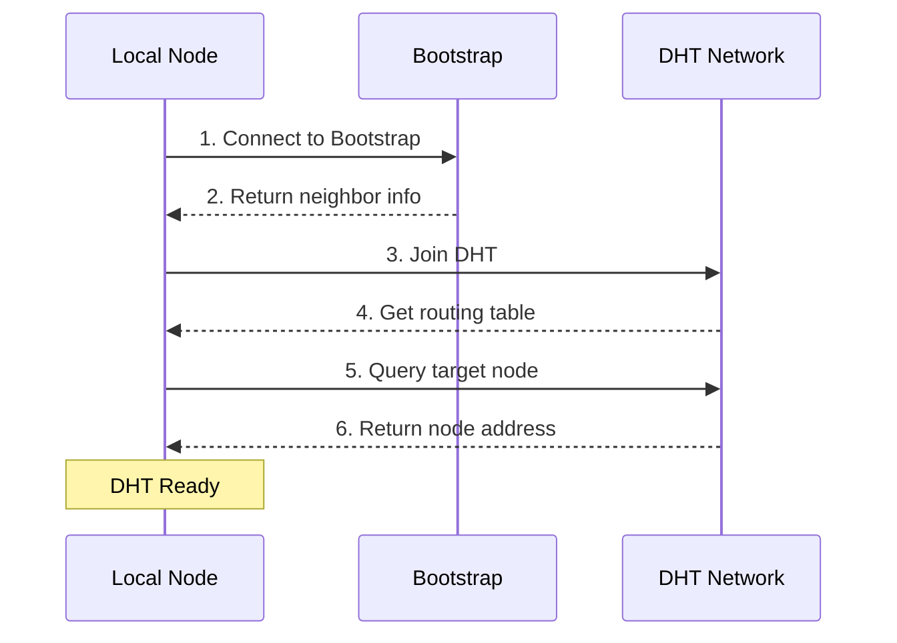
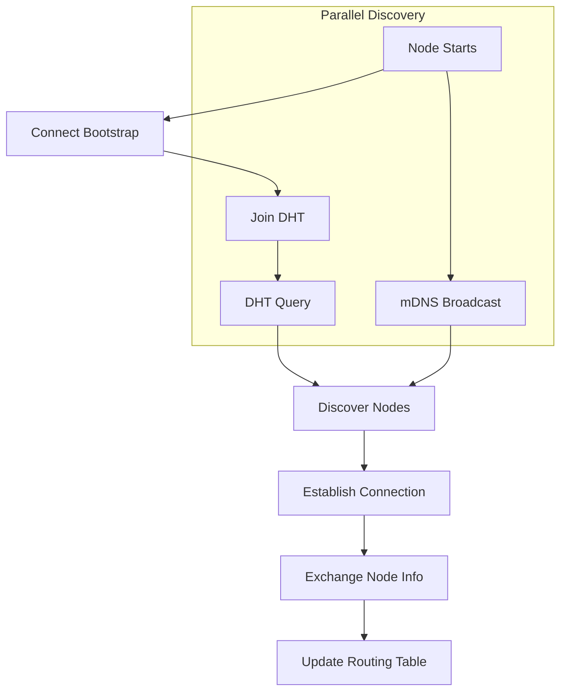

# Peer Discovery

This guide answers: **How to discover other nodes in the network?**

---

## Problem

```
┌─────────────────────────────────────────────────────────────────────┐
│                     What problem am I solving?                       │
├─────────────────────────────────────────────────────────────────────┤
│                                                                      │
│  "How to find other nodes in the network?"                          │
│  "What's the difference between DHT and mDNS?"                      │
│  "How to configure peer discovery?"                                  │
│                                                                      │
└─────────────────────────────────────────────────────────────────────┘
```

---

## Discovery Mechanism Overview



### Discovery Mechanism Comparison

| Mechanism | Scope | Advantages | Disadvantages |
|-----------|-------|------------|---------------|
| **DHT** | Global | Decentralized, scalable | Requires initial connection |
| **mDNS** | LAN | Automatic, zero-config | Limited to local network |
| **Bootstrap** | Global | Reliable, fast | Requires pre-configuration |

---

## DHT Discovery Configuration

DHT (Distributed Hash Table) is used for global peer discovery.

```go
package main

import (
    "context"
    "fmt"
    "log"
    "time"

    "github.com/dep2p/go-dep2p"
    "github.com/dep2p/go-dep2p/pkg/types"
)

func main() {
    ctx := context.Background()

    // DHT enabled by default in Desktop/Server presets
    node, err := dep2p.New(ctx,
        dep2p.WithPreset(dep2p.PresetDesktop),
        // DHT auto-configured via preset
    )
    if err != nil {
        log.Fatalf("Failed to create: %v", err)
    }
    defer node.Close()
    if err := node.Start(ctx); err != nil {
        log.Fatalf("Failed to start: %v", err)
    }

    realm, _ := node.Realm("my-network")
    _ = realm.Join(ctx)

    fmt.Println("DHT discovery enabled")
    
    // Wait for DHT sync
    time.Sleep(10 * time.Second)
    
    fmt.Printf("Current connections: %d\n", node.ConnectionCount())
}
```

### DHT Workflow



---

## mDNS LAN Discovery

mDNS is used to automatically discover nodes on the same LAN.

```go
package main

import (
    "context"
    "fmt"
    "log"

    "github.com/dep2p/go-dep2p"
    "github.com/dep2p/go-dep2p/pkg/types"
)

func main() {
    ctx := context.Background()

    // mDNS enabled by default in Desktop preset
    node, err := dep2p.New(ctx,
        dep2p.WithPreset(dep2p.PresetDesktop),
        // mDNS auto-discovers same-network nodes
    )
    if err != nil {
        log.Fatalf("Failed to create: %v", err)
    }
    defer node.Close()
    if err := node.Start(ctx); err != nil {
        log.Fatalf("Failed to start: %v", err)
    }

    realm, _ := node.Realm("my-network")
    _ = realm.Join(ctx)

    // Listen for new node discoveries
    node.Endpoint().SetConnectedNotify(func(conn dep2p.Connection) {
        fmt.Printf("Discovered new node: %s\n", conn.RemoteID().ShortString())
    })

    fmt.Println("mDNS discovery enabled")
    fmt.Println("Waiting for LAN nodes...")
    
    select {}
}
```

### mDNS Service Tag

```go
// Default service tag
const defaultServiceTag = "dep2p.local"

// Nodes with the same service tag will discover each other
```

---

## Discovery Flow



---

## Discovery in Presets

| Preset | DHT | mDNS | Bootstrap |
|--------|-----|------|-----------|
| `PresetMinimal` | ❌ | ❌ | ❌ |
| `PresetDesktop` | ✅ | ✅ | ✅ |
| `PresetServer` | ✅ | ✅ | ✅ |
| `PresetMobile` | ✅ | ✅ | ✅ |

---

## Monitor Peer Discovery

```go
package main

import (
    "context"
    "fmt"
    "log"
    "time"

    "github.com/dep2p/go-dep2p"
    "github.com/dep2p/go-dep2p/pkg/types"
)

func main() {
    ctx := context.Background()

    node, err := dep2p.New(ctx,
        dep2p.WithPreset(dep2p.PresetDesktop),
    )
    if err != nil {
        log.Fatalf("Failed to create: %v", err)
    }
    defer node.Close()
    if err := node.Start(ctx); err != nil {
        log.Fatalf("Failed to start: %v", err)
    }

    realm, _ := node.Realm("my-network")
    _ = realm.Join(ctx)

    // Set connection notification
    node.Endpoint().SetConnectedNotify(func(conn dep2p.Connection) {
        fmt.Printf("✅ New connection: %s\n", conn.RemoteID().ShortString())
    })

    // Set disconnection notification
    node.Endpoint().SetDisconnectedNotify(func(conn dep2p.Connection) {
        fmt.Printf("❌ Disconnected: %s\n", conn.RemoteID().ShortString())
    })

    // Periodic stats output
    go func() {
        for {
            time.Sleep(10 * time.Second)
            fmt.Printf("📊 Current connections: %d\n", node.ConnectionCount())
        }
    }()

    select {}
}
```

---

## Find Node by NodeID

```go
package main

import (
    "context"
    "fmt"
    "log"

    "github.com/dep2p/go-dep2p"
    "github.com/dep2p/go-dep2p/pkg/types"
)

func main() {
    ctx := context.Background()

    node, err := dep2p.New(ctx,
        dep2p.WithPreset(dep2p.PresetDesktop),
    )
    if err != nil {
        log.Fatalf("Failed to create: %v", err)
    }
    defer node.Close()
    if err := node.Start(ctx); err != nil {
        log.Fatalf("Failed to start: %v", err)
    }

    realm, _ := node.Realm("my-network")
    _ = realm.Join(ctx)

    // Target node ID
    targetIDStr := "5Q2STWvBFn..."
    targetID, err := types.ParseNodeID(targetIDStr)
    if err != nil {
        log.Fatalf("Failed to parse NodeID: %v", err)
    }

    // Find and connect via DHT (auto-discover address)
    conn, err := node.Connect(ctx, targetID)
    if err != nil {
        log.Fatalf("Connection failed: %v", err)
    }

    fmt.Printf("Connected to: %s\n", conn.RemoteID().ShortString())
}
```

---

## Troubleshooting

### Problem 1: Cannot Discover Other Nodes

**Possible causes**:
- No Bootstrap nodes
- Not on same network (mDNS)
- DHT not synced

**Solutions**:

```go
// 1. Check Bootstrap configuration
node, _ := dep2p.New(ctx,
    dep2p.WithPreset(dep2p.PresetDesktop),  // Includes default Bootstrap
)
_ = node.Start(ctx)

// 2. Wait for DHT sync
time.Sleep(10 * time.Second)

// 3. Check connection count
if node.ConnectionCount() == 0 {
    fmt.Println("Not connected to any nodes")
}
```

### Problem 2: mDNS Discovery Not Working

**Possible causes**:
- Firewall blocking multicast
- Not on same subnet
- mDNS service not started

**Solutions**:

```bash
# 1. Check firewall
# macOS
sudo pfctl -d  # Temporarily disable firewall

# Linux
sudo ufw allow 5353/udp  # Allow mDNS

# 2. Check network
ping -c 1 224.0.0.251  # mDNS multicast address
```

### Problem 3: DHT Query Slow

**Possible causes**:
- High network latency
- Small DHT routing table
- Target node offline

**Solutions**:

```go
// 1. Increase timeout
ctx, cancel := context.WithTimeout(context.Background(), 60*time.Second)
defer cancel()

// 2. Use direct address connection (if known)
conn, _ := node.ConnectToAddr(ctx, "/ip4/1.2.3.4/udp/4001/quic-v1/p2p/...")
```

---

## Best Practices

```
┌─────────────────────────────────────────────────────────────────────┐
│                    Peer Discovery Best Practices                     │
├─────────────────────────────────────────────────────────────────────┤
│                                                                      │
│  1. Use preset configuration                                        │
│     - PresetDesktop includes full discovery features                │
│     - DHT + mDNS + Bootstrap all enabled                            │
│                                                                      │
│  2. Configure multiple Bootstrap nodes                              │
│     - Improve initial connection success rate                       │
│     - Distribute across different locations                         │
│                                                                      │
│  3. Wait for DHT sync                                               │
│     - Wait a few seconds after startup                              │
│     - Before performing node lookups                                │
│                                                                      │
│  4. Monitor connection status                                       │
│     - Set connect/disconnect notifications                          │
│     - Periodically check connection count                           │
│                                                                      │
│  5. Cache known nodes                                               │
│     - Save successfully connected nodes                             │
│     - Prioritize on next startup                                    │
│                                                                      │
└─────────────────────────────────────────────────────────────────────┘
```

---

## Related Documentation

- [How to Bootstrap Network](bootstrap-network.md)
- [How to Share Address](share-address.md)
- [NAT Traversal Configuration](nat-traversal.md)
- [Core Concepts](../concepts/core-concepts.md)
