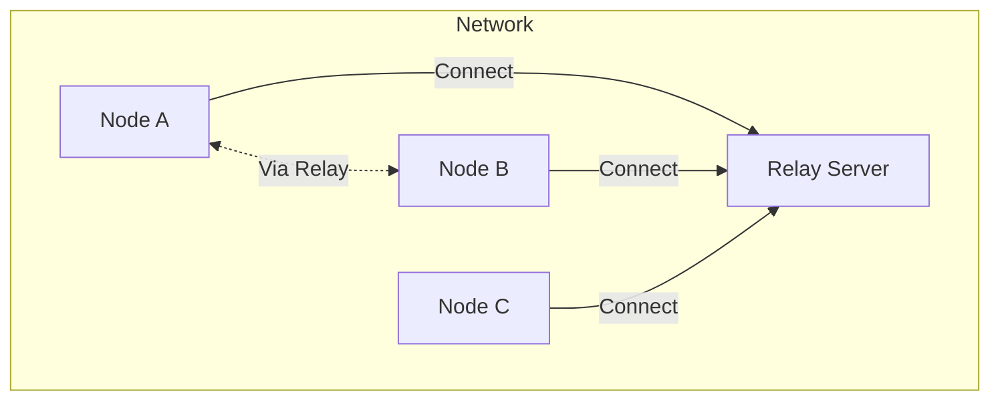
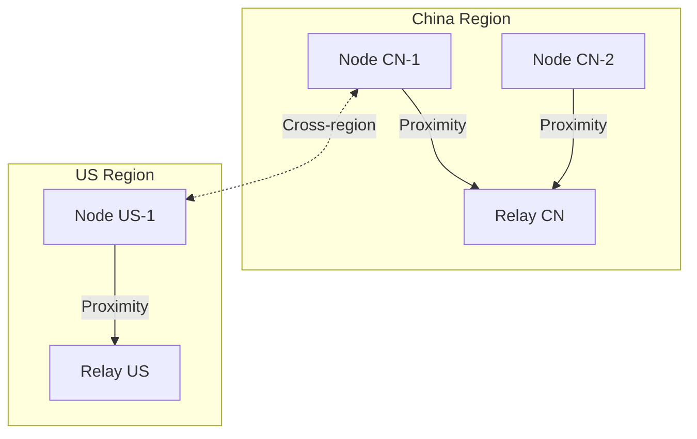
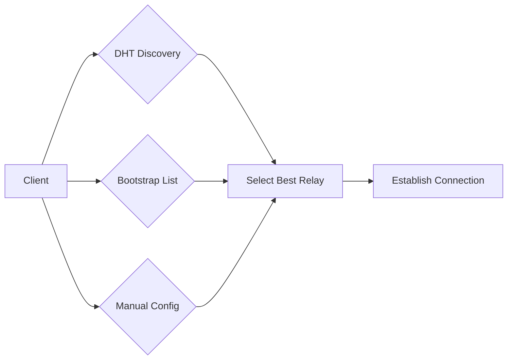
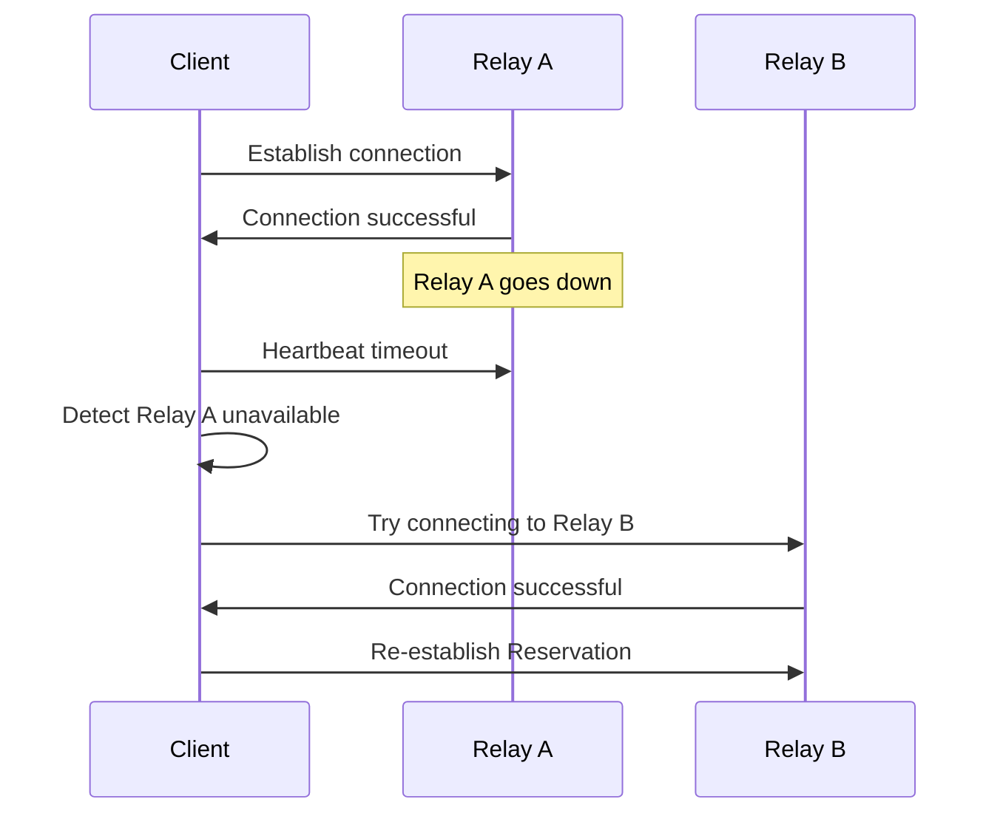
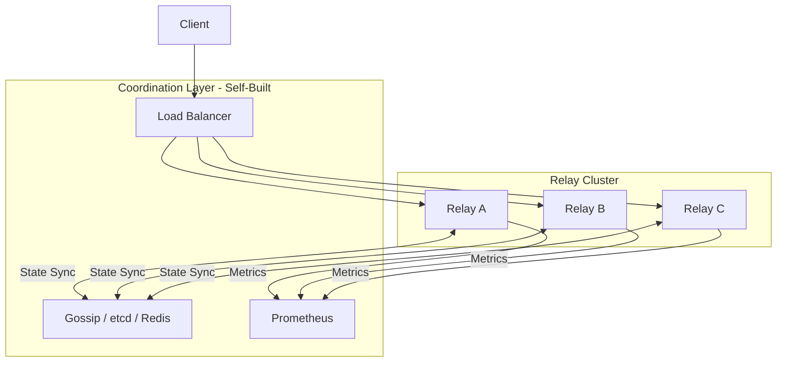

# Relay Deployment Models Guide

This guide answers: **How to choose the right Relay deployment model?**

---

## Problem

```
┌─────────────────────────────────────────────────────────────────────┐
│                    What Problem Am I Solving?                       │
├─────────────────────────────────────────────────────────────────────┤
│                                                                      │
│  "Should I deploy single or multiple Relays?"                      │
│  "Do multiple Relays automatically sync state?"                    │
│  "How to achieve highly available relay service?"                  │
│  "What to consider for cross-region deployment?"                   │
│                                                                      │
└─────────────────────────────────────────────────────────────────────┘
```

---

## Quick Decision

```
What do I need?
│
├─ Small Realm (<100 nodes) / Development/Testing
│  └─→ Single Self-Hosted (Tier 1)
│
├─ Medium Realm (100-1000 nodes) / Basic High Availability
│  └─→ Multiple Relays within Realm (Tier 2)
│
└─ Large Realm (>1000 nodes) / Global Rate Limiting/Billing
   └─→ Build Distributed Coordination Layer (Tier 3)
```

---

## Tier 1: Single Self-Hosted

### Use Cases

- Small Realm (less than 100 nodes)
- Development/testing environment
- Private network deployment
- Low availability requirements

### Architecture



### Configuration Example

```go
package main

import (
    "context"
    "log"

    "github.com/dep2p/go-dep2p"
    "github.com/dep2p/go-dep2p/pkg/types"
)

func main() {
    ctx := context.Background()

    // Single Relay server
    relay, err := dep2p.StartNode(ctx,
        dep2p.WithPreset(dep2p.PresetServer),
        dep2p.WithRelayServer(true),
        dep2p.WithListenPort(4001),
        // Resource limits
        dep2p.WithConnectionLimits(100, 200),
    )
    if err != nil {
        log.Fatalf("Start failed: %v", err)
    }
    defer relay.Close()

    // Join Realm (optional, for Realm Relay)
    relay.Realm().JoinRealm(ctx, types.RealmID("my-realm"))

    log.Printf("Relay started: %s", relay.ID())
    select {}
}
```

### Resource Estimation

| Concurrent Connections | Estimated Memory | Estimated Bandwidth |
|------------------------|------------------|---------------------|
| 50 | 256MB | 10Mbps |
| 100 | 512MB | 20Mbps |
| 200 | 1GB | 50Mbps |

### Failure Impact

```
┌─────────────────────────────────────────────────────────────────────┐
│                    Single Point Failure Impact                       │
├─────────────────────────────────────────────────────────────────────┤
│                                                                      │
│  When Relay goes down:                                              │
│  - All connections depending on this Relay are interrupted         │
│  - Clients need to wait for timeout then try direct or other Relay │
│  - Reservation state is lost                                        │
│                                                                      │
│  After recovery:                                                    │
│  - Clients automatically reconnect                                  │
│  - Need to re-establish reservations                                │
│                                                                      │
└─────────────────────────────────────────────────────────────────────┘
```

---

## Tier 2: Multiple Relays within Realm

### Use Cases

- Medium Realm (100-1000 nodes)
- Need basic high availability
- Geographically distributed clients (proximity access)
- Accept "stateless sharing" limitations

### Architecture



### Configuration Example

#### Relay Server (one per region)

```go
// relay_cn.go
relay, _ := dep2p.StartNode(ctx,
    dep2p.WithPreset(dep2p.PresetServer),
    dep2p.WithRelayServer(true),
    dep2p.WithListenPort(4001),
)
relay.Realm().JoinRealm(ctx, types.RealmID("my-realm"))
```

#### Client Configuration

```go
// Configure multiple Relays as Bootstrap
node, _ := dep2p.StartNode(ctx,
    dep2p.WithPreset(dep2p.PresetDesktop),
    dep2p.WithBootstrapPeers(
        "/ip4/cn-relay.example.com/udp/4001/quic-v1/p2p/...",
        "/ip4/us-relay.example.com/udp/4001/quic-v1/p2p/...",
        "/ip4/eu-relay.example.com/udp/4001/quic-v1/p2p/...",
    ),
    dep2p.WithRelay(true),
)
```

### Client Discovery Mechanism



| Discovery Method | Description | Use Case |
|------------------|-------------|----------|
| DHT Discovery | Automatically discover Relay nodes in network | Dynamic environment |
| Bootstrap List | Pre-configured Relay address list | Stable deployment |
| Manual Configuration | User-specified Relay address | Private network |

### Important Limitations

```
┌─────────────────────────────────────────────────────────────────────┐
│                    ⚠️  Tier 2 Important Limitations                │
├─────────────────────────────────────────────────────────────────────┤
│                                                                      │
│  Each Relay instance runs independently, no shared state:           │
│                                                                      │
│  1. Cross-instance Reservations are not synced                      │
│     - Reservation established on Relay A doesn't exist on Relay B  │
│     - Switching Relay requires re-establishing reservation         │
│                                                                      │
│  2. Rate limiting/quota not shared                                  │
│     - Each Relay counts independently                               │
│     - Users can connect to multiple Relays to "bypass" single       │
│       instance rate limiting                                        │
│                                                                      │
│  3. Statistics not aggregated                                      │
│     - Need to collect metrics from each instance                    │
│     - Recommend using Prometheus + remote write                     │
│                                                                      │
│  If you need these capabilities, refer to Tier 3 to build          │
│  coordination layer yourself.                                        │
│                                                                      │
└─────────────────────────────────────────────────────────────────────┘
```

### Failure Handling



---

## Tier 3: Cross-Region Distributed Cluster

### Use Cases

- Large Realm (over 1000 nodes)
- Enterprise SLA requirements (99.9%+)
- Need global rate limiting/billing
- Need cross-instance Reservation sync

### Architecture Overview



### DeP2P Boundary Declaration

```
┌─────────────────────────────────────────────────────────────────────┐
│                       DeP2P Capability Boundary                     │
├─────────────────────────────────────────────────────────────────────┤
│                                                                      │
│  DeP2P as a **Library**:                                            │
│  ✅ Provides single-instance Relay Server implementation            │
│  ✅ Provides Relay Client implementation                            │
│  ✅ Provides AutoRelay discovery mechanism                          │
│  ✅ Supports System Relay / Realm Relay layering                    │
│                                                                      │
│  DeP2P **Does Not Provide**:                                        │
│  ❌ Multi-instance Relay state synchronization                     │
│  ❌ Distributed rate limiting/billing                               │
│  ❌ Cross-instance Reservation coordination                         │
│  ❌ Global failover orchestration                                   │
│                                                                      │
│  If you need these capabilities, build a **product-level           │
│  coordination layer** on top of DeP2P.                               │
│                                                                      │
└─────────────────────────────────────────────────────────────────────┘
```

### Problems You Need to Solve Yourself

| Problem | Description | Possible Solutions |
|---------|-------------|-------------------|
| Reservation Sync | Share reservation state across instances | etcd / Redis Cluster |
| Global Rate Limiting | Cross-instance counters | Redis + Lua / Token Bucket |
| Member Verification Cache | Consistency invalidation | Pub/Sub / TTL Strategy |
| Failure Detection | Instance health checks | Consul / Kubernetes |
| Load Balancing | Intelligent routing | Anycast / DNS-based LB |
| Statistics Aggregation | Global metrics | Prometheus Federation |

### Extension Example (Conceptual)

```go
// This is a conceptual example showing how to build coordination layer
// on top of DeP2P. Actual implementation needs to be designed based on
// specific requirements.

type DistributedRelay struct {
    // Underlying DeP2P Relay
    relay *dep2p.Node
    
    // State synchronization (need to implement yourself)
    stateSync StateSync // interface { SyncReservation(...) }
    
    // Distributed rate limiting (need to implement yourself)
    rateLimiter DistributedRateLimiter // interface { Allow(...) bool }
    
    // Health check (need to implement yourself)
    healthCheck HealthCheck // interface { IsHealthy() bool }
}

// Override Reservation handling, add sync logic
func (d *DistributedRelay) HandleReservation(req ReservationRequest) error {
    // 1. Check distributed rate limiting
    if !d.rateLimiter.Allow(req.PeerID) {
        return ErrRateLimited
    }
    
    // 2. Local processing
    res, err := d.relay.HandleReservation(req)
    if err != nil {
        return err
    }
    
    // 3. Sync to other instances
    return d.stateSync.SyncReservation(res)
}
```

---

## Deployment Checklist

### Tier 1 Checklist

- [ ] Confirm node count < 100
- [ ] Configure fixed port (for firewall)
- [ ] Set resource limits (prevent overload)
- [ ] Configure monitoring alerts (single point failure warning)
- [ ] Prepare failure recovery process

### Tier 2 Checklist

- [ ] Plan Relay count and geographic locations
- [ ] Configure Bootstrap list to include all Relays
- [ ] Understand and accept "stateless sharing" limitations
- [ ] Configure independent monitoring for each instance
- [ ] Test failover process

### Tier 3 Checklist

- [ ] Assess distributed systems engineering capabilities
- [ ] Choose state synchronization solution (etcd/Redis/custom)
- [ ] Design rate limiting/billing architecture
- [ ] Plan monitoring and operations system
- [ ] Prepare sufficient development and operations resources

---

## FAQ

### Q1: Do multiple Relays automatically sync?

**No**. In DeP2P, each Relay instance runs independently and does not share state. If you need state synchronization, refer to Tier 3 to build coordination layer yourself.

### Q2: How do clients choose the best Relay?

Clients select Relay based on:
1. Connection latency (prefer lower latency)
2. Availability (prefer connectable)
3. Load (if Relay rejects, try next)

### Q3: Does a single Relay failure affect other Relays?

**No**. Each Relay runs independently; one failure doesn't affect others. But clients depending on that Relay need to reconnect to other Relays.

### Q4: How to monitor multiple Relays?

Recommendations:
- Each Relay exposes Prometheus metrics
- Use Prometheus Federation or remote write for aggregation
- Set up alerting rules for key metrics

### Q5: Is there a ready-made solution for Tier 3 "coordination layer"?

DeP2P does not provide ready-made solutions because:
1. This exceeds the "library" boundary
2. Different scenarios have vastly different requirements
3. Avoid introducing unnecessary dependencies

If needed, you can refer to:
- etcd + gRPC for state synchronization
- Redis Cluster for distributed rate limiting
- Consul for service discovery and health checks

---

## Related Documentation

- [How to Use Relay](use-relay.md)
- [NAT Traversal Configuration](nat-traversal.md)
- [ADR-0005: Relay Deployment Model Tiers](../../design/adr/0005-relay-deployment-models.md)
- [Relay Protocol Specification](../../design/protocols/transport/relay.md)

