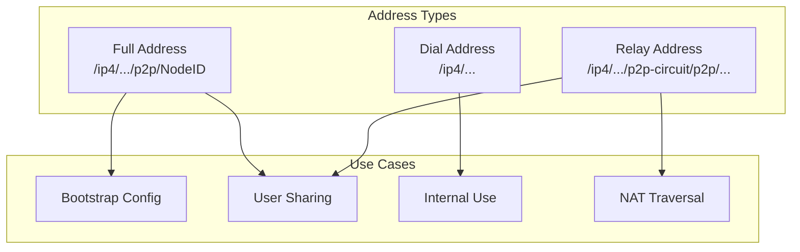
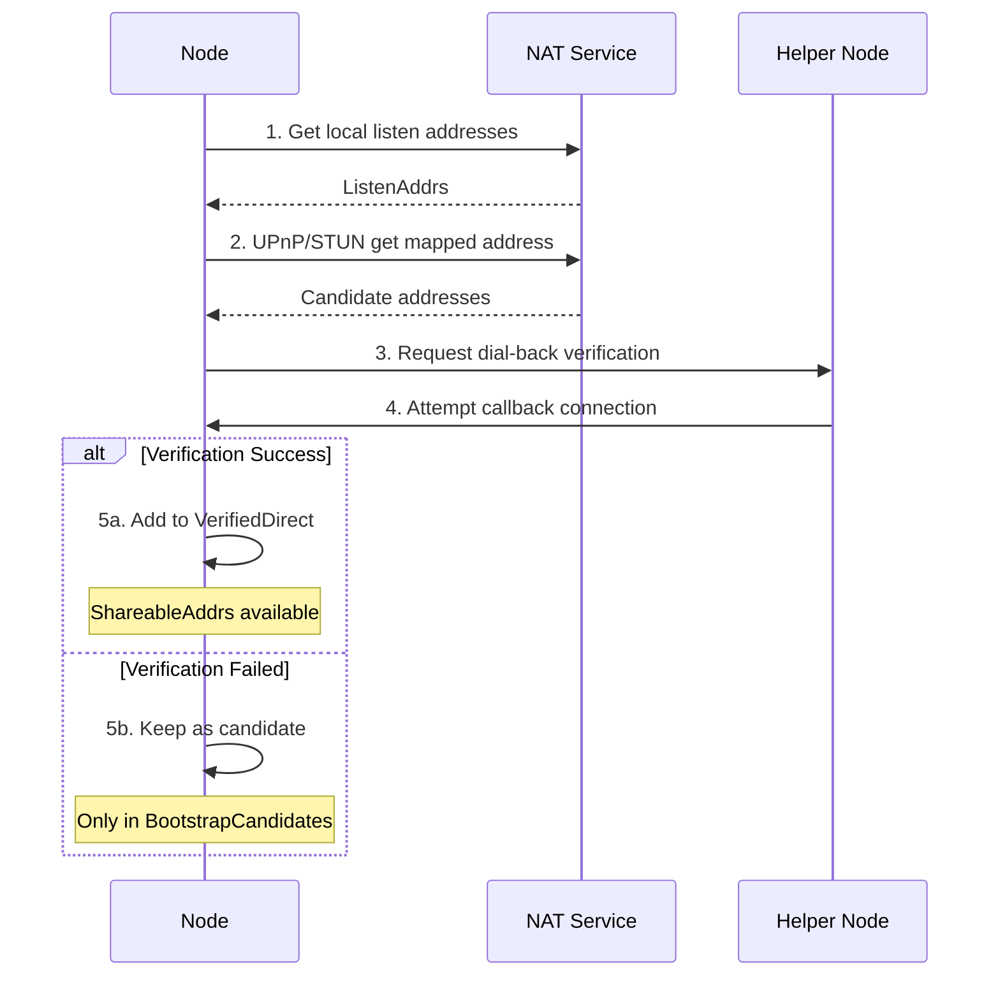

# How to Get/Share Connectable Addresses

This guide answers: **How to get addresses that can be shared with other nodes?**

---

## Problem

```
┌─────────────────────────────────────────────────────────────────────┐
│                     What problem am I solving?                       │
├─────────────────────────────────────────────────────────────────────┤
│                                                                      │
│  "How do I get an address that I can share with others?"            │
│  "What's the difference between ShareableAddrs and ListenAddrs?"    │
│  "Why can't I get a public address sometimes?"                      │
│                                                                      │
└─────────────────────────────────────────────────────────────────────┘
```

---

## Address Types Overview

DeP2P has three address types:



### Address Type Comparison

| Type | Format | Use Case | User Visible |
|------|--------|----------|--------------|
| **Full Address** | `/ip4/.../p2p/<NodeID>` | Bootstrap, sharing | ✅ Yes |
| **Dial Address** | `/ip4/...` | Internal dialing | ❌ No |
| **Relay Address** | `/ip4/.../p2p-circuit/p2p/<NodeID>` | NAT fallback | ✅ Yes |

---

## Methods to Get Addresses

### Method 1: ShareableAddrs() - Get Shareable Addresses

Returns verified public direct addresses (Full Address).

```go
package main

import (
    "context"
    "fmt"
    "log"

    "github.com/dep2p/go-dep2p"
    "github.com/dep2p/go-dep2p/pkg/types"
)

func main() {
    ctx := context.Background()

    node, err := dep2p.StartNode(ctx, dep2p.WithPreset(dep2p.PresetServer))
    if err != nil {
        log.Fatalf("Failed to start: %v", err)
    }
    defer node.Close()

    node.Realm().JoinRealm(ctx, types.RealmID("my-network"))

    // Get shareable addresses (may be empty if not yet verified)
    addrs := node.ShareableAddrs()
    if len(addrs) > 0 {
        fmt.Println("Shareable addresses:")
        for _, addr := range addrs {
            fmt.Printf("  %s\n", addr)
        }
    } else {
        fmt.Println("No shareable addresses yet (verifying or no public reachability)")
    }
}
```

### Method 2: WaitShareableAddrs() - Wait for Shareable Addresses

Waits for address verification to complete. Recommended.

```go
package main

import (
    "context"
    "fmt"
    "log"
    "time"

    "github.com/dep2p/go-dep2p"
    "github.com/dep2p/go-dep2p/pkg/types"
)

func main() {
    ctx := context.Background()

    node, err := dep2p.StartNode(ctx, dep2p.WithPreset(dep2p.PresetServer))
    if err != nil {
        log.Fatalf("Failed to start: %v", err)
    }
    defer node.Close()

    node.Realm().JoinRealm(ctx, types.RealmID("my-network"))

    // Wait for address verification (up to 30 seconds)
    waitCtx, cancel := context.WithTimeout(ctx, 30*time.Second)
    defer cancel()

    addrs, err := node.WaitShareableAddrs(waitCtx)
    if err != nil {
        fmt.Println("Timeout getting addresses, may not have public reachability")
        fmt.Println("Consider using Relay addresses")
        return
    }

    fmt.Println("Shareable addresses:")
    for _, addr := range addrs {
        fmt.Printf("  %s\n", addr)
    }
}
```

### Method 3: BootstrapCandidates() - Get Candidate Addresses

Returns all candidate addresses (including unverified), for cold start.

```go
package main

import (
    "context"
    "fmt"
    "log"

    "github.com/dep2p/go-dep2p"
    "github.com/dep2p/go-dep2p/pkg/types"
)

func main() {
    ctx := context.Background()

    node, err := dep2p.StartNode(ctx, dep2p.WithPreset(dep2p.PresetServer))
    if err != nil {
        log.Fatalf("Failed to start: %v", err)
    }
    defer node.Close()

    node.Realm().JoinRealm(ctx, types.RealmID("my-network"))

    // Get all candidate addresses (not all guaranteed reachable)
    candidates := node.BootstrapCandidates()
    
    fmt.Println("Candidate addresses:")
    for _, c := range candidates {
        fmt.Printf("  Type: %s, Address: %s\n", c.Type, c.Addr)
    }
}
```

---

## Address Retrieval Flow



---

## Differences Between Methods

```
┌─────────────────────────────────────────────────────────────────────────────┐
│                     Address Retrieval Methods Comparison                     │
├─────────────────────────────────────────────────────────────────────────────┤
│                                                                              │
│  Method                   Returns               Verified    Recommended For │
│  ─────────────────────────────────────────────────────────────────────────  │
│  ListenAddrs()           Local listen addrs     No         Internal debug  │
│  AdvertisedAddrs()       Advertised addrs       No         Advanced use    │
│  ShareableAddrs()        Verified public addrs  Yes        User sharing    │
│  WaitShareableAddrs()    Wait for verified      Yes        Recommended     │
│  BootstrapCandidates()   All candidates         No         Cold start      │
│                                                                              │
└─────────────────────────────────────────────────────────────────────────────┘
```

---

## Complete Example: Get and Share Addresses

```go
package main

import (
    "context"
    "fmt"
    "log"
    "time"

    "github.com/dep2p/go-dep2p"
    "github.com/dep2p/go-dep2p/pkg/types"
)

func main() {
    ctx := context.Background()

    node, err := dep2p.StartNode(ctx,
        dep2p.WithPreset(dep2p.PresetServer),
        dep2p.WithListenPort(4001),
    )
    if err != nil {
        log.Fatalf("Failed to start: %v", err)
    }
    defer node.Close()

    node.Realm().JoinRealm(ctx, types.RealmID("my-network"))

    fmt.Println("Node info:")
    fmt.Printf("  NodeID: %s\n", node.ID())
    fmt.Println()

    // 1. Display listen addresses
    fmt.Println("Listen addresses (local):")
    for _, addr := range node.ListenAddrs() {
        fmt.Printf("  %s\n", addr)
    }
    fmt.Println()

    // 2. Wait for shareable addresses
    fmt.Println("Waiting for public address verification...")
    waitCtx, cancel := context.WithTimeout(ctx, 30*time.Second)
    defer cancel()

    addrs, err := node.WaitShareableAddrs(waitCtx)
    if err == nil && len(addrs) > 0 {
        fmt.Println()
        fmt.Println("✅ Shareable addresses (verified):")
        for _, addr := range addrs {
            fmt.Printf("  %s\n", addr)
        }
        fmt.Println()
        fmt.Println("Share the above addresses with other users to connect")
    } else {
        fmt.Println()
        fmt.Println("⚠️ Cannot get verified public addresses")
        fmt.Println()
        
        // 3. Fall back to candidate addresses
        fmt.Println("Candidate addresses (try these):")
        candidates := node.BootstrapCandidates()
        for _, c := range candidates {
            fmt.Printf("  [%s] %s\n", c.Type, c.Addr)
        }
    }
}
```

---

## Address Format Explanation

### Full Address Format

```
/ip4/203.0.113.5/udp/4001/quic-v1/p2p/5Q2STWvBFn...
 │    │           │    │    │          │
 │    │           │    │    │          └── NodeID (Base58 encoded)
 │    │           │    │    └── Transport protocol
 │    │           │    └── Port
 │    │           └── Transport layer protocol
 │    └── IP address
 └── IP version
```

### Full Address with DNS

```
/dns4/node.example.com/udp/4001/quic-v1/p2p/5Q2STWvBFn...
  │    │                 │
  │    │                 └── Port and protocol
  │    └── Domain name
  └── DNS version (dns4 = IPv4, dns6 = IPv6)
```

### Relay Address Format

```
/ip4/203.0.113.5/udp/4001/quic-v1/p2p/5Q2STWvB.../p2p-circuit/p2p/7K3YTWvA...
 │                                │                │             │
 │                                │                │             └── Target NodeID
 │                                │                └── Relay marker
 │                                └── Relay NodeID
 └── Relay node address
```

---

## Troubleshooting

### Problem 1: ShareableAddrs() Returns Empty

**Causes**:
1. Address verification not complete
2. Node behind NAT with no public reachability
3. No helper nodes for dial-back verification

**Solutions**:

```go
// 1. Use WaitShareableAddrs to wait
addrs, err := node.WaitShareableAddrs(ctx)
if err != nil {
    // Timeout, may not have public reachability
}

// 2. Check if there are connected nodes (for verification)
if node.ConnectionCount() == 0 {
    fmt.Println("No connected nodes, cannot verify addresses")
}

// 3. Use Relay as fallback
node, _ := dep2p.StartNode(ctx,
    dep2p.WithPreset(dep2p.PresetDesktop),
    dep2p.WithRelay(true),  // Enable Relay
)
```

### Problem 2: Address Cannot Be Connected By Other Nodes

**Causes**:
1. Firewall blocking inbound connections
2. Port not mapped (behind NAT)
3. Shared wrong address format

**Solutions**:

```go
// 1. Ensure using Full Address
addr := node.ShareableAddrs()[0]
if !strings.Contains(addr, "/p2p/") {
    log.Fatal("Must use Full Address format")
}

// 2. For public servers, explicitly declare external address
node, _ := dep2p.StartNode(ctx,
    dep2p.WithPreset(dep2p.PresetServer),
    dep2p.WithExternalAddrs("/ip4/PUBLIC_IP/udp/4001/quic-v1"),
)

// 3. Check if port is open
// sudo ufw allow 4001/udp
```

### Problem 3: Only Have Relay Address

**Explanation**: This is normal, indicates node has no direct public reachability.

**Handling**:

```go
// Relay addresses can also be shared with other users
// But latency will be higher

addrs := node.ShareableAddrs()
if len(addrs) == 0 {
    // Try to get Relay address
    candidates := node.BootstrapCandidates()
    for _, c := range candidates {
        if c.Type == "relay" {
            fmt.Printf("Relay address: %s\n", c.Addr)
        }
    }
}
```

---

## Best Practices

```
┌─────────────────────────────────────────────────────────────────────┐
│                    Address Sharing Best Practices                    │
├─────────────────────────────────────────────────────────────────────┤
│                                                                      │
│  1. Always use Full Address                                         │
│     ✅ /ip4/1.2.3.4/udp/4001/quic-v1/p2p/5Q2STWvBFn...              │
│     ❌ /ip4/1.2.3.4/udp/4001/quic-v1                                │
│                                                                      │
│  2. Prefer WaitShareableAddrs()                                     │
│     - Ensures addresses are verified                                 │
│     - Set reasonable timeout                                         │
│                                                                      │
│  3. Server nodes declare external address                           │
│     - Use WithExternalAddrs() to declare public IP                  │
│     - Ensure port is open                                            │
│                                                                      │
│  4. Nodes behind NAT enable Relay                                   │
│     - Use WithRelay(true)                                           │
│     - Relay addresses can also be shared                            │
│                                                                      │
└─────────────────────────────────────────────────────────────────────┘
```

---

## Related Documentation

- [How to Bootstrap Network](bootstrap-network.md)
- [How to Use Relay](use-relay.md)
- [NAT Traversal Configuration](nat-traversal.md)
- [FAQ](../getting-started/faq.md)
