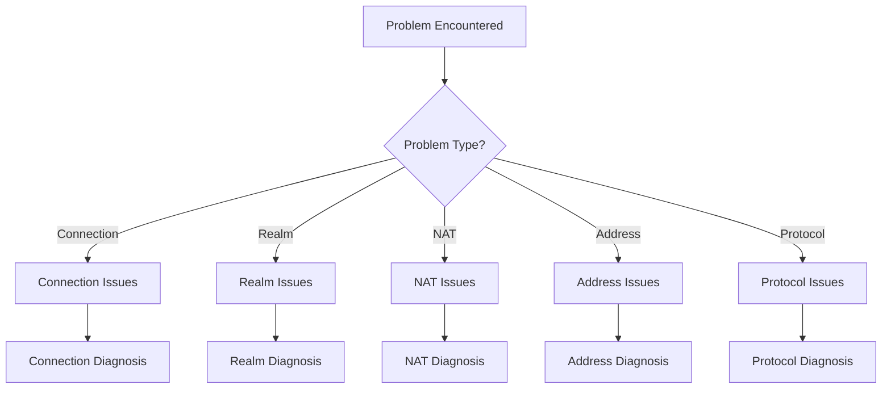

# Troubleshooting

This guide answers: **How to diagnose and solve problems when they occur?**

---

## Top 5 Most Common Errors

Quickly locate your problem:

| Error | Cause | Solution |
|-------|-------|----------|
| `ErrNotMember` | Using business APIs without joining Realm | Call `JoinRealm()` first |
| `ErrAlreadyJoined` | Joining same Realm twice | Check `CurrentRealm()` or call `LeaveRealm()` first |
| `connection timeout` | Network unreachable or firewall blocking | Check network, enable Relay |
| `peer id mismatch` | Wrong NodeID in address | Use `ShareableAddrs()` to get correct address |
| `ErrAuthFailed` | RealmKey mismatch | Ensure all members use the same realmKey |

> **Complete Error Reference**: See [Error Codes Reference](../reference/error-codes.md) for detailed explanation of all errors.
> 
> **API Constraints**: See [API Defaults and Constraints](../reference/api-defaults.md) to understand core constraints.

---

## Problem Categories



---

## Quick Diagnosis Checklist

```
┌─────────────────────────────────────────────────────────────────────┐
│                    Quick Diagnosis Checklist                         │
├─────────────────────────────────────────────────────────────────────┤
│                                                                      │
│  □ Did node start successfully?                                     │
│    - Check for startup errors                                       │
│    - Confirm node.ID() is available                                 │
│                                                                      │
│  □ Did you join a Realm?                                            │
│    - Call JoinRealm() before using business APIs                    │
│    - Check CurrentRealm()                                           │
│                                                                      │
│  □ Is network connected?                                            │
│    - Check ConnectionCount()                                        │
│    - Check Bootstrap configuration                                  │
│                                                                      │
│  □ Is address format correct?                                       │
│    - Use Full Address format                                        │
│    - Check /p2p/<NodeID> suffix                                     │
│                                                                      │
│  □ Is NAT/firewall blocking?                                        │
│    - Check UDP port                                                 │
│    - Enable Relay                                                   │
│                                                                      │
└─────────────────────────────────────────────────────────────────────┘
```

---

## Connection Issues

### Problem: Cannot Connect to Other Nodes

**Diagnostic Steps**:

```go
func diagnoseConnectionIssue(ctx context.Context, node dep2p.Node, targetAddr string) {
    fmt.Println("═══════════════════════════════════════")
    fmt.Println("Connection Diagnosis")
    fmt.Println("═══════════════════════════════════════")
    
    // 1. Check local node status
    fmt.Printf("Local Node ID: %s\n", node.ID())
    fmt.Printf("Current Connections: %d\n", node.ConnectionCount())
    
    // 2. Check target address format
    if !strings.Contains(targetAddr, "/p2p/") {
        fmt.Println("❌ Address format error: missing /p2p/<NodeID> suffix")
        return
    }
    fmt.Println("✓ Address format correct")
    
    // 3. Attempt connection
    start := time.Now()
    conn, err := node.ConnectToAddr(ctx, targetAddr)
    elapsed := time.Since(start)
    
    if err != nil {
        fmt.Printf("❌ Connection failed (%v): %v\n", elapsed, err)
        analyzeConnectionError(err)
        return
    }
    
    fmt.Printf("✓ Connection successful (%v)\n", elapsed)
    fmt.Printf("  Remote node: %s\n", conn.RemoteID())
}

func analyzeConnectionError(err error) {
    errStr := err.Error()
    
    switch {
    case strings.Contains(errStr, "timeout"):
        fmt.Println("Diagnosis: Connection timeout")
        fmt.Println("Suggestions:")
        fmt.Println("  - Check network connectivity")
        fmt.Println("  - Increase timeout duration")
        fmt.Println("  - Check firewall settings")
        
    case strings.Contains(errStr, "refused"):
        fmt.Println("Diagnosis: Connection refused")
        fmt.Println("Suggestions:")
        fmt.Println("  - Confirm target node is running")
        fmt.Println("  - Check if port is correct")
        
    case strings.Contains(errStr, "no route"):
        fmt.Println("Diagnosis: No route to host")
        fmt.Println("Suggestions:")
        fmt.Println("  - Check NAT configuration")
        fmt.Println("  - Enable Relay")
        
    case strings.Contains(errStr, "peer id mismatch"):
        fmt.Println("Diagnosis: NodeID mismatch")
        fmt.Println("Suggestions:")
        fmt.Println("  - Confirm NodeID in address is correct")
        
    default:
        fmt.Printf("Diagnosis: Unknown error\n")
        fmt.Println("Suggestion: Enable Debug logging for details")
    }
}
```

### Common Connection Errors and Solutions

| Error | Cause | Solution |
|-------|-------|----------|
| `context deadline exceeded` | Timeout | Increase timeout, check network |
| `connection refused` | Target unreachable | Confirm target node running |
| `no route to host` | Routing issue | Check NAT, use Relay |
| `peer id mismatch` | ID mismatch | Use correct full address |

---

## Realm Issues

### Problem: ErrNotMember Error

**Cause**: Calling business API without joining Realm

```go
// ❌ Wrong usage
node, _ := dep2p.New(ctx, dep2p.WithPreset(dep2p.PresetDesktop))
_ = node.Start(ctx)
node.Send(ctx, targetID, "/myapp/1.0.0", data)  // Error: ErrNotMember

// ✓ Correct usage
node, _ := dep2p.New(ctx, dep2p.WithPreset(dep2p.PresetDesktop))
_ = node.Start(ctx)
realm, _ := node.Realm("my-realm")  // Join Realm first
_ = realm.Join(ctx)
node.Send(ctx, targetID, "/myapp/1.0.0", data)  // Works
```

### Problem: ErrAlreadyJoined Error

**Cause**: Joining same Realm repeatedly

```go
// ❌ Wrong
realm, _ := node.Realm("realm-a")
_ = realm.Join(ctx)
realm, _ = node.Realm("realm-a")  // Error

// ✓ Correct: Check current Realm first
currentRealm := node.Realm().CurrentRealm()
if currentRealm != types.RealmID("realm-a") {
    realm, _ := node.Realm("realm-a")
    _ = realm.Join(ctx)
}
```

### Diagnose Realm Status

```go
func diagnoseRealmIssue(node dep2p.Node) {
    fmt.Println("═══════════════════════════════════════")
    fmt.Println("Realm Diagnosis")
    fmt.Println("═══════════════════════════════════════")
    
    currentRealm := node.Realm().CurrentRealm()
    
    if currentRealm.IsEmpty() {
        fmt.Println("❌ Not joined any Realm")
        fmt.Println("Suggestion: Call realm, _ := node.Realm(realmID); realm.Join(ctx)")
    } else {
        fmt.Printf("✓ Current Realm: %s\n", currentRealm)
    }
}
```

---

## NAT Issues

### Problem: Cannot Get Public Address

**Diagnosis**:

```go
func diagnoseNATIssue(ctx context.Context, node dep2p.Node) {
    fmt.Println("═══════════════════════════════════════")
    fmt.Println("NAT Diagnosis")
    fmt.Println("═══════════════════════════════════════")
    
    // 1. Check listen addresses
    fmt.Println("\nListen Addresses:")
    for _, addr := range node.ListenAddrs() {
        fmt.Printf("  %s\n", addr)
    }
    
    // 2. Check advertised addresses
    fmt.Println("\nAdvertised Addresses:")
    advAddrs := node.AdvertisedAddrs()
    if len(advAddrs) == 0 {
        fmt.Println("  (none)")
    } else {
        for _, addr := range advAddrs {
            fmt.Printf("  %s\n", addr)
        }
    }
    
    // 3. Wait for shareable addresses
    fmt.Println("\nWaiting for public address verification...")
    waitCtx, cancel := context.WithTimeout(ctx, 30*time.Second)
    defer cancel()
    
    addrs, err := node.WaitShareableAddrs(waitCtx)
    if err != nil {
        fmt.Println("❌ Cannot get public address")
        fmt.Println("Possible causes:")
        fmt.Println("  - Behind multiple NAT layers")
        fmt.Println("  - UPnP not available")
        fmt.Println("  - No helper nodes for verification")
        fmt.Println("Suggestion: Enable Relay")
    } else {
        fmt.Println("✓ Public Addresses:")
        for _, addr := range addrs {
            fmt.Printf("  %s\n", addr)
        }
    }
    
    // 4. Check Relay candidates
    fmt.Println("\nCandidate Addresses:")
    for _, c := range node.BootstrapCandidates() {
        fmt.Printf("  [%s] %s\n", c.Type, c.Addr)
    }
}
```

### NAT Traversal Checklist

```
┌─────────────────────────────────────────────────────────────────────┐
│                   NAT Traversal Checklist                            │
├─────────────────────────────────────────────────────────────────────┤
│                                                                      │
│  □ Does router support UPnP?                                        │
│    - Log into router to check UPnP settings                         │
│    - Some routers disable UPnP by default                           │
│                                                                      │
│  □ Does firewall allow UDP?                                         │
│    - Check local firewall                                           │
│    - Check router firewall                                          │
│    - Port 4001/UDP needs to be open                                 │
│                                                                      │
│  □ What NAT type is being used?                                     │
│    - Full Cone: Easiest to traverse                                 │
│    - Symmetric: Hardest, recommend Relay                            │
│                                                                      │
│  □ Is Relay enabled?                                                │
│    - PresetDesktop enables by default                               │
│    - Ensure Relay nodes are available                               │
│                                                                      │
└─────────────────────────────────────────────────────────────────────┘
```

---

## Address Issues

### Problem: Wrong Address Format

**Correct Format Comparison**:

```
┌─────────────────────────────────────────────────────────────────────────────┐
│                       Address Format Comparison                              │
├─────────────────────────────────────────────────────────────────────────────┤
│                                                                              │
│  ✓ Full Address (correct, for Bootstrap/sharing):                           │
│    /ip4/1.2.3.4/udp/4001/quic-v1/p2p/5Q2STWvBFn...                          │
│                                                                              │
│  ✗ Dial Address (wrong, missing NodeID):                                    │
│    /ip4/1.2.3.4/udp/4001/quic-v1                                            │
│                                                                              │
│  ✗ Simplified format (wrong):                                               │
│    1.2.3.4:4001                                                              │
│                                                                              │
│  ✓ DNS format (correct):                                                    │
│    /dns4/node.example.com/udp/4001/quic-v1/p2p/5Q2STWvBFn...                │
│                                                                              │
│  ✓ Relay format (correct):                                                  │
│    /ip4/.../p2p/.../p2p-circuit/p2p/...                                     │
│                                                                              │
└─────────────────────────────────────────────────────────────────────────────┘
```

### Address Validation Function

```go
func validateAddress(addr string) error {
    // Check basic format
    if !strings.HasPrefix(addr, "/") {
        return fmt.Errorf("address must start with /")
    }
    
    // Check if contains NodeID
    if !strings.Contains(addr, "/p2p/") {
        return fmt.Errorf("address must contain /p2p/<NodeID>")
    }
    
    // Check protocol
    if !strings.Contains(addr, "/quic") {
        return fmt.Errorf("recommend using QUIC protocol")
    }
    
    return nil
}
```

---

## Protocol Issues

### Problem: Protocol Not Supported

**Diagnosis**:

```go
func diagnoseProtocolIssue(ctx context.Context, node dep2p.Node, 
    targetID types.NodeID, protocol string) {
    
    fmt.Println("═══════════════════════════════════════")
    fmt.Println("Protocol Diagnosis")
    fmt.Println("═══════════════════════════════════════")
    
    // 1. Check protocol format
    if !strings.HasPrefix(protocol, "/") {
        fmt.Println("❌ Protocol ID format error: must start with /")
        return
    }
    
    parts := strings.Split(protocol, "/")
    if len(parts) < 4 {
        fmt.Println("❌ Protocol ID format error: should be /<namespace>/<name>/<version>")
        return
    }
    fmt.Printf("✓ Protocol format correct: %s\n", protocol)
    
    // 2. Try connecting and opening stream
    conn, err := node.Connect(ctx, targetID)
    if err != nil {
        fmt.Printf("❌ Cannot connect to target node: %v\n", err)
        return
    }
    
    stream, err := conn.OpenStream(ctx, protocol)
    if err != nil {
        fmt.Printf("❌ Protocol not supported: %v\n", err)
        fmt.Println("Suggestions:")
        fmt.Println("  - Confirm remote has registered this protocol")
        fmt.Println("  - Check if protocol ID matches exactly")
        fmt.Println("  - Try downgrading to older version")
        return
    }
    defer stream.Close()
    
    fmt.Println("✓ Protocol supported")
}
```

---

## Diagnostic Tools

### Complete Diagnostic Script

```go
package main

import (
    "context"
    "fmt"
    "time"

    "github.com/dep2p/go-dep2p"
    "github.com/dep2p/go-dep2p/pkg/types"
)

func runDiagnostics(node dep2p.Node) {
    ctx := context.Background()
    
    fmt.Println("╔════════════════════════════════════════╗")
    fmt.Println("║       DeP2P Node Diagnostics           ║")
    fmt.Println("╚════════════════════════════════════════╝")
    fmt.Println()
    
    // Basic info
    fmt.Println("【Basic Info】")
    fmt.Printf("Node ID:     %s\n", node.ID())
    fmt.Printf("Connections: %d\n", node.ConnectionCount())
    fmt.Println()
    
    // Realm status
    fmt.Println("【Realm Status】")
    realm := node.Realm().CurrentRealm()
    if realm.IsEmpty() {
        fmt.Println("Status:     ❌ Not joined any Realm")
    } else {
        fmt.Printf("Status:     ✓ Joined %s\n", realm)
    }
    fmt.Println()
    
    // Address info
    fmt.Println("【Address Info】")
    fmt.Println("Listen Addresses:")
    for _, addr := range node.ListenAddrs() {
        fmt.Printf("  • %s\n", addr)
    }
    
    fmt.Println("Shareable Addresses:")
    waitCtx, cancel := context.WithTimeout(ctx, 10*time.Second)
    addrs, err := node.WaitShareableAddrs(waitCtx)
    cancel()
    
    if err != nil || len(addrs) == 0 {
        fmt.Println("  (none yet, verifying...)")
    } else {
        for _, addr := range addrs {
            fmt.Printf("  • %s\n", addr)
        }
    }
    fmt.Println()
    
    // Network status
    fmt.Println("【Network Status】")
    if node.ConnectionCount() > 0 {
        fmt.Println("Bootstrap:  ✓ Connected")
    } else {
        fmt.Println("Bootstrap:  ❌ Not connected, check Bootstrap config")
    }
    
    fmt.Println()
    fmt.Println("═══════════════════════════════════════")
}
```

---

## Issue Report Template

When reporting issues, please provide the following information:

```
## Problem Description
[Brief description of the problem]

## Environment Info
- DeP2P Version: 
- Go Version: 
- Operating System: 
- Network Environment: [Home/Corporate/Cloud Server]

## Steps to Reproduce
1. 
2. 
3. 

## Expected Behavior
[Describe expected behavior]

## Actual Behavior
[Describe actual behavior]

## Diagnostic Info
Node ID: 
Connection Count: 
Realm: 
Listen Addresses: 
Advertised Addresses: 

## Logs
[Relevant log output]

## Code Sample
[Minimal reproducible code]
```

---

## Related Documentation

- [Observability](observability.md)
- [NAT Traversal Configuration](nat-traversal.md)
- [How to Use Relay](use-relay.md)
- [FAQ](../getting-started/faq.md)
