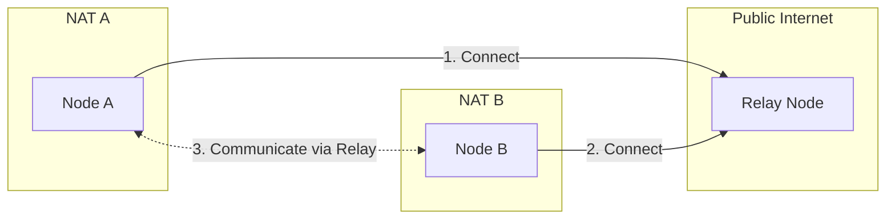
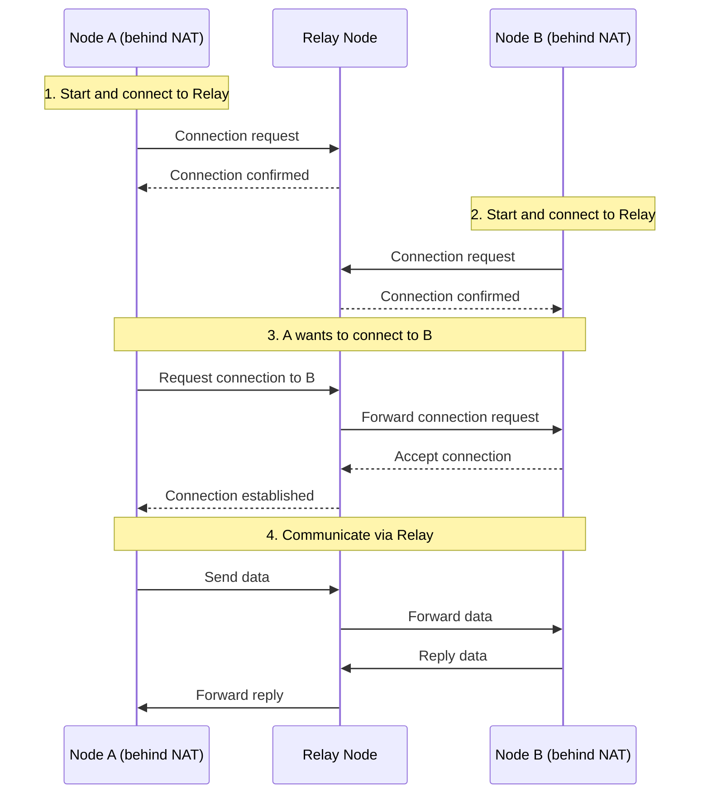

# How to Use Relay

This guide answers: **How to use relay to connect to other nodes behind NAT?**

---

## Problem

```
┌─────────────────────────────────────────────────────────────────────┐
│                     What problem am I solving?                       │
├─────────────────────────────────────────────────────────────────────┤
│                                                                      │
│  "I'm behind NAT, other nodes can't connect to me directly"         │
│  "How to configure a relay server?"                                  │
│  "How to use AutoRelay for automatic relay discovery?"              │
│                                                                      │
└─────────────────────────────────────────────────────────────────────┘
```

---

## Relay Overview



### Two Roles

| Role | Description | Configuration |
|------|-------------|---------------|
| **Relay Client** | Use relay to connect to other nodes | `WithRelay(true)` |
| **Relay Server** | Provide relay service for other nodes | `WithRelayServer(true)` |

---

## Enable Relay Client

### Basic Configuration

```go
package main

import (
    "context"
    "fmt"
    "log"

    "github.com/dep2p/go-dep2p"
    "github.com/dep2p/go-dep2p/pkg/types"
)

func main() {
    ctx := context.Background()

    // Enable Relay client (enabled by default)
    node, err := dep2p.StartNode(ctx,
        dep2p.WithPreset(dep2p.PresetDesktop),
        dep2p.WithRelay(true),  // Enable Relay
    )
    if err != nil {
        log.Fatalf("Failed to start: %v", err)
    }
    defer node.Close()

    node.Realm().JoinRealm(ctx, types.RealmID("my-network"))

    fmt.Printf("Node started: %s\n", node.ID().ShortString())
    fmt.Println("Relay client enabled, can connect to other nodes via relay")
}
```

### Relay Configuration in Presets

| Preset | Relay Client | Relay Server |
|--------|--------------|--------------|
| `PresetMinimal` | ❌ Disabled | ❌ Disabled |
| `PresetDesktop` | ✅ Enabled | ❌ Disabled |
| `PresetServer` | ✅ Enabled | ✅ Enabled |
| `PresetMobile` | ✅ Enabled | ❌ Disabled |

---

## Configure Relay Server

Deploy a node that provides relay service for other nodes.

```go
package main

import (
    "context"
    "fmt"
    "log"
    "os"
    "os/signal"
    "syscall"

    "github.com/dep2p/go-dep2p"
    "github.com/dep2p/go-dep2p/pkg/types"
)

func main() {
    ctx, cancel := context.WithCancel(context.Background())
    defer cancel()

    // Configure Relay server
    node, err := dep2p.StartNode(ctx,
        dep2p.WithPreset(dep2p.PresetServer),
        dep2p.WithRelayServer(true),    // Enable Relay service
        dep2p.WithListenPort(4001),     // Fixed port
    )
    if err != nil {
        log.Fatalf("Failed to start: %v", err)
    }
    defer node.Close()

    node.Realm().JoinRealm(ctx, types.RealmID("relay-network"))

    fmt.Println("╔════════════════════════════════════════╗")
    fmt.Println("║         Relay Server Started           ║")
    fmt.Println("╚════════════════════════════════════════╝")
    fmt.Println()
    fmt.Printf("Node ID: %s\n", node.ID())
    fmt.Println()
    fmt.Println("Other nodes can connect using these addresses:")
    for _, addr := range node.ListenAddrs() {
        fmt.Printf("  %s/p2p/%s\n", addr, node.ID())
    }
    fmt.Println()
    fmt.Println("Press Ctrl+C to exit")

    sigCh := make(chan os.Signal, 1)
    signal.Notify(sigCh, syscall.SIGINT, syscall.SIGTERM)
    <-sigCh
}
```

---

## AutoRelay Automatic Discovery

DeP2P automatically discovers and uses Relay nodes in the network.

```go
package main

import (
    "context"
    "fmt"
    "log"
    "time"

    "github.com/dep2p/go-dep2p"
    "github.com/dep2p/go-dep2p/pkg/types"
)

func main() {
    ctx := context.Background()

    // AutoRelay is enabled by default in Desktop/Server presets
    node, err := dep2p.StartNode(ctx,
        dep2p.WithPreset(dep2p.PresetDesktop),
        // AutoRelay automatically discovers and connects to Relay nodes
    )
    if err != nil {
        log.Fatalf("Failed to start: %v", err)
    }
    defer node.Close()

    node.Realm().JoinRealm(ctx, types.RealmID("my-network"))

    // Wait for AutoRelay to discover Relay nodes
    fmt.Println("Waiting for Relay node discovery...")
    time.Sleep(10 * time.Second)

    // Check for Relay addresses
    candidates := node.BootstrapCandidates()
    for _, c := range candidates {
        if c.Type == "relay" {
            fmt.Printf("Discovered Relay: %s\n", c.Addr)
        }
    }
}
```

---

## Manually Specify Relay Nodes

When you know the Relay node address, you can specify it directly.

```go
package main

import (
    "context"
    "fmt"
    "log"

    "github.com/dep2p/go-dep2p"
    "github.com/dep2p/go-dep2p/pkg/types"
)

func main() {
    ctx := context.Background()

    // Specify Relay node as Bootstrap
    relayAddr := "/ip4/1.2.3.4/udp/4001/quic-v1/p2p/5Q2STWvBRelayNode..."

    node, err := dep2p.StartNode(ctx,
        dep2p.WithPreset(dep2p.PresetDesktop),
        dep2p.WithBootstrapPeers(relayAddr),  // Relay node can also be Bootstrap
        dep2p.WithRelay(true),
    )
    if err != nil {
        log.Fatalf("Failed to start: %v", err)
    }
    defer node.Close()

    node.Realm().JoinRealm(ctx, types.RealmID("my-network"))

    fmt.Printf("Node started: %s\n", node.ID().ShortString())
    fmt.Println("Will use specified Relay node")
}
```

---

## Relay Connection Flow



---

## Relay Address Format

```
┌─────────────────────────────────────────────────────────────────────────────┐
│                          Relay Address Format                                │
├─────────────────────────────────────────────────────────────────────────────┤
│                                                                              │
│  Format:                                                                     │
│  /ip4/<relay-ip>/udp/<port>/quic-v1/p2p/<relay-id>/p2p-circuit/p2p/<target>│
│                                                                              │
│  Example:                                                                    │
│  /ip4/1.2.3.4/udp/4001/quic-v1/p2p/5Q2STWvBRelay/p2p-circuit/p2p/7K3YTarget│
│  │                               │              │                │         │
│  └─ Relay node address ──────────┘              │                │         │
│                                                  │                │         │
│                            p2p-circuit marker ──┘                │         │
│                                                                   │         │
│                                            Target NodeID ────────┘         │
│                                                                              │
└─────────────────────────────────────────────────────────────────────────────┘
```

---

## Complete Example: Nodes Behind NAT Communication

### 1. Relay Server (Public)

```go
// relay_server.go
package main

import (
    "context"
    "fmt"
    "log"
    "os"
    "os/signal"
    "syscall"

    "github.com/dep2p/go-dep2p"
    "github.com/dep2p/go-dep2p/pkg/types"
)

func main() {
    ctx, cancel := context.WithCancel(context.Background())
    defer cancel()

    node, err := dep2p.StartNode(ctx,
        dep2p.WithPreset(dep2p.PresetServer),
        dep2p.WithRelayServer(true),
        dep2p.WithListenPort(4001),
    )
    if err != nil {
        log.Fatalf("Failed to start: %v", err)
    }
    defer node.Close()

    node.Realm().JoinRealm(ctx, types.RealmID("demo-network"))

    fmt.Printf("Relay server: %s\n", node.ID())
    for _, addr := range node.ListenAddrs() {
        fmt.Printf("Address: %s/p2p/%s\n", addr, node.ID())
    }

    sigCh := make(chan os.Signal, 1)
    signal.Notify(sigCh, syscall.SIGINT, syscall.SIGTERM)
    <-sigCh
}
```

### 2. Node A Behind NAT

```go
// node_a.go
package main

import (
    "context"
    "fmt"
    "log"
    "os"

    "github.com/dep2p/go-dep2p"
    "github.com/dep2p/go-dep2p/pkg/types"
)

func main() {
    ctx := context.Background()

    relayAddr := os.Getenv("RELAY_ADDR") // Get Relay address from env

    node, err := dep2p.StartNode(ctx,
        dep2p.WithPreset(dep2p.PresetDesktop),
        dep2p.WithBootstrapPeers(relayAddr),
        dep2p.WithRelay(true),
    )
    if err != nil {
        log.Fatalf("Failed to start: %v", err)
    }
    defer node.Close()

    node.Realm().JoinRealm(ctx, types.RealmID("demo-network"))

    fmt.Printf("Node A: %s\n", node.ID())
    fmt.Println("Waiting for Node B to connect...")

    // Register message handler
    node.Endpoint().SetProtocolHandler("/test/1.0.0", func(stream dep2p.Stream) {
        defer stream.Close()
        buf := make([]byte, 1024)
        n, _ := stream.Read(buf)
        fmt.Printf("Received message: %s\n", string(buf[:n]))
        stream.Write([]byte("Hello from A!"))
    })

    select {}
}
```

### 3. Node B Behind NAT

```go
// node_b.go
package main

import (
    "context"
    "fmt"
    "log"
    "os"

    "github.com/dep2p/go-dep2p"
    "github.com/dep2p/go-dep2p/pkg/types"
)

func main() {
    ctx := context.Background()

    relayAddr := os.Getenv("RELAY_ADDR")
    nodeAID := os.Getenv("NODE_A_ID")

    node, err := dep2p.StartNode(ctx,
        dep2p.WithPreset(dep2p.PresetDesktop),
        dep2p.WithBootstrapPeers(relayAddr),
        dep2p.WithRelay(true),
    )
    if err != nil {
        log.Fatalf("Failed to start: %v", err)
    }
    defer node.Close()

    node.Realm().JoinRealm(ctx, types.RealmID("demo-network"))

    fmt.Printf("Node B: %s\n", node.ID())

    // Connect to Node A (via Relay)
    targetID, _ := types.ParseNodeID(nodeAID)
    conn, err := node.Connect(ctx, targetID)
    if err != nil {
        log.Fatalf("Connection failed: %v", err)
    }

    fmt.Println("Connected to Node A (via Relay)")

    // Send message
    stream, _ := conn.OpenStream(ctx, "/test/1.0.0")
    stream.Write([]byte("Hello from B!"))
    
    buf := make([]byte, 1024)
    n, _ := stream.Read(buf)
    fmt.Printf("Received reply: %s\n", string(buf[:n]))
}
```

---

## Troubleshooting

### Problem 1: Cannot Connect to Relay Node

**Possible causes**:
- Relay node unreachable
- Firewall blocking connection
- Wrong address format

**Solutions**:

```go
// 1. Check Relay address format
// Must be Full Address
relayAddr := "/ip4/1.2.3.4/udp/4001/quic-v1/p2p/5Q2STWvBRelay..."

// 2. Test connection
conn, err := node.ConnectToAddr(ctx, relayAddr)
if err != nil {
    log.Printf("Cannot connect to Relay: %v", err)
}

// 3. Use multiple Relays
node, _ := dep2p.StartNode(ctx,
    dep2p.WithBootstrapPeers(
        "/ip4/1.2.3.4/udp/4001/quic-v1/p2p/...",
        "/ip4/5.6.7.8/udp/4001/quic-v1/p2p/...",
    ),
)
```

### Problem 2: High Latency via Relay

**Cause**: All traffic goes through Relay forwarding

**Solutions**:
- Try direct connection or hole punching
- Choose geographically closer Relay
- DeP2P automatically attempts to upgrade to direct connection

### Problem 3: Relay Node Overloaded

**Solutions**:

```go
// Limit Relay connections
// Configure in Relay server settings
node, _ := dep2p.StartNode(ctx,
    dep2p.WithPreset(dep2p.PresetServer),
    dep2p.WithRelayServer(true),
    dep2p.WithConnectionLimits(100, 200),  // Limit connection count
)
```

---

## Best Practices

```
┌─────────────────────────────────────────────────────────────────────┐
│                       Relay Best Practices                           │
├─────────────────────────────────────────────────────────────────────┤
│                                                                      │
│  1. Deploy multiple Relay nodes                                     │
│     - Improve availability                                          │
│     - Distribute load                                               │
│     - Choose different geographic locations                         │
│                                                                      │
│  2. Use Server preset for Relay nodes                               │
│     - PresetServer auto-enables Relay service                       │
│     - Configure fixed port                                          │
│     - Use public IP                                                  │
│                                                                      │
│  3. Client configuration                                            │
│     - Enable AutoRelay                                              │
│     - Configure multiple Bootstrap nodes                            │
│     - System will auto-select best Relay                            │
│                                                                      │
│  4. Monitor Relay status                                            │
│     - Monitor connection count                                      │
│     - Monitor bandwidth usage                                       │
│     - Set reasonable limits                                         │
│                                                                      │
└─────────────────────────────────────────────────────────────────────┘
```

---

## Related Documentation

- [How to Bootstrap Network](bootstrap-network.md)
- [How to Share Address](share-address.md)
- [NAT Traversal Configuration](nat-traversal.md)
- [Cross-NAT Connection Tutorial](../tutorials/03-cross-nat-connect.md)
