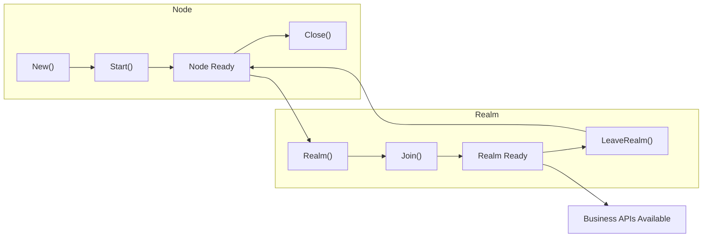

# API Defaults and Constraints

This document lists DeP2P's core constraints, API default behaviors, and how to fix errors when constraints are violated.

---

## Core Constraints (Must Follow)

```
┌─────────────────────────────────────────────────────────────────────┐
│                    DeP2P Core Constraints                           │
├─────────────────────────────────────────────────────────────────────┤
│                                                                      │
│  1. Must call Realm().Join() before using business APIs            │
│     → Otherwise returns ErrNotMember                                │
│                                                                      │
│  2. A Node can only join one Realm at a time                       │
│     → Must call LeaveRealm() before switching                       │
│                                                                      │
│  3. RealmKey must be securely shared among members                 │
│     → Only nodes with the same realmKey can verify each other       │
│                                                                      │
│  4. Protocol ID must include version                                │
│     → Format: /namespace/name/version                               │
│                                                                      │
│  5. Address must use Full Address format                            │
│     → Must include /p2p/<NodeID> suffix                            │
│                                                                      │
└─────────────────────────────────────────────────────────────────────┘
```

---

## Constraint Quick Reference

| Constraint | Error When Violated | Solution |
|------------|---------------------|----------|
| Must call Realm().Join() first | `ErrNotMember` | Call `node.Realm()` + `realm.Join()` |
| Cannot join Realm twice | `ErrAlreadyJoined` | Check `CurrentRealm()` or call `LeaveRealm()` first |
| RealmKey mismatch | `ErrAuthFailed` | Ensure all members use the same realmKey |
| Address missing NodeID | Connection fails | Use `ShareableAddrs()` to get full address |
| Invalid protocol ID format | Protocol negotiation fails | Use `/namespace/name/version` format |

---

## API Default Behaviors

### Node Layer

| API | Default Behavior | Notes |
|-----|------------------|-------|
| `New()` | Auto-generate identity | New NodeID on each start |
| `New()` | Random port | Uses `/udp/0/quic-v1` |
| `Start()` | Enable NAT traversal | UPnP/STUN/hole punching |
| `Start()` | Enable Relay | As client using relay |
| `Close()` | Graceful shutdown | Waits for Goodbye message propagation |

### Realm Layer

| API | Default Behavior | Notes |
|-----|------------------|-------|
| `Realm().Join()` | Auto-derive RealmID | Derived from realmKey hash |
| `Realm().Join()` | Enable PSK auth | Member verification |
| `CurrentRealm()` | Returns nil | When not joined |
| `LeaveRealm()` | Clean up subscriptions | Automatically leaves all Topics |

### Messaging Layer

| API | Default Behavior | Notes |
|-----|------------------|-------|
| `Send()` | No retry | Application layer must handle |
| `Request()` | 30s timeout | Can override with context |
| `OnMessage()` | Replace handler | Only last handler kept for same protocol |

### PubSub Layer

| API | Default Behavior | Notes |
|-----|------------------|-------|
| `Join()` | Auto-add Realm prefix | Actual topic: `/dep2p/app/<realmID>/user-topic` |
| `Publish()` | Async send | Does not wait for confirmation |
| `Subscribe()` | Returns channel | Messages received via channel |

---

## Lifecycle Constraints



### Correct Lifecycle

```go
// 1. Start node
node, err := dep2p.New(ctx, dep2p.WithPreset(dep2p.PresetDesktop))
if err != nil {
    log.Fatal(err)
}
if err := node.Start(ctx); err != nil {
    log.Fatal(err)
}
defer node.Close()

// 2. Join Realm (required!)
realmKey := types.RealmKey(sharedSecret)
realm, err := node.Realm("my-app")
if err != nil {
    log.Fatal(err)
}
if err := realm.Join(ctx); err != nil {
    log.Fatal(err)
}

// 3. Use business APIs
messaging := realm.Messaging()
pubsub := realm.PubSub()
// ... business logic ...

// 4. Leave Realm (optional, Close() handles it automatically)
// realm.Leave(ctx)
```

### Common Mistakes

```go
// ❌ Wrong: Using business API without joining Realm
node, _ := dep2p.New(ctx, dep2p.WithPreset(dep2p.PresetDesktop))
_ = node.Start(ctx)
node.Send(ctx, targetID, "/myapp/1.0.0", data)  // ErrNotMember!

// ❌ Wrong: Joining same Realm twice
realm, _ := node.Realm("realm-a")
_ = realm.Join(ctx)
_ = realm.Join(ctx)  // ErrAlreadyJoined!

// ❌ Wrong: Different realmKey
realmA, _ := nodeA.Realm("test")
_ = realmA.Join(ctx)
realmB, _ := nodeB.Realm("test")
_ = realmB.Join(ctx)  // Cannot verify each other!
```

---

## Preset Defaults

### PresetDesktop

```go
// Connection limits
LowWater:  50
HighWater: 100

// Feature flags
NAT:        true   // Enable NAT traversal
Relay:      true   // Enable Relay client
RelayServer: false // Not a Relay server

// Discovery
mDNS:       true   // LAN discovery
DHT:        true   // Distributed hash table

// Liveness
Heartbeat:  15s    // Heartbeat interval
Timeout:    45s    // Heartbeat timeout
```

### PresetServer

```go
// Connection limits
LowWater:  100
HighWater: 200

// Feature flags
NAT:         true
Relay:       true
RelayServer: true   // Act as Relay server

// Discovery
mDNS:        false  // Servers usually don't need
DHT:         true
```

### PresetMobile

```go
// Connection limits
LowWater:  10
HighWater: 30

// Feature flags
NAT:        true
Relay:      true   // Mobile often needs relay
RelayServer: false

// Battery optimization
HeartbeatInterval: 30s  // Lower frequency
```

---

## Protocol Namespace

DeP2P uses a three-level protocol namespace:

```
┌─────────────────────────────────────────────────────────────────────┐
│                      Protocol Namespace                              │
├─────────────────────────────────────────────────────────────────────┤
│                                                                      │
│  /dep2p/sys/*                                                       │
│    System protocols (DHT/Relay/NAT), not for direct use            │
│                                                                      │
│  /dep2p/realm/<realmID>/*                                           │
│    Realm control protocols (member verification/sync), auto-managed │
│                                                                      │
│  /dep2p/app/<realmID>/*                                             │
│    Application protocols, used via realm.Messaging()                │
│    Framework auto-adds prefix                                       │
│                                                                      │
└─────────────────────────────────────────────────────────────────────┘
```

### Protocol Auto-Prefix

```go
// User code
messaging.SendWithProtocol(ctx, targetID, "chat/1.0.0", data)

// Actual protocol ID (framework auto-adds)
// /dep2p/app/<realmID>/chat/1.0.0
```

---

## Self-Check Checklist

Use this checklist to verify your code follows constraints:

```
□ Called Realm().Join() after starting node?
□ All members use the same realmKey?
□ Business APIs called after Realm().Join()?
□ Protocol ID includes version (e.g., /1.0.0)?
□ Shared addresses include /p2p/<NodeID>?
□ Using context to control timeout?
□ Properly handling Close() cleanup?
```

---

## Related Documentation

- [Error Codes Reference](error-codes.md) - Complete error code list
- [Configuration Reference](configuration.md) - All configuration options
- [Troubleshooting](../how-to/troubleshooting.md) - Problem diagnosis guide
- [5-Minute Quickstart](../getting-started/quickstart.md) - Quick start

