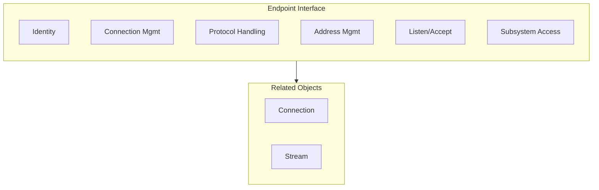
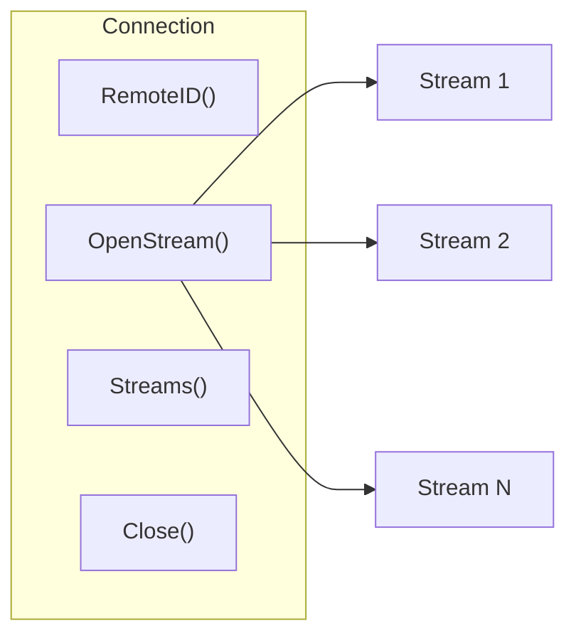

# Endpoint API

Endpoint is the core connection interface of DeP2P, providing low-level connection management and protocol handling capabilities.

---

## Overview



Endpoint is the minimal stable interface, providing:
- Node identity management
- Connection establishment and management
- Protocol handler registration
- Address management
- Subsystem access

---

## Getting the Endpoint

Obtain through Node's `Endpoint()` method:

```go
ep := node.Endpoint()
```

---

## Identity APIs

### ID

Returns the node ID.

```go
func (e Endpoint) ID() NodeID
```

**Returns**:
| Type | Description |
|------|-------------|
| `NodeID` | Unique node identifier |

---

### PublicKey

Returns the node's public key.

```go
func (e Endpoint) PublicKey() PublicKey
```

**Returns**:
| Type | Description |
|------|-------------|
| `PublicKey` | Node public key |

---

## Connection Management APIs

### Connect

Connects to a node by NodeID.

```go
func (e Endpoint) Connect(ctx context.Context, nodeID NodeID) (Connection, error)
```

**Parameters**:
| Parameter | Type | Description |
|-----------|------|-------------|
| `ctx` | `context.Context` | Context |
| `nodeID` | `NodeID` | Target node ID |

**Returns**:
| Type | Description |
|------|-------------|
| `Connection` | Connection instance |
| `error` | Error information |

**Notes**:
- Automatically finds node addresses through discovery service
- Automatically selects optimal connection path (direct → hole punching → relay)
- If connection already exists, returns existing connection

**Example**:

```go
conn, err := ep.Connect(ctx, targetNodeID)
if err != nil {
    log.Printf("Connection failed: %v", err)
    return
}
defer conn.Close()
```

---

### ConnectWithAddrs

Connects to a node using specified addresses.

```go
func (e Endpoint) ConnectWithAddrs(ctx context.Context, nodeID NodeID, addrs []Address) (Connection, error)
```

**Parameters**:
| Parameter | Type | Description |
|-----------|------|-------------|
| `ctx` | `context.Context` | Context |
| `nodeID` | `NodeID` | Target node ID |
| `addrs` | `[]Address` | Address list |

**Returns**:
| Type | Description |
|------|-------------|
| `Connection` | Connection instance |
| `error` | Error information |

---

### Disconnect

Disconnects from a specified node.

```go
func (e Endpoint) Disconnect(nodeID NodeID) error
```

**Parameters**:
| Parameter | Type | Description |
|-----------|------|-------------|
| `nodeID` | `NodeID` | Target node ID |

**Returns**:
| Type | Description |
|------|-------------|
| `error` | Error information |

---

### Connections

Returns all active connections.

```go
func (e Endpoint) Connections() []Connection
```

**Returns**:
| Type | Description |
|------|-------------|
| `[]Connection` | Connection list |

**Example**:

```go
for _, conn := range ep.Connections() {
    fmt.Printf("Connected to: %s\n", conn.RemoteID())
}
```

---

### Connection

Gets a connection to a specified node.

```go
func (e Endpoint) Connection(nodeID NodeID) (Connection, bool)
```

**Parameters**:
| Parameter | Type | Description |
|-----------|------|-------------|
| `nodeID` | `NodeID` | Target node ID |

**Returns**:
| Type | Description |
|------|-------------|
| `Connection` | Connection instance |
| `bool` | Whether it exists |

---

### ConnectionCount

Returns the current connection count.

```go
func (e Endpoint) ConnectionCount() int
```

---

## Protocol Handling APIs

### SetProtocolHandler

Sets a protocol handler.

```go
func (e Endpoint) SetProtocolHandler(protocolID ProtocolID, handler ProtocolHandler)
```

**Parameters**:
| Parameter | Type | Description |
|-----------|------|-------------|
| `protocolID` | `ProtocolID` | Protocol ID |
| `handler` | `ProtocolHandler` | Handler function |

**Example**:

```go
ep.SetProtocolHandler("/myapp/echo/1.0.0", func(stream Stream) {
    defer stream.Close()
    
    buf := make([]byte, 1024)
    n, err := stream.Read(buf)
    if err != nil {
        return
    }
    
    stream.Write(buf[:n])
})
```

---

### RemoveProtocolHandler

Removes a protocol handler.

```go
func (e Endpoint) RemoveProtocolHandler(protocolID ProtocolID)
```

**Parameters**:
| Parameter | Type | Description |
|-----------|------|-------------|
| `protocolID` | `ProtocolID` | Protocol ID |

---

### Protocols

Returns the list of registered protocols.

```go
func (e Endpoint) Protocols() []ProtocolID
```

**Returns**:
| Type | Description |
|------|-------------|
| `[]ProtocolID` | Protocol ID list |

---

## Listen and Accept APIs

### Listen

Starts listening for connections.

```go
func (e Endpoint) Listen(ctx context.Context) error
```

**Parameters**:
| Parameter | Type | Description |
|-----------|------|-------------|
| `ctx` | `context.Context` | Context |

**Returns**:
| Type | Description |
|------|-------------|
| `error` | Error information |

**Notes**:
- Should be called after setting protocol handlers
- After calling, starts accepting inbound connections

---

### Accept

Accepts an inbound connection.

```go
func (e Endpoint) Accept(ctx context.Context) (Connection, error)
```

**Parameters**:
| Parameter | Type | Description |
|-----------|------|-------------|
| `ctx` | `context.Context` | Context |

**Returns**:
| Type | Description |
|------|-------------|
| `Connection` | New connection |
| `error` | Error information |

---

## Address Management APIs

### ListenAddrs

Returns local listen addresses.

```go
func (e Endpoint) ListenAddrs() []Address
```

---

### AdvertisedAddrs

Returns advertised addresses.

```go
func (e Endpoint) AdvertisedAddrs() []Address
```

---

### AddAdvertisedAddr

Adds an advertised address.

```go
func (e Endpoint) AddAdvertisedAddr(addr Address)
```

---

## Subsystem Access APIs

### Discovery

Returns the discovery service.

```go
func (e Endpoint) Discovery() DiscoveryService
```

---

### NAT

Returns the NAT service.

```go
func (e Endpoint) NAT() NATService
```

---

### Relay

Returns the relay client.

```go
func (e Endpoint) Relay() RelayClient
```

---

### AddressBook

Returns the address book.

```go
func (e Endpoint) AddressBook() AddressBook
```

---

## Lifecycle APIs

### Close

Closes the Endpoint.

```go
func (e Endpoint) Close() error
```

---

## Connection Interface

Connection represents a connection to a remote node.



### RemoteID

Returns the remote node ID.

```go
func (c Connection) RemoteID() NodeID
```

---

### RemotePublicKey

Returns the remote node's public key.

```go
func (c Connection) RemotePublicKey() PublicKey
```

---

### RemoteAddrs

Returns the remote node's addresses.

```go
func (c Connection) RemoteAddrs() []Address
```

---

### LocalID

Returns the local node ID.

```go
func (c Connection) LocalID() NodeID
```

---

### LocalAddrs

Returns local addresses.

```go
func (c Connection) LocalAddrs() []Address
```

---

### OpenStream

Opens a new stream.

```go
func (c Connection) OpenStream(ctx context.Context, protocolID ProtocolID) (Stream, error)
```

**Parameters**:
| Parameter | Type | Description |
|-----------|------|-------------|
| `ctx` | `context.Context` | Context |
| `protocolID` | `ProtocolID` | Protocol ID |

**Returns**:
| Type | Description |
|------|-------------|
| `Stream` | Stream instance |
| `error` | Error information |

**Example**:

```go
stream, err := conn.OpenStream(ctx, "/myapp/data/1.0.0")
if err != nil {
    log.Printf("Failed to open stream: %v", err)
    return
}
defer stream.Close()

stream.Write([]byte("Hello"))
```

---

### OpenStreamWithPriority

Opens a stream with specified priority.

```go
func (c Connection) OpenStreamWithPriority(ctx context.Context, protocolID ProtocolID, priority Priority) (Stream, error)
```

---

### AcceptStream

Accepts a new stream.

```go
func (c Connection) AcceptStream(ctx context.Context) (Stream, error)
```

**Notes**:
- Blocks until remote node opens a new stream
- Usually called in a loop within a dedicated goroutine

---

### Streams

Returns all active streams.

```go
func (c Connection) Streams() []Stream
```

---

### StreamCount

Returns the current stream count.

```go
func (c Connection) StreamCount() int
```

---

### IsClosed

Checks if the connection is closed.

```go
func (c Connection) IsClosed() bool
```

---

### ConnectedAt

Returns the connection establishment time.

```go
func (c Connection) ConnectedAt() time.Time
```

---

### Close

Closes the connection.

```go
func (c Connection) Close() error
```

---

## Stream Interface

Stream represents a bidirectional data stream.

### ProtocolID

Returns the stream's protocol ID.

```go
func (s Stream) ProtocolID() ProtocolID
```

---

### Read

Reads data from the stream.

```go
func (s Stream) Read(p []byte) (n int, err error)
```

---

### Write

Writes data to the stream.

```go
func (s Stream) Write(p []byte) (n int, err error)
```

---

### Close

Closes the stream.

```go
func (s Stream) Close() error
```

---

### CloseRead

Closes the read direction.

```go
func (s Stream) CloseRead() error
```

---

### CloseWrite

Closes the write direction.

```go
func (s Stream) CloseWrite() error
```

---

### SetDeadline

Sets read/write timeout.

```go
func (s Stream) SetDeadline(t time.Time) error
```

---

### SetReadDeadline

Sets read timeout.

```go
func (s Stream) SetReadDeadline(t time.Time) error
```

---

### SetWriteDeadline

Sets write timeout.

```go
func (s Stream) SetWriteDeadline(t time.Time) error
```

---

## Method List

### Endpoint Methods

| Method | Category | Description |
|--------|----------|-------------|
| `ID()` | Identity | Returns node ID |
| `PublicKey()` | Identity | Returns public key |
| `Connect()` | Connection | Connect by NodeID |
| `ConnectWithAddrs()` | Connection | Connect with addresses |
| `Disconnect()` | Connection | Disconnect |
| `Connections()` | Connection | Returns all connections |
| `Connection()` | Connection | Gets specific connection |
| `ConnectionCount()` | Connection | Returns connection count |
| `SetProtocolHandler()` | Protocol | Sets handler |
| `RemoveProtocolHandler()` | Protocol | Removes handler |
| `Protocols()` | Protocol | Returns protocol list |
| `Listen()` | Listen | Starts listening |
| `Accept()` | Listen | Accepts connection |
| `ListenAddrs()` | Address | Returns listen addresses |
| `AdvertisedAddrs()` | Address | Returns advertised addresses |
| `AddAdvertisedAddr()` | Address | Adds advertised address |
| `Discovery()` | Subsystem | Returns discovery service |
| `NAT()` | Subsystem | Returns NAT service |
| `Relay()` | Subsystem | Returns relay client |
| `AddressBook()` | Subsystem | Returns address book |
| `Close()` | Lifecycle | Closes Endpoint |

### Connection Methods

| Method | Description |
|--------|-------------|
| `RemoteID()` | Returns remote node ID |
| `RemotePublicKey()` | Returns remote public key |
| `RemoteAddrs()` | Returns remote addresses |
| `LocalID()` | Returns local node ID |
| `LocalAddrs()` | Returns local addresses |
| `OpenStream()` | Opens stream |
| `OpenStreamWithPriority()` | Opens priority stream |
| `AcceptStream()` | Accepts stream |
| `Streams()` | Returns all streams |
| `StreamCount()` | Returns stream count |
| `IsClosed()` | Checks if closed |
| `ConnectedAt()` | Returns connection time |
| `Close()` | Closes connection |

### Stream Methods

| Method | Description |
|--------|-------------|
| `ProtocolID()` | Returns protocol ID |
| `Read()` | Reads data |
| `Write()` | Writes data |
| `Close()` | Closes stream |
| `CloseRead()` | Closes read |
| `CloseWrite()` | Closes write |
| `SetDeadline()` | Sets timeout |
| `SetReadDeadline()` | Sets read timeout |
| `SetWriteDeadline()` | Sets write timeout |

---

## Related Documentation

- [Node API](node.md)
- [Realm API](realm.md)
- [Protocol ID Specification](../protocol-ids.md)
