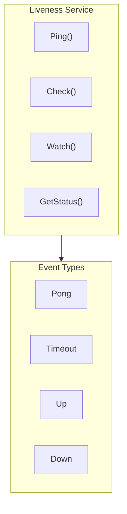

# Liveness API

The Liveness service provides node liveness detection and network health monitoring capabilities.

---

## Overview



The Liveness service supports:
- **Active Probing**: Ping/Check to verify node liveness
- **Passive Monitoring**: Watch to monitor node status changes
- **Statistics**: Metrics such as RTT, success rate, etc.

> **How to Get**: Obtain the Liveness service through `realm.Liveness()`.

---

## Getting Liveness Service

```go
realm, _ := node.Realm("my-realm")
_ = realm.Join(ctx)
liveness := realm.Liveness()
```

---

## Ping API

### Ping

Send a ping and measure round-trip time (RTT).

```go
func (l *Liveness) Ping(ctx context.Context, peerID string) (time.Duration, error)
```

**Parameters**:
| Parameter | Type | Description |
|-----------|------|-------------|
| `ctx` | `context.Context` | Context |
| `peerID` | `string` | Target node ID |

**Return Values**:
| Type | Description |
|------|-------------|
| `time.Duration` | Round-trip time (RTT) |
| `error` | Error information |

**Description**:
- Sends a ping message and waits for a pong response
- Returns the RTT which is the round-trip time of the message
- Can be used for network latency measurement

**Example**:

```go
liveness := realm.Liveness()

rtt, err := liveness.Ping(ctx, targetPeerID)
if err != nil {
    log.Printf("Ping failed: %v", err)
    return
}
fmt.Printf("RTT: %v\n", rtt)
```

---

### Check

Check if a node is alive.

```go
func (l *Liveness) Check(ctx context.Context, peerID string) (bool, error)
```

**Parameters**:
| Parameter | Type | Description |
|-----------|------|-------------|
| `ctx` | `context.Context` | Context |
| `peerID` | `string` | Target node ID |

**Return Values**:
| Type | Description |
|------|-------------|
| `bool` | Whether the node is alive |
| `error` | Error information (errors during the check process) |

**Description**:
- Similar to Ping, but only returns the liveness status
- Suitable for scenarios where you only need to know if a node is online

**Example**:

```go
alive, err := liveness.Check(ctx, targetPeerID)
if err != nil {
    log.Printf("Check failed: %v", err)
    return
}
if alive {
    fmt.Println("Node is online")
} else {
    fmt.Println("Node is offline")
}
```

---

## Watch API

### Watch

Monitor node status changes.

```go
func (l *Liveness) Watch(peerID string) (<-chan LivenessEvent, error)
```

**Parameters**:
| Parameter | Type | Description |
|-----------|------|-------------|
| `peerID` | `string` | Target node ID |

**Return Values**:
| Type | Description |
|------|-------------|
| `<-chan LivenessEvent` | Event channel |
| `error` | Error information |

**LivenessEvent Structure**:

```go
type LivenessEvent struct {
    PeerID    string            // Node ID
    Type      LivenessEventType // Event type
    Status    LivenessStatus    // Current status
    Timestamp time.Time         // Event time
    RTT       time.Duration     // Round-trip time (Pong events only)
}
```

**LivenessEventType Constants**:

| Type | Description |
|------|-------------|
| `LivenessEventPong` | Received pong response |
| `LivenessEventTimeout` | Timeout |
| `LivenessEventUp` | Node came online |
| `LivenessEventDown` | Node went offline |

**Example**:

```go
liveness := realm.Liveness()

// Start monitoring node
eventCh, err := liveness.Watch(targetPeerID)
if err != nil {
    log.Fatal(err)
}

// Handle events
go func() {
    for event := range eventCh {
        switch event.Type {
        case interfaces.LivenessEventUp:
            fmt.Printf("Node %s came online\n", event.PeerID[:16])
        case interfaces.LivenessEventDown:
            fmt.Printf("Node %s went offline\n", event.PeerID[:16])
        case interfaces.LivenessEventPong:
            fmt.Printf("Node %s RTT: %v\n", event.PeerID[:16], event.RTT)
        case interfaces.LivenessEventTimeout:
            fmt.Printf("Node %s timed out\n", event.PeerID[:16])
        }
    }
}()
```

---

### Unwatch

Stop monitoring a node.

```go
func (l *Liveness) Unwatch(peerID string) error
```

**Parameters**:
| Parameter | Type | Description |
|-----------|------|-------------|
| `peerID` | `string` | Target node ID |

**Example**:

```go
// Stop monitoring
liveness.Unwatch(targetPeerID)
```

---

## Status API

### GetStatus

Get node liveness status.

```go
func (l *Liveness) GetStatus(peerID string) LivenessStatus
```

**Parameters**:
| Parameter | Type | Description |
|-----------|------|-------------|
| `peerID` | `string` | Target node ID |

**Return Values**:
| Type | Description |
|------|-------------|
| `LivenessStatus` | Liveness status |

**LivenessStatus Structure**:

```go
type LivenessStatus struct {
    Alive        bool          // Whether alive
    LastSeen     time.Time     // Last confirmed alive time
    LastRTT      time.Duration // Last RTT
    AvgRTT       time.Duration // Average RTT (sliding window)
    MinRTT       time.Duration // Historical best RTT
    MaxRTT       time.Duration // Historical worst RTT
    FailCount    int           // Consecutive failure count
    TotalPings   int           // Total ping count
    SuccessCount int           // Success count
    SuccessRate  float64       // Success rate (0.0 - 1.0)
}
```

**Example**:

```go
liveness := realm.Liveness()

status := liveness.GetStatus(targetPeerID)
fmt.Printf("Alive: %v\n", status.Alive)
fmt.Printf("Last seen: %v\n", status.LastSeen)
fmt.Printf("Average RTT: %v\n", status.AvgRTT)
fmt.Printf("Success rate: %.2f%%\n", status.SuccessRate*100)
```

---

## Lifecycle API

### Start

Start the liveness detection service.

```go
func (l *Liveness) Start(ctx context.Context) error
```

**Description**:
- Usually called automatically by Realm
- Starts background periodic probing tasks

---

### Stop

Stop the liveness detection service.

```go
func (l *Liveness) Stop(ctx context.Context) error
```

**Description**:
- Stops all background tasks
- Closes all monitoring channels

---

## Configuration

**LivenessConfig Structure**:

```go
type LivenessConfig struct {
    Interval      time.Duration // Detection interval (default 30s)
    Timeout       time.Duration // Single detection timeout (default 5s)
    FailThreshold int           // Failure threshold for offline detection (default 3)
}
```

**Default Configuration**:

```go
func DefaultLivenessConfig() *LivenessConfig {
    return &LivenessConfig{
        Interval:      30 * time.Second,
        Timeout:       5 * time.Second,
        FailThreshold: 3,
    }
}
```

---

## Method List

| Method | Category | Description |
|--------|----------|-------------|
| `Ping()` | Probing | Send ping and measure RTT |
| `Check()` | Probing | Check if node is alive |
| `Watch()` | Monitoring | Monitor node status changes |
| `Unwatch()` | Monitoring | Stop monitoring node |
| `GetStatus()` | Status | Get node liveness status |
| `Start()` | Lifecycle | Start service |
| `Stop()` | Lifecycle | Stop service |

---

## Usage Scenarios

### Connection Quality Monitoring

```go
liveness := realm.Liveness()

// Periodically check connection quality
ticker := time.NewTicker(time.Minute)
for range ticker.C {
    for _, peerID := range realm.Members() {
        status := liveness.GetStatus(peerID)
        if status.AvgRTT > 500*time.Millisecond {
            log.Printf("Warning: High latency to %s (%v)", peerID[:16], status.AvgRTT)
        }
        if status.SuccessRate < 0.9 {
            log.Printf("Warning: Unstable connection to %s (%.1f%%)", peerID[:16], status.SuccessRate*100)
        }
    }
}
```

### Node Online/Offline Notifications

```go
liveness := realm.Liveness()

// Monitor all members
for _, peerID := range realm.Members() {
    eventCh, _ := liveness.Watch(peerID)
    go func(peerID string, ch <-chan interfaces.LivenessEvent) {
        for event := range ch {
            if event.Type == interfaces.LivenessEventDown {
                notifyUserOffline(peerID)
            } else if event.Type == interfaces.LivenessEventUp {
                notifyUserOnline(peerID)
            }
        }
    }(peerID, eventCh)
}
```

---

## Related Documents

- [Realm API](realm.md)
- [Node API](node.md)
- [Disconnect Detection Design](../../../../design/03_architecture/L3_behavioral/disconnect_detection.md)
