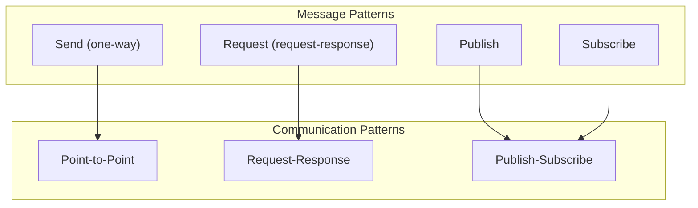

# Messaging API

MessagingService provides a unified messaging interface supporting multiple communication patterns.

---

## Overview



MessagingService supports three communication patterns:
- **Send/Receive**: One-way message sending
- **Request/Response**: Request-response pattern
- **Publish/Subscribe**: Publish-subscribe pattern

> **Important**: All messaging APIs must be used after calling `JoinRealm()`.

---

## Prerequisites

Must join Realm before using messaging APIs:

```go
// Must join Realm first
realmKey := types.GenerateRealmKey()
realm, err := node.JoinRealmWithKey(ctx, "my-realm", realmKey)
if err != nil {
    log.Fatal(err)
}

// Now messaging APIs can be used (get Messaging service from Realm)
messaging := realm.Messaging()
messaging.Send(ctx, targetID, protocol, data)
```

---

## Send API

### Send

Sends a one-way message.

```go
func (m *Messaging) Send(ctx context.Context, nodeID types.NodeID, protocol types.ProtocolID, data []byte) error
```

**Parameters**:
| Parameter | Type | Description |
|-----------|------|-------------|
| `ctx` | `context.Context` | Context |
| `nodeID` | `types.NodeID` | Target node ID |
| `protocol` | `types.ProtocolID` | Protocol ID |
| `data` | `[]byte` | Message data |

**Returns**:
| Type | Description |
|------|-------------|
| `error` | Error information |

**Notes**:
- Does not wait for response after sending
- Suitable for notifications, events, etc.
- Returns `ErrNotMember` if not joined Realm

**Example**:

```go
// Get Messaging service
realm, _ := node.JoinRealmWithKey(ctx, "my-realm", realmKey)
messaging := realm.Messaging()

// Send notification
err := messaging.Send(ctx, targetID, "/myapp/notify/1.0.0", []byte("User online"))
if err != nil {
    log.Printf("Send failed: %v", err)
}

// Send JSON data
data, _ := json.Marshal(notification)
err = messaging.Send(ctx, targetID, "/myapp/event/1.0.0", data)
```

---

## Request API

### Request

Sends a message using request-response pattern.

```go
func (m *Messaging) Request(ctx context.Context, nodeID types.NodeID, protocol types.ProtocolID, data []byte) ([]byte, error)
```

**Parameters**:
| Parameter | Type | Description |
|-----------|------|-------------|
| `ctx` | `context.Context` | Context |
| `nodeID` | `types.NodeID` | Target node ID |
| `protocol` | `types.ProtocolID` | Protocol ID |
| `data` | `[]byte` | Request data |

**Returns**:
| Type | Description |
|------|-------------|
| `[]byte` | Response data |
| `error` | Error information |

**Notes**:
- Sends request and waits for response
- Supports context timeout control
- Suitable for RPC call scenarios

**Example**:

```go
// Get Messaging service
realm, _ := node.JoinRealmWithKey(ctx, "my-realm", realmKey)
messaging := realm.Messaging()

// Simple request
resp, err := messaging.Request(ctx, targetID, "/myapp/rpc/1.0.0", []byte("ping"))
if err != nil {
    log.Printf("Request failed: %v", err)
    return
}
fmt.Printf("Response: %s\n", resp)

// Request with timeout
ctx, cancel := context.WithTimeout(context.Background(), 5*time.Second)
defer cancel()

resp, err = messaging.Request(ctx, targetID, "/myapp/query/1.0.0", queryData)
if err != nil {
    if ctx.Err() == context.DeadlineExceeded {
        log.Println("Request timed out")
    }
}
```

---

## Publish/Subscribe API

### Publish

Publishes a message to a topic.

```go
func (n *Node) Publish(ctx context.Context, topic string, data []byte) error
```

**Parameters**:
| Parameter | Type | Description |
|-----------|------|-------------|
| `ctx` | `context.Context` | Context |
| `topic` | `string` | Topic name |
| `data` | `[]byte` | Message data |

**Returns**:
| Type | Description |
|------|-------------|
| `error` | Error information |

**Notes**:
- Message is sent to all nodes subscribed to the topic
- Topic is valid within current Realm scope

**Example**:

```go
// Publish chat message
err := node.Publish(ctx, "chat-room", []byte("Hello everyone!"))

// Publish structured data
msg := ChatMessage{
    Sender:  node.ID().String(),
    Content: "Hello",
    Time:    time.Now(),
}
data, _ := json.Marshal(msg)
err := node.Publish(ctx, "chat-room", data)
```

---

### Subscribe

Subscribes to a topic.

```go
func (n *Node) Subscribe(ctx context.Context, topic string) (messagingif.Subscription, error)
```

**Parameters**:
| Parameter | Type | Description |
|-----------|------|-------------|
| `ctx` | `context.Context` | Context |
| `topic` | `string` | Topic name |

**Returns**:
| Type | Description |
|------|-------------|
| `Subscription` | Subscription instance |
| `error` | Error information |

**Example**:

```go
// Subscribe to topic
sub, err := node.Subscribe(ctx, "chat-room")
if err != nil {
    log.Fatal(err)
}
defer sub.Cancel()

// Receive messages
for msg := range sub.Messages() {
    fmt.Printf("Received from %s: %s\n", msg.From, msg.Data)
}

// Or use Next() method
for {
    msg, err := sub.Next(ctx)
    if err != nil {
        break
    }
    fmt.Printf("Message: %s\n", msg.Data)
}
```

---

## Subscription Interface

### Messages

Returns the message channel.

```go
func (s Subscription) Messages() <-chan *Message
```

**Returns**:
| Type | Description |
|------|-------------|
| `<-chan *Message` | Message channel |

---

### Next

Gets the next message.

```go
func (s Subscription) Next(ctx context.Context) (*Message, error)
```

**Parameters**:
| Parameter | Type | Description |
|-----------|------|-------------|
| `ctx` | `context.Context` | Context |

**Returns**:
| Type | Description |
|------|-------------|
| `*Message` | Message |
| `error` | Error information |

---

### Cancel

Cancels the subscription.

```go
func (s Subscription) Cancel() error
```

---

### Topic

Returns the subscribed topic.

```go
func (s Subscription) Topic() string
```

---

## Message Structure

```go
type Message struct {
    // From sender node ID
    From NodeID
    
    // Topic name
    Topic string
    
    // Data message data
    Data []byte
    
    // ReceivedAt receive time
    ReceivedAt time.Time
    
    // Signature (optional)
    Signature []byte
}
```

---

## Message Flow

```mermaid
sequenceDiagram
    participant A as Node A
    participant B as Node B
    participant T as Topic
    
    Note over A,B: Send/Receive Pattern
    A->>B: Send(nodeID, proto, data)
    
    Note over A,B: Request/Response Pattern
    A->>B: Request(nodeID, proto, data)
    B-->>A: Response
    
    Note over A,T,B: Publish/Subscribe Pattern
    B->>T: Subscribe("topic")
    A->>T: Publish("topic", data)
    T-->>B: Message
```

---

## Protocol Handlers

For Send and Request patterns, register protocol handlers on the receiving side:

### Register Handler

```go
// Register via Endpoint
node.Endpoint().SetProtocolHandler("/myapp/echo/1.0.0", func(stream endpoint.Stream) {
    defer stream.Close()
    
    // Read request
    buf := make([]byte, 4096)
    n, err := stream.Read(buf)
    if err != nil {
        return
    }
    
    // Send response
    stream.Write(buf[:n])
})
```

### Remove Handler

```go
node.Endpoint().RemoveProtocolHandler("/myapp/echo/1.0.0")
```

---

## Method List

### Node Messaging Methods

| Method | Pattern | Description |
|--------|---------|-------------|
| `Send()` | One-way | Send message |
| `Request()` | Request-Response | Send request and wait for response |
| `Publish()` | Publish | Publish message to topic |
| `Subscribe()` | Subscribe | Subscribe to topic |

### Subscription Methods

| Method | Description |
|--------|-------------|
| `Messages()` | Returns message channel |
| `Next()` | Gets next message |
| `Cancel()` | Cancels subscription |
| `Topic()` | Returns topic name |

---

## Error Handling

| Error | Description | Solution |
|-------|-------------|----------|
| `ErrNotMember` | Not joined Realm | Call `JoinRealm()` first |
| `ErrPeerNotFound` | Target node not found | Check if node is online |
| `ErrConnectionFailed` | Connection failed | Check network connection |
| `context deadline exceeded` | Operation timed out | Increase timeout |

**Example**:

```go
realm, _ := node.JoinRealmWithKey(ctx, "my-realm", realmKey)
messaging := realm.Messaging()

err := messaging.Send(ctx, targetID, protocol, data)
if err != nil {
    switch {
    case errors.Is(err, realm.ErrNotMember):
        log.Println("Please join Realm first")
    case errors.Is(err, messaging.ErrPeerNotFound):
        log.Println("Target node offline")
    default:
        log.Printf("Send failed: %v", err)
    }
}
```

---

## Best Practices

### Protocol ID Naming

```go
// Recommended format: /<app>/<feature>/<version>
const (
    ProtoChatMessage = "/myapp/chat/1.0.0"
    ProtoFileTransfer = "/myapp/file/1.0.0"
    ProtoRPC = "/myapp/rpc/1.0.0"
)
```

### Message Serialization

```go
realm, _ := node.JoinRealmWithKey(ctx, "my-realm", realmKey)
messaging := realm.Messaging()

// Using JSON
data, _ := json.Marshal(message)
messaging.Send(ctx, targetID, protocol, data)

// Using Protobuf (recommended for high-performance scenarios)
data, _ := proto.Marshal(message)
messaging.Send(ctx, targetID, protocol, data)
```

### Timeout Control

```go
realm, _ := node.JoinRealmWithKey(ctx, "my-realm", realmKey)
messaging := realm.Messaging()

// Always set timeout
ctx, cancel := context.WithTimeout(context.Background(), 10*time.Second)
defer cancel()

resp, err := messaging.Request(ctx, targetID, protocol, data)
```

### Subscription Management

```go
// Use defer to ensure unsubscribe
sub, _ := node.Subscribe(ctx, topic)
defer sub.Cancel()

// Use context to control subscription lifecycle
ctx, cancel := context.WithCancel(context.Background())
defer cancel()

go func() {
    for msg := range sub.Messages() {
        // Handle message
    }
}()
```

---

## Related Documentation

- [Node API](node.md)
- [Realm API](realm.md)
- [Protocol ID Specification](../protocol-ids.md)
- [Secure Chat Tutorial](../../tutorials/02-secure-chat.md)
