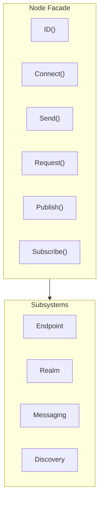

# Node API

Node is the primary user-facing entry point for DeP2P, providing a simple high-level API.

---

## Overview



Node is a Facade pattern implementation that encapsulates underlying complexity, providing:
- Simple connection APIs
- Unified messaging interface
- Convenient address management
- Subsystem access entry points

---

## Creating a Node

### New

Creates a new node instance.

```go
func New(ctx context.Context, opts ...Option) (*Node, error)
```

### Start

Starts the node.

```go
func (n *Node) Start(ctx context.Context) error
```

**Parameters**:
| Parameter | Type | Description |
|-----------|------|-------------|
| `ctx` | `context.Context` | Context |
| `opts` | `...Option` | Configuration options |

**Returns**:
| Type | Description |
|------|-------------|
| `*Node` | Node instance |
| `error` | Error information |

**Example**:

```go
// Create node with preset
node, err := dep2p.New(ctx,
    dep2p.WithPreset(dep2p.PresetDesktop),
)
if err != nil {
    log.Fatal(err)
}
if err := node.Start(ctx); err != nil {
    log.Fatal(err)
}
defer node.Close()

// Custom configuration
node, err := dep2p.New(ctx,
    dep2p.WithPreset(dep2p.PresetServer),
    dep2p.WithListenPort(4001),
    dep2p.WithBootstrapPeers(bootstrapAddrs...),
)
if err != nil {
    log.Fatal(err)
}
if err := node.Start(ctx); err != nil {
    log.Fatal(err)
}
```

---

## Identity APIs

### ID

Returns the node's unique identifier.

```go
func (n *Node) ID() types.NodeID
```

**Returns**:
| Type | Description |
|------|-------------|
| `types.NodeID` | Node ID (Base58 encoded public key derivative) |

**Example**:

```go
nodeID := node.ID()
fmt.Printf("Node ID: %s\n", nodeID)
fmt.Printf("Short ID: %s\n", nodeID.ShortString())
```

---

## Connection Management APIs

### Connect

Connects to a node by NodeID.

```go
func (n *Node) Connect(ctx context.Context, nodeID types.NodeID) (endpoint.Connection, error)
```

**Parameters**:
| Parameter | Type | Description |
|-----------|------|-------------|
| `ctx` | `context.Context` | Context (supports timeout and cancellation) |
| `nodeID` | `types.NodeID` | Target node ID |

**Returns**:
| Type | Description |
|------|-------------|
| `endpoint.Connection` | Connection instance |
| `error` | Error information |

**Notes**:
- Automatically finds addresses from AddressBook/Discovery and connects
- If a connection to the node already exists, returns the existing connection
- This is the recommended connection method

**Example**:

```go
conn, err := node.Connect(ctx, targetNodeID)
if err != nil {
    log.Printf("Connection failed: %v", err)
    return
}
fmt.Printf("Connected to: %s\n", conn.RemoteID())
```

---

### ConnectToAddr

Connects to a node using a full address.

```go
func (n *Node) ConnectToAddr(ctx context.Context, fullAddr string) (endpoint.Connection, error)
```

**Parameters**:
| Parameter | Type | Description |
|-----------|------|-------------|
| `ctx` | `context.Context` | Context |
| `fullAddr` | `string` | Full address (with /p2p/<NodeID>) |

**Returns**:
| Type | Description |
|------|-------------|
| `endpoint.Connection` | Connection instance |
| `error` | Error information |

**Notes**:
- Suitable for Bootstrap and user-shared address scenarios
- Address must be in Full Address format

**Example**:

```go
fullAddr := "/ip4/192.168.1.100/udp/4001/quic-v1/p2p/5Q2STWvBFn..."
conn, err := node.ConnectToAddr(ctx, fullAddr)
if err != nil {
    log.Printf("Connection failed: %v", err)
    return
}
```

---

### ConnectWithAddrs

Connects to a node using specified addresses.

```go
func (n *Node) ConnectWithAddrs(ctx context.Context, nodeID types.NodeID, addrs []string) (endpoint.Connection, error)
```

**Parameters**:
| Parameter | Type | Description |
|-----------|------|-------------|
| `ctx` | `context.Context` | Context |
| `nodeID` | `types.NodeID` | Target node ID |
| `addrs` | `[]string` | Address list (Dial Address format) |

**Returns**:
| Type | Description |
|------|-------------|
| `endpoint.Connection` | Connection instance |
| `error` | Error information |

**Notes**:
- Bypasses discovery service, uses provided addresses directly
- Addresses must be in Dial Address format (without /p2p/)

**Example**:

```go
addrs := []string{
    "/ip4/192.168.1.100/udp/4001/quic-v1",
    "/ip4/10.0.0.1/udp/4001/quic-v1",
}
conn, err := node.ConnectWithAddrs(ctx, targetID, addrs)
```

---

## Address Management APIs

### ListenAddrs

Returns local listen addresses.

```go
func (n *Node) ListenAddrs() []endpoint.Address
```

**Returns**:
| Type | Description |
|------|-------------|
| `[]endpoint.Address` | List of listen addresses |

**Example**:

```go
for _, addr := range node.ListenAddrs() {
    fmt.Printf("Listening on: %s\n", addr)
}
```

---

### AdvertisedAddrs

Returns advertised address list.

```go
func (n *Node) AdvertisedAddrs() []endpoint.Address
```

**Returns**:
| Type | Description |
|------|-------------|
| `[]endpoint.Address` | List of advertised addresses |

---

### ShareableAddrs

Returns shareable full address list.

```go
func (n *Node) ShareableAddrs() []string
```

**Returns**:
| Type | Description |
|------|-------------|
| `[]string` | Full address list (with /p2p/<NodeID>) |

**Notes**:
- Only returns verified public direct-connect addresses
- May return empty (if no public reachability)

**Example**:

```go
addrs := node.ShareableAddrs()
if len(addrs) > 0 {
    fmt.Println("Share this address:", addrs[0])
}
```

---

### WaitShareableAddrs

Waits for shareable addresses to become available.

```go
func (n *Node) WaitShareableAddrs(ctx context.Context) ([]string, error)
```

**Parameters**:
| Parameter | Type | Description |
|-----------|------|-------------|
| `ctx` | `context.Context` | Context (can set timeout) |

**Returns**:
| Type | Description |
|------|-------------|
| `[]string` | Full address list |
| `error` | Error information (timeout, etc.) |

**Example**:

```go
ctx, cancel := context.WithTimeout(context.Background(), 30*time.Second)
defer cancel()

addrs, err := node.WaitShareableAddrs(ctx)
if err != nil {
    log.Println("Timeout getting addresses")
}
```

---

### BootstrapCandidates

Returns all candidate addresses.

```go
func (n *Node) BootstrapCandidates() []reachabilityif.BootstrapCandidate
```

**Returns**:
| Type | Description |
|------|-------------|
| `[]BootstrapCandidate` | Candidate address list (with type info) |

---

## Subsystem Access APIs

### Endpoint

Returns the underlying Endpoint interface.

```go
func (n *Node) Endpoint() endpoint.Endpoint
```

**Returns**:
| Type | Description |
|------|-------------|
| `endpoint.Endpoint` | Endpoint interface |

---

### Realm

Returns the Realm manager.

```go
func (n *Node) Realm() realmif.RealmManager
```

**Returns**:
| Type | Description |
|------|-------------|
| `RealmManager` | Realm manager |

**Example**:

```go
// Join Realm
realm, _ := node.Realm("my-realm")
_ = realm.Join(ctx)

// Check current Realm
fmt.Printf("Current Realm: %s\n", node.Realm().CurrentRealm())
```

---

### Messaging

Returns the messaging subsystem.

```go
func (n *Node) Messaging() messagingif.MessagingService
```

---

### Discovery

Returns the discovery service.

```go
func (n *Node) Discovery() endpoint.DiscoveryService
```

---

### NAT

Returns the NAT service.

```go
func (n *Node) NAT() endpoint.NATService
```

---

### Relay

Returns the relay client.

```go
func (n *Node) Relay() endpoint.RelayClient
```

---

### AddressBook

Returns the address book.

```go
func (n *Node) AddressBook() endpoint.AddressBook
```

---

### ConnectionManager

Returns the connection manager.

```go
func (n *Node) ConnectionManager() connmgrif.ConnectionManager
```

---

### Liveness

Returns the liveness detection service.

```go
func (n *Node) Liveness() livenessif.LivenessService
```

---

## Messaging APIs

> **Note**: The following APIs must be called after `Realm().Join()`, otherwise they return `ErrNotMember`.

### Send

Sends a one-way message.

```go
func (n *Node) Send(ctx context.Context, nodeID types.NodeID, protocol types.ProtocolID, data []byte) error
```

**Parameters**:
| Parameter | Type | Description |
|-----------|------|-------------|
| `ctx` | `context.Context` | Context |
| `nodeID` | `types.NodeID` | Target node ID |
| `protocol` | `types.ProtocolID` | Protocol ID |
| `data` | `[]byte` | Message data |

**Returns**:
| Type | Description |
|------|-------------|
| `error` | Error information |

**Example**:

```go
err := node.Send(ctx, targetID, "/myapp/message/1.0.0", []byte("Hello"))
if err != nil {
    log.Printf("Send failed: %v", err)
}
```

---

### Request

Sends a message using request-response pattern.

```go
func (n *Node) Request(ctx context.Context, nodeID types.NodeID, protocol types.ProtocolID, data []byte) ([]byte, error)
```

**Parameters**:
| Parameter | Type | Description |
|-----------|------|-------------|
| `ctx` | `context.Context` | Context |
| `nodeID` | `types.NodeID` | Target node ID |
| `protocol` | `types.ProtocolID` | Protocol ID |
| `data` | `[]byte` | Request data |

**Returns**:
| Type | Description |
|------|-------------|
| `[]byte` | Response data |
| `error` | Error information |

**Example**:

```go
resp, err := node.Request(ctx, targetID, "/myapp/rpc/1.0.0", requestData)
if err != nil {
    log.Printf("Request failed: %v", err)
    return
}
fmt.Printf("Response: %s\n", resp)
```

---

### Publish

Publishes a message to a topic.

```go
func (n *Node) Publish(ctx context.Context, topic string, data []byte) error
```

**Parameters**:
| Parameter | Type | Description |
|-----------|------|-------------|
| `ctx` | `context.Context` | Context |
| `topic` | `string` | Topic name |
| `data` | `[]byte` | Message data |

**Returns**:
| Type | Description |
|------|-------------|
| `error` | Error information |

**Example**:

```go
err := node.Publish(ctx, "chat-room", []byte("Hello everyone!"))
```

---

### Subscribe

Subscribes to a topic.

```go
func (n *Node) Subscribe(ctx context.Context, topic string) (messagingif.Subscription, error)
```

**Parameters**:
| Parameter | Type | Description |
|-----------|------|-------------|
| `ctx` | `context.Context` | Context |
| `topic` | `string` | Topic name |

**Returns**:
| Type | Description |
|------|-------------|
| `Subscription` | Subscription instance |
| `error` | Error information |

**Example**:

```go
sub, err := node.Subscribe(ctx, "chat-room")
if err != nil {
    log.Fatal(err)
}
defer sub.Cancel()

for msg := range sub.Messages() {
    fmt.Printf("Received message: %s\n", msg.Data)
}
```

---

## Lifecycle APIs

### Close

Closes the node and releases resources.

```go
func (n *Node) Close() error
```

**Returns**:
| Type | Description |
|------|-------------|
| `error` | Error information |

**Notes**:
- Sends Goodbye messages to notify other nodes
- Waits for graceful shutdown before disconnecting all connections
- Releases all resources

**Example**:

```go
defer node.Close()
```

---

## Ready Status API

### ReadyLevel

Returns the current node readiness level.

```go
func (n *Node) ReadyLevel() ReadyLevel
```

**ReadyLevel Constants**:

| Level | Value | Description |
|-------|-------|-------------|
| `ReadyLevelCreated` | 0 | Node object created, not started |
| `ReadyLevelNetwork` | 1 | Transport layer ready, can initiate outbound connections |
| `ReadyLevelDiscovered` | 2 | DHT network join successful, can discover other nodes |
| `ReadyLevelReachable` | 3 | Reachability verification completed, can be discovered by other nodes |
| `ReadyLevelRealmReady` | 4 | Realm join completed, Realm members reachable |

**Example**:

```go
level := node.ReadyLevel()
if level >= interfaces.ReadyLevelDiscovered {
    // Can use DHT discovery features
    fmt.Println("DHT is ready")
}
```

---

### WaitReady

Waits for the node to reach the specified readiness level.

```go
func (n *Node) WaitReady(ctx context.Context, level ReadyLevel) error
```

**Parameters**:
| Parameter | Type | Description |
|-----------|------|-------------|
| `ctx` | `context.Context` | Context, can be used to set timeout or cancellation |
| `level` | `ReadyLevel` | Target readiness level |

**Returns**:
| Type | Description |
|------|-------------|
| `error` | Returns corresponding error if context is cancelled or timeout occurs |

**Notes**:
- Blocks until the node reaches the specified readiness level
- If current level is already >= target level, returns nil immediately

**Example**:

```go
// Wait for DHT network join to complete, wait up to 30 seconds
ctx, cancel := context.WithTimeout(context.Background(), 30*time.Second)
defer cancel()

if err := node.WaitReady(ctx, interfaces.ReadyLevelDiscovered); err != nil {
    log.Printf("Wait timeout: %v", err)
}
fmt.Println("DHT network join completed, can start discovering nodes")
```

---

### OnReadyLevelChange

Registers a readiness level change callback.

```go
func (n *Node) OnReadyLevelChange(callback func(level ReadyLevel))
```

**Parameters**:
| Parameter | Type | Description |
|-----------|------|-------------|
| `callback` | `func(level ReadyLevel)` | Callback function when level changes |

**Notes**:
- When readiness level changes, the registered callback function will be called
- Callback is called synchronously when level changes, avoid time-consuming operations in callback

**Example**:

```go
node.OnReadyLevelChange(func(level interfaces.ReadyLevel) {
    log.Printf("Readiness level changed: %v", level)
    if level == interfaces.ReadyLevelRealmReady {
        fmt.Println("Node fully ready, can start communication")
    }
})
```

---

## Bootstrap Capability

### EnableBootstrap

Enables Bootstrap capability, setting the node as a bootstrap node.

```go
func (n *Node) EnableBootstrap(ctx context.Context) error
```

**Notes**:
After enabling, the node will:
- Maintain extended node storage (up to 50,000 nodes)
- Periodically probe stored nodes for liveness
- Actively discover new nodes through Random Walk
- Respond to FIND_NODE requests, returning the nearest K nodes

**Prerequisites**:
- Node must have a publicly reachable address (not behind NAT)

**Example**:

```go
// Set node as bootstrap node
if err := node.EnableBootstrap(ctx); err != nil {
    log.Printf("Failed to enable Bootstrap: %v", err)
}
```

---

### DisableBootstrap

Disables Bootstrap capability.

```go
func (n *Node) DisableBootstrap(ctx context.Context) error
```

**Notes**:
- Stops serving as a bootstrap node
- Retains stored node information (can quickly restore when enabled next time)

---

### IsBootstrapEnabled

Queries whether Bootstrap capability is enabled.

```go
func (n *Node) IsBootstrapEnabled() bool
```

---

### BootstrapStats

Gets Bootstrap statistics.

```go
func (n *Node) BootstrapStats() BootstrapStats
```

**BootstrapStats Structure**:

```go
type BootstrapStats struct {
    Enabled       bool          // Whether enabled
    PeerCount     int           // Number of stored nodes
    LastProbeTime time.Time     // Last probe time
    ProbeInterval time.Duration // Probe interval
}
```

---

## Relay Capability

### EnableRelay

Enables Relay capability, setting the node as a relay server.

```go
func (n *Node) EnableRelay(ctx context.Context) error
```

**Notes**:
- Provides relay service for nodes behind NAT
- All resource limit parameters use built-in default values

**Prerequisites**:
- Node must have a publicly reachable address (not behind NAT)

**Example**:

```go
// Set node as relay server
if err := node.EnableRelay(ctx); err != nil {
    log.Printf("Failed to enable Relay: %v", err)
}
```

---

### DisableRelay

Disables Relay capability.

```go
func (n *Node) DisableRelay(ctx context.Context) error
```

**Notes**:
- Stops serving as relay service
- Established relay circuits will be gracefully closed

---

### IsRelayEnabled

Queries whether Relay capability is enabled.

```go
func (n *Node) IsRelayEnabled() bool
```

---

### SetRelayAddr

Sets the Relay address to use (for client use).

```go
func (n *Node) SetRelayAddr(addr types.Multiaddr) error
```

**Parameters**:
| Parameter | Type | Description |
|-----------|------|-------------|
| `addr` | `types.Multiaddr` | Full multiaddr address of the Relay |

**Example**:

```go
relayAddr := "/ip4/relay.example.com/udp/4001/quic-v1/p2p/12D3KooW..."
node.SetRelayAddr(types.MustParseMultiaddr(relayAddr))
```

---

### RemoveRelayAddr

Removes Relay address configuration.

```go
func (n *Node) RemoveRelayAddr() error
```

---

### RelayAddr

Gets the currently configured Relay address.

```go
func (n *Node) RelayAddr() (types.Multiaddr, bool)
```

**Returns**:
| Type | Description |
|------|-------------|
| `types.Multiaddr` | Relay address |
| `bool` | Whether configured (false means not configured) |

---

### RelayStats

Gets Relay statistics.

```go
func (n *Node) RelayStats() RelayStats
```

**RelayStats Structure**:

```go
type RelayStats struct {
    Enabled         bool          // Whether enabled
    ActiveCircuits  int           // Number of active circuits
    TotalCircuits   int           // Total number of circuits
    BytesRelayed    int64         // Bytes relayed
    LastActivityAt  time.Time     // Last activity time
}
```

---

## Network Change Notification

### NetworkChange

Notifies the node that the network may have changed.

```go
func (n *Node) NetworkChange()
```

**Notes**:
- On some platforms (such as Android), the system cannot automatically detect network changes
- Applications need to call this method when receiving system network change callbacks
- Calling this method has no side effects even if the network hasn't actually changed

**Use Cases**:
- WiFi switching
- Mobile network switching (4G → 5G)
- VPN connection/disconnection

**Example**:

```go
// Listen to system network change events on Android and other platforms
func onSystemNetworkChange() {
    node.NetworkChange()
}
```

---

### OnNetworkChange

Registers a network change callback.

```go
func (n *Node) OnNetworkChange(callback func(event NetworkChangeEvent))
```

**Parameters**:
| Parameter | Type | Description |
|-----------|------|-------------|
| `callback` | `func(event NetworkChangeEvent)` | Network change callback function |

**NetworkChangeEvent Structure**:

```go
type NetworkChangeEvent struct {
    Type      NetworkChangeType // Change type
    Timestamp time.Time         // Change time
    Details   string            // Detailed information
}
```

**Example**:

```go
node.OnNetworkChange(func(event interfaces.NetworkChangeEvent) {
    log.Printf("Network change: %v", event.Type)
    // Can perform corresponding handling here, such as re-fetching configuration
})
```

---

## Method List

| Method | Category | Description |
|--------|----------|-------------|
| `ID()` | Identity | Returns node ID |
| `Connect()` | Connection | Connect by NodeID |
| `ConnectToAddr()` | Connection | Connect by full address |
| `ConnectWithAddrs()` | Connection | Connect with specified addresses |
| `ListenAddrs()` | Address | Returns listen addresses |
| `AdvertisedAddrs()` | Address | Returns advertised addresses |
| `ShareableAddrs()` | Address | Returns shareable addresses |
| `WaitShareableAddrs()` | Address | Waits for shareable addresses |
| `BootstrapCandidates()` | Address | Returns candidate addresses |
| `Endpoint()` | Subsystem | Returns Endpoint |
| `Realm()` | Subsystem | Returns Realm manager |
| `Messaging()` | Subsystem | Returns messaging service |
| `Discovery()` | Subsystem | Returns discovery service |
| `NAT()` | Subsystem | Returns NAT service |
| `Relay()` | Subsystem | Returns relay client |
| `AddressBook()` | Subsystem | Returns address book |
| `ConnectionManager()` | Subsystem | Returns connection manager |
| `Liveness()` | Subsystem | Returns liveness service |
| `Send()` | Messaging | One-way send |
| `Request()` | Messaging | Request-response |
| `Publish()` | Messaging | Publish message |
| `Subscribe()` | Messaging | Subscribe to topic |
| `ReadyLevel()` | Ready Status | Returns current readiness level |
| `WaitReady()` | Ready Status | Waits for specified readiness level |
| `OnReadyLevelChange()` | Ready Status | Registers readiness level change callback |
| `EnableBootstrap()` | Bootstrap | Enables Bootstrap capability |
| `DisableBootstrap()` | Bootstrap | Disables Bootstrap capability |
| `IsBootstrapEnabled()` | Bootstrap | Queries Bootstrap status |
| `BootstrapStats()` | Bootstrap | Gets Bootstrap statistics |
| `EnableRelay()` | Relay | Enables Relay capability |
| `DisableRelay()` | Relay | Disables Relay capability |
| `IsRelayEnabled()` | Relay | Queries Relay status |
| `SetRelayAddr()` | Relay | Sets Relay address |
| `RemoveRelayAddr()` | Relay | Removes Relay address |
| `RelayAddr()` | Relay | Gets Relay address |
| `RelayStats()` | Relay | Gets Relay statistics |
| `NetworkChange()` | Network Change | Notifies network change |
| `OnNetworkChange()` | Network Change | Registers network change callback |
| `Close()` | Lifecycle | Close node |

---

## Error Handling

| Error | Description | Solution |
|-------|-------------|----------|
| `ErrNotMember` | Called messaging API without joining Realm | Call `Realm().Join()` first |
| `ErrIdentityMismatch` | Identity verification failed during connection | Check NodeID in address |
| `context deadline exceeded` | Operation timed out | Increase timeout or check network |

---

## Related Documentation

- [Endpoint API](endpoint.md)
- [Realm API](realm.md)
- [Messaging API](messaging.md)
- [Configuration Reference](../configuration.md)
