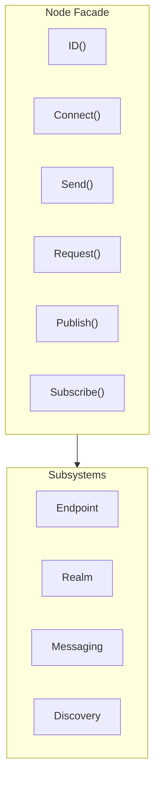

# Node API

Node is the primary user-facing entry point for DeP2P, providing a simple high-level API.

---

## Overview



Node is a Facade pattern implementation that encapsulates underlying complexity, providing:
- Simple connection APIs
- Unified messaging interface
- Convenient address management
- Subsystem access entry points

---

## Creating a Node

### StartNode

Creates and starts a new node.

```go
func StartNode(ctx context.Context, opts ...Option) (*Node, error)
```

**Parameters**:
| Parameter | Type | Description |
|-----------|------|-------------|
| `ctx` | `context.Context` | Context |
| `opts` | `...Option` | Configuration options |

**Returns**:
| Type | Description |
|------|-------------|
| `*Node` | Node instance |
| `error` | Error information |

**Example**:

```go
// Create node with preset
node, err := dep2p.StartNode(ctx,
    dep2p.WithPreset(dep2p.PresetDesktop),
)
if err != nil {
    log.Fatal(err)
}
defer node.Close()

// Custom configuration
node, err := dep2p.StartNode(ctx,
    dep2p.WithPreset(dep2p.PresetServer),
    dep2p.WithListenPort(4001),
    dep2p.WithBootstrapPeers(bootstrapAddrs...),
)
```

---

## Identity APIs

### ID

Returns the node's unique identifier.

```go
func (n *Node) ID() types.NodeID
```

**Returns**:
| Type | Description |
|------|-------------|
| `types.NodeID` | Node ID (Base58 encoded public key derivative) |

**Example**:

```go
nodeID := node.ID()
fmt.Printf("Node ID: %s\n", nodeID)
fmt.Printf("Short ID: %s\n", nodeID.ShortString())
```

---

## Connection Management APIs

### Connect

Connects to a node by NodeID.

```go
func (n *Node) Connect(ctx context.Context, nodeID types.NodeID) (endpoint.Connection, error)
```

**Parameters**:
| Parameter | Type | Description |
|-----------|------|-------------|
| `ctx` | `context.Context` | Context (supports timeout and cancellation) |
| `nodeID` | `types.NodeID` | Target node ID |

**Returns**:
| Type | Description |
|------|-------------|
| `endpoint.Connection` | Connection instance |
| `error` | Error information |

**Notes**:
- Automatically finds addresses from AddressBook/Discovery and connects
- If a connection to the node already exists, returns the existing connection
- This is the recommended connection method

**Example**:

```go
conn, err := node.Connect(ctx, targetNodeID)
if err != nil {
    log.Printf("Connection failed: %v", err)
    return
}
fmt.Printf("Connected to: %s\n", conn.RemoteID())
```

---

### ConnectToAddr

Connects to a node using a full address.

```go
func (n *Node) ConnectToAddr(ctx context.Context, fullAddr string) (endpoint.Connection, error)
```

**Parameters**:
| Parameter | Type | Description |
|-----------|------|-------------|
| `ctx` | `context.Context` | Context |
| `fullAddr` | `string` | Full address (with /p2p/<NodeID>) |

**Returns**:
| Type | Description |
|------|-------------|
| `endpoint.Connection` | Connection instance |
| `error` | Error information |

**Notes**:
- Suitable for Bootstrap and user-shared address scenarios
- Address must be in Full Address format

**Example**:

```go
fullAddr := "/ip4/192.168.1.100/udp/4001/quic-v1/p2p/5Q2STWvBFn..."
conn, err := node.ConnectToAddr(ctx, fullAddr)
if err != nil {
    log.Printf("Connection failed: %v", err)
    return
}
```

---

### ConnectWithAddrs

Connects to a node using specified addresses.

```go
func (n *Node) ConnectWithAddrs(ctx context.Context, nodeID types.NodeID, addrs []string) (endpoint.Connection, error)
```

**Parameters**:
| Parameter | Type | Description |
|-----------|------|-------------|
| `ctx` | `context.Context` | Context |
| `nodeID` | `types.NodeID` | Target node ID |
| `addrs` | `[]string` | Address list (Dial Address format) |

**Returns**:
| Type | Description |
|------|-------------|
| `endpoint.Connection` | Connection instance |
| `error` | Error information |

**Notes**:
- Bypasses discovery service, uses provided addresses directly
- Addresses must be in Dial Address format (without /p2p/)

**Example**:

```go
addrs := []string{
    "/ip4/192.168.1.100/udp/4001/quic-v1",
    "/ip4/10.0.0.1/udp/4001/quic-v1",
}
conn, err := node.ConnectWithAddrs(ctx, targetID, addrs)
```

---

## Address Management APIs

### ListenAddrs

Returns local listen addresses.

```go
func (n *Node) ListenAddrs() []endpoint.Address
```

**Returns**:
| Type | Description |
|------|-------------|
| `[]endpoint.Address` | List of listen addresses |

**Example**:

```go
for _, addr := range node.ListenAddrs() {
    fmt.Printf("Listening on: %s\n", addr)
}
```

---

### AdvertisedAddrs

Returns advertised address list.

```go
func (n *Node) AdvertisedAddrs() []endpoint.Address
```

**Returns**:
| Type | Description |
|------|-------------|
| `[]endpoint.Address` | List of advertised addresses |

---

### ShareableAddrs

Returns shareable full address list.

```go
func (n *Node) ShareableAddrs() []string
```

**Returns**:
| Type | Description |
|------|-------------|
| `[]string` | Full address list (with /p2p/<NodeID>) |

**Notes**:
- Only returns verified public direct-connect addresses
- May return empty (if no public reachability)

**Example**:

```go
addrs := node.ShareableAddrs()
if len(addrs) > 0 {
    fmt.Println("Share this address:", addrs[0])
}
```

---

### WaitShareableAddrs

Waits for shareable addresses to become available.

```go
func (n *Node) WaitShareableAddrs(ctx context.Context) ([]string, error)
```

**Parameters**:
| Parameter | Type | Description |
|-----------|------|-------------|
| `ctx` | `context.Context` | Context (can set timeout) |

**Returns**:
| Type | Description |
|------|-------------|
| `[]string` | Full address list |
| `error` | Error information (timeout, etc.) |

**Example**:

```go
ctx, cancel := context.WithTimeout(context.Background(), 30*time.Second)
defer cancel()

addrs, err := node.WaitShareableAddrs(ctx)
if err != nil {
    log.Println("Timeout getting addresses")
}
```

---

### BootstrapCandidates

Returns all candidate addresses.

```go
func (n *Node) BootstrapCandidates() []reachabilityif.BootstrapCandidate
```

**Returns**:
| Type | Description |
|------|-------------|
| `[]BootstrapCandidate` | Candidate address list (with type info) |

---

## Subsystem Access APIs

### Endpoint

Returns the underlying Endpoint interface.

```go
func (n *Node) Endpoint() endpoint.Endpoint
```

**Returns**:
| Type | Description |
|------|-------------|
| `endpoint.Endpoint` | Endpoint interface |

---

### Realm

Returns the Realm manager.

```go
func (n *Node) Realm() realmif.RealmManager
```

**Returns**:
| Type | Description |
|------|-------------|
| `RealmManager` | Realm manager |

**Example**:

```go
// Join Realm
node.Realm().JoinRealm(ctx, types.RealmID("my-realm"))

// Check current Realm
fmt.Printf("Current Realm: %s\n", node.Realm().CurrentRealm())
```

---

### Messaging

Returns the messaging subsystem.

```go
func (n *Node) Messaging() messagingif.MessagingService
```

---

### Discovery

Returns the discovery service.

```go
func (n *Node) Discovery() endpoint.DiscoveryService
```

---

### NAT

Returns the NAT service.

```go
func (n *Node) NAT() endpoint.NATService
```

---

### Relay

Returns the relay client.

```go
func (n *Node) Relay() endpoint.RelayClient
```

---

### AddressBook

Returns the address book.

```go
func (n *Node) AddressBook() endpoint.AddressBook
```

---

### ConnectionManager

Returns the connection manager.

```go
func (n *Node) ConnectionManager() connmgrif.ConnectionManager
```

---

### Liveness

Returns the liveness detection service.

```go
func (n *Node) Liveness() livenessif.LivenessService
```

---

## Messaging APIs

> **Note**: The following APIs must be called after `JoinRealm()`, otherwise they return `ErrNotMember`.

### Send

Sends a one-way message.

```go
func (n *Node) Send(ctx context.Context, nodeID types.NodeID, protocol types.ProtocolID, data []byte) error
```

**Parameters**:
| Parameter | Type | Description |
|-----------|------|-------------|
| `ctx` | `context.Context` | Context |
| `nodeID` | `types.NodeID` | Target node ID |
| `protocol` | `types.ProtocolID` | Protocol ID |
| `data` | `[]byte` | Message data |

**Returns**:
| Type | Description |
|------|-------------|
| `error` | Error information |

**Example**:

```go
err := node.Send(ctx, targetID, "/myapp/message/1.0.0", []byte("Hello"))
if err != nil {
    log.Printf("Send failed: %v", err)
}
```

---

### Request

Sends a message using request-response pattern.

```go
func (n *Node) Request(ctx context.Context, nodeID types.NodeID, protocol types.ProtocolID, data []byte) ([]byte, error)
```

**Parameters**:
| Parameter | Type | Description |
|-----------|------|-------------|
| `ctx` | `context.Context` | Context |
| `nodeID` | `types.NodeID` | Target node ID |
| `protocol` | `types.ProtocolID` | Protocol ID |
| `data` | `[]byte` | Request data |

**Returns**:
| Type | Description |
|------|-------------|
| `[]byte` | Response data |
| `error` | Error information |

**Example**:

```go
resp, err := node.Request(ctx, targetID, "/myapp/rpc/1.0.0", requestData)
if err != nil {
    log.Printf("Request failed: %v", err)
    return
}
fmt.Printf("Response: %s\n", resp)
```

---

### Publish

Publishes a message to a topic.

```go
func (n *Node) Publish(ctx context.Context, topic string, data []byte) error
```

**Parameters**:
| Parameter | Type | Description |
|-----------|------|-------------|
| `ctx` | `context.Context` | Context |
| `topic` | `string` | Topic name |
| `data` | `[]byte` | Message data |

**Returns**:
| Type | Description |
|------|-------------|
| `error` | Error information |

**Example**:

```go
err := node.Publish(ctx, "chat-room", []byte("Hello everyone!"))
```

---

### Subscribe

Subscribes to a topic.

```go
func (n *Node) Subscribe(ctx context.Context, topic string) (messagingif.Subscription, error)
```

**Parameters**:
| Parameter | Type | Description |
|-----------|------|-------------|
| `ctx` | `context.Context` | Context |
| `topic` | `string` | Topic name |

**Returns**:
| Type | Description |
|------|-------------|
| `Subscription` | Subscription instance |
| `error` | Error information |

**Example**:

```go
sub, err := node.Subscribe(ctx, "chat-room")
if err != nil {
    log.Fatal(err)
}
defer sub.Cancel()

for msg := range sub.Messages() {
    fmt.Printf("Received message: %s\n", msg.Data)
}
```

---

## Lifecycle APIs

### Close

Closes the node and releases resources.

```go
func (n *Node) Close() error
```

**Returns**:
| Type | Description |
|------|-------------|
| `error` | Error information |

**Notes**:
- Sends Goodbye messages to notify other nodes
- Waits for graceful shutdown before disconnecting all connections
- Releases all resources

**Example**:

```go
defer node.Close()
```

---

## Method List

| Method | Category | Description |
|--------|----------|-------------|
| `ID()` | Identity | Returns node ID |
| `Connect()` | Connection | Connect by NodeID |
| `ConnectToAddr()` | Connection | Connect by full address |
| `ConnectWithAddrs()` | Connection | Connect with specified addresses |
| `ListenAddrs()` | Address | Returns listen addresses |
| `AdvertisedAddrs()` | Address | Returns advertised addresses |
| `ShareableAddrs()` | Address | Returns shareable addresses |
| `WaitShareableAddrs()` | Address | Waits for shareable addresses |
| `BootstrapCandidates()` | Address | Returns candidate addresses |
| `Endpoint()` | Subsystem | Returns Endpoint |
| `Realm()` | Subsystem | Returns Realm manager |
| `Messaging()` | Subsystem | Returns messaging service |
| `Discovery()` | Subsystem | Returns discovery service |
| `NAT()` | Subsystem | Returns NAT service |
| `Relay()` | Subsystem | Returns relay client |
| `AddressBook()` | Subsystem | Returns address book |
| `ConnectionManager()` | Subsystem | Returns connection manager |
| `Liveness()` | Subsystem | Returns liveness service |
| `Send()` | Messaging | One-way send |
| `Request()` | Messaging | Request-response |
| `Publish()` | Messaging | Publish message |
| `Subscribe()` | Messaging | Subscribe to topic |
| `Close()` | Lifecycle | Close node |

---

## Error Handling

| Error | Description | Solution |
|-------|-------------|----------|
| `ErrNotMember` | Called messaging API without joining Realm | Call `JoinRealm()` first |
| `ErrIdentityMismatch` | Identity verification failed during connection | Check NodeID in address |
| `context deadline exceeded` | Operation timed out | Increase timeout or check network |

---

## Related Documentation

- [Endpoint API](endpoint.md)
- [Realm API](realm.md)
- [Messaging API](messaging.md)
- [Configuration Reference](../configuration.md)
