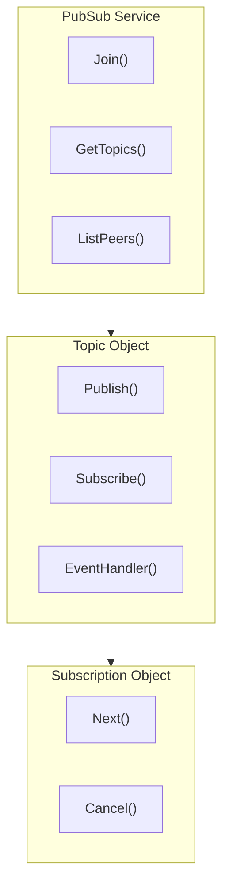

# PubSub API

PubSub service provides publish/subscribe functionality based on GossipSub.

---

## Overview



PubSub supports:
- **Topic Management**: Join/list topics
- **Message Publishing**: Publish messages to topics
- **Message Subscription**: Subscribe to topics to receive messages
- **Peer Events**: Monitor peer join/leave events in topics

> **How to Get**: Get PubSub service through `realm.PubSub()`.

---

## Getting PubSub Service

```go
realm, _ := node.Realm("my-realm")
_ = realm.Join(ctx)
pubsub := realm.PubSub()
```

---

## PubSub API

### Join

Join a topic.

```go
func (p *PubSub) Join(topic string, opts ...TopicOption) (Topic, error)
```

**Parameters**:
| Parameter | Type | Description |
|-----------|------|-------------|
| `topic` | `string` | Topic name |
| `opts` | `...TopicOption` | Topic options |

**Returns**:
| Type | Description |
|------|-------------|
| `Topic` | Topic object |
| `error` | Error information |

**Notes**:
- You must join a topic before you can publish and subscribe to messages
- Topic names are automatically prefixed with the Realm prefix

**Example**:

```go
pubsub := realm.PubSub()

// Join a topic
topic, err := pubsub.Join("chat-room")
if err != nil {
    log.Fatal(err)
}
defer topic.Close()
```

---

### GetTopics

Get all joined topics.

```go
func (p *PubSub) GetTopics() []string
```

**Returns**:
| Type | Description |
|------|-------------|
| `[]string` | List of topic names |

**Example**:

```go
topics := pubsub.GetTopics()
fmt.Printf("Joined %d topics:\n", len(topics))
for _, t := range topics {
    fmt.Printf("  - %s\n", t)
}
```

---

### ListPeers

List all peers in the specified topic.

```go
func (p *PubSub) ListPeers(topic string) []string
```

**Parameters**:
| Parameter | Type | Description |
|-----------|------|-------------|
| `topic` | `string` | Topic name |

**Returns**:
| Type | Description |
|------|-------------|
| `[]string` | List of peer IDs |

**Example**:

```go
peers := pubsub.ListPeers("chat-room")
fmt.Printf("Topic has %d peers\n", len(peers))
```

---

## Topic API

### Publish

Publish a message to a topic.

```go
func (t *Topic) Publish(ctx context.Context, data []byte, opts ...PublishOption) error
```

**Parameters**:
| Parameter | Type | Description |
|-----------|------|-------------|
| `ctx` | `context.Context` | Context |
| `data` | `[]byte` | Message data |
| `opts` | `...PublishOption` | Publish options |

**Returns**:
| Type | Description |
|------|-------------|
| `error` | Error information |

**Example**:

```go
topic, _ := pubsub.Join("chat-room")

// Publish a text message
err := topic.Publish(ctx, []byte("Hello everyone!"))
if err != nil {
    log.Printf("Publish failed: %v", err)
}

// Publish structured data
msg := ChatMessage{
    Sender:  node.ID(),
    Content: "Hello",
    Time:    time.Now(),
}
data, _ := json.Marshal(msg)
topic.Publish(ctx, data)
```

---

### Subscribe

Subscribe to a topic.

```go
func (t *Topic) Subscribe(opts ...SubscribeOption) (TopicSubscription, error)
```

**Parameters**:
| Parameter | Type | Description |
|-----------|------|-------------|
| `opts` | `...SubscribeOption` | Subscribe options |

**Returns**:
| Type | Description |
|------|-------------|
| `TopicSubscription` | Subscription object |
| `error` | Error information |

**Example**:

```go
topic, _ := pubsub.Join("chat-room")

// Create a subscription
sub, err := topic.Subscribe()
if err != nil {
    log.Fatal(err)
}
defer sub.Cancel()

// Receive messages
for {
    msg, err := sub.Next(ctx)
    if err != nil {
        break
    }
    fmt.Printf("Received message from %s: %s\n", msg.From[:16], msg.Data)
}
```

---

### EventHandler

Register a topic event handler.

```go
func (t *Topic) EventHandler(opts ...TopicEventHandlerOption) (TopicEventHandler, error)
```

**Returns**:
| Type | Description |
|------|-------------|
| `TopicEventHandler` | Event handler |
| `error` | Error information |

**Example**:

```go
topic, _ := pubsub.Join("chat-room")

// Create an event handler
handler, err := topic.EventHandler()
if err != nil {
    log.Fatal(err)
}
defer handler.Cancel()

// Monitor peer events
go func() {
    for {
        event, err := handler.NextPeerEvent(ctx)
        if err != nil {
            break
        }
        switch event.Type {
        case interfaces.PeerJoin:
            fmt.Printf("Peer %s joined topic\n", event.Peer[:16])
        case interfaces.PeerLeave:
            fmt.Printf("Peer %s left topic\n", event.Peer[:16])
        }
    }
}()
```

---

### ListPeers (Topic)

List all peers in this topic.

```go
func (t *Topic) ListPeers() []string
```

---

### String

Return the topic name.

```go
func (t *Topic) String() string
```

---

### Close

Close the topic.

```go
func (t *Topic) Close() error
```

---

## TopicSubscription API

### Next

Get the next message.

```go
func (s *TopicSubscription) Next(ctx context.Context) (*Message, error)
```

**Parameters**:
| Parameter | Type | Description |
|-----------|------|-------------|
| `ctx` | `context.Context` | Context |

**Returns**:
| Type | Description |
|------|-------------|
| `*Message` | Message object |
| `error` | Error information |

---

### Cancel

Cancel the subscription.

```go
func (s *TopicSubscription) Cancel()
```

---

## Message Structure

```go
type Message struct {
    From         string // Sender peer ID
    Data         []byte // Message data
    Topic        string // Topic the message belongs to
    Seqno        []byte // Sequence number
    ID           string // Unique message identifier
    ReceivedFrom string // Peer ID from which the message was received
    SentTimeNano int64  // Send timestamp (nanoseconds)
    RecvTimeNano int64  // Receive timestamp (nanoseconds)
}
```

---

## PeerEvent Structure

```go
type PeerEvent struct {
    Type PeerEventType // Event type
    Peer string        // Related peer ID
}
```

**PeerEventType Constants**:

| Type | Description |
|------|-------------|
| `PeerJoin` | Peer joined the topic |
| `PeerLeave` | Peer left the topic |

---

## Method List

### PubSub Methods

| Method | Description |
|--------|-------------|
| `Join()` | Join a topic |
| `GetTopics()` | Get all joined topics |
| `ListPeers()` | List all peers in the specified topic |
| `Close()` | Close the service |

### Topic Methods

| Method | Description |
|--------|-------------|
| `String()` | Return the topic name |
| `Publish()` | Publish a message |
| `Subscribe()` | Subscribe to the topic |
| `EventHandler()` | Register an event handler |
| `ListPeers()` | List peers in the topic |
| `Close()` | Close the topic |

### TopicSubscription Methods

| Method | Description |
|--------|-------------|
| `Next()` | Get the next message |
| `Cancel()` | Cancel the subscription |

---

## Usage Scenarios

### Chat Room

```go
pubsub := realm.PubSub()
topic, _ := pubsub.Join("chat-room")
sub, _ := topic.Subscribe()

// Receive messages
go func() {
    for {
        msg, err := sub.Next(ctx)
        if err != nil {
            return
        }
        displayMessage(msg)
    }
}()

// Send messages
topic.Publish(ctx, []byte("Hello!"))
```

### Event Broadcasting

```go
pubsub := realm.PubSub()
topic, _ := pubsub.Join("events")

// Broadcast an event
event := Event{
    Type:    "user_login",
    UserID:  "user123",
    Time:    time.Now(),
}
data, _ := json.Marshal(event)
topic.Publish(ctx, data)
```

---

## Related Documents

- [Realm API](realm.md)
- [Messaging API](messaging.md)
- [Protocol ID Specification](../protocol-ids.md)
