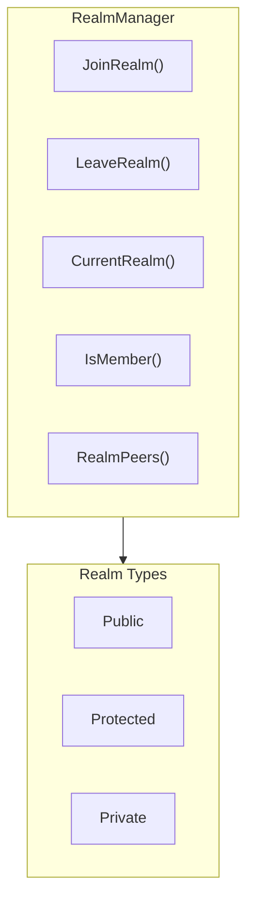
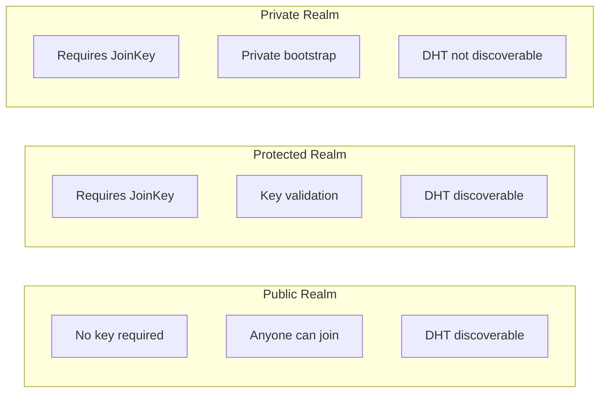
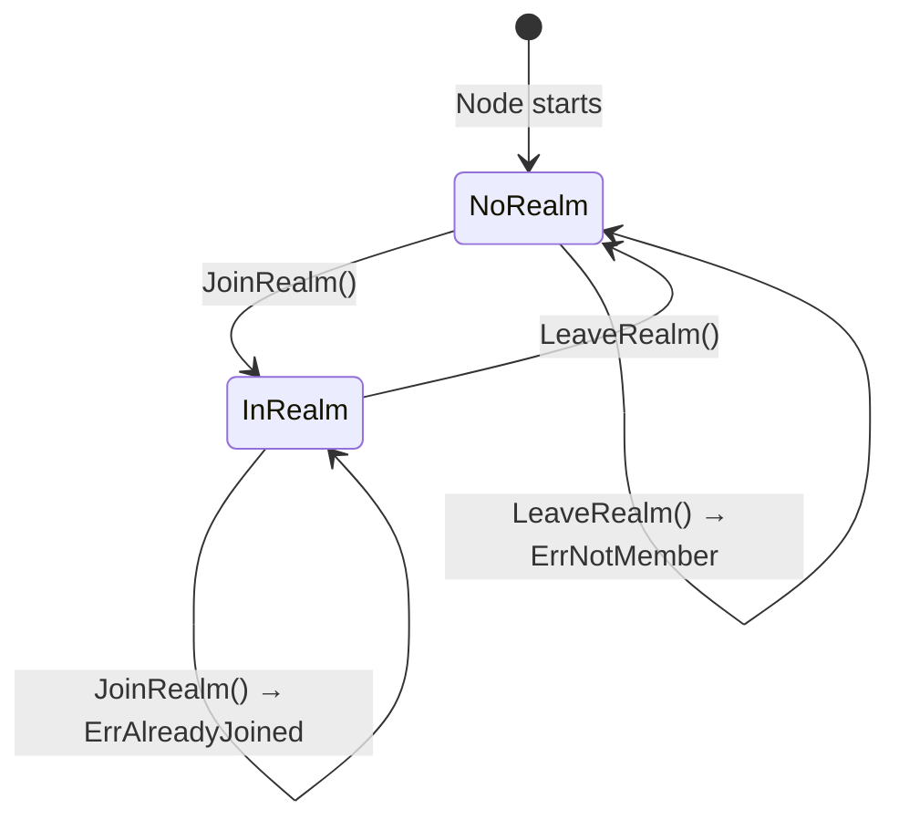

# Realm API

RealmManager provides Realm (business isolation domain) management functionality, implementing multi-tenant isolation.

---

## Overview



Realm is the core mechanism for DeP2P business isolation:
- Shares underlying infrastructure (DHT, relay, NAT traversal)
- Business layer is completely isolated (different Realms are invisible to each other)
- Strict single-Realm model (a node can only join one business Realm at a time)

---

## Getting RealmManager

Obtain through Node's `Realm()` method:

```go
realmMgr := node.Realm()
```

---

## Realm Membership Management APIs

### JoinRealm

Joins a specified Realm.

```go
func (m RealmManager) JoinRealm(ctx context.Context, realmID types.RealmID, opts ...JoinOption) error
```

**Parameters**:
| Parameter | Type | Description |
|-----------|------|-------------|
| `ctx` | `context.Context` | Context |
| `realmID` | `types.RealmID` | Realm ID |
| `opts` | `...JoinOption` | Join options |

**Returns**:
| Type | Description |
|------|-------------|
| `error` | Error information |

**Notes**:
- For Protected/Private Realms, JoinKey is required
- If already joined another Realm, returns `ErrAlreadyJoined`
- Must call `LeaveRealm()` first to leave current Realm

**Example**:

```go
// Join Public Realm
realm, err := node.Realm("my-public-realm")
if err != nil {
    log.Printf("Failed to get Realm: %v", err)
    return
}
if err := realm.Join(ctx); err != nil {
    if errors.Is(err, realm.ErrAlreadyJoined) {
        log.Println("Already joined another Realm, please leave first")
    }
    return
}

// Join Protected Realm
realm, err = node.Realm("protected-realm")
if err == nil {
    err = realm.Join(ctx, realm.WithJoinKey([]byte("secret-key")))
}

// Join Private Realm (with private bootstrap nodes)
realm, err = node.Realm("private-realm")
if err == nil {
    err = realm.Join(ctx,
        realm.WithPrivateBootstrapPeers(bootstrapAddrs),
        realm.WithSkipDHTRegistration(),
    )
}
```

---

### LeaveRealm

Leaves the current Realm.

```go
func (m RealmManager) LeaveRealm() error
```

**Returns**:
| Type | Description |
|------|-------------|
| `error` | Error information |

**Notes**:
- Sends Goodbye messages to Realm neighbors
- If not joined any Realm, returns `ErrNotMember`

**Example**:

```go
if err := node.Realm().LeaveRealm(); err != nil {
    if errors.Is(err, realm.ErrNotMember) {
        log.Println("Not joined any Realm")
    }
}
```

---

### CurrentRealm

Returns the current Realm.

```go
func (m RealmManager) CurrentRealm() types.RealmID
```

**Returns**:
| Type | Description |
|------|-------------|
| `types.RealmID` | Current Realm ID, empty means not joined |

**Example**:

```go
currentRealm := node.Realm().CurrentRealm()
if currentRealm == "" {
    fmt.Println("Not joined any Realm")
} else {
    fmt.Printf("Current Realm: %s\n", currentRealm)
}
```

---

### IsMember

Checks if joined a Realm.

```go
func (m RealmManager) IsMember() bool
```

**Returns**:
| Type | Description |
|------|-------------|
| `bool` | Whether joined a Realm |

**Example**:

```go
if node.Realm().IsMember() {
    fmt.Println("Joined a Realm")
}
```

---

### IsMemberOf

Checks if a member of specified Realm.

```go
func (m RealmManager) IsMemberOf(realmID types.RealmID) bool
```

**Parameters**:
| Parameter | Type | Description |
|-----------|------|-------------|
| `realmID` | `types.RealmID` | Realm ID |

**Returns**:
| Type | Description |
|------|-------------|
| `bool` | Whether a member of that Realm |

---

## Member Event Listener APIs

### OnMemberJoin

Registers a callback for member join events.

```go
func (r *Realm) OnMemberJoin(handler func(peerID string)) error
```

**Parameters**:
| Parameter | Type | Description |
|-----------|------|-------------|
| `handler` | `func(peerID string)` | Callback function when a member joins |

**Returns**:
| Type | Description |
|------|-------------|
| `error` | Error information |

**Notes**:
- Callback is executed in a background goroutine, won't block event processing
- Callback function should return quickly to avoid blocking
- For time-consuming operations, start a new goroutine within the callback

**Example**:

```go
realm.OnMemberJoin(func(peerID string) {
    fmt.Printf("New member joined: %s\n", peerID[:16])
    // Can send welcome messages here, etc.
})
```

---

### OnMemberLeave

Registers a callback for member leave events.

```go
func (r *Realm) OnMemberLeave(handler func(peerID string)) error
```

**Parameters**:
| Parameter | Type | Description |
|-----------|------|-------------|
| `handler` | `func(peerID string)` | Callback function when a member leaves |

**Returns**:
| Type | Description |
|------|-------------|
| `error` | Error information |

**Example**:

```go
realm.OnMemberLeave(func(peerID string) {
    fmt.Printf("Member left: %s\n", peerID[:16])
    // Can clean up related resources here, etc.
})
```

---

### EventBus

Returns the event bus for subscribing to member events.

```go
func (r *Realm) EventBus() EventBus
```

**Returns**:
| Type | Description |
|------|-------------|
| `EventBus` | Event bus interface |

**Supported Event Types**:
| Event Type | Description |
|------------|-------------|
| `types.EvtRealmMemberJoined` | Member joined event |
| `types.EvtRealmMemberLeft` | Member left event |

**Example**:

```go
// Using convenience methods (recommended)
realm.OnMemberJoin(func(peerID string) {
    fmt.Println("Member joined:", peerID)
})

// Or use EventBus directly (advanced usage)
sub, _ := realm.EventBus().Subscribe(new(types.EvtRealmMemberJoined))
go func() {
    for evt := range sub.Out() {
        if e, ok := evt.(*types.EvtRealmMemberJoined); ok {
            fmt.Println("Member joined:", e.MemberID)
        }
    }
}()
```

---

## Connection Management APIs

### Connect

Connects to a Realm member or potential member.

```go
func (r *Realm) Connect(ctx context.Context, target string) (Connection, error)
```

**Parameters**:
| Parameter | Type | Description |
|-----------|------|-------------|
| `ctx` | `context.Context` | Context |
| `target` | `string` | Target (supports multiple formats) |

**Supported target formats**:
- **ConnectionTicket**: `dep2p://base64...` (easy to share)
- **Full Address**: `/ip4/x.x.x.x/udp/port/quic-v1/p2p/12D3KooW...`
- **Pure NodeID**: `12D3KooW...` (auto-discover address via DHT)

**Connection priority**: Direct → Hole punching → Relay fallback

**Example**:

```go
// Connect using ticket (recommended, easy to share)
conn, err := realm.Connect(ctx, "dep2p://eyJ...")

// Connect using full address
conn, err := realm.Connect(ctx, "/ip4/1.2.3.4/udp/4001/quic-v1/p2p/12D3KooW...")

// Connect using pure NodeID (requires DHT discovery)
conn, err := realm.Connect(ctx, "12D3KooWA...")
```

---

### ConnectWithHint

Connects to a Realm member using address hints.

```go
func (r *Realm) ConnectWithHint(ctx context.Context, target string, hints []string) (Connection, error)
```

**Parameters**:
| Parameter | Type | Description |
|-----------|------|-------------|
| `ctx` | `context.Context` | Context |
| `target` | `string` | Target NodeID |
| `hints` | `[]string` | Address hint list |

**Example**:

```go
hints := []string{"/ip4/192.168.1.100/udp/4001/quic-v1"}
conn, err := realm.ConnectWithHint(ctx, "12D3KooWA...", hints)
```

---

## Health Status API

### Health

Returns Realm health status.

```go
func (r *Realm) Health() *RealmHealth
```

**Returns**:
| Type | Description |
|------|-------------|
| `*RealmHealth` | Realm health status |

**RealmHealth Structure**:

```go
type RealmHealth struct {
    Status         string  // Status: healthy, minimal, isolated
    MemberCount    int     // Member count
    ActivePeers    int     // Active connections (not implemented yet)
    MessagesPerSec float64 // Message throughput (not implemented yet)
}
```

**Status Description**:
| Status | Condition | Description |
|--------|-----------|-------------|
| `isolated` | MemberCount == 0 | No other members |
| `minimal` | MemberCount == 1 | Only self |
| `healthy` | MemberCount > 1 | Normal state |

**Example**:

```go
health := realm.Health()
fmt.Printf("Status: %s, Members: %d\n", health.Status, health.MemberCount)

if health.Status == "isolated" {
    fmt.Println("Warning: No other members to communicate with")
}
```

---

## Realm Peer Management APIs

### RealmPeers

Returns the list of nodes in the Realm.

```go
func (m RealmManager) RealmPeers(realmID types.RealmID) []types.NodeID
```

**Parameters**:
| Parameter | Type | Description |
|-----------|------|-------------|
| `realmID` | `types.RealmID` | Realm ID |

**Returns**:
| Type | Description |
|------|-------------|
| `[]types.NodeID` | List of node IDs |

**Example**:

```go
peers := node.Realm().RealmPeers(types.RealmID("my-realm"))
fmt.Printf("Realm has %d nodes\n", len(peers))
for _, peer := range peers {
    fmt.Printf("  - %s\n", peer.ShortString())
}
```

---

### RealmPeerCount

Returns the number of nodes in the Realm.

```go
func (m RealmManager) RealmPeerCount(realmID types.RealmID) int
```

**Parameters**:
| Parameter | Type | Description |
|-----------|------|-------------|
| `realmID` | `types.RealmID` | Realm ID |

**Returns**:
| Type | Description |
|------|-------------|
| `int` | Node count |

---

## Realm Metadata API

### RealmMetadata

Returns Realm metadata.

```go
func (m RealmManager) RealmMetadata() (*types.RealmMetadata, error)
```

**Returns**:
| Type | Description |
|------|-------------|
| `*RealmMetadata` | Realm metadata |
| `error` | Error information |

---

## JoinOption Options

### WithJoinKey

Provides join key (for Protected/Private Realms).

```go
func WithJoinKey(key []byte) JoinOption
```

**Example**:

```go
realm, _ := node.Realm(realmID)
_ = realm.Join(ctx, realm.WithJoinKey([]byte("secret")))
```

---

### WithTimeout

Sets join timeout.

```go
func WithTimeout(d time.Duration) JoinOption
```

**Example**:

```go
realm, _ := node.Realm(realmID)
_ = realm.Join(ctx, realm.WithTimeout(30*time.Second))
```

---

### WithPrivateBootstrapPeers

Specifies private bootstrap nodes (for Private Realms).

```go
func WithPrivateBootstrapPeers(peers []string) JoinOption
```

**Example**:

```go
bootstrapAddrs := []string{
    "/ip4/192.168.1.100/udp/4001/quic-v1/p2p/12D3KooW...",
}
realm, _ := node.Realm(realmID)
_ = realm.Join(ctx,
    realm.WithPrivateBootstrapPeers(bootstrapAddrs),
)
```

---

### WithSkipDHTRegistration

Skips DHT registration (for Private Realms).

```go
func WithSkipDHTRegistration() JoinOption
```

**Example**:

```go
realm, _ := node.Realm(realmID)
_ = realm.Join(ctx,
    realm.WithPrivateBootstrapPeers(addrs),
    realm.WithSkipDHTRegistration(),
)
```

---

## Realm Types



### Public Realm

- No key required
- Anyone can join
- Registered in public DHT

**Use Cases**: Public chat rooms, public services

```go
realm, _ := node.Realm("public-chat")
_ = realm.Join(ctx)
```

---

### Protected Realm

- Requires JoinKey
- Join after key validation
- Registered in public DHT

**Use Cases**: Paid services, member areas

```go
realm, _ := node.Realm("premium-service")
_ = realm.Join(ctx,
    realm.WithJoinKey(membershipKey),
)
```

---

### Private Realm

- Requires JoinKey
- Uses private bootstrap nodes
- Not registered in public DHT

**Use Cases**: Corporate intranets, private communications

```go
realm, _ := node.Realm("company-internal")
_ = realm.Join(ctx,
    realm.WithJoinKey(employeeKey),
    realm.WithPrivateBootstrapPeers(internalBootstraps),
    realm.WithSkipDHTRegistration(),
)
```

---

## Realm State Transitions



---

## Error Handling

| Error | Description | Solution |
|-------|-------------|----------|
| `ErrNotMember` | Not joined any Realm | Call `JoinRealm()` first |
| `ErrAlreadyJoined` | Already joined another Realm | Call `LeaveRealm()` first |
| `ErrInvalidJoinKey` | Invalid JoinKey | Check if key is correct |
| `ErrRealmNotFound` | Realm not found | Check if RealmID is correct |

**Example**:

```go
realm, err := node.Realm(realmID)
if err != nil {
    log.Printf("Failed to get Realm: %v", err)
    return
}
if err := realm.Join(ctx); err != nil {
    switch {
    case errors.Is(err, realm.ErrAlreadyJoined):
        // Leave current Realm first
        node.Realm().LeaveRealm()
        realm, _ = node.Realm(realmID)
        _ = realm.Join(ctx)
    case errors.Is(err, realm.ErrInvalidJoinKey):
        log.Println("Invalid key")
    default:
        log.Printf("Join failed: %v", err)
    }
}
```

---

## Method List

| Method | Category | Description |
|--------|----------|-------------|
| `Realm()` | Membership | Get or create Realm |
| `Join()` | Membership | Join Realm |
| `LeaveRealm()` | Membership | Leave Realm |
| `CurrentRealm()` | Membership | Returns current Realm |
| `IsMember()` | Membership | Checks if joined |
| `Members()` | Member Info | Returns member list |
| `MemberCount()` | Member Info | Returns member count |
| `OnMemberJoin()` | Events | Register member join callback |
| `OnMemberLeave()` | Events | Register member leave callback |
| `EventBus()` | Events | Returns event bus |
| `Connect()` | Connection | Connect to Realm member |
| `ConnectWithHint()` | Connection | Connect with address hints |
| `Health()` | Health | Returns health status |
| `Messaging()` | Services | Returns messaging service |
| `PubSub()` | Services | Returns pub/sub service |
| `Streams()` | Services | Returns streams service |
| `Liveness()` | Services | Returns liveness service |
| `RealmMetadata()` | Metadata | Returns metadata |

---

## RealmMetadata Structure

```go
type RealmMetadata struct {
    ID          RealmID     // Realm ID
    Name        string      // Human-readable name
    Creator     NodeID      // Creator
    AccessLevel AccessLevel // Access level
    CreatedAt   time.Time   // Creation time
    Description string      // Description
    Signature   []byte      // Creator signature
}

type AccessLevel int

const (
    Public    AccessLevel = 0  // Public
    Protected AccessLevel = 1  // Protected
    Private   AccessLevel = 2  // Private
)
```

---

## Configuration Parameters

| Parameter | Type | Default | Description |
|-----------|------|---------|-------------|
| `Enable` | bool | `true` | Enable Realm management |
| `AutoJoin` | bool | `false` | Don't auto-join any business Realm |
| `RealmAuthEnabled` | bool | `true` | Enable RealmAuth protocol |
| `RealmAuthTimeout` | Duration | `10s` | RealmAuth timeout |
| `JoinProofTTL` | Duration | `24h` | JoinProof validity period |
| `MemberCacheSize` | int | `10000` | Member cache size |
| `MemberCacheTTL` | Duration | `5m` | Member cache TTL |

---

## Related Documentation

- [Node API](node.md)
- [Messaging API](messaging.md)
- [Join Realm Tutorial](../../getting-started/first-realm.md)
