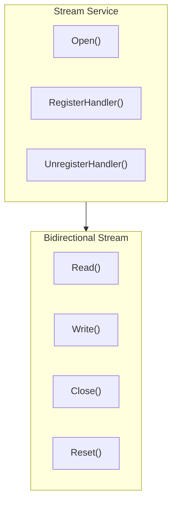

# Streams API

The Streams service provides raw bidirectional stream communication capabilities.

---

## Overview



Streams supports:
- **Opening streams**: Open bidirectional streams to specified nodes
- **Stream handlers**: Register protocol handlers to receive inbound streams
- **Raw I/O**: Direct read/write of byte streams

> **How to get**: Obtain the Streams service via `realm.Streams()`.

---

## Getting Streams Service

```go
realm, _ := node.Realm("my-realm")
_ = realm.Join(ctx)
streams := realm.Streams()
```

---

## Streams API

### Open

Open a stream to the specified node.

```go
func (s *Streams) Open(ctx context.Context, peerID string, protocol string) (BiStream, error)
```

**Parameters**:
| Parameter | Type | Description |
|-----------|------|-------------|
| `ctx` | `context.Context` | Context |
| `peerID` | `string` | Target node ID |
| `protocol` | `string` | Protocol ID |

**Returns**:
| Type | Description |
|------|-------------|
| `BiStream` | Bidirectional stream object |
| `error` | Error information |

**Notes**:
- Streams are bidirectional and can be read from and written to simultaneously
- Protocol ID is automatically prefixed with Realm prefix

**Example**:

```go
streams := realm.Streams()

// Open stream
stream, err := streams.Open(ctx, targetPeerID, "/myapp/file-transfer/1.0.0")
if err != nil {
    log.Fatal(err)
}
defer stream.Close()

// Send data
stream.Write([]byte("Hello"))

// Receive response
buf := make([]byte, 1024)
n, _ := stream.Read(buf)
fmt.Printf("Received: %s\n", buf[:n])
```

---

### RegisterHandler

Register a stream handler.

```go
func (s *Streams) RegisterHandler(protocol string, handler BiStreamHandler) error
```

**Parameters**:
| Parameter | Type | Description |
|-----------|------|-------------|
| `protocol` | `string` | Protocol ID |
| `handler` | `BiStreamHandler` | Stream handler function |

**BiStreamHandler type**:

```go
type BiStreamHandler func(stream BiStream)
```

**Notes**:
- This handler is called when an inbound stream with the corresponding protocol is received
- The handler executes in a new goroutine
- The handler is responsible for closing the stream

**Example**:

```go
streams := realm.Streams()

// Register Echo handler
err := streams.RegisterHandler("/myapp/echo/1.0.0", func(stream interfaces.BiStream) {
    defer stream.Close()
    
    // Read data
    buf := make([]byte, 4096)
    n, err := stream.Read(buf)
    if err != nil {
        return
    }
    
    // Echo back
    stream.Write(buf[:n])
})
if err != nil {
    log.Fatal(err)
}
```

---

### UnregisterHandler

Unregister a stream handler.

```go
func (s *Streams) UnregisterHandler(protocol string) error
```

**Parameters**:
| Parameter | Type | Description |
|-----------|------|-------------|
| `protocol` | `string` | Protocol ID |

---

## BiStream API

BiStream implements the `io.Reader`, `io.Writer`, and `io.Closer` interfaces.

### Read

Read data from the stream.

```go
func (s BiStream) Read(p []byte) (n int, err error)
```

---

### Write

Write data to the stream.

```go
func (s BiStream) Write(p []byte) (n int, err error)
```

---

### Close

Close the stream (graceful close).

```go
func (s BiStream) Close() error
```

**Notes**:
- Graceful close, sends FIN signal
- The peer will receive EOF

---

### Reset

Reset the stream (abnormal close).

```go
func (s BiStream) Reset() error
```

**Notes**:
- Abnormal close, sends RST signal
- The peer will receive an error

---

### CloseRead

Close the read end.

```go
func (s BiStream) CloseRead() error
```

**Notes**:
- Half-close, only closes the read end
- Can still write data

---

### CloseWrite

Close the write end.

```go
func (s BiStream) CloseWrite() error
```

**Notes**:
- Half-close, only closes the write end
- Can still read data

---

### Protocol

Return the protocol used by the stream.

```go
func (s BiStream) Protocol() string
```

---

### RemotePeer

Return the remote node ID.

```go
func (s BiStream) RemotePeer() string
```

**Notes**:
- May return an empty string if the connection is disconnected
- Callers should check the return value

---

### SetDeadline

Set read and write timeout.

```go
func (s BiStream) SetDeadline(t time.Time) error
```

**Parameters**:
| Parameter | Type | Description |
|-----------|------|-------------|
| `t` | `time.Time` | Deadline time, zero value means no timeout |

**Notes**:
- Sets the deadline for both read and write operations
- After timeout, Read and Write will return errors
- For long-running streams, it is recommended to set a timeout to avoid goroutine leaks

---

### SetReadDeadline

Set read timeout.

```go
func (s BiStream) SetReadDeadline(t time.Time) error
```

---

### SetWriteDeadline

Set write timeout.

```go
func (s BiStream) SetWriteDeadline(t time.Time) error
```

---

### Stat

Return stream statistics.

```go
func (s BiStream) Stat() StreamStat
```

**StreamStat structure**:

```go
type StreamStat struct {
    Direction Direction     // Stream direction
    Opened    int64         // Stream open time (Unix nanoseconds)
    Protocol  string        // Protocol used
}
```

---

## Method List

### Streams Methods

| Method | Description |
|--------|-------------|
| `Open()` | Open a stream to the specified node |
| `RegisterHandler()` | Register a stream handler |
| `UnregisterHandler()` | Unregister a stream handler |
| `Close()` | Close the service |

### BiStream Methods

| Method | Description |
|--------|-------------|
| `Read()` | Read data |
| `Write()` | Write data |
| `Close()` | Gracefully close stream |
| `Reset()` | Abnormally close stream |
| `CloseRead()` | Close read end |
| `CloseWrite()` | Close write end |
| `Protocol()` | Return protocol |
| `RemotePeer()` | Return remote node ID |
| `SetDeadline()` | Set read/write timeout |
| `SetReadDeadline()` | Set read timeout |
| `SetWriteDeadline()` | Set write timeout |
| `Stat()` | Return statistics |

---

## Usage Scenarios

### File Transfer

```go
streams := realm.Streams()

// Sender
stream, _ := streams.Open(ctx, targetPeerID, "/myapp/file/1.0.0")
defer stream.Close()

// Send file name and size
header := FileHeader{Name: "test.txt", Size: fileSize}
headerData, _ := json.Marshal(header)
stream.Write(headerData)

// Send file content
io.Copy(stream, file)
stream.CloseWrite()

// Wait for acknowledgment
ack := make([]byte, 2)
stream.Read(ack)
```

```go
// Receiver
streams.RegisterHandler("/myapp/file/1.0.0", func(stream interfaces.BiStream) {
    defer stream.Close()
    
    // Read file header
    headerBuf := make([]byte, 1024)
    n, _ := stream.Read(headerBuf)
    var header FileHeader
    json.Unmarshal(headerBuf[:n], &header)
    
    // Receive file content
    file, _ := os.Create(header.Name)
    io.CopyN(file, stream, header.Size)
    file.Close()
    
    // Send acknowledgment
    stream.Write([]byte("OK"))
})
```

### Bidirectional Communication

```go
streams := realm.Streams()

stream, _ := streams.Open(ctx, targetPeerID, "/myapp/chat/1.0.0")
defer stream.Close()

// Set timeout
stream.SetDeadline(time.Now().Add(5 * time.Minute))

// Send and receive loop
go func() {
    for {
        msg := <-outgoing
        stream.Write(msg)
    }
}()

for {
    buf := make([]byte, 4096)
    n, err := stream.Read(buf)
    if err != nil {
        break
    }
    incoming <- buf[:n]
}
```

---

## Best Practices

### Timeout Settings

```go
// Always set timeout
stream.SetDeadline(time.Now().Add(30 * time.Second))

// Or set separately
stream.SetReadDeadline(time.Now().Add(10 * time.Second))
stream.SetWriteDeadline(time.Now().Add(10 * time.Second))
```

### Resource Cleanup

```go
// Use defer to ensure closure
stream, _ := streams.Open(ctx, peerID, protocol)
defer stream.Close()

// Or use Reset on error
if err != nil {
    stream.Reset()
    return
}
```

### Half-Close Mode

```go
// Half-close write end after sending is complete
stream.Write(data)
stream.CloseWrite()

// Continue reading response
response, _ := io.ReadAll(stream)
```

---

## Related Documents

- [Realm API](realm.md)
- [Messaging API](messaging.md)
- [Protocol ID Specification](../protocol-ids.md)
