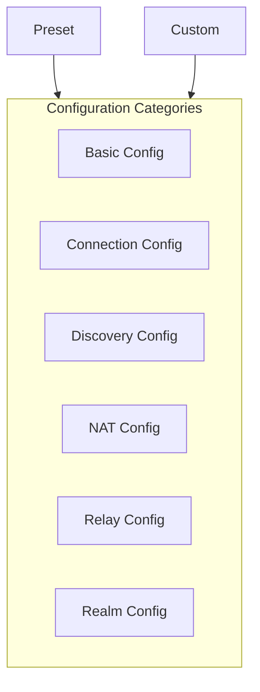

# Configuration Reference

This document details all configuration options for DeP2P.

---

## Overview



DeP2P uses functional options pattern for configuration:

```go
node, err := dep2p.New(ctx,
    dep2p.WithPreset(dep2p.PresetDesktop),
    dep2p.WithListenPort(4001),
    dep2p.WithBootstrapPeers(bootstrapAddrs...),
)
if err != nil {
    log.Fatal(err)
}
if err := node.Start(ctx); err != nil {
    log.Fatal(err)
}
```

---

## Basic Configuration

### WithPreset

Uses a preset configuration.

```go
func WithPreset(preset Preset) Option
```

**Parameters**:
| Value | Description |
|-------|-------------|
| `PresetMinimal` | Minimal configuration |
| `PresetDesktop` | Desktop application |
| `PresetServer` | Server |
| `PresetMobile` | Mobile device |

**Example**:

```go
node, _ := dep2p.New(ctx, dep2p.WithPreset(dep2p.PresetDesktop))
_ = node.Start(ctx)
```

---

### WithIdentity

Sets node identity.

```go
func WithIdentity(identity crypto.PrivKey) Option
```

**Notes**:
- If not set, a new identity is automatically generated
- Same private key produces same NodeID

**Example**:

```go
// Use existing private key
privKey, _ := crypto.UnmarshalPrivateKey(keyBytes)
node, _ := dep2p.New(ctx, dep2p.WithIdentity(privKey))
_ = node.Start(ctx)

// Load from file
key, _ := dep2p.LoadIdentity("node.key")
node, _ := dep2p.New(ctx, dep2p.WithIdentity(key))
_ = node.Start(ctx)
```

---

### WithListenPort

Sets the listen port.

```go
func WithListenPort(port int) Option
```

**Notes**:
- Uses random port by default
- Port 0 means random allocation

**Example**:

```go
node, _ := dep2p.New(ctx, dep2p.WithListenPort(4001))
_ = node.Start(ctx)
```

---

### WithListenAddrs

Sets listen addresses.

```go
func WithListenAddrs(addrs ...string) Option
```

**Notes**:
- Supports multiple listen addresses
- Supports IPv4 and IPv6

**Example**:

```go
node, _ := dep2p.New(ctx,
    dep2p.WithListenAddrs(
        "/ip4/0.0.0.0/udp/4001/quic-v1",
        "/ip6/::/udp/4001/quic-v1",
    ),
)
_ = node.Start(ctx)
```

---

## Connection Configuration

### WithConnectionLimits

Sets connection limits.

```go
func WithConnectionLimits(low, high int) Option
```

**Parameters**:
| Parameter | Description |
|-----------|-------------|
| `low` | Low watermark (don't trim) |
| `high` | High watermark (start trimming) |

**Example**:

```go
node, _ := dep2p.New(ctx,
    dep2p.WithConnectionLimits(50, 100),
)
_ = node.Start(ctx)
```

---

### WithConnectionTimeout

Sets connection timeout.

```go
func WithConnectionTimeout(d time.Duration) Option
```

**Example**:

```go
node, _ := dep2p.New(ctx,
    dep2p.WithConnectionTimeout(30*time.Second),
)
_ = node.Start(ctx)
```

---

### WithIdleTimeout

Sets idle connection timeout.

```go
func WithIdleTimeout(d time.Duration) Option
```

**Notes**:
- Connections with no data transfer beyond this time will be closed

**Example**:

```go
node, _ := dep2p.New(ctx,
    dep2p.WithIdleTimeout(5*time.Minute),
)
_ = node.Start(ctx)
```

---

## Discovery Configuration

### WithBootstrapPeers

Sets bootstrap nodes.

```go
func WithBootstrapPeers(addrs ...string) Option
```

**Notes**:
- Uses full address format (with /p2p/<NodeID>)
- Can configure multiple bootstrap nodes

**Example**:

```go
bootstrapAddrs := []string{
    "/ip4/104.131.131.82/udp/4001/quic-v1/p2p/QmaCpDMGvV2BGHeYERUEnRQAwe3N8SzbUtfsmvsqQLuvuJ",
    "/dnsaddr/bootstrap.dep2p.io/p2p/12D3KooWLQj...",
}
node, _ := dep2p.New(ctx,
    dep2p.WithBootstrapPeers(bootstrapAddrs...),
)
_ = node.Start(ctx)
```

---

### WithDHT

Enables/configures DHT.

```go
func WithDHT(mode DHTMode) Option
```

**Parameters**:
| Value | Description |
|-------|-------------|
| `DHTClient` | Client mode only |
| `DHTServer` | Server mode |
| `DHTAuto` | Auto mode |

**Example**:

```go
node, _ := dep2p.New(ctx,
    dep2p.WithDHT(dep2p.DHTServer),
)
_ = node.Start(ctx)
```

---

### WithMDNS

Enables mDNS local discovery.

```go
func WithMDNS(enabled bool) Option
```

**Notes**:
- Only effective within LAN
- Enabled by default in desktop preset

**Example**:

```go
node, _ := dep2p.New(ctx,
    dep2p.WithMDNS(true),
)
_ = node.Start(ctx)
```

---

## NAT Configuration

### WithNAT

Enables NAT traversal.

```go
func WithNAT(enabled bool) Option
```

**Example**:

```go
node, _ := dep2p.New(ctx,
    dep2p.WithNAT(true),
)
_ = node.Start(ctx)
```

---

### WithAutoNAT

Enables AutoNAT (auto-detect public reachability).

```go
func WithAutoNAT(enabled bool) Option
```

---

### WithHolePunching

Enables hole punching.

```go
func WithHolePunching(enabled bool) Option
```

---

### WithExternalAddrs

Declares external addresses.

```go
func WithExternalAddrs(addrs ...string) Option
```

**Notes**:
- For scenarios with known public IP
- Skips NAT detection

**Example**:

```go
node, _ := dep2p.New(ctx,
    dep2p.WithExternalAddrs("/ip4/203.0.113.1/udp/4001/quic-v1"),
)
_ = node.Start(ctx)
```

---

### WithSTUNServers

Sets STUN servers.

```go
func WithSTUNServers(servers ...string) Option
```

**Example**:

```go
node, _ := dep2p.New(ctx,
    dep2p.WithSTUNServers(
        "stun.l.google.com:19302",
        "stun.dep2p.io:3478",
    ),
)
_ = node.Start(ctx)
```

---

## Relay Configuration

### WithRelay

Enables relay client.

```go
func WithRelay(enabled bool) Option
```

**Notes**:
- Allows connecting through relay nodes
- Enabled by default

---

### WithRelayMap (v2.0)

Configures RelayMap (required in v2.0).

```go
func WithRelayMap(relayMap *relayif.RelayMap) Option
```

**Notes**:
- Mandatory in v2.0, replaces old `WithAutoRelay` and `WithStaticRelays`
- Must contain at least 2 relay servers for redundancy
- Automatically probes latency at startup and selects optimal Home Relay

---

### WithRelayServer

Enables relay server.

```go
func WithRelayServer(enabled bool) Option
```

**Notes**:
- Serves as relay node for other nodes
- Requires public IP

**Example**:

```go
// Configure as relay server
node, _ := dep2p.New(ctx,
    dep2p.WithPreset(dep2p.PresetServer),
    dep2p.WithRelayServer(true),
    dep2p.WithListenPort(4001),
)
_ = node.Start(ctx)
```

---

### ~~WithStaticRelays~~ (Deprecated)

> **Deprecated**: Removed in v2.0, use `WithRelayMap` instead.

Sets static relay nodes (v1.x API).

```go
// ❌ Deprecated, use WithRelayMap
func WithStaticRelays(addrs ...string) Option
```

**Migration Guide**:
Use `WithRelayMap` instead, configuring complete RelayMapEntry list.

**Example**:

```go
node, _ := dep2p.New(ctx,
    dep2p.WithStaticRelays(
        "/ip4/relay1.example.com/udp/4001/quic-v1/p2p/12D3KooW...",
    ),
)
_ = node.Start(ctx)
```

---

## Realm Configuration

### WithRealmAuth

Enables Realm authentication.

```go
func WithRealmAuth(enabled bool) Option
```

---

### WithRealmAuthTimeout

Sets Realm authentication timeout.

```go
func WithRealmAuthTimeout(d time.Duration) Option
```

---

## Configuration Parameter Table

### Basic Configuration

| Option | Type | Default | Description |
|--------|------|---------|-------------|
| `WithPreset` | `Preset` | - | Use preset configuration |
| `WithIdentity` | `crypto.PrivKey` | Auto-generated | Node identity |
| `WithListenPort` | `int` | Random | Listen port |
| `WithListenAddrs` | `[]string` | Default addresses | Listen address list |

### Connection Configuration

| Option | Type | Default | Description |
|--------|------|---------|-------------|
| `WithConnectionLimits` | `int, int` | See preset | Connection limits |
| `WithConnectionTimeout` | `Duration` | `30s` | Connection timeout |
| `WithIdleTimeout` | `Duration` | `5m` | Idle timeout |

### Discovery Configuration

| Option | Type | Default | Description |
|--------|------|---------|-------------|
| `WithBootstrapPeers` | `[]string` | Public nodes | Bootstrap nodes |
| `WithDHT` | `DHTMode` | `DHTClient` | DHT mode |
| `WithMDNS` | `bool` | See preset | mDNS discovery |

### NAT Configuration

| Option | Type | Default | Description |
|--------|------|---------|-------------|
| `WithNAT` | `bool` | `true` | Enable NAT |
| `WithAutoNAT` | `bool` | `true` | Auto NAT |
| `WithHolePunching` | `bool` | `true` | Hole punching |
| `WithExternalAddrs` | `[]string` | - | External addresses |
| `WithSTUNServers` | `[]string` | Public servers | STUN servers |

### Relay Configuration

| Option | Type | Default | Description |
|--------|------|---------|-------------|
| `WithRelayMap` | `*relayif.RelayMap` | - | **v2.0 required**: RelayMap config |
| `WithRelayServer` | `bool` | `false` | Relay server |
| ~~`WithAutoRelay`~~ | - | - | Deprecated, use `WithRelayMap` |
| ~~`WithStaticRelays`~~ | - | - | Deprecated, use `WithRelayMap` |

---

## Configuration Examples

### Minimal Configuration

```go
node, _ := dep2p.New(ctx)
_ = node.Start(ctx)
```

### Desktop Application

```go
node, _ := dep2p.New(ctx,
    dep2p.WithPreset(dep2p.PresetDesktop),
    dep2p.WithMDNS(true),
)
_ = node.Start(ctx)
```

### Server Configuration

```go
node, _ := dep2p.New(ctx,
    dep2p.WithPreset(dep2p.PresetServer),
    dep2p.WithListenPort(4001),
    dep2p.WithDHT(dep2p.DHTServer),
    dep2p.WithRelayServer(true),
)
_ = node.Start(ctx)
```

### Mobile Configuration

```go
// v2.0: Must configure RelayMap
relayMap := &relayif.RelayMap{
    Entries: []relayif.RelayMapEntry{
        {NodeID: relay1ID, Addrs: []string{"/ip4/1.2.3.4/udp/4001/quic-v1"}},
        {NodeID: relay2ID, Addrs: []string{"/ip4/5.6.7.8/udp/4001/quic-v1"}},
    },
}

node, _ := dep2p.New(
    dep2p.WithPreset(dep2p.PresetMobile),
    dep2p.WithRelayMap(relayMap),
)
```

### Private Network

```go
// Private Relay configuration
privateRelayMap := &relayif.RelayMap{
    Entries: []relayif.RelayMapEntry{
        {NodeID: privateRelay1, Addrs: []string{"/ip4/10.0.0.1/udp/4001/quic-v1"}},
        {NodeID: privateRelay2, Addrs: []string{"/ip4/10.0.0.2/udp/4001/quic-v1"}},
    },
}

node, _ := dep2p.New(
    dep2p.WithBootstrapPeers(privateBootstraps...),
    dep2p.WithRelayMap(privateRelayMap),
    dep2p.WithMDNS(false),  // Disable public discovery
)
```

---

## Related Documentation

- [Preset Configuration](presets.md)
- [Node API](api/node.md)
- [Quick Start](../getting-started/quickstart.md)
