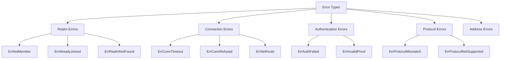

# Error Codes Reference

This document lists all error types in DeP2P, including trigger conditions, root cause analysis, and solutions.

---

## Error Categories



---

## Realm Errors

### ErrNotMember

**Description**: Node attempts to use business APIs without joining a Realm.

| Item | Content |
|------|---------|
| **Error Type** | `realm.ErrNotMember` |
| **Trigger Condition** | Calling `Send()`, `Request()`, `Publish()` etc. before calling `Realm().Join()` |
| **Root Cause** | DeP2P requires explicit Realm join before using business features |

**Solution**:

```go
// ❌ Wrong
node, _ := dep2p.New(ctx, dep2p.WithPreset(dep2p.PresetDesktop))
_ = node.Start(ctx)
err := node.Send(ctx, targetID, "/myapp/1.0.0", data)
// err = ErrNotMember

// ✓ Correct
node, _ := dep2p.New(ctx, dep2p.WithPreset(dep2p.PresetDesktop))
_ = node.Start(ctx)
realm, _ := node.Realm("my-realm")  // Get realm first
_ = realm.Join(ctx)                 // Join first
messaging := realm.Messaging()
err := messaging.Send(ctx, targetID, "/myapp/1.0.0", data)    // Then use
```

---

### ErrAlreadyJoined

**Description**: Node already joined a Realm, attempting to join the same Realm again.

| Item | Content |
|------|---------|
| **Error Type** | `realm.ErrAlreadyJoined` |
| **Trigger Condition** | Repeatedly calling `Realm().Join()` on an already joined Realm |
| **Root Cause** | Single Realm mode: node can only join one Realm at a time |

**Solution**:

```go
// ❌ Wrong
realm, _ := node.Realm("realm-a")
_ = realm.Join(ctx)
_ = realm.Join(ctx)  // ErrAlreadyJoined

// ✓ Correct: Check current state
if node.CurrentRealm() == nil {
    realm, _ := node.Realm("realm-a")
    _ = realm.Join(ctx)
}

// ✓ Or: Leave first then join
node.LeaveRealm(ctx)
realm, _ := node.Realm("realm-b")
_ = realm.Join(ctx)
```

---

### ErrRealmNotFound

**Description**: Requested Realm does not exist or is unreachable.

| Item | Content |
|------|---------|
| **Error Type** | `realm.ErrRealmNotFound` |
| **Trigger Condition** | Attempting to join a non-existent Realm |
| **Root Cause** | Incorrect RealmID or no members of that Realm in network |

**Solution**:

```go
// Check if RealmID is correct
// Ensure other members are online in network
// Check Bootstrap configuration
```

---

## Connection Errors

### ErrConnectionTimeout

**Description**: Connection timeout.

| Item | Content |
|------|---------|
| **Error Type** | `context deadline exceeded` |
| **Trigger Condition** | Cannot establish connection within specified time |
| **Root Cause** | Network latency, firewall blocking, target offline |

**Solution**:

```go
// 1. Increase timeout
ctx, cancel := context.WithTimeout(context.Background(), 30*time.Second)
defer cancel()
conn, err := node.Connect(ctx, targetID)

// 2. Check network
// - Confirm target node is online
// - Check firewall settings
// - Try using Relay
```

---

### ErrConnectionRefused

**Description**: Connection refused.

| Item | Content |
|------|---------|
| **Error Type** | `connection refused` |
| **Trigger Condition** | Target node refuses connection |
| **Root Cause** | Target node not running, wrong port, in deny list |

**Solution**:

```go
// 1. Confirm target node is running
// 2. Check if port is correct
// 3. Check if added to blacklist
```

---

### ErrNoRoute

**Description**: Cannot route to target.

| Item | Content |
|------|---------|
| **Error Type** | `no route to host` |
| **Trigger Condition** | Cannot find path to target |
| **Root Cause** | NAT blocking, no available addresses, Relay unavailable |

**Solution**:

```go
// 1. Enable Relay
node, _ := dep2p.New(ctx,
    dep2p.WithPreset(dep2p.PresetDesktop),
    dep2p.WithRelay(true),
)
_ = node.Start(ctx)

// 2. Check NAT configuration
// - Confirm UPnP enabled
// - Check firewall rules

// 3. Provide more addresses
node.AddAddresses(targetID, additionalAddrs)
```

---

## Authentication Errors

### ErrAuthFailed

**Description**: PSK member authentication failed.

| Item | Content |
|------|---------|
| **Error Type** | `realm.ErrAuthFailed` |
| **Trigger Condition** | Peer uses different RealmKey |
| **Root Cause** | Inconsistent realmKey among members |

**Solution**:

```go
// Ensure all members use the same realmKey
// realmKey should be distributed through secure channel

// Generate realmKey
realmKey := types.GenerateRealmKey()
fmt.Printf("Share this Key: %s\n", realmKey.String())

// Other members use the same key
key, _ := types.ParseRealmKey(sharedKeyString)
realm, _ := node.Realm("my-realm")
_ = realm.Join(ctx)
```

---

### ErrInvalidProof

**Description**: Member proof invalid.

| Item | Content |
|------|---------|
| **Error Type** | `realm.ErrInvalidProof` |
| **Trigger Condition** | Provided member proof cannot be verified |
| **Root Cause** | Proof expired, signature error, key mismatch |

**Solution**:

```go
// 1. Ensure realmKey is correct
// 2. Check time sync (proof may expire)
// 3. Rejoin Realm to refresh proof
```

---

## Protocol Errors

### ErrProtocolMismatch

**Description**: Protocol version mismatch.

| Item | Content |
|------|---------|
| **Error Type** | `protocol mismatch` |
| **Trigger Condition** | Incompatible protocol versions between peers |
| **Root Cause** | Using different protocol versions |

**Solution**:

```go
// 1. Confirm protocol versions match
// 2. Implement version negotiation

// Sender
messaging.SendWithProtocol(ctx, targetID, "myproto/1.0.0", data)

// Receiver also needs to register same version
messaging.OnProtocol("myproto/1.0.0", handler)
```

---

### ErrProtocolNotSupported

**Description**: Protocol not supported.

| Item | Content |
|------|---------|
| **Error Type** | `protocol not supported` |
| **Trigger Condition** | Peer has not registered requested protocol |
| **Root Cause** | Protocol not implemented, wrong protocol ID |

**Solution**:

```go
// 1. Confirm peer registered the protocol
// 2. Check protocol ID format

// ❌ Wrong format
messaging.SendWithProtocol(ctx, targetID, "myproto", data)

// ✓ Correct format (includes version)
messaging.SendWithProtocol(ctx, targetID, "myproto/1.0.0", data)
```

---

## Address Errors

### ErrInvalidAddress

**Description**: Invalid address format.

| Item | Content |
|------|---------|
| **Error Type** | `invalid address` |
| **Trigger Condition** | Provided address format is incorrect |
| **Root Cause** | Missing `/p2p/<NodeID>` suffix, format error |

**Solution**:

```go
// ❌ Wrong: Missing NodeID
addr := "/ip4/1.2.3.4/udp/4001/quic-v1"

// ✓ Correct: Full address
addr := "/ip4/1.2.3.4/udp/4001/quic-v1/p2p/5Q2STWvBFn..."

// Get correct full address
addrs, _ := node.WaitShareableAddrs(ctx)
```

---

### ErrPeerIDMismatch

**Description**: NodeID mismatch.

| Item | Content |
|------|---------|
| **Error Type** | `peer id mismatch` |
| **Trigger Condition** | NodeID in address doesn't match actual node |
| **Root Cause** | Address expired, node identity changed |

**Solution**:

```go
// 1. Get latest address
addrs, _ := targetNode.WaitShareableAddrs(ctx)

// 2. Update address book
node.AddAddresses(targetID, addrs)
```

---

## Error Handling Best Practices

### Categorized Handling

```go
switch {
case errors.Is(err, realm.ErrNotMember):
    // Need to join Realm first
    realm, _ := node.Realm("my-realm")
    _ = realm.Join(ctx)
    // Retry operation

case errors.Is(err, realm.ErrAuthFailed):
    // Auth failed, check realmKey
    log.Error("realmKey mismatch, check configuration")

case errors.Is(err, context.DeadlineExceeded):
    // Timeout, may need retry or use Relay
    log.Warn("Connection timeout, try using Relay")

default:
    log.Errorf("Unknown error: %v", err)
}
```

### Retry Strategy

```go
func withRetry(ctx context.Context, fn func() error, maxRetries int) error {
    var lastErr error
    for i := 0; i < maxRetries; i++ {
        if err := fn(); err != nil {
            lastErr = err
            // Retriable errors
            if errors.Is(err, context.DeadlineExceeded) {
                time.Sleep(time.Duration(i+1) * time.Second)
                continue
            }
            // Non-retriable errors
            if errors.Is(err, realm.ErrNotMember) {
                return err
            }
        }
        return nil
    }
    return lastErr
}
```

---

## Related Documentation

- [API Defaults and Constraints](api-defaults.md) - Core constraints explanation
- [Troubleshooting](../how-to/troubleshooting.md) - Diagnosis guide
- [FAQ](../getting-started/faq.md) - Common questions

