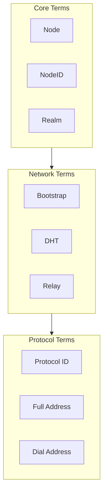
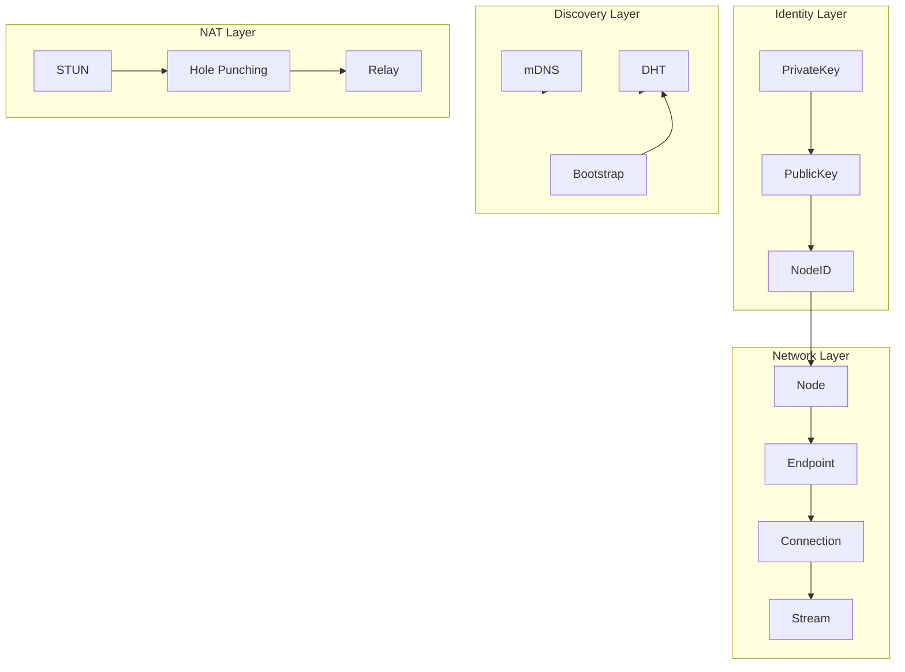

# Glossary

This document defines the core terms and concepts used in DeP2P.

---

## Overview



---

## Core Terms

### Node

A participant instance in the DeP2P network. Each Node has a unique NodeID and can establish connections with other Nodes to communicate.

**Related Concepts**: NodeID, Endpoint, Connection

**Usage**:
```go
node, _ := dep2p.StartNode(ctx)
defer node.Close()
```

---

### NodeID

**Node Identifier**

A node's unique identifier, a Base58 encoded string derived from the public key. NodeID is the node's "ID card" that uniquely identifies it in the network.

**Format**: `12D3KooWxxxxxxxxxxxxxxxxxxxxxxxxxxxxxxxx`

**Related Concepts**: Node, Identity, PublicKey

**Usage**:
```go
nodeID := node.ID()
fmt.Println(nodeID)  // 12D3KooWxxxxxxx...
```

---

### Realm

**Domain/Business Isolation Zone**

DeP2P's multi-tenant isolation mechanism. Nodes in different Realms share underlying infrastructure (DHT, relay) but have complete business layer isolation.

**Types**:
- **Public**: Open Realm, anyone can join
- **Protected**: Protected Realm, requires key to join
- **Private**: Private Realm, not registered in public DHT

**Related Concepts**: RealmManager, JoinRealm, RealmID

**Usage**:
```go
node.Realm().JoinRealm(ctx, types.RealmID("my-realm"))
```

---

### Connection

A secure communication link between two nodes, based on QUIC protocol. Supports multiplexing, allowing multiple Streams on a single connection.

**Related Concepts**: Node, Stream, Endpoint

---

### Stream

A bidirectional data channel on a Connection. Each Stream corresponds to a specific protocol for transmitting that protocol's messages.

**Related Concepts**: Connection, ProtocolID

---

### Endpoint

DeP2P's core connection interface, providing low-level connection management and protocol handling. Node is a high-level wrapper of Endpoint.

**Related Concepts**: Node, Connection, ProtocolHandler

---

### Identity

A node's cryptographic identity, consisting of a public-private key pair. Private key is used for signing, public key for verification and deriving NodeID.

**Related Concepts**: NodeID, PublicKey, PrivateKey

---

## Network Terms

### Bootstrap

The process of a new node joining the network. By connecting to known Bootstrap nodes to discover more nodes and integrate into the network.

**Related Concepts**: BootstrapPeer, DHT, Discovery

**Usage**:
```go
node, _ := dep2p.StartNode(ctx,
    dep2p.WithBootstrapPeers(bootstrapAddrs...),
)
```

---

### DHT

**Distributed Hash Table**

A decentralized key-value storage system used for node discovery and address storage. DeP2P uses Kademlia DHT.

**Modes**:
- **Client**: Only queries DHT
- **Server**: Stores and serves DHT requests

**Related Concepts**: Bootstrap, Discovery, Kademlia

---

### mDNS

**Multicast DNS**

A node discovery mechanism within local networks. Can discover other nodes in the local network without internet.

**Related Concepts**: Discovery, LAN

---

### NAT

**Network Address Translation**

Technology commonly used in home and office routers, sharing a single public IP among multiple devices. NAT blocks inbound connections.

**Related Concepts**: NAT Traversal, Hole Punching, STUN

---

### NAT Traversal

Techniques to bypass NAT restrictions and establish direct connections. Includes Hole Punching, UPnP, NAT-PMP, etc.

**Related Concepts**: NAT, Hole Punching, Relay

---

### Hole Punching

Two nodes behind NAT coordinate to simultaneously send packets, opening temporary port mappings on their respective NATs, thereby establishing a direct connection.

**Related Concepts**: NAT Traversal, STUN, Relay

---

### STUN

**Session Traversal Utilities for NAT**

A protocol that helps nodes discover their public IP and port.

**Related Concepts**: NAT, NAT Traversal

---

### Relay

A mechanism to forward data through a third-party node when direct connection is impossible. Relay nodes need public reachability.

**Related Concepts**: NAT Traversal, RelayServer, Circuit Address

---

### AutoRelay

A mechanism to automatically discover and use Relay nodes. Enabled automatically when direct connection cannot be established.

**Related Concepts**: Relay, NAT

---

### Reachability

Whether a node can be directly accessed by other nodes in the network. Public network nodes are usually reachable, nodes behind NAT are usually not reachable.

**States**:
- **Public**: Publicly reachable
- **Private**: Not directly accessible

**Related Concepts**: NAT, AutoNAT

---

## Address Terms

### Multiaddr

**Multiaddress**

A self-describing address format that can represent any network address and protocol stack.

**Format**: `/ip4/192.168.1.1/udp/4001/quic-v1`

**Related Concepts**: Full Address, Dial Address

---

### Full Address

An address that includes NodeID. Format: `<Dial Address>/p2p/<NodeID>`

**Example**: `/ip4/192.168.1.1/udp/4001/quic-v1/p2p/12D3KooWxxxxxxx`

**Usage**: Bootstrap, user sharing

**Related Concepts**: Dial Address, Multiaddr

---

### Dial Address

A network address without NodeID. Format: `/ip4/<IP>/udp/<Port>/quic-v1`

**Example**: `/ip4/192.168.1.1/udp/4001/quic-v1`

**Usage**: Used in combination with NodeID

**Related Concepts**: Full Address, Multiaddr

---

### Circuit Address

Address format for connecting through a Relay node.

**Format**: `<Relay Address>/p2p/<RelayID>/p2p-circuit/p2p/<TargetID>`

**Example**: `/ip4/relay.example.com/udp/4001/quic-v1/p2p/12D3KooW.../p2p-circuit/p2p/12D3KooW...`

**Related Concepts**: Relay, Full Address

---

### Listen Address

The local address a node uses to receive inbound connections.

**Related Concepts**: Advertised Address

---

### Advertised Address

Addresses a node advertises to the network as connectable. May differ from Listen Address (e.g., after NAT mapping).

**Related Concepts**: Listen Address, Reachability

---

## Protocol Terms

### Protocol ID

A unique string identifying a specific communication protocol. Format: `/<namespace>/<name>/<version>`

**Example**: `/myapp/chat/1.0.0`

**Related Concepts**: Stream, ProtocolHandler

---

### Protocol Handler

A callback function that handles messages for a specific protocol. Called when a request for that protocol is received.

**Related Concepts**: Protocol ID, Stream

---

## Messaging Terms

### Send

One-way message sending pattern. Does not wait for response after sending.

**Related Concepts**: Request, Publish

---

### Request

Request-response pattern. Sends request and waits for the other party's response.

**Related Concepts**: Send, Response

---

### Publish

The publish operation in publish-subscribe pattern. Sends message to all subscribers.

**Related Concepts**: Subscribe, Topic

---

### Subscribe

The subscribe operation in publish-subscribe pattern. Receives all messages for a specific topic.

**Related Concepts**: Publish, Topic, Subscription

---

### Topic

A message channel in publish-subscribe pattern. Subscribers only receive messages for subscribed topics.

**Related Concepts**: Publish, Subscribe

---

## System Terms

### Discovery

Mechanisms for finding other nodes in the network. Includes DHT discovery, mDNS discovery, etc.

**Related Concepts**: DHT, mDNS, Bootstrap

---

### AddressBook

A local cache storing known node addresses. Speeds up subsequent connections.

**Related Concepts**: NodeID, Address, Discovery

---

### ConnectionManager

A component that manages connection lifecycle. Responsible for connection limits, trimming policies, etc.

**Related Concepts**: Connection, Watermark

---

### Liveness

A mechanism for detecting if connections are still active. Uses Ping-Pong heartbeat protocol.

**Related Concepts**: Connection, Ping

---

## Term Relationship Diagram



---

## Related Documentation

- [Core Concepts](../concepts/core-concepts.md)
- [Architecture Overview](../concepts/architecture-overview.md)
- [Node API](api/node.md)
