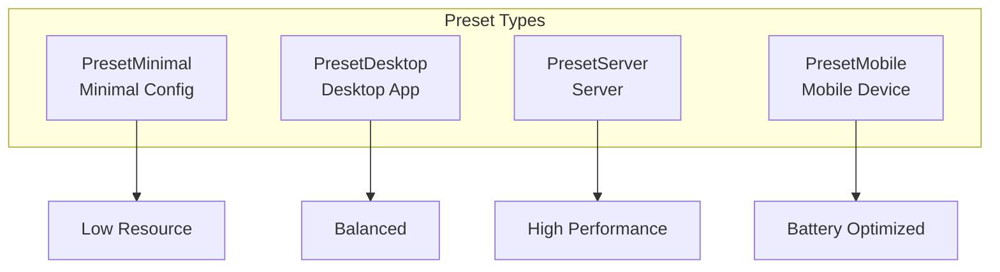
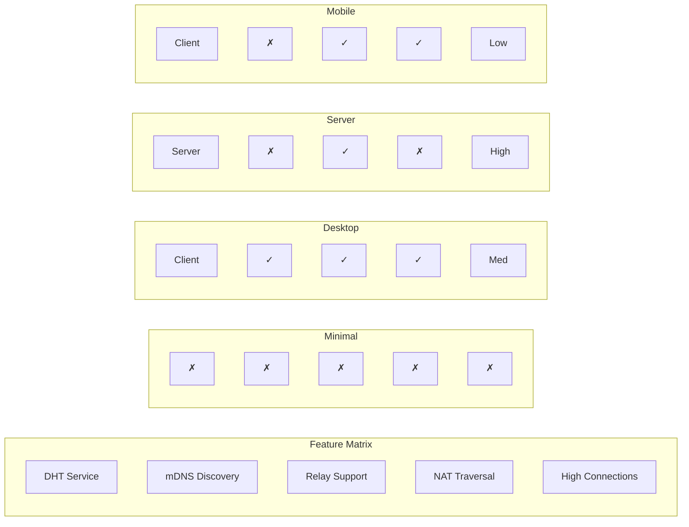
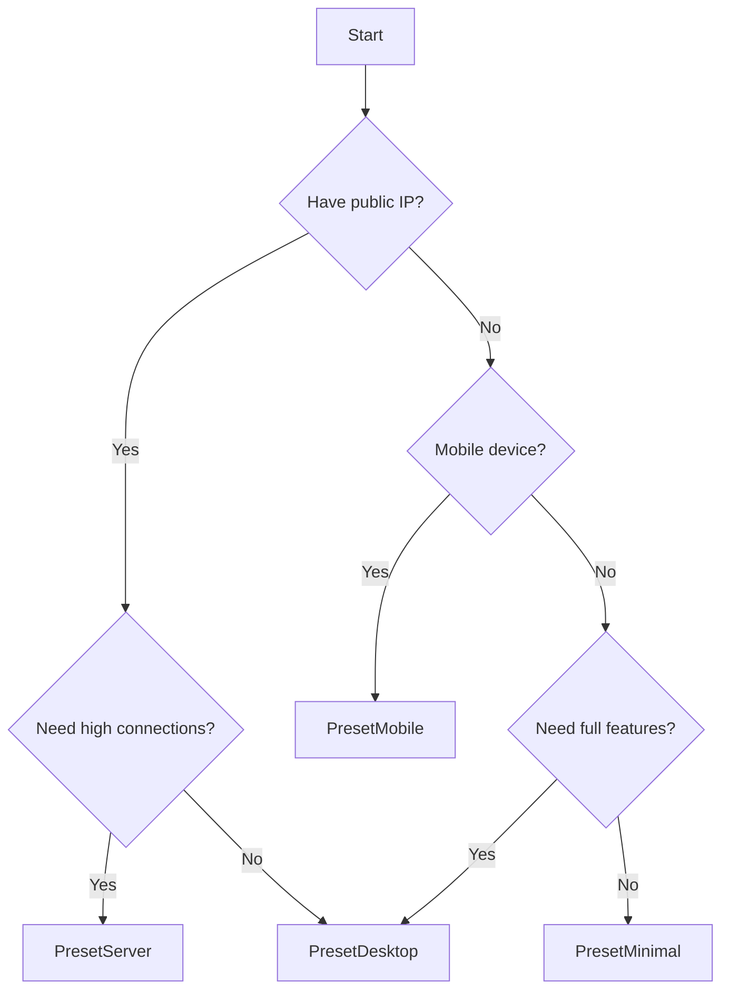

# Preset Configuration Reference

This document details the preset configurations provided by DeP2P.

---

## Overview

Preset configurations are optimized configuration sets for different scenarios, simplifying the node creation process.



---

## Preset Types

### PresetMinimal

Minimal configuration for resource-constrained or testing scenarios.

```go
node, _ := dep2p.New(ctx, dep2p.WithPreset(dep2p.PresetMinimal))
_ = node.Start(ctx)
```

**Configuration Details**:

| Config | Value | Description |
|--------|-------|-------------|
| DHT | Disabled | No DHT participation |
| mDNS | Disabled | No local discovery |
| Relay | Disabled | No relay support |
| NAT | Disabled | No NAT traversal |
| Connection Limit | 10/20 | Very low connections |
| Auto Discovery | Disabled | Manual connections |

**Use Cases**:
- Unit testing
- Local development
- Extremely resource-constrained environments
- Simple direct-connect scenarios

---

### PresetDesktop

Default configuration for desktop applications, balancing features and resources.

```go
node, _ := dep2p.New(ctx, dep2p.WithPreset(dep2p.PresetDesktop))
_ = node.Start(ctx)
```

**Configuration Details**:

| Config | Value | Description |
|--------|-------|-------------|
| DHT | Client | DHT client mode |
| mDNS | Enabled | LAN discovery |
| Relay | Enabled | Relay connection support |
| AutoRelay | Enabled | Automatic relay usage |
| NAT | Enabled | NAT traversal |
| AutoNAT | Enabled | Auto reachability detection |
| HolePunching | Enabled | Hole punching support |
| Connection Limit | 50/100 | Medium connections |

**Use Cases**:
- Desktop chat applications
- File sharing applications
- Personal nodes
- Development and debugging

---

### PresetServer

Server configuration, maximizing performance and connection capacity.

```go
node, _ := dep2p.New(ctx, dep2p.WithPreset(dep2p.PresetServer))
_ = node.Start(ctx)
```

**Configuration Details**:

| Config | Value | Description |
|--------|-------|-------------|
| DHT | Server | DHT server mode |
| mDNS | Disabled | Usually not needed for servers |
| Relay | Enabled | Relay support |
| RelayServer | Optional | Can serve as relay server |
| NAT | Disabled | Assumes public IP |
| AutoNAT | Disabled | Assumes reachable |
| Connection Limit | 200/500 | High connections |
| Listen Port | Fixed | Recommended 4001 |

**Use Cases**:
- Bootstrap nodes
- Relay servers
- High availability services
- Public servers

---

### PresetMobile

Mobile configuration, optimizing battery and data consumption.

```go
node, _ := dep2p.New(ctx, dep2p.WithPreset(dep2p.PresetMobile))
_ = node.Start(ctx)
```

**Configuration Details**:

| Config | Value | Description |
|--------|-------|-------------|
| DHT | Client | Client only |
| mDNS | Disabled | Save battery |
| Relay | Enabled | Required for mobile networks |
| AutoRelay | Enabled | Automatic relay |
| NAT | Enabled | Attempt traversal |
| HolePunching | Enabled | Attempt hole punching |
| Connection Limit | 20/50 | Low connections |
| Idle Timeout | Short | Quick release |

**Use Cases**:
- Mobile chat applications
- Mobile clients
- IoT devices
- Low-power devices

---

## Preset Comparison



### Feature Comparison Table

| Feature | Minimal | Desktop | Server | Mobile |
|---------|---------|---------|--------|--------|
| DHT | Disabled | Client | Server | Client |
| mDNS | Disabled | Enabled | Disabled | Disabled |
| Relay Client | Disabled | Enabled | Enabled | Enabled |
| Relay Server | Disabled | Disabled | Optional | Disabled |
| NAT Traversal | Disabled | Enabled | Disabled | Enabled |
| AutoNAT | Disabled | Enabled | Disabled | Enabled |
| HolePunching | Disabled | Enabled | Disabled | Enabled |
| AutoRelay | Disabled | Enabled | Disabled | Enabled |

### Resource Consumption Comparison

| Metric | Minimal | Desktop | Server | Mobile |
|--------|---------|---------|--------|--------|
| Memory | Low | Medium | High | Low |
| CPU | Low | Medium | High | Low |
| Network | Very Low | Medium | High | Optimized |
| Connections | 10-20 | 50-100 | 200-500 | 20-50 |
| Battery | N/A | N/A | N/A | Optimized |

---

## How to Choose a Preset



### Selection Guide

| Scenario | Recommended Preset |
|----------|-------------------|
| Local testing | PresetMinimal |
| Desktop application | PresetDesktop |
| Public server | PresetServer |
| Bootstrap node | PresetServer |
| Relay server | PresetServer + WithRelayServer |
| Mobile app | PresetMobile |
| IoT device | PresetMobile or PresetMinimal |
| Development debugging | PresetDesktop |

---

## Customizing Presets

Presets can be combined with other options:

### Extending a Preset

```go
// Based on desktop preset, add fixed port
node, _ := dep2p.New(ctx,
    dep2p.WithPreset(dep2p.PresetDesktop),
    dep2p.WithListenPort(4001),
)
_ = node.Start(ctx)
```

### Overriding Preset Settings

```go
// Based on server preset, enable relay server
node, _ := dep2p.New(ctx,
    dep2p.WithPreset(dep2p.PresetServer),
    dep2p.WithRelayServer(true),
    dep2p.WithListenPort(4001),
)
_ = node.Start(ctx)
```

### Disabling Features from Preset

```go
// Based on desktop preset, disable mDNS
node, _ := dep2p.New(ctx,
    dep2p.WithPreset(dep2p.PresetDesktop),
    dep2p.WithMDNS(false),
)
_ = node.Start(ctx)
```

---

## Fully Custom Configuration

Without using presets, fully custom configuration:

```go
node, _ := dep2p.New(ctx,
    // Identity
    dep2p.WithIdentity(privateKey),
    
    // Network
    dep2p.WithListenPort(4001),
    dep2p.WithBootstrapPeers(bootstrapAddrs...),
    
    // Discovery
    dep2p.WithDHT(dep2p.DHTServer),
    dep2p.WithMDNS(true),
    
    // NAT
    dep2p.WithNAT(true),
    dep2p.WithAutoNAT(true),
    dep2p.WithHolePunching(true),
    
    // Relay (v2.0: RelayMap required)
    dep2p.WithRelayMap(relayMap),  // See RelayMap configuration below
    dep2p.WithRelayServer(false),
    
    // Connections
    dep2p.WithConnectionLimits(100, 200),
)
_ = node.Start(ctx)
```

---

## Related Documentation

- [Configuration Reference](configuration.md)
- [Node API](api/node.md)
- [Quick Start](../getting-started/quickstart.md)
