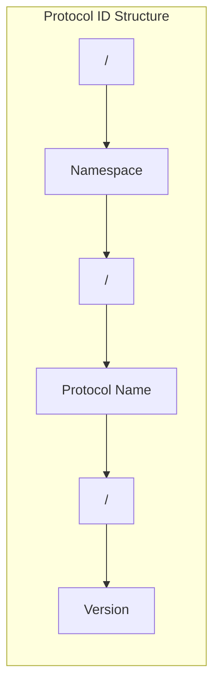
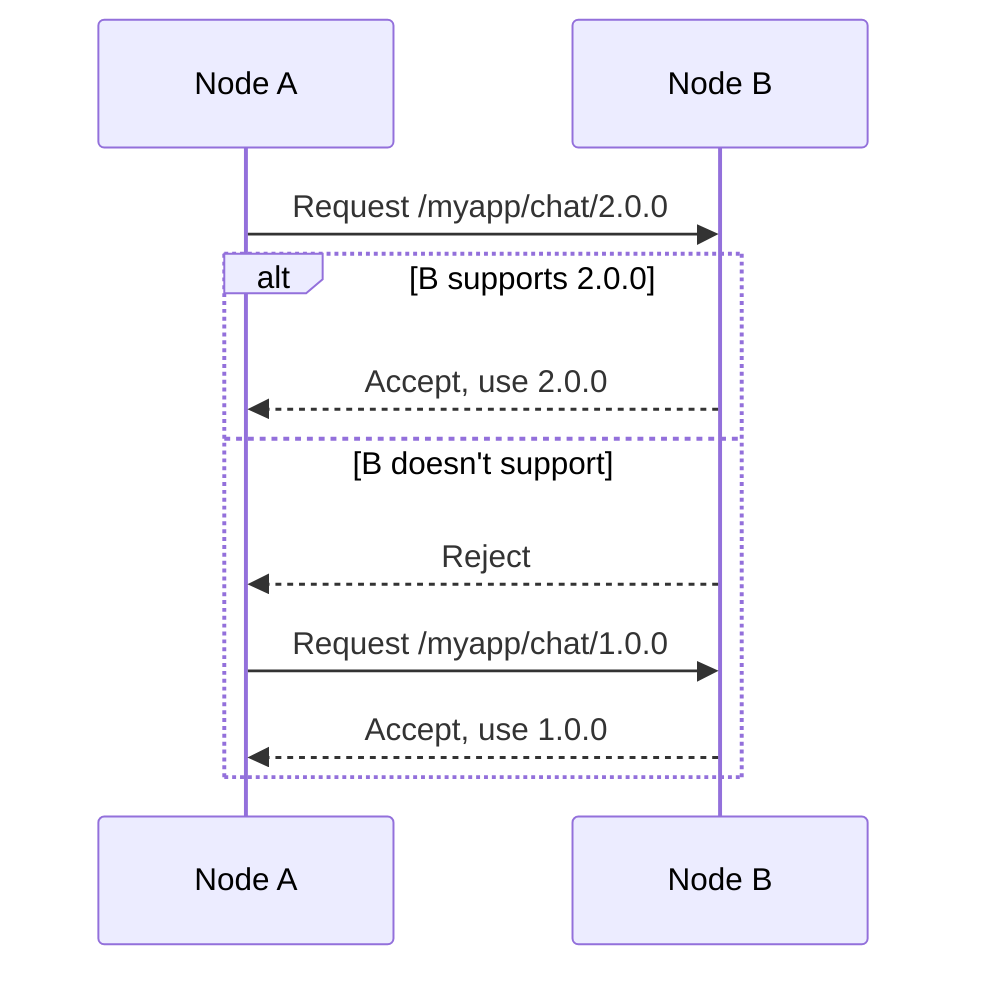
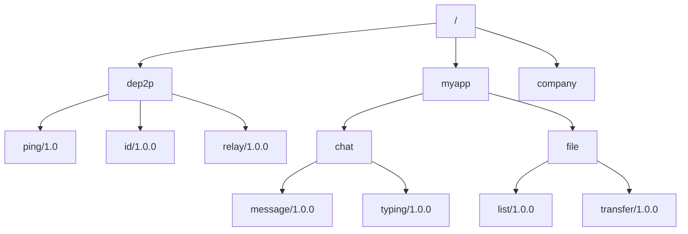

# Protocol ID Naming Specification

This document defines the format specification and best practices for DeP2P Protocol IDs.

---

## Overview

Protocol ID is a unique string that identifies a communication protocol. Proper naming of Protocol IDs is crucial for protocol negotiation, version management, and interoperability.



---

## Format Specification

### Basic Format

```
/<namespace>/<protocol-name>/<version>
```

**Examples**:
- `/myapp/chat/1.0.0`
- `/dep2p/sys/ping/1.0.0`
- `/dep2p/sys/dht/1.0.0`

---

### Components

| Part | Description | Rules |
|------|-------------|-------|
| Namespace | Application or organization identifier | Lowercase letters, numbers, hyphens |
| Protocol Name | Protocol functionality description | Lowercase letters, numbers, hyphens |
| Version | Protocol version number | Semantic version or simple version |

---

## Namespace Rules

### Application Namespace

```
/<app-name>/<protocol>/<version>
```

**Example**:
```go
const (
    ProtoMyAppChat = "/myapp/chat/1.0.0"
    ProtoMyAppFile = "/myapp/file/1.0.0"
)
```

---

### Organization Namespace

```
/<org>/<app>/<protocol>/<version>
```

**Example**:
```go
const (
    ProtoCompanyMessaging = "/acme/messenger/message/1.0.0"
    ProtoCompanySync = "/acme/sync/data/1.0.0"
)
```

---

### System Namespace

DeP2P system protocols use the `/dep2p/` namespace:

```
/dep2p/<protocol>/<version>
```

**System Protocol Examples**:
| Protocol ID | Description |
|-------------|-------------|
| `/dep2p/sys/ping/1.0.0` | Ping-Pong heartbeat |
| `/dep2p/sys/identify/1.0.0` | Identity exchange |
| `/dep2p/relay/1.0.0/hop` | Relay protocol (HOP) |
| `/dep2p/relay/1.0.0/stop` | Relay protocol (STOP) |
| `/dep2p/realm/<realmID>/auth/1.0.0` | Realm authentication |

---

## Version Number Rules

### Semantic Versioning

Semantic versioning is recommended:

```
<major>.<minor>.<patch>
```

| Part | Meaning |
|------|---------|
| major | Incompatible API changes |
| minor | Backward compatible feature additions |
| patch | Backward compatible bug fixes |

**Examples**:
- `1.0.0` - First stable version
- `1.1.0` - New features added
- `2.0.0` - Breaking changes

---

### Simple Versioning

For simple scenarios, two-part versioning can be used:

```
<major>.<minor>
```

**Examples**:
- `1.0`
- `2.1`

---

## Version Negotiation

### Multi-Version Support

```go
// Register handlers for multiple versions
node.Endpoint().SetProtocolHandler("/myapp/chat/1.0.0", handleChatV1)
node.Endpoint().SetProtocolHandler("/myapp/chat/2.0.0", handleChatV2)
```

### Protocol Negotiation Flow



---

## Naming Best Practices

### Recommended Practices

```go
// Use constant definitions
const (
    // Chat protocols
    ProtoChatMessage = "/myapp/chat/message/1.0.0"
    ProtoChatTyping  = "/myapp/chat/typing/1.0.0"
    
    // File transfer
    ProtoFileRequest  = "/myapp/file/request/1.0.0"
    ProtoFileTransfer = "/myapp/file/transfer/1.0.0"
)
```

### Practices to Avoid

```go
// Avoid: No version number
const BadProto1 = "/myapp/chat"  // Missing version

// Avoid: Using uppercase
const BadProto2 = "/MyApp/Chat/1.0.0"  // Should use lowercase

// Avoid: Using special characters
const BadProto3 = "/my_app/chat!/1.0.0"  // Uses _ and !

// Avoid: Inconsistent version format
const BadProto4 = "/myapp/chat/v1"  // Should use numeric version
```

---

## Protocol ID Examples

### Chat Application

```go
const (
    // Message related
    ProtoChatMessage = "/chatapp/message/1.0.0"
    ProtoChatRead    = "/chatapp/read/1.0.0"
    ProtoChatTyping  = "/chatapp/typing/1.0.0"
    
    // Group related
    ProtoGroupCreate = "/chatapp/group/create/1.0.0"
    ProtoGroupJoin   = "/chatapp/group/join/1.0.0"
    ProtoGroupLeave  = "/chatapp/group/leave/1.0.0"
)
```

---

### File Sharing

```go
const (
    // File operations
    ProtoFileList     = "/fileshare/list/1.0.0"
    ProtoFileRequest  = "/fileshare/request/1.0.0"
    ProtoFileTransfer = "/fileshare/transfer/1.0.0"
    ProtoFileHash     = "/fileshare/hash/1.0.0"
)
```

---

### RPC Service

```go
const (
    // General RPC
    ProtoRPCCall   = "/myservice/rpc/call/1.0.0"
    ProtoRPCStream = "/myservice/rpc/stream/1.0.0"
)
```

---

## Protocol ID Tree



---

## Common Mistakes

| Error | Problem | Correct Format |
|-------|---------|----------------|
| `myapp/chat/1.0` | Missing leading slash | `/myapp/chat/1.0` |
| `/myapp/chat` | Missing version number | `/myapp/chat/1.0.0` |
| `/MyApp/Chat/1.0` | Using uppercase | `/myapp/chat/1.0` |
| `/my app/chat/1.0` | Contains space | `/my-app/chat/1.0` |
| `/myapp/chat/v1.0` | Version prefix v | `/myapp/chat/1.0` |

---

## Related Documentation

- [Endpoint API](api/endpoint.md)
- [Messaging API](api/messaging.md)
- [Custom Protocols Tutorial](../how-to/custom-protocols.md)
