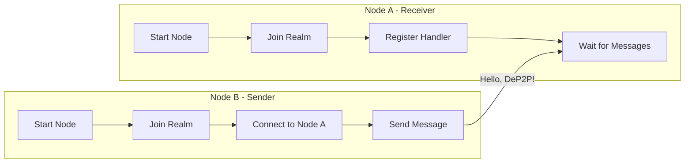
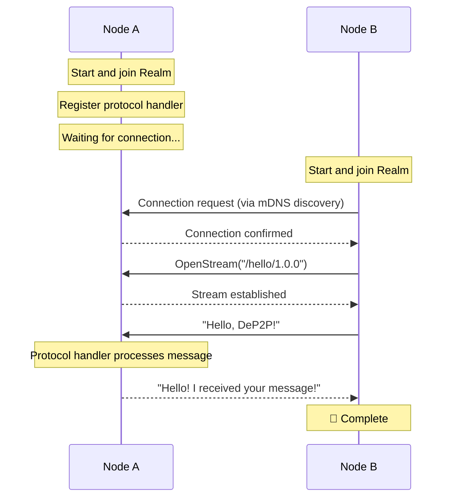

# Hello World: Two Nodes Connect

This tutorial will guide you through the most basic DeP2P operation: connecting two nodes and sending messages between them.

---

## Tutorial Goals

```
┌─────────────────────────────────────────────────────────────────────┐
│                    After this tutorial you will learn               │
├─────────────────────────────────────────────────────────────────────┤
│                                                                      │
│  ✅ Create two DeP2P nodes                                           │
│  ✅ Discover each other on the same network                          │
│  ✅ Establish connection and send messages                           │
│  ✅ Receive and handle messages from other nodes                     │
│                                                                      │
└─────────────────────────────────────────────────────────────────────┘
```

---

## Prerequisites

- Go 1.21 or higher
- DeP2P installed (`go get github.com/dep2p/go-dep2p`)
- Two terminal windows

---

## Architecture Overview



---

## Step 1: Create Node A (Receiver)

Create file `node_a/main.go`:

```go
package main

import (
    "context"
    "fmt"
    "log"
    "os"
    "os/signal"
    "syscall"

    "github.com/dep2p/go-dep2p"
    "github.com/dep2p/go-dep2p/pkg/types"
)

// Define application protocol
const helloProtocol = "/hello/1.0.0"

func main() {
    fmt.Println("╔════════════════════════════════════════╗")
    fmt.Println("║      DeP2P Hello World - Node A        ║")
    fmt.Println("╚════════════════════════════════════════╝")
    fmt.Println()

    ctx, cancel := context.WithCancel(context.Background())
    defer cancel()

    // Capture interrupt signal
    signalCh := make(chan os.Signal, 1)
    signal.Notify(signalCh, syscall.SIGINT, syscall.SIGTERM)
    go func() {
        <-signalCh
        fmt.Println("\nReceived interrupt signal, shutting down...")
        cancel()
    }()

    // ========================================
    // Step 1: Create and start node
    // ========================================
    fmt.Println("Step 1: Starting node...")
    node, err := dep2p.StartNode(ctx,
        dep2p.WithPreset(dep2p.PresetDesktop),
        dep2p.WithListenPort(8001), // Fixed port for easy connection
    )
    if err != nil {
        log.Fatalf("Failed to start node: %v", err)
    }
    defer node.Close()

    fmt.Printf("✅ Node started\n")
    fmt.Printf("   Node ID: %s\n", node.ID())
    fmt.Printf("   Listen Addresses: %v\n", node.ListenAddrs())
    fmt.Println()

    // ========================================
    // Step 2: Join Realm
    // ========================================
    fmt.Println("Step 2: Joining Realm...")
    realmID := types.RealmID("hello-world-demo")
    if err := node.Realm().JoinRealm(ctx, realmID); err != nil {
        log.Fatalf("Failed to join Realm: %v", err)
    }
    fmt.Printf("✅ Joined Realm: %s\n", realmID)
    fmt.Println()

    // ========================================
    // Step 3: Register protocol handler
    // ========================================
    fmt.Println("Step 3: Registering protocol handler...")
    node.Endpoint().SetProtocolHandler(helloProtocol, func(stream dep2p.Stream) {
        defer stream.Close()

        // Read message
        buf := make([]byte, 1024)
        n, err := stream.Read(buf)
        if err != nil {
            fmt.Printf("Failed to read message: %v\n", err)
            return
        }

        message := string(buf[:n])
        fmt.Printf("\n📨 Received message: %s\n", message)
        fmt.Printf("   From: %s\n", stream.RemotePeer())

        // Send response
        response := "Hello! I received your message!"
        _, err = stream.Write([]byte(response))
        if err != nil {
            fmt.Printf("Failed to send response: %v\n", err)
            return
        }
        fmt.Printf("📤 Sent response: %s\n", response)
    })
    fmt.Printf("✅ Registered protocol: %s\n", helloProtocol)
    fmt.Println()

    // ========================================
    // Wait for messages
    // ========================================
    fmt.Println("════════════════════════════════════════")
    fmt.Println("Node A is ready, waiting for messages from Node B...")
    fmt.Println()
    fmt.Println("Start Node B in another terminal using this NodeID:")
    fmt.Printf("   %s\n", node.ID())
    fmt.Println()
    fmt.Println("Press Ctrl+C to exit")
    fmt.Println("════════════════════════════════════════")

    <-ctx.Done()
    fmt.Println("Node A closed")
}
```

---

## Step 2: Create Node B (Sender)

Create file `node_b/main.go`:

```go
package main

import (
    "context"
    "fmt"
    "log"
    "os"
    "time"

    "github.com/dep2p/go-dep2p"
    "github.com/dep2p/go-dep2p/pkg/types"
)

// Define application protocol (must match Node A)
const helloProtocol = "/hello/1.0.0"

func main() {
    fmt.Println("╔════════════════════════════════════════╗")
    fmt.Println("║      DeP2P Hello World - Node B        ║")
    fmt.Println("╚════════════════════════════════════════╝")
    fmt.Println()

    // Get Node A's ID from command line arguments
    if len(os.Args) < 2 {
        fmt.Println("Usage: go run main.go <NodeA's NodeID>")
        fmt.Println()
        fmt.Println("Example: go run main.go 5Q2STWvBFn...")
        os.Exit(1)
    }
    nodeAIDStr := os.Args[1]

    ctx, cancel := context.WithTimeout(context.Background(), 30*time.Second)
    defer cancel()

    // ========================================
    // Step 1: Create and start node
    // ========================================
    fmt.Println("Step 1: Starting node...")
    node, err := dep2p.StartNode(ctx,
        dep2p.WithPreset(dep2p.PresetDesktop),
    )
    if err != nil {
        log.Fatalf("Failed to start node: %v", err)
    }
    defer node.Close()

    fmt.Printf("✅ Node started\n")
    fmt.Printf("   Node ID: %s\n", node.ID())
    fmt.Println()

    // ========================================
    // Step 2: Join Realm (must match Node A)
    // ========================================
    fmt.Println("Step 2: Joining Realm...")
    realmID := types.RealmID("hello-world-demo")
    if err := node.Realm().JoinRealm(ctx, realmID); err != nil {
        log.Fatalf("Failed to join Realm: %v", err)
    }
    fmt.Printf("✅ Joined Realm: %s\n", realmID)
    fmt.Println()

    // ========================================
    // Step 3: Parse Node A's ID
    // ========================================
    fmt.Println("Step 3: Parsing target node ID...")
    nodeAID, err := types.ParseNodeID(nodeAIDStr)
    if err != nil {
        log.Fatalf("Failed to parse NodeID: %v", err)
    }
    fmt.Printf("✅ Target node: %s\n", nodeAID.ShortString())
    fmt.Println()

    // ========================================
    // Step 4: Connect to Node A
    // ========================================
    fmt.Println("Step 4: Connecting to Node A...")
    
    // Wait for mDNS discovery (same LAN)
    fmt.Println("   Waiting for Node A discovery (mDNS)...")
    time.Sleep(2 * time.Second)
    
    conn, err := node.Connect(ctx, nodeAID)
    if err != nil {
        log.Fatalf("Connection failed: %v\nHint: Make sure both nodes are on the same network", err)
    }
    fmt.Printf("✅ Connected to Node A\n")
    fmt.Println()

    // ========================================
    // Step 5: Send message
    // ========================================
    fmt.Println("Step 5: Sending message...")
    
    // Open stream
    stream, err := conn.OpenStream(ctx, helloProtocol)
    if err != nil {
        log.Fatalf("Failed to open stream: %v", err)
    }
    defer stream.Close()

    // Send message
    message := "Hello, DeP2P! This is a greeting from Node B!"
    _, err = stream.Write([]byte(message))
    if err != nil {
        log.Fatalf("Failed to send message: %v", err)
    }
    fmt.Printf("📤 Sent message: %s\n", message)

    // Read response
    buf := make([]byte, 1024)
    n, err := stream.Read(buf)
    if err != nil {
        log.Fatalf("Failed to read response: %v", err)
    }
    fmt.Printf("📨 Received response: %s\n", string(buf[:n]))
    fmt.Println()

    // ========================================
    // Done
    // ========================================
    fmt.Println("════════════════════════════════════════")
    fmt.Println("🎉 Hello World Complete!")
    fmt.Println("   You have successfully sent and received messages between two nodes.")
    fmt.Println("════════════════════════════════════════")
}
```

---

## Step 3: Run the Example

### Terminal 1: Start Node A

```bash
cd node_a
go run main.go
```

Expected output:

```
╔════════════════════════════════════════╗
║      DeP2P Hello World - Node A        ║
╚════════════════════════════════════════╝

Step 1: Starting node...
✅ Node started
   Node ID: 5Q2STWvBFn7xR8mK...
   Listen Addresses: [/ip4/0.0.0.0/udp/8001/quic-v1]

Step 2: Joining Realm...
✅ Joined Realm: hello-world-demo

Step 3: Registering protocol handler...
✅ Registered protocol: /hello/1.0.0

════════════════════════════════════════
Node A is ready, waiting for messages from Node B...

Start Node B in another terminal using this NodeID:
   5Q2STWvBFn7xR8mK...

Press Ctrl+C to exit
════════════════════════════════════════
```

### Terminal 2: Start Node B

Copy the NodeID from Node A's output, then run:

```bash
cd node_b
go run main.go 5Q2STWvBFn7xR8mK...  # Replace with Node A's actual NodeID
```

Expected output:

```
╔════════════════════════════════════════╗
║      DeP2P Hello World - Node B        ║
╚════════════════════════════════════════╝

Step 1: Starting node...
✅ Node started
   Node ID: 7K3YTWvAFn8xR9nL...

Step 2: Joining Realm...
✅ Joined Realm: hello-world-demo

Step 3: Parsing target node ID...
✅ Target node: 5Q2STWv...

Step 4: Connecting to Node A...
   Waiting for Node A discovery (mDNS)...
✅ Connected to Node A

Step 5: Sending message...
📤 Sent message: Hello, DeP2P! This is a greeting from Node B!
📨 Received response: Hello! I received your message!

════════════════════════════════════════
🎉 Hello World Complete!
   You have successfully sent and received messages between two nodes.
════════════════════════════════════════
```

### Terminal 1 (Node A) will show:

```
📨 Received message: Hello, DeP2P! This is a greeting from Node B!
   From: 7K3YTWvAFn8xR9nL...
📤 Sent response: Hello! I received your message!
```

---

## Message Flow



---

## Key Concepts

### 1. Protocol Identifier

```go
const helloProtocol = "/hello/1.0.0"
```

Protocol identifiers distinguish different message types, typically in the format `/app-name/version`.

### 2. Realm Isolation

```go
realmID := types.RealmID("hello-world-demo")
node.Realm().JoinRealm(ctx, realmID)
```

Both nodes must join the **same Realm** to communicate.

### 3. Protocol Handler

```go
node.Endpoint().SetProtocolHandler(helloProtocol, func(stream dep2p.Stream) {
    // Handle message
})
```

Protocol handlers are called when messages of the specified protocol are received.

### 4. Stream Communication

```go
stream, _ := conn.OpenStream(ctx, helloProtocol)
stream.Write([]byte("message"))
stream.Read(buf)
```

DeP2P uses stream communication, supporting bidirectional data transfer.

---

## Troubleshooting

### Problem 1: Connection Timeout

**Symptom**: Node B cannot connect to Node A

**Possible causes**:
- Nodes are not on the same network
- Firewall blocking UDP traffic
- mDNS discovery takes time

**Solutions**:
```go
// Increase wait time
time.Sleep(5 * time.Second)

// Or connect using full address
fullAddr := "/ip4/192.168.1.100/udp/8001/quic-v1/p2p/5Q2STW..."
node.ConnectToAddr(ctx, fullAddr)
```

### Problem 2: Realm Mismatch

**Symptom**: Message sending returns `ErrNotMember`

**Solution**: Ensure both nodes join the same Realm:
```go
// Must be the same on both sides
realmID := types.RealmID("hello-world-demo")
```

### Problem 3: Protocol Mismatch

**Symptom**: Message sent successfully but no response

**Solution**: Ensure protocol identifiers are exactly the same:
```go
// Must be the same on both sides
const helloProtocol = "/hello/1.0.0"
```

---

## Next Steps

- [Secure Chat Application](02-secure-chat.md) - Build a complete chat application
- [Cross-NAT Connection](03-cross-nat-connect.md) - Connect across different networks
- [Realm Application](04-realm-application.md) - Deep dive into Realm isolation
