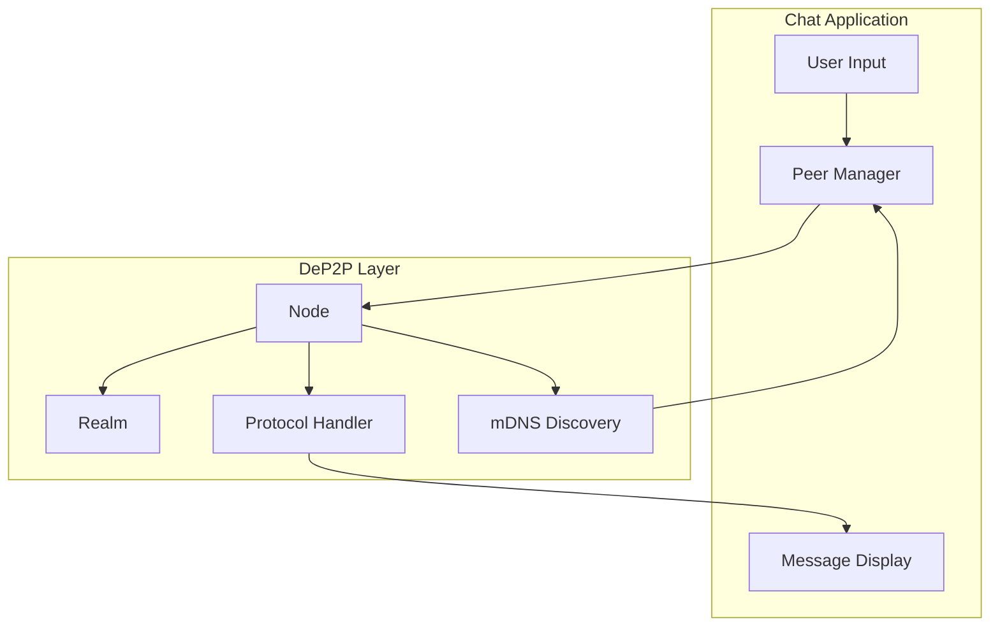
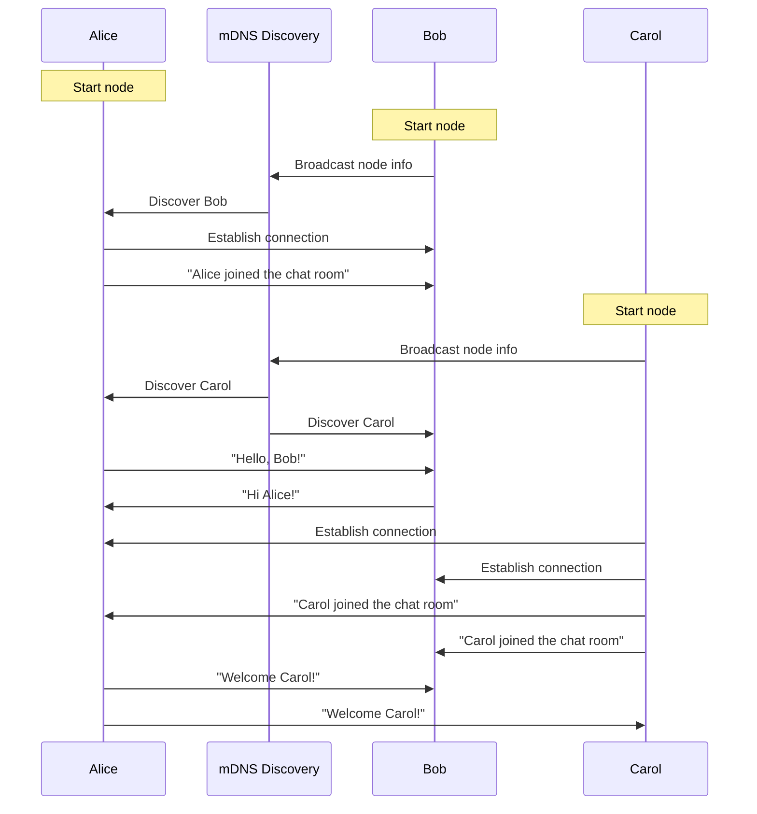

# Secure Chat Application

This tutorial will guide you through building a complete P2P chat application with bidirectional messaging and multi-user interaction.

---

## Tutorial Goals

```
┌─────────────────────────────────────────────────────────────────────┐
│                    After this tutorial you will learn               │
├─────────────────────────────────────────────────────────────────────┤
│                                                                      │
│  ✅ Design a chat message protocol                                   │
│  ✅ Implement bidirectional messaging                                │
│  ✅ Handle user input and message display                            │
│  ✅ Use mDNS to auto-discover nodes on the same network              │
│  ✅ Manage multiple peer connections                                 │
│                                                                      │
└─────────────────────────────────────────────────────────────────────┘
```

---

## Application Architecture



---

## Prerequisites

- Go 1.21 or higher
- DeP2P installed
- Multiple devices on the same LAN (or multiple terminals)

---

## Step 1: Design Message Protocol

First, we define the chat protocol structure:

```go
// Protocol identifier
const chatProtocol = "/chat/1.0.0"

// Message format: simple text
// Production apps may use JSON or Protobuf
```

```
┌─────────────────────────────────────────────────────────────────────┐
│                     Message Protocol Design                          │
├─────────────────────────────────────────────────────────────────────┤
│                                                                      │
│  Protocol ID: /chat/1.0.0                                           │
│                                                                      │
│  Message Format: [nickname]:[message content]                        │
│  Example: "Alice:Hello, everyone!"                                  │
│                                                                      │
│  Features:                                                           │
│  • Simple text format, easy to debug                                │
│  • Nickname identifies the sender                                   │
│  • Each message is independent, stateless                           │
│                                                                      │
└─────────────────────────────────────────────────────────────────────┘
```

---

## Step 2: Complete Code Implementation

Create file `chat/main.go`:

```go
package main

import (
    "bufio"
    "context"
    "fmt"
    "log"
    "os"
    "os/signal"
    "strings"
    "sync"
    "syscall"
    "time"

    "github.com/dep2p/go-dep2p"
    "github.com/dep2p/go-dep2p/pkg/types"
)

// Protocol identifier
const chatProtocol = "/chat/1.0.0"

// Global variables: manage all connected peers
var (
    peers     = make(map[string]dep2p.Stream) // NodeID -> Stream
    peersLock sync.RWMutex
    nickname  string
)

func main() {
    fmt.Println("╔════════════════════════════════════════╗")
    fmt.Println("║     DeP2P Secure Chat - P2P Chat       ║")
    fmt.Println("╚════════════════════════════════════════╝")
    fmt.Println()

    // Get nickname
    if len(os.Args) > 1 {
        nickname = os.Args[1]
    } else {
        fmt.Print("Enter your nickname: ")
        reader := bufio.NewReader(os.Stdin)
        nickname, _ = reader.ReadString('\n')
        nickname = strings.TrimSpace(nickname)
    }
    if nickname == "" {
        nickname = "Anonymous"
    }
    fmt.Printf("Welcome, %s!\n\n", nickname)

    ctx, cancel := context.WithCancel(context.Background())
    defer cancel()

    // Capture interrupt signal
    signalCh := make(chan os.Signal, 1)
    signal.Notify(signalCh, syscall.SIGINT, syscall.SIGTERM)
    go func() {
        <-signalCh
        fmt.Println("\n\nGoodbye! 👋")
        cancel()
    }()

    // ========================================
    // Step 1: Create node
    // ========================================
    fmt.Println("Starting node...")
    node, err := dep2p.New(ctx,
        dep2p.WithPreset(dep2p.PresetDesktop),
        // mDNS auto-enabled for LAN discovery
    )
    if err != nil {
        log.Fatalf("Failed to create node: %v", err)
    }
    if err := node.Start(ctx); err != nil {
        log.Fatalf("Failed to start node: %v", err)
    }
    defer node.Close()

    fmt.Printf("Node ID: %s\n", node.ID().ShortString())
    fmt.Println()

    // ========================================
    // Step 2: Join Realm
    // ========================================
    realmID := "chat-room"
    realm, err := node.Realm(realmID)
    if err != nil {
        log.Fatalf("Failed to get Realm: %v", err)
    }
    if err := realm.Join(ctx); err != nil {
        log.Fatalf("Failed to join Realm: %v", err)
    }
    fmt.Printf("Joined chat room: %s\n", realmID)
    fmt.Println()

    // ========================================
    // Step 3: Register message handler
    // ========================================
    node.Endpoint().SetProtocolHandler(chatProtocol, handleIncomingStream)
    fmt.Println("Message handler registered")
    fmt.Println()

    // ========================================
    // Step 4: Set connection notify (when new peer discovered)
    // ========================================
    node.Endpoint().SetConnectedNotify(func(conn dep2p.Connection) {
        remoteID := conn.RemoteID()
        fmt.Printf("\n🔗 New peer discovered: %s\n", remoteID.ShortString())
        fmt.Print("> ")
        
        // Try to establish chat stream
        go func() {
            time.Sleep(500 * time.Millisecond) // Wait for connection to stabilize
            connectToPeer(ctx, node, remoteID)
        }()
    })

    // ========================================
    // Step 5: Start chatting
    // ========================================
    fmt.Println("════════════════════════════════════════")
    fmt.Println("Chat room is ready!")
    fmt.Println("• Nodes on the same network will auto-discover and connect")
    fmt.Println("• Type message and press Enter to send")
    fmt.Println("• Type /quit to exit")
    fmt.Println("════════════════════════════════════════")
    fmt.Println()

    // Start input loop
    go inputLoop(ctx)

    // Wait for exit
    <-ctx.Done()
    
    // Close all streams
    peersLock.Lock()
    for _, stream := range peers {
        stream.Close()
    }
    peersLock.Unlock()
    
    fmt.Println("Chat ended")
}

// handleIncomingStream handles message streams from other nodes
func handleIncomingStream(stream dep2p.Stream) {
    remotePeer := stream.RemotePeer().String()
    
    // Save stream for sending messages
    peersLock.Lock()
    peers[remotePeer] = stream
    peersLock.Unlock()
    
    defer func() {
        peersLock.Lock()
        delete(peers, remotePeer)
        peersLock.Unlock()
        stream.Close()
    }()
    
    // Continuously read messages
    buf := make([]byte, 4096)
    for {
        n, err := stream.Read(buf)
        if err != nil {
            return
        }
        
        message := string(buf[:n])
        fmt.Printf("\n%s\n", message)
        fmt.Print("> ")
    }
}

// connectToPeer connects to a discovered peer
func connectToPeer(ctx context.Context, node dep2p.Node, peerID types.NodeID) {
    peersLock.RLock()
    _, exists := peers[peerID.String()]
    peersLock.RUnlock()
    
    if exists {
        return // Already connected
    }
    
    // Get connection
    conn, err := node.Connect(ctx, peerID)
    if err != nil {
        return
    }
    
    // Open chat stream
    stream, err := conn.OpenStream(ctx, chatProtocol)
    if err != nil {
        return
    }
    
    // Save stream
    peersLock.Lock()
    peers[peerID.String()] = stream
    peersLock.Unlock()
    
    // Send join message
    joinMsg := fmt.Sprintf("💬 %s joined the chat room", nickname)
    stream.Write([]byte(joinMsg))
    
    // Start read goroutine
    go func() {
        defer func() {
            peersLock.Lock()
            delete(peers, peerID.String())
            peersLock.Unlock()
            stream.Close()
            fmt.Printf("\n👋 Node %s left the chat room\n", peerID.ShortString())
            fmt.Print("> ")
        }()
        
        buf := make([]byte, 4096)
        for {
            n, err := stream.Read(buf)
            if err != nil {
                return
            }
            fmt.Printf("\n%s\n", string(buf[:n]))
            fmt.Print("> ")
        }
    }()
}

// inputLoop handles user input
func inputLoop(ctx context.Context) {
    reader := bufio.NewReader(os.Stdin)
    
    for {
        select {
        case <-ctx.Done():
            return
        default:
        }
        
        fmt.Print("> ")
        input, err := reader.ReadString('\n')
        if err != nil {
            continue
        }
        
        input = strings.TrimSpace(input)
        if input == "" {
            continue
        }
        
        // Check exit command
        if input == "/quit" || input == "/exit" {
            os.Exit(0)
        }
        
        // Format message
        message := fmt.Sprintf("<%s> %s", nickname, input)
        
        // Broadcast to all peers
        broadcastMessage(message)
    }
}

// broadcastMessage broadcasts message to all connected nodes
func broadcastMessage(message string) {
    peersLock.RLock()
    defer peersLock.RUnlock()
    
    if len(peers) == 0 {
        fmt.Println("(No other users yet)")
        return
    }
    
    for peerID, stream := range peers {
        _, err := stream.Write([]byte(message))
        if err != nil {
            fmt.Printf("Failed to send to %s\n", peerID[:8])
        }
    }
}
```

---

## Step 3: Run the Chat Application

### Terminal 1: User Alice

```bash
go run main.go Alice
```

### Terminal 2: User Bob

```bash
go run main.go Bob
```

### Terminal 3: User Carol (optional)

```bash
go run main.go Carol
```

---

## Expected Output

### Terminal 1 (Alice)

```
╔════════════════════════════════════════╗
║     DeP2P Secure Chat - P2P Chat       ║
╚════════════════════════════════════════╝

Welcome, Alice!

Starting node...
Node ID: 5Q2STW...

Joined chat room: chat-room

Message handler registered

════════════════════════════════════════
Chat room is ready!
• Nodes on the same network will auto-discover and connect
• Type message and press Enter to send
• Type /quit to exit
════════════════════════════════════════

🔗 New peer discovered: 7K3YTW...
> 
💬 Bob joined the chat room
> Hello, Bob!
<Bob> Hi Alice! Nice to meet you!
> 
🔗 New peer discovered: 9M5ZXY...
> 
💬 Carol joined the chat room
> Welcome Carol!
<Bob> Hey Carol!
<Carol> Thanks everyone!
```

### Terminal 2 (Bob)

```
╔════════════════════════════════════════╗
║     DeP2P Secure Chat - P2P Chat       ║
╚════════════════════════════════════════╝

Welcome, Bob!

Starting node...
Node ID: 7K3YTW...

Joined chat room: chat-room

════════════════════════════════════════
Chat room is ready!
════════════════════════════════════════

🔗 New peer discovered: 5Q2STW...
> 
💬 Alice joined the chat room
<Alice> Hello, Bob!
> Hi Alice! Nice to meet you!
```

---

## Message Flow



---

## Key Concepts

### 1. Bidirectional Stream Communication

```go
// Receive message
n, _ := stream.Read(buf)
message := string(buf[:n])

// Send message
stream.Write([]byte(message))
```

Each stream is bidirectional, supporting simultaneous read and write.

### 2. Peer Management

```go
var peers = make(map[string]dep2p.Stream)

// Save connection
peers[peerID] = stream

// Broadcast message
for _, stream := range peers {
    stream.Write([]byte(message))
}
```

Use a map to manage all connected peers.

### 3. mDNS Auto-Discovery

```go
node.Endpoint().SetConnectedNotify(func(conn dep2p.Connection) {
    // Callback when new node discovered
    remoteID := conn.RemoteID()
    connectToPeer(ctx, node, remoteID)
})
```

DeP2P automatically discovers nodes on the same network via mDNS.

### 4. Message Format

```go
// Format message
message := fmt.Sprintf("<%s> %s", nickname, input)
```

Simple text format including sender nickname.

---

## Extension Suggestions

### 1. Add Timestamps

```go
message := fmt.Sprintf("[%s] <%s> %s", 
    time.Now().Format("15:04:05"),
    nickname,
    input,
)
```

### 2. Use JSON Message Format

```go
type ChatMessage struct {
    From      string    `json:"from"`
    Content   string    `json:"content"`
    Timestamp time.Time `json:"timestamp"`
}

// Send
msg := ChatMessage{From: nickname, Content: input, Timestamp: time.Now()}
data, _ := json.Marshal(msg)
stream.Write(data)

// Receive
var msg ChatMessage
json.Unmarshal(buf[:n], &msg)
```

### 3. Private Messaging

```go
// Format: /msg <nickname> <message>
if strings.HasPrefix(input, "/msg ") {
    parts := strings.SplitN(input, " ", 3)
    targetNick := parts[1]
    privateMsg := parts[2]
    // Send only to specific user
}
```

### 4. Online User List

```go
// Format: /list
if input == "/list" {
    fmt.Println("Online users:")
    for peerID := range peers {
        fmt.Printf("  - %s\n", peerID[:16])
    }
}
```

---

## Troubleshooting

### Problem 1: Cannot Discover Other Nodes

**Possible causes**:
- Not on the same network
- Firewall blocking UDP broadcast
- mDNS service not running

**Solutions**:
- Ensure on the same WiFi/Ethernet
- Check firewall settings
- Manually connect using full address

### Problem 2: Messages Lost

**Possible causes**:
- Stream closed
- Network unstable

**Solutions**:
```go
// Add retry logic
for retry := 0; retry < 3; retry++ {
    _, err := stream.Write([]byte(message))
    if err == nil {
        break
    }
    time.Sleep(100 * time.Millisecond)
}
```

### Problem 3: Duplicate Connections

**Possible causes**:
- Both sides trying to connect

**Solutions**:
```go
// Check if already connected
peersLock.RLock()
_, exists := peers[peerID.String()]
peersLock.RUnlock()
if exists {
    return
}
```

---

## Security Notes

```
┌─────────────────────────────────────────────────────────────────────┐
│                        Security Features                             │
├─────────────────────────────────────────────────────────────────────┤
│                                                                      │
│  ✅ Transport Encryption                                             │
│     All messages encrypted via QUIC + TLS 1.3                        │
│                                                                      │
│  ✅ Identity Verification                                            │
│     Each node has unique NodeID (derived from public key)            │
│                                                                      │
│  ✅ Realm Isolation                                                  │
│     Only nodes in the same Realm can communicate                     │
│                                                                      │
│  ⚠️ Notes                                                           │
│     This example uses simple text format. For production:            │
│     • Use structured message format (JSON/Protobuf)                  │
│     • Add message signature verification                             │
│     • Implement end-to-end encryption                                │
│                                                                      │
└─────────────────────────────────────────────────────────────────────┘
```

---

## Next Steps

- [Cross-NAT Connection](03-cross-nat-connect.md) - Connect across different networks
- [Realm Application](04-realm-application.md) - Deep dive into Realm isolation
- [Hello World](01-hello-world.md) - Review basic concepts
