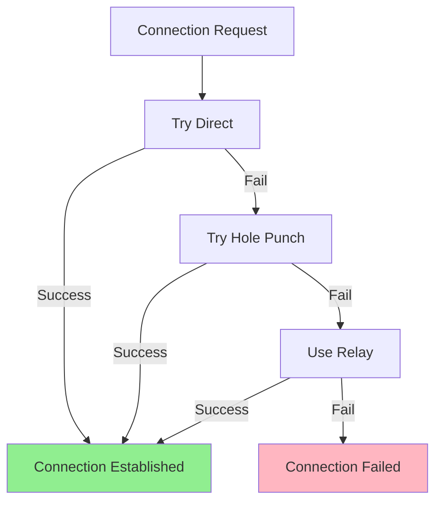
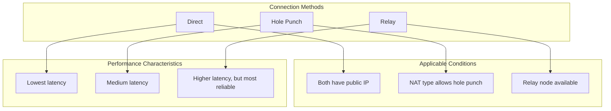

# Cross-NAT Connection

This tutorial will guide you through connecting nodes across different network environments, including using Relay to traverse NAT.

---

## Tutorial Goals

```
┌─────────────────────────────────────────────────────────────────────┐
│                    After this tutorial you will learn               │
├─────────────────────────────────────────────────────────────────────┤
│                                                                      │
│  ✅ Understand three NAT traversal methods                          │
│  ✅ Configure a Relay node                                           │
│  ✅ Establish connections between nodes behind NAT                   │
│  ✅ Understand connection fallback strategy                          │
│                                                                      │
└─────────────────────────────────────────────────────────────────────┘
```

---

## NAT Traversal Overview

```
┌─────────────────────────────────────────────────────────────────────────────┐
│                        NAT Traversal Strategy                                │
├─────────────────────────────────────────────────────────────────────────────┤
│                                                                              │
│                         ┌──────────────┐                                    │
│                         │   Internet   │                                    │
│                         └──────────────┘                                    │
│                                │                                            │
│            ┌───────────────────┼───────────────────┐                       │
│            │                   │                   │                       │
│     ┌──────┴──────┐     ┌──────┴──────┐     ┌──────┴──────┐               │
│     │   NAT A     │     │   Relay     │     │   NAT B     │               │
│     │(Home Router)│     │(Public Node)│     │(Corp Firewall)               │
│     └──────┬──────┘     └─────────────┘     └──────┬──────┘               │
│            │                                       │                       │
│     ┌──────┴──────┐                         ┌──────┴──────┐               │
│     │   Node A    │                         │   Node B    │               │
│     │ 192.168.1.x │                         │ 10.0.0.x    │               │
│     └─────────────┘                         └─────────────┘               │
│                                                                              │
│  Connection Strategy (by priority):                                          │
│  ──────────────────────────────────                                         │
│  1. Direct       - If both have public IP                                   │
│  2. Hole Punch   - Try UDP hole punching through NAT                        │
│  3. Relay        - Route through public Relay node                          │
│                                                                              │
└─────────────────────────────────────────────────────────────────────────────┘
```

---

## Connection Fallback Flow



---

## Network Topology

This tutorial uses the following network topology:

```
┌─────────────────────────────────────────────────────────────────────────────┐
│                         Example Network Topology                             │
├─────────────────────────────────────────────────────────────────────────────┤
│                                                                              │
│  ┌─────────────────┐                        ┌─────────────────┐            │
│  │    Network A    │                        │    Network B    │            │
│  │  192.168.1.0/24 │                        │  10.0.0.0/24    │            │
│  │                 │                        │                 │            │
│  │  ┌───────────┐  │                        │  ┌───────────┐  │            │
│  │  │  Node A   │  │      ┌─────────┐      │  │  Node B   │  │            │
│  │  │ .100:8001 │──┼──────│  Relay  │──────┼──│ .50:8002  │  │            │
│  │  └───────────┘  │      │Public IP│      │  └───────────┘  │            │
│  │                 │      └─────────┘      │                 │            │
│  └─────────────────┘                        └─────────────────┘            │
│                                                                              │
│  Scenario Description:                                                       │
│  • Node A and Node B are on different LANs                                  │
│  • Both are behind NAT                                                      │
│  • Connected via public Relay node                                          │
│                                                                              │
└─────────────────────────────────────────────────────────────────────────────┘
```

---

## Step 1: Configure Relay Node

The Relay node needs to be deployed on a public server with a fixed IP address.

Create file `relay/main.go`:

```go
package main

import (
    "context"
    "fmt"
    "log"
    "os"
    "os/signal"
    "syscall"

    "github.com/dep2p/go-dep2p"
    "github.com/dep2p/go-dep2p/pkg/types"
)

func main() {
    fmt.Println("╔════════════════════════════════════════╗")
    fmt.Println("║      DeP2P Relay Node                  ║")
    fmt.Println("╚════════════════════════════════════════╝")
    fmt.Println()

    ctx, cancel := context.WithCancel(context.Background())
    defer cancel()

    // Capture interrupt signal
    signalCh := make(chan os.Signal, 1)
    signal.Notify(signalCh, syscall.SIGINT, syscall.SIGTERM)
    go func() {
        <-signalCh
        fmt.Println("\nShutting down Relay node...")
        cancel()
    }()

    // ========================================
    // Create Relay node
    // ========================================
    fmt.Println("Starting Relay node...")
    node, err := dep2p.StartNode(ctx,
        dep2p.WithPreset(dep2p.PresetServer), // Server preset
        dep2p.WithListenPort(4001),           // Fixed port
        dep2p.WithRelayService(true),         // Enable relay service
    )
    if err != nil {
        log.Fatalf("Failed to start: %v", err)
    }
    defer node.Close()

    fmt.Printf("✅ Relay node started\n")
    fmt.Printf("   Node ID: %s\n", node.ID())
    fmt.Println()
    fmt.Println("Listen addresses:")
    for _, addr := range node.ListenAddrs() {
        fmt.Printf("   %s\n", addr)
    }
    fmt.Println()

    // Join system Realm (Relay service doesn't need specific business Realm)
    realmID := types.RealmID("relay-network")
    if err := node.Realm().JoinRealm(ctx, realmID); err != nil {
        log.Fatalf("Failed to join Realm: %v", err)
    }

    // Print connection info
    fmt.Println("════════════════════════════════════════")
    fmt.Println("Relay node is ready!")
    fmt.Println()
    fmt.Println("Other nodes can connect using this address:")
    for _, addr := range node.ListenAddrs() {
        fmt.Printf("   %s/p2p/%s\n", addr, node.ID())
    }
    fmt.Println()
    fmt.Println("Press Ctrl+C to shutdown")
    fmt.Println("════════════════════════════════════════")

    <-ctx.Done()
    fmt.Println("Relay node closed")
}
```

---

## Step 2: Configure Node A (Behind NAT)

Create file `node_a/main.go`:

```go
package main

import (
    "context"
    "fmt"
    "log"
    "os"
    "os/signal"
    "syscall"

    "github.com/dep2p/go-dep2p"
    "github.com/dep2p/go-dep2p/pkg/types"
)

// Relay node's full address (replace with actual address)
var relayAddr = "/ip4/1.2.3.4/udp/4001/quic-v1/p2p/QmRelayNodeID..."

const echoProtocol = "/echo/1.0.0"

func main() {
    fmt.Println("╔════════════════════════════════════════╗")
    fmt.Println("║      DeP2P Node A - Behind NAT         ║")
    fmt.Println("╚════════════════════════════════════════╝")
    fmt.Println()

    // Get Relay address from command line
    if len(os.Args) > 1 {
        relayAddr = os.Args[1]
    }

    ctx, cancel := context.WithCancel(context.Background())
    defer cancel()

    signalCh := make(chan os.Signal, 1)
    signal.Notify(signalCh, syscall.SIGINT, syscall.SIGTERM)
    go func() {
        <-signalCh
        fmt.Println("\nShutting down node...")
        cancel()
    }()

    // ========================================
    // Create node (configure Bootstrap node)
    // ========================================
    fmt.Println("Starting node...")
    node, err := dep2p.StartNode(ctx,
        dep2p.WithPreset(dep2p.PresetDesktop),
        dep2p.WithBootstrapPeers([]string{relayAddr}), // Use Relay as Bootstrap
        dep2p.WithEnableRelay(true),                   // Enable relay client
    )
    if err != nil {
        log.Fatalf("Failed to start: %v", err)
    }
    defer node.Close()

    fmt.Printf("✅ Node started\n")
    fmt.Printf("   Node ID: %s\n", node.ID())
    fmt.Println()

    // Join Realm
    realmID := types.RealmID("cross-nat-demo")
    if err := node.Realm().JoinRealm(ctx, realmID); err != nil {
        log.Fatalf("Failed to join Realm: %v", err)
    }
    fmt.Printf("✅ Joined Realm: %s\n", realmID)
    fmt.Println()

    // Register Echo handler
    node.Endpoint().SetProtocolHandler(echoProtocol, func(stream dep2p.Stream) {
        defer stream.Close()
        
        buf := make([]byte, 1024)
        n, err := stream.Read(buf)
        if err != nil {
            return
        }
        
        message := string(buf[:n])
        fmt.Printf("\n📨 Received message: %s\n", message)
        fmt.Printf("   From: %s\n", stream.RemotePeer().ShortString())
        
        // Echo response
        response := fmt.Sprintf("Echo: %s", message)
        stream.Write([]byte(response))
        fmt.Printf("📤 Sent response: %s\n", response)
    })

    fmt.Println("════════════════════════════════════════")
    fmt.Println("Node A is ready!")
    fmt.Println()
    fmt.Println("Start Node B on another network using this NodeID:")
    fmt.Printf("   %s\n", node.ID())
    fmt.Println()
    fmt.Println("Press Ctrl+C to shutdown")
    fmt.Println("════════════════════════════════════════")

    <-ctx.Done()
}
```

---

## Step 3: Configure Node B (Behind NAT)

Create file `node_b/main.go`:

```go
package main

import (
    "context"
    "fmt"
    "log"
    "os"
    "time"

    "github.com/dep2p/go-dep2p"
    "github.com/dep2p/go-dep2p/pkg/types"
)

// Relay node's full address
var relayAddr = "/ip4/1.2.3.4/udp/4001/quic-v1/p2p/QmRelayNodeID..."

const echoProtocol = "/echo/1.0.0"

func main() {
    fmt.Println("╔════════════════════════════════════════╗")
    fmt.Println("║      DeP2P Node B - Behind NAT         ║")
    fmt.Println("╚════════════════════════════════════════╝")
    fmt.Println()

    // Parse command line arguments
    if len(os.Args) < 2 {
        fmt.Println("Usage: go run main.go <NodeA's NodeID> [Relay address]")
        os.Exit(1)
    }
    nodeAIDStr := os.Args[1]
    if len(os.Args) > 2 {
        relayAddr = os.Args[2]
    }

    ctx, cancel := context.WithTimeout(context.Background(), 60*time.Second)
    defer cancel()

    // ========================================
    // Create node
    // ========================================
    fmt.Println("Starting node...")
    node, err := dep2p.StartNode(ctx,
        dep2p.WithPreset(dep2p.PresetDesktop),
        dep2p.WithBootstrapPeers([]string{relayAddr}),
        dep2p.WithEnableRelay(true),
    )
    if err != nil {
        log.Fatalf("Failed to start: %v", err)
    }
    defer node.Close()

    fmt.Printf("✅ Node started\n")
    fmt.Printf("   Node ID: %s\n", node.ID())
    fmt.Println()

    // Join Realm (must match Node A)
    realmID := types.RealmID("cross-nat-demo")
    if err := node.Realm().JoinRealm(ctx, realmID); err != nil {
        log.Fatalf("Failed to join Realm: %v", err)
    }
    fmt.Printf("✅ Joined Realm: %s\n", realmID)
    fmt.Println()

    // Parse target node ID
    nodeAID, err := types.ParseNodeID(nodeAIDStr)
    if err != nil {
        log.Fatalf("Failed to parse NodeID: %v", err)
    }

    // ========================================
    // Connect to Node A (auto-tries various traversal methods)
    // ========================================
    fmt.Println("Connecting to Node A...")
    fmt.Println("   Try order: Direct → Hole Punch → Relay")
    fmt.Println()

    startTime := time.Now()
    conn, err := node.Connect(ctx, nodeAID)
    if err != nil {
        log.Fatalf("Connection failed: %v", err)
    }
    connectTime := time.Since(startTime)

    fmt.Printf("✅ Connection successful! Time: %v\n", connectTime)
    fmt.Println()

    // ========================================
    // Send test message
    // ========================================
    fmt.Println("Sending test message...")
    stream, err := conn.OpenStream(ctx, echoProtocol)
    if err != nil {
        log.Fatalf("Failed to open stream: %v", err)
    }
    defer stream.Close()

    testMessage := "Hello from Node B via NAT!"
    _, err = stream.Write([]byte(testMessage))
    if err != nil {
        log.Fatalf("Failed to send: %v", err)
    }
    fmt.Printf("📤 Sent: %s\n", testMessage)

    // Read response
    buf := make([]byte, 1024)
    n, err := stream.Read(buf)
    if err != nil {
        log.Fatalf("Failed to read response: %v", err)
    }
    fmt.Printf("📨 Received response: %s\n", string(buf[:n]))
    fmt.Println()

    // ========================================
    // Done
    // ========================================
    fmt.Println("════════════════════════════════════════")
    fmt.Println("🎉 Cross-NAT connection test successful!")
    fmt.Printf("   Connection method: Auto-selected (may use relay)\n")
    fmt.Printf("   Connection time: %v\n", connectTime)
    fmt.Println("════════════════════════════════════════")
}
```

---

## Step 4: Run the Test

### 1. Start Relay Node (on public server)

```bash
cd relay
go run main.go
```

Note the full address from output, e.g.:

```
/ip4/1.2.3.4/udp/4001/quic-v1/p2p/QmRelay...
```

### 2. Start Node A (in Network A)

```bash
cd node_a
go run main.go "/ip4/1.2.3.4/udp/4001/quic-v1/p2p/QmRelay..."
```

Note the NodeID from output.

### 3. Start Node B (in Network B)

```bash
cd node_b
go run main.go "QmNodeA..." "/ip4/1.2.3.4/udp/4001/quic-v1/p2p/QmRelay..."
```

---

## Expected Output

### Relay Node

```
╔════════════════════════════════════════╗
║      DeP2P Relay Node                  ║
╚════════════════════════════════════════╝

Starting Relay node...
✅ Relay node started
   Node ID: QmRelay...

Listen addresses:
   /ip4/1.2.3.4/udp/4001/quic-v1

════════════════════════════════════════
Relay node is ready!

Other nodes can connect using this address:
   /ip4/1.2.3.4/udp/4001/quic-v1/p2p/QmRelay...

Press Ctrl+C to shutdown
════════════════════════════════════════
```

### Node A

```
╔════════════════════════════════════════╗
║      DeP2P Node A - Behind NAT         ║
╚════════════════════════════════════════╝

Starting node...
✅ Node started
   Node ID: QmNodeA...

✅ Joined Realm: cross-nat-demo

════════════════════════════════════════
Node A is ready!

Start Node B on another network using this NodeID:
   QmNodeA...

Press Ctrl+C to shutdown
════════════════════════════════════════

📨 Received message: Hello from Node B via NAT!
   From: QmNodeB...
📤 Sent response: Echo: Hello from Node B via NAT!
```

### Node B

```
╔════════════════════════════════════════╗
║      DeP2P Node B - Behind NAT         ║
╚════════════════════════════════════════╝

Starting node...
✅ Node started
   Node ID: QmNodeB...

✅ Joined Realm: cross-nat-demo

Connecting to Node A...
   Try order: Direct → Hole Punch → Relay

✅ Connection successful! Time: 1.2s

Sending test message...
📤 Sent: Hello from Node B via NAT!
📨 Received response: Echo: Hello from Node B via NAT!

════════════════════════════════════════
🎉 Cross-NAT connection test successful!
   Connection method: Auto-selected (may use relay)
   Connection time: 1.2s
════════════════════════════════════════
```

---

## Connection Methods Explained



### NAT Type Impact on Hole Punching

| NAT Type | Hole Punch Success Rate | Description |
|----------|------------------------|-------------|
| Full Cone | High | Easiest to traverse |
| Restricted Cone | Medium | Needs coordination |
| Port Restricted | Low | Difficult |
| Symmetric | Very Low | Nearly impossible, needs relay |

---

## Troubleshooting

### Problem 1: Cannot Connect to Relay

**Symptom**: Error "connect to bootstrap failed" on node start

**Solutions**:
- Confirm Relay node is running
- Confirm Relay address is correct (includes full NodeID)
- Check firewall allows UDP port 4001

### Problem 2: Connection via Relay Times Out

**Symptom**: Connection takes very long or times out

**Solutions**:
```go
// Increase timeout
ctx, cancel := context.WithTimeout(context.Background(), 120*time.Second)

// Or explicitly use relay
conn, err := node.ConnectViaRelay(ctx, nodeAID, relayNodeID)
```

### Problem 3: Messages Lost After Connection

**Symptom**: Connection successful but no message response

**Solutions**:
- Confirm both nodes joined the same Realm
- Check protocol identifiers match
- Add message acknowledgment mechanism

---

## Advanced Configuration

### Using Multiple Relays

```go
node, err := dep2p.StartNode(ctx,
    dep2p.WithPreset(dep2p.PresetDesktop),
    dep2p.WithBootstrapPeers([]string{
        relay1Addr,
        relay2Addr,
        relay3Addr,
    }),
    dep2p.WithEnableRelay(true),
)
```

### Auto-Select Best Relay

DeP2P automatically selects the Relay node with lowest latency.

---

## Next Steps

- [Realm Application](04-realm-application.md) - Deep dive into Realm isolation
- [Hello World](01-hello-world.md) - Review basic concepts
- [Secure Chat](02-secure-chat.md) - Build a chat application
