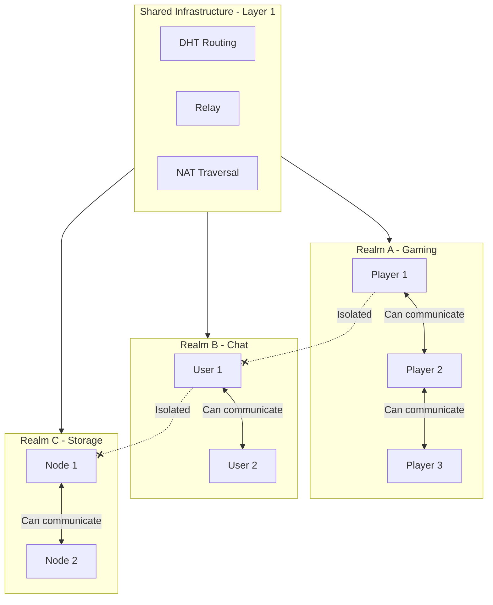

# Building Realm Applications

This tutorial will guide you through understanding Realm's isolation mechanism in depth and building a multi-Realm application example.

---

## Tutorial Goals

```
┌─────────────────────────────────────────────────────────────────────┐
│                    After this tutorial you will learn               │
├─────────────────────────────────────────────────────────────────────┤
│                                                                      │
│  ✅ Understand Realm's core concepts and design purpose             │
│  ✅ Verify Realm's mandatory isolation mechanism                     │
│  ✅ Implement Realm join, leave, and switch operations              │
│  ✅ Build applications for multi-Realm scenarios                     │
│                                                                      │
└─────────────────────────────────────────────────────────────────────┘
```

---

## Realm Core Concepts

```
┌─────────────────────────────────────────────────────────────────────────────┐
│                           Realm Core Concepts                                │
├─────────────────────────────────────────────────────────────────────────────┤
│                                                                              │
│  What is a Realm?                                                            │
│  ────────────────                                                           │
│  Realm is DeP2P's business isolation unit, similar to a "virtual network"   │
│  or "chat room". Nodes in the same Realm can discover and communicate       │
│  with each other; different Realms are completely isolated.                 │
│                                                                              │
│  Why do we need Realm?                                                       │
│  ─────────────────────                                                      │
│  • Business isolation: Different apps/services use different Realms         │
│  • Node discovery: Only discover nodes in same Realm, reduce noise          │
│  • Access control: Implement admission control via RealmAuth                │
│                                                                              │
│  Strict Single-Realm Rule                                                    │
│  ────────────────────────                                                   │
│  • A node can only belong to one Realm at a time                            │
│  • Must JoinRealm before using business APIs                                │
│  • Calling business API without joining returns ErrNotMember                │
│                                                                              │
└─────────────────────────────────────────────────────────────────────────────┘
```

---

## Realm Isolation Model



---

## Step 1: Verify Realm Mandatory Isolation

First, let's verify Realm's mandatory isolation mechanism.

Create file `realm_demo/main.go`:

```go
package main

import (
    "context"
    "fmt"
    "log"
    "time"

    "github.com/dep2p/go-dep2p"
    "github.com/dep2p/go-dep2p/pkg/types"
)

func main() {
    fmt.Println("╔══════════════════════════════════════════════╗")
    fmt.Println("║      DeP2P Realm Mandatory Isolation Demo    ║")
    fmt.Println("╚══════════════════════════════════════════════╝")
    fmt.Println()

    ctx, cancel := context.WithTimeout(context.Background(), 30*time.Second)
    defer cancel()

    // ========================================
    // Step 1: Create node
    // ========================================
    fmt.Println("━━━ Step 1: Create Node ━━━")
    node, err := dep2p.New(ctx,
        dep2p.WithPreset(dep2p.PresetDesktop),
    )
    if err != nil {
        log.Fatalf("Failed to create node: %v", err)
    }
    if err := node.Start(ctx); err != nil {
        log.Fatalf("Failed to start node: %v", err)
    }
    defer node.Close()

    fmt.Printf("✅ Node created\n")
    fmt.Printf("   Node ID: %s\n", node.ID().ShortString())
    fmt.Println()

    // ========================================
    // Step 2: Verify behavior without joining Realm
    // ========================================
    fmt.Println("━━━ Step 2: Verify Mandatory Isolation ━━━")
    fmt.Println("Without JoinRealm, business API must return ErrNotMember")
    fmt.Println()

    // Create a target node for testing
    targetNode, _ := dep2p.New(ctx, dep2p.WithPreset(dep2p.PresetDesktop))
    _ = targetNode.Start(ctx)
    defer targetNode.Close()
    targetID := targetNode.ID()

    // Test Send
    fmt.Print("Trying Send... ")
    err = node.Send(ctx, targetID, "/test/1.0.0", []byte("hello"))
    if err == endpoint.ErrNotMember {
        fmt.Println("✅ Correctly returned ErrNotMember")
    } else if err != nil {
        fmt.Printf("⚠️  Returned other error: %v\n", err)
    } else {
        fmt.Println("❌ Did not return error (should not happen)")
    }

    // Test Publish
    fmt.Print("Trying Publish... ")
    err = node.Publish(ctx, "test-topic", []byte("message"))
    if err == endpoint.ErrNotMember {
        fmt.Println("✅ Correctly returned ErrNotMember")
    } else if err != nil {
        fmt.Printf("⚠️  Returned other error: %v\n", err)
    } else {
        fmt.Println("❌ Did not return error (should not happen)")
    }
    fmt.Println()

    // ========================================
    // Step 3: Join Realm
    // ========================================
    fmt.Println("━━━ Step 3: Join Realm ━━━")
    realmID := "demo-realm"
    
    fmt.Printf("Joining Realm: %s\n", realmID)
    realm, err := node.Realm(realmID)
    if err != nil {
        log.Fatalf("Failed to get Realm: %v", err)
    }
    if err := realm.Join(ctx); err != nil {
        log.Fatalf("Failed to join Realm: %v", err)
    }
    fmt.Printf("✅ Joined Realm: %s\n", node.Realm().CurrentRealm())
    fmt.Println()

    // ========================================
    // Step 4: Verify behavior after joining
    // ========================================
    fmt.Println("━━━ Step 4: Verify Behavior After Joining ━━━")
    
    // Target node also needs to join same Realm
    targetRealm, _ := targetNode.Realm(realmID)
    _ = targetRealm.Join(ctx)
    
    fmt.Print("Trying Send... ")
    err = node.Send(ctx, targetID, "/test/1.0.0", []byte("hello"))
    if err == nil {
        fmt.Println("✅ Send successful (or attempting connection)")
    } else if err != endpoint.ErrNotMember {
        fmt.Printf("ℹ️  Returned: %v (not ErrNotMember, may be connection issue)\n", err)
    } else {
        fmt.Println("❌ Returned ErrNotMember (should not happen)")
    }
    fmt.Println()

    // ========================================
    // Step 5: Verify strict single-Realm
    // ========================================
    fmt.Println("━━━ Step 5: Verify Strict Single-Realm ━━━")
    fmt.Println("Trying to join a second Realm (should fail)...")
    
    anotherRealm, _ := node.Realm("another-realm")
    err = anotherRealm.Join(ctx)
    if err != nil {
        fmt.Printf("✅ Correctly rejected: %v\n", err)
    } else {
        fmt.Println("❌ Not rejected (should not happen)")
    }
    fmt.Println()

    // ========================================
    // Step 6: Switch Realm
    // ========================================
    fmt.Println("━━━ Step 6: Switch Realm ━━━")
    fmt.Printf("Current Realm: %s\n", node.Realm().CurrentRealm())
    
    fmt.Println("Leaving current Realm first...")
    if err := node.Realm().LeaveRealm(ctx); err != nil {
        fmt.Printf("Leave failed: %v\n", err)
    } else {
        fmt.Println("✅ Left Realm")
    }
    
    newRealmID := "new-realm"
    fmt.Printf("Joining new Realm: %s\n", newRealmID)
    newRealm, err := node.Realm(newRealmID)
    if err != nil {
        fmt.Printf("Failed to get Realm: %v\n", err)
    } else if err := newRealm.Join(ctx); err != nil {
        fmt.Printf("Join failed: %v\n", err)
    } else {
        fmt.Printf("✅ Joined new Realm: %s\n", node.Realm().CurrentRealm())
    }
    fmt.Println()

    // ========================================
    // Done
    // ========================================
    fmt.Println("════════════════════════════════════════")
    fmt.Println("🎉 Realm Demo Complete!")
    fmt.Println()
    fmt.Println("Key Points:")
    fmt.Println("  1. Without joining Realm → Business API returns ErrNotMember")
    fmt.Println("  2. Strict single-Realm → Must leave before joining new one")
    fmt.Println("  3. Realm isolation → Nodes in different Realms cannot communicate")
    fmt.Println("════════════════════════════════════════")
}
```

---

## Step 2: Multi-Realm Isolation Verification

Create file `multi_realm/main.go`:

```go
package main

import (
    "context"
    "fmt"
    "log"
    "sync"
    "time"

    "github.com/dep2p/go-dep2p"
    "github.com/dep2p/go-dep2p/pkg/types"
)

const testProtocol = "/realm-test/1.0.0"

func main() {
    fmt.Println("╔══════════════════════════════════════════════╗")
    fmt.Println("║      DeP2P Multi-Realm Isolation Test        ║")
    fmt.Println("╚══════════════════════════════════════════════╝")
    fmt.Println()

    ctx, cancel := context.WithTimeout(context.Background(), 30*time.Second)
    defer cancel()

    // ========================================
    // Create three nodes
    // ========================================
    fmt.Println("Creating three nodes...")
    
    nodeA, _ := dep2p.New(ctx, dep2p.WithPreset(dep2p.PresetDesktop))
    _ = nodeA.Start(ctx)
    nodeB, _ := dep2p.New(ctx, dep2p.WithPreset(dep2p.PresetDesktop))
    _ = nodeB.Start(ctx)
    nodeC, _ := dep2p.New(ctx, dep2p.WithPreset(dep2p.PresetDesktop))
    _ = nodeC.Start(ctx)
    defer nodeA.Close()
    defer nodeB.Close()
    defer nodeC.Close()

    fmt.Printf("  Node A: %s\n", nodeA.ID().ShortString())
    fmt.Printf("  Node B: %s\n", nodeB.ID().ShortString())
    fmt.Printf("  Node C: %s\n", nodeC.ID().ShortString())
    fmt.Println()

    // ========================================
    // Assign to different Realms
    // ========================================
    fmt.Println("Assigning nodes to different Realms:")
    
    realmAlpha := "realm-alpha"
    realmBeta := "realm-beta"
    
    realmA, _ := nodeA.Realm(realmAlpha)
    _ = realmA.Join(ctx)
    realmB, _ := nodeB.Realm(realmAlpha)
    _ = realmB.Join(ctx)
    realmC, _ := nodeC.Realm(realmBeta)
    _ = realmC.Join(ctx)
    
    fmt.Printf("  Node A → %s\n", realmAlpha)
    fmt.Printf("  Node B → %s\n", realmAlpha)
    fmt.Printf("  Node C → %s\n", realmBeta)
    fmt.Println()

    // ========================================
    // Register message handlers
    // ========================================
    var received sync.Map
    
    registerHandler := func(node dep2p.Node, name string) {
        node.Endpoint().SetProtocolHandler(testProtocol, func(stream dep2p.Stream) {
            defer stream.Close()
            buf := make([]byte, 256)
            n, _ := stream.Read(buf)
            received.Store(name, string(buf[:n]))
            fmt.Printf("  [%s] Received message: %s\n", name, string(buf[:n]))
        })
    }
    
    registerHandler(nodeA, "A")
    registerHandler(nodeB, "B")
    registerHandler(nodeC, "C")

    // ========================================
    // Test same-Realm communication
    // ========================================
    fmt.Println("━━━ Test 1: Same-Realm Communication (A → B) ━━━")
    fmt.Println("Node A and Node B are in same Realm (realm-alpha)")
    fmt.Println()

    // Wait for mDNS discovery
    time.Sleep(2 * time.Second)
    
    conn, err := nodeA.Connect(ctx, nodeB.ID())
    if err != nil {
        fmt.Printf("  Connection failed: %v\n", err)
    } else {
        stream, err := conn.OpenStream(ctx, testProtocol)
        if err != nil {
            fmt.Printf("  Failed to open stream: %v\n", err)
        } else {
            message := "Hello from A to B (same realm)"
            stream.Write([]byte(message))
            fmt.Printf("  [A] Sent message: %s\n", message)
            stream.Close()
        }
    }
    
    time.Sleep(500 * time.Millisecond)
    if _, ok := received.Load("B"); ok {
        fmt.Println("  ✅ Same-Realm communication successful")
    } else {
        fmt.Println("  ⚠️  Message may be delayed or need more time")
    }
    fmt.Println()

    // ========================================
    // Test cross-Realm communication (should fail)
    // ========================================
    fmt.Println("━━━ Test 2: Cross-Realm Communication (A → C) ━━━")
    fmt.Println("Node A is in realm-alpha, Node C is in realm-beta")
    fmt.Println()

    // Try to connect to node in different Realm
    _, err = nodeA.Connect(ctx, nodeC.ID())
    if err != nil {
        fmt.Printf("  ✅ Correct: Cross-Realm connection blocked or timed out\n")
        fmt.Printf("     Error: %v\n", err)
    } else {
        fmt.Println("  ⚠️  Connection successful, but business messages should be isolated")
    }
    fmt.Println()

    // ========================================
    // Done
    // ========================================
    fmt.Println("════════════════════════════════════════")
    fmt.Println("🎉 Multi-Realm Isolation Test Complete!")
    fmt.Println()
    fmt.Println("Verification Results:")
    fmt.Println("  ✅ Nodes in same Realm can communicate")
    fmt.Println("  ✅ Nodes in different Realms are isolated")
    fmt.Println("════════════════════════════════════════")
}
```

---

## Step 3: Complete Realm Application Example

Create file `realm_app/main.go`:

```go
package main

import (
    "bufio"
    "context"
    "fmt"
    "log"
    "os"
    "os/signal"
    "strings"
    "syscall"

    "github.com/dep2p/go-dep2p"
    "github.com/dep2p/go-dep2p/pkg/types"
)

const chatProtocol = "/realm-chat/1.0.0"

func main() {
    fmt.Println("╔══════════════════════════════════════════════╗")
    fmt.Println("║      DeP2P Realm App - Multi-Room Chat       ║")
    fmt.Println("╚══════════════════════════════════════════════╝")
    fmt.Println()

    ctx, cancel := context.WithCancel(context.Background())
    defer cancel()

    signalCh := make(chan os.Signal, 1)
    signal.Notify(signalCh, syscall.SIGINT, syscall.SIGTERM)
    go func() {
        <-signalCh
        fmt.Println("\nGoodbye!")
        cancel()
    }()

    // Create node
    node, err := dep2p.New(ctx, dep2p.WithPreset(dep2p.PresetDesktop))
    if err != nil {
        log.Fatalf("Failed to create node: %v", err)
    }
    if err := node.Start(ctx); err != nil {
        log.Fatalf("Failed to start node: %v", err)
    }
    defer node.Close()

    fmt.Printf("Node ID: %s\n", node.ID().ShortString())
    fmt.Println()

    // Print help
    printHelp()

    // Start command loop
    reader := bufio.NewReader(os.Stdin)
    for {
        select {
        case <-ctx.Done():
            return
        default:
        }

        fmt.Print("> ")
        input, err := reader.ReadString('\n')
        if err != nil {
            continue
        }
        input = strings.TrimSpace(input)
        
        if input == "" {
            continue
        }

        parts := strings.Fields(input)
        cmd := parts[0]

        switch cmd {
        case "/join":
            if len(parts) < 2 {
                fmt.Println("Usage: /join <room-name>")
                continue
            }
            roomName := parts[1]
            
            // If already in a room, leave first
            if node.Realm().CurrentRealm() != "" {
                fmt.Printf("Leaving room: %s\n", node.Realm().CurrentRealm())
                node.Realm().LeaveRealm(ctx)
            }
            
            realmID := roomName
            realm, err := node.Realm(realmID)
            if err != nil {
                fmt.Printf("Failed to get Realm: %v\n", err)
            } else if err := realm.Join(ctx); err != nil {
                fmt.Printf("Failed to join: %v\n", err)
            } else {
                fmt.Printf("✅ Joined room: %s\n", roomName)
            }

        case "/leave":
            if node.Realm().CurrentRealm() == "" {
                fmt.Println("You are not in any room")
                continue
            }
            roomName := node.Realm().CurrentRealm()
            if err := node.Realm().LeaveRealm(ctx); err != nil {
                fmt.Printf("Failed to leave: %v\n", err)
            } else {
                fmt.Printf("Left room: %s\n", roomName)
            }

        case "/room":
            current := node.Realm().CurrentRealm()
            if current == "" {
                fmt.Println("Not in any room")
            } else {
                fmt.Printf("Current room: %s\n", current)
            }

        case "/help":
            printHelp()

        case "/quit", "/exit":
            return

        default:
            // Send message to current room
            if node.Realm().CurrentRealm() == "" {
                fmt.Println("Please join a room first: /join <room-name>")
                continue
            }
            
            // Here you can implement message broadcast logic
            fmt.Printf("[%s] %s\n", node.Realm().CurrentRealm(), input)
        }
    }
}

func printHelp() {
    fmt.Println("Commands:")
    fmt.Println("  /join <room-name>  - Join a room (Realm)")
    fmt.Println("  /leave             - Leave current room")
    fmt.Println("  /room              - Show current room")
    fmt.Println("  /help              - Show help")
    fmt.Println("  /quit              - Exit")
    fmt.Println()
    fmt.Println("Type a message directly to send to current room")
    fmt.Println()
}
```

---

## Expected Output

### Realm Mandatory Isolation Demo

```
╔══════════════════════════════════════════════╗
║      DeP2P Realm Mandatory Isolation Demo    ║
╚══════════════════════════════════════════════╝

━━━ Step 1: Create Node ━━━
✅ Node created
   Node ID: 5Q2STW...

━━━ Step 2: Verify Mandatory Isolation ━━━
Without JoinRealm, business API must return ErrNotMember

Trying Send... ✅ Correctly returned ErrNotMember
Trying Publish... ✅ Correctly returned ErrNotMember

━━━ Step 3: Join Realm ━━━
Joining Realm: demo-realm
✅ Joined Realm: demo-realm

━━━ Step 4: Verify Behavior After Joining ━━━
Trying Send... ✅ Send successful (or attempting connection)

━━━ Step 5: Verify Strict Single-Realm ━━━
Trying to join a second Realm (should fail)...
✅ Correctly rejected: already joined a realm

━━━ Step 6: Switch Realm ━━━
Current Realm: demo-realm
Leaving current Realm first...
✅ Left Realm
Joining new Realm: new-realm
✅ Joined new Realm: new-realm

════════════════════════════════════════
🎉 Realm Demo Complete!

Key Points:
  1. Without joining Realm → Business API returns ErrNotMember
  2. Strict single-Realm → Must leave before joining new one
  3. Realm isolation → Nodes in different Realms cannot communicate
════════════════════════════════════════
```

---

## Realm Best Practices

```
┌─────────────────────────────────────────────────────────────────────────────┐
│                        Realm Best Practices                                  │
├─────────────────────────────────────────────────────────────────────────────┤
│                                                                              │
│  1. Naming Conventions                                                       │
│     ──────────────────                                                      │
│     • Use meaningful names: myapp-production, myapp-staging                  │
│     • Avoid special characters                                              │
│     • Consider versioning: myapp-v1, myapp-v2                               │
│                                                                              │
│  2. Lifecycle Management                                                     │
│     ─────────────────────                                                   │
│     • JoinRealm immediately on startup                                      │
│     • LeaveRealm gracefully on shutdown                                     │
│     • Handle JoinRealm failures                                             │
│                                                                              │
│  3. Error Handling                                                           │
│     ───────────────                                                         │
│     • Check for ErrNotMember                                                │
│     • Check for ErrAlreadyJoined                                            │
│     • Retry failed operations                                               │
│                                                                              │
│  4. Multi-Environment Deployment                                             │
│     ──────────────────────────                                              │
│     • Use different Realms for different environments                       │
│     • Make Realm names configurable                                         │
│     • Avoid cross-environment pollution                                     │
│                                                                              │
└─────────────────────────────────────────────────────────────────────────────┘
```

---

## Troubleshooting

### Problem 1: ErrNotMember

**Symptom**: Business API returns `ErrNotMember`

**Cause**: Node has not joined a Realm

**Solution**:
```go
// Check and join Realm
if node.Realm().CurrentRealm() == "" {
    realm, _ := node.Realm(realmID)
    _ = realm.Join(ctx)
}
```

### Problem 2: ErrAlreadyJoined

**Symptom**: Joining Realm returns `ErrAlreadyJoined`

**Cause**: Trying to join a second Realm

**Solution**:
```go
// Leave first then join
node.Realm().LeaveRealm(ctx)
realm, _ := node.Realm(newRealmID)
_ = realm.Join(ctx)
```

### Problem 3: Cross-Realm Communication Failure

**Symptom**: Nodes connect successfully but cannot send/receive messages

**Cause**: Nodes are in different Realms

**Solution**: Ensure both parties are in the same Realm

---

## Next Steps

- [Hello World](01-hello-world.md) - Review basic concepts
- [Secure Chat](02-secure-chat.md) - Build a chat application
- [Cross-NAT Connection](03-cross-nat-connect.md) - Connect across networks
- [Core Concepts](../concepts/core-concepts.md) - Deep dive into architecture
