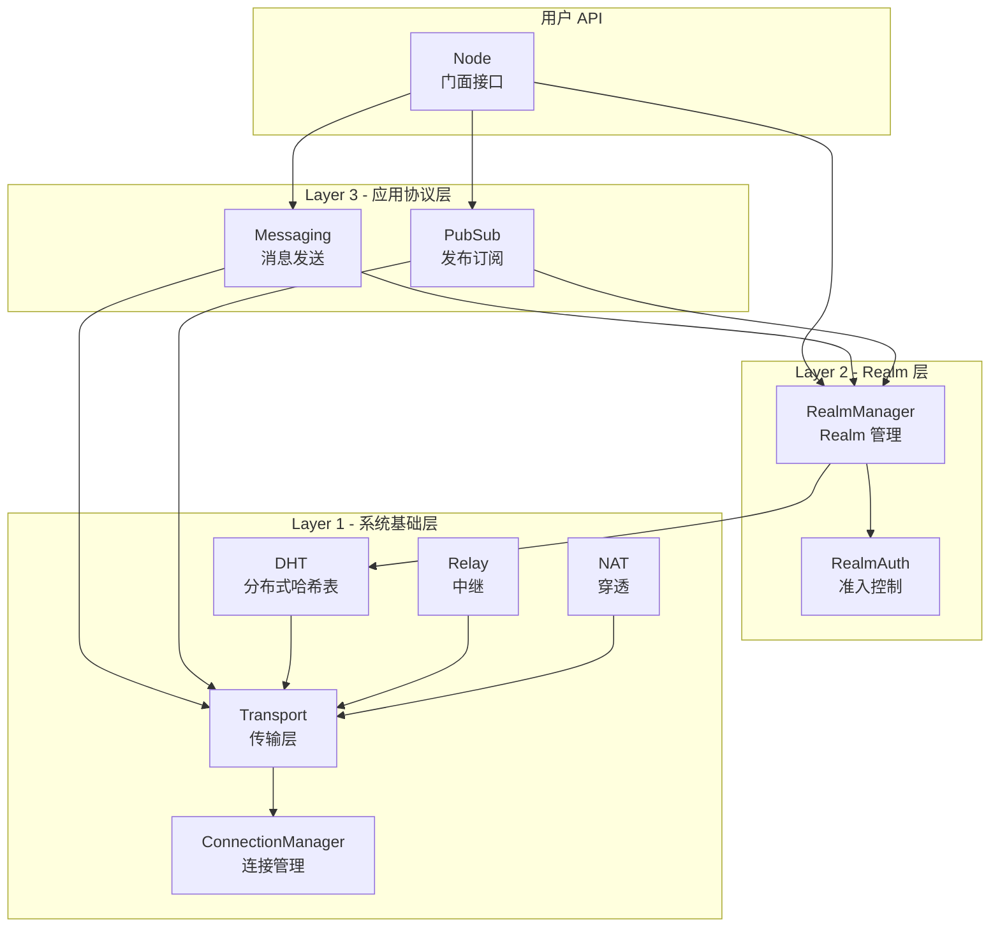
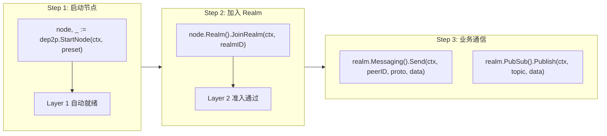
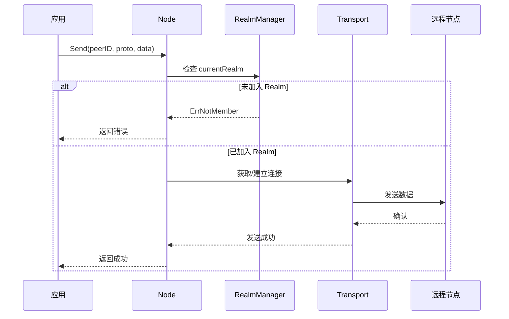
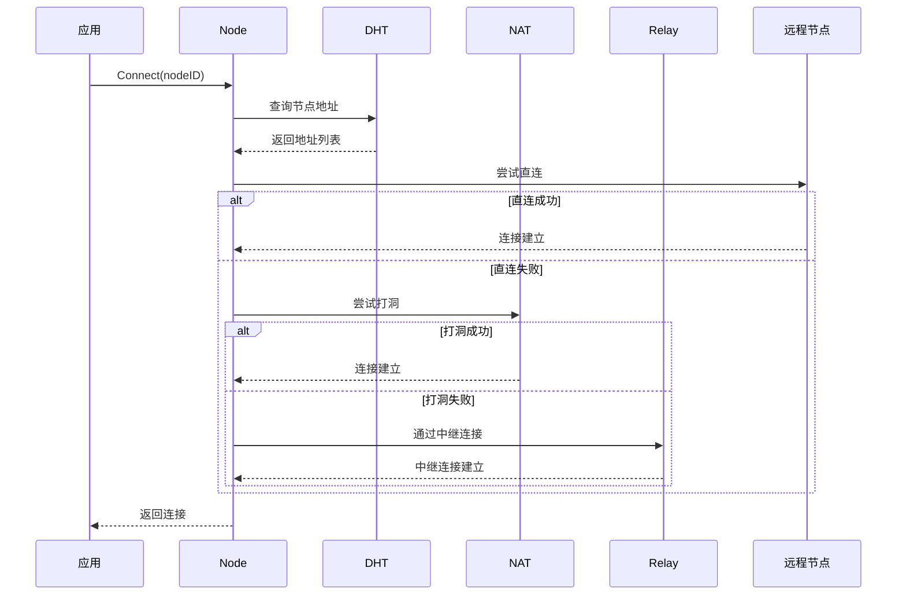

# 架构概览

本文档介绍 DeP2P 的系统架构设计，帮助你理解各组件如何协同工作。

---

## 架构设计理念

```
┌─────────────────────────────────────────────────────────────────────┐
│                        DeP2P 架构设计理念                            │
├─────────────────────────────────────────────────────────────────────┤
│                                                                      │
│  1. 简单易用                                                         │
│     让 P2P 连接像调用函数一样简单：给一个公钥，发个消息               │
│                                                                      │
│  2. 共享基础设施 + 业务隔离                                          │
│     所有节点共享 DHT/Relay/NAT，同时业务层完全隔离                   │
│                                                                      │
│  3. 严格单 Realm 模型                                                │
│     节点同一时间只属于一个业务 Realm，Join 前业务层零交互             │
│                                                                      │
│  4. 透明基础设施                                                     │
│     系统层对用户完全透明，无需手动配置                               │
│                                                                      │
└─────────────────────────────────────────────────────────────────────┘
```

---

## 三层架构详解

DeP2P 采用三层架构设计，每层有明确的职责和边界：

### Layer 1: 系统基础层（Infrastructure）

```
┌─────────────────────────────────────────────────────────────────────────────┐
│  Layer 1: 系统基础层 (Infrastructure)                                       │
├─────────────────────────────────────────────────────────────────────────────┤
│                                                                              │
│   ┌────────────────────────────────────────────────────────────────────┐    │
│   │                        传输子系统 (Transport)                       │    │
│   │  ────────────────────────────────────────────────────────────────  │    │
│   │  • QUIC (推荐)    - 内置加密、多路复用、0-RTT                      │    │
│   │  • TCP            - 兼容传统环境                                   │    │
│   │  • WebSocket      - 浏览器兼容                                     │    │
│   │  • TLS/Noise      - 安全层                                         │    │
│   └────────────────────────────────────────────────────────────────────┘    │
│                                                                              │
│   ┌─────────────┐  ┌─────────────┐  ┌─────────────┐  ┌─────────────┐       │
│   │  System DHT │  │   Relay     │  │     NAT     │  │  Bootstrap  │       │
│   │  ─────────  │  │  ─────────  │  │  ─────────  │  │  ─────────  │       │
│   │  Kademlia   │  │  兜底通道   │  │  地址发现   │  │  引导节点   │       │
│   │  路由发现   │  │  穿透失败   │  │  STUN/UPnP  │  │  种子来源   │       │
│   │  Provider   │  │  时使用     │  │  NAT 类型   │  │  DHT 入口   │       │
│   └─────────────┘  └─────────────┘  └─────────────┘  └─────────────┘       │
│                                                                              │
│   特点：节点启动自动就绪，用户完全无感知                                     │
│   协议前缀：/dep2p/sys/...                                                  │
│                                                                              │
└─────────────────────────────────────────────────────────────────────────────┘
```

### Layer 2: Realm 层（Business Isolation）

```
┌─────────────────────────────────────────────────────────────────────────────┐
│  Layer 2: Realm 层 (Business Isolation)                                     │
├─────────────────────────────────────────────────────────────────────────────┤
│                                                                              │
│   ┌─────────────────────────────────────────────────────────────────────┐   │
│   │                        Realm 管理器                                  │   │
│   │  ─────────────────────────────────────────────────────────────────  │   │
│   │  • JoinRealm(realmID)     加入指定 Realm                            │   │
│   │  • LeaveRealm()           离开当前 Realm                            │   │
│   │  • CurrentRealm()         获取当前 Realm                            │   │
│   │  • SwitchRealm(realmID)   切换到其他 Realm（原子操作）              │   │
│   └─────────────────────────────────────────────────────────────────────┘   │
│                                                                              │
│   ┌────────────────┐  ┌────────────────┐  ┌────────────────┐               │
│   │   成员管理     │  │   准入控制     │  │   RealmAuth    │               │
│   │   ──────────  │  │   ──────────  │  │   ──────────  │               │
│   │   节点列表     │  │   Public      │  │   签名验证     │               │
│   │   在线状态     │  │   Protected   │  │   凭证检查     │               │
│   │   服务发现     │  │   Private     │  │   权限校验     │               │
│   └────────────────┘  └────────────────┘  └────────────────┘               │
│                                                                              │
│   特点：用户显式操作，严格单 Realm                                           │
│   协议前缀：/dep2p/sys/realm/...                                            │
│                                                                              │
└─────────────────────────────────────────────────────────────────────────────┘
```

### Layer 3: 应用协议层（Application Protocols）

```
┌─────────────────────────────────────────────────────────────────────────────┐
│  Layer 3: 应用协议层 (Application Protocols)                                │
├─────────────────────────────────────────────────────────────────────────────┤
│                                                                              │
│   ┌─────────────────────────────────┐  ┌─────────────────────────────────┐ │
│   │        流协议 (Stream)           │  │       订阅协议 (PubSub)          │ │
│   │  ─────────────────────────────  │  │  ─────────────────────────────  │ │
│   │                                  │  │                                  │ │
│   │  Send(peerID, proto, data)      │  │  Publish(topic, data)           │ │
│   │  └─ 单向发送，不等待响应         │  │  └─ 发布到主题                   │ │
│   │                                  │  │                                  │ │
│   │  Request(peerID, proto, req)    │  │  Subscribe(topic, handler)      │ │
│   │  └─ 请求-响应模式                │  │  └─ 订阅主题                     │ │
│   │                                  │  │                                  │ │
│   │  OpenStream(peerID, proto)      │  │  Query(topic, query)            │ │
│   │  └─ 双向流通信                   │  │  └─ 查询主题数据                 │ │
│   │                                  │  │                                  │ │
│   └─────────────────────────────────┘  └─────────────────────────────────┘ │
│                                                                              │
│   [!] 必须先 JoinRealm，否则返回 ErrNotMember                                │
│   协议前缀：/dep2p/app/...                                                  │
│                                                                              │
└─────────────────────────────────────────────────────────────────────────────┘
```

---

## 核心组件概览



### Node（门面接口）

Node 是用户与 DeP2P 交互的主要入口，提供简洁的 API：

```go
type Node interface {
    // 基础信息
    ID() NodeID                    // 获取节点 ID
    ListenAddrs() []Multiaddr      // 获取监听地址
    Close() error                  // 关闭节点
    
    // Realm 管理
    Realm() RealmManager           // 获取 Realm 管理器
    
    // 连接管理
    Connect(ctx, nodeID) (Conn, error)           // 连接到节点
    ConnectToAddr(ctx, addr) (Conn, error)       // 连接到地址
    
    // 消息发送（需要 JoinRealm）
    Send(ctx, peerID, proto, data) error         // 单向发送
    Request(ctx, peerID, proto, req) (Response, error)  // 请求-响应
    
    // 协议处理器
    SetStreamHandler(proto, handler)             // 设置流处理器
    
    // 发布订阅（需要 JoinRealm）
    Publish(ctx, topic, data) error              // 发布
    Subscribe(topic, handler) (Subscription, error)  // 订阅
}
```

### ConnectionManager（连接管理器）

连接管理器负责管理节点间的连接：

```
┌─────────────────────────────────────────────────────────────────────────────┐
│                        ConnectionManager 职责                                │
├─────────────────────────────────────────────────────────────────────────────┤
│                                                                              │
│  水位线控制                                                                  │
│  ──────────                                                                 │
│  • LowWatermark   - 连接数低于此值时不裁剪                                  │
│  • HighWatermark  - 连接数超过此值时触发裁剪                                │
│                                                                              │
│  连接保护                                                                    │
│  ──────────                                                                 │
│  • 重要连接标记（不被裁剪）                                                  │
│  • Bootstrap 连接保护                                                        │
│  • 活跃连接保护                                                              │
│                                                                              │
│  裁剪策略                                                                    │
│  ──────────                                                                 │
│  • 优先裁剪空闲连接                                                          │
│  • 优先裁剪非 Realm 连接                                                     │
│  • 保留最近活跃连接                                                          │
│                                                                              │
└─────────────────────────────────────────────────────────────────────────────┘
```

---

## 用户视角：三步走

从用户角度看，使用 DeP2P 只需三步：



### 完整示例

```go
package main

import (
    "context"
    "fmt"
    "log"
    
    "github.com/dep2p/go-dep2p"
)

func main() {
    ctx := context.Background()
    
    // ==========================================
    // Step 1: 启动节点
    // ==========================================
    // Layer 1 系统基础层自动就绪：
    // - Transport 传输层就绪
    // - DHT 加入网络
    // - NAT 地址发现
    // - Bootstrap 连接完成
    node, err := dep2p.StartNode(ctx, dep2p.WithPreset(dep2p.PresetDesktop))
    if err != nil {
        log.Fatalf("启动节点失败: %v", err)
    }
    defer node.Close()
    
    fmt.Printf("节点 ID: %s\n", node.ID())
    fmt.Printf("监听地址: %v\n", node.ListenAddrs())
    
    // ==========================================
    // Step 2: 加入 Realm
    // ==========================================
    // Layer 2 Realm 层：
    // - 执行 RealmAuth 验证
    // - 设置 currentRealm
    // - 可以发现 Realm 内节点
    if err := node.Realm().JoinRealm(ctx, "my-app-realm"); err != nil {
        log.Fatalf("加入 Realm 失败: %v", err)
    }
    fmt.Printf("已加入 Realm: %s\n", node.Realm().CurrentRealm())
    
    // ==========================================
    // Step 3: 业务通信
    // ==========================================
    // Layer 3 应用协议层：
    // - 注册协议处理器
    // - 发送消息
    // - 发布订阅
    
    // 注册协议处理器
    node.SetStreamHandler("/my-app/echo/1.0", func(s dep2p.Stream) {
        defer s.Close()
        buf := make([]byte, 1024)
        n, _ := s.Read(buf)
        s.Write(buf[:n])  // Echo back
    })
    
    // 发送消息给其他节点
    // remoteNodeID := "..." // 其他节点的 ID
    // realm, _ := node.JoinRealmWithKey(ctx, "my-realm", realmKey)
    // realm.Messaging().Send(ctx, remoteNodeID, "/my-app/echo/1.0", []byte("Hello!"))
    
    // 发布消息到主题
    // node.Publish(ctx, "my-app-topic", []byte("Broadcast message"))
    
    fmt.Println("节点已就绪，等待消息...")
    select {} // 保持运行
}
```

---

## 数据流

### 消息发送流程



### 连接建立流程



---

## 关键设计决策

### 1. 为什么选择 QUIC？

| 特性 | 说明 |
|------|------|
| **内置加密** | TLS 1.3，无需额外安全层 |
| **多路复用** | 原生流多路复用，无需 yamux/mplex |
| **0-RTT** | 快速连接建立 |
| **连接迁移** | IP 变化时连接不中断 |

### 2. 为什么采用严格单 Realm？

| 原因 | 说明 |
|------|------|
| **简化状态管理** | 一个节点一个 Realm，状态清晰 |
| **避免跨 Realm 泄露** | 业务数据不会意外跨 Realm |
| **资源可控** | 连接数、发现范围可预测 |

### 3. 为什么 Layer 1 透明？

| 原因 | 说明 |
|------|------|
| **降低使用门槛** | 用户无需理解 DHT/NAT/Relay |
| **自动优化** | 系统自动选择最优连接路径 |
| **减少配置错误** | 默认配置适用于大多数场景 |

---

## 预设配置

DeP2P 提供多种预设配置，适应不同场景：

```
┌─────────────────────────────────────────────────────────────────────────────┐
│                           预设配置对比                                       │
├─────────────────────────────────────────────────────────────────────────────┤
│                                                                              │
│  预设            │ 连接限制  │ DHT  │ Relay │ 适用场景                      │
│  ────────────────┼──────────┼──────┼───────┼───────────────────────────────│
│  PresetMobile    │ 20/50    │ ✅   │ ✅    │ 手机、平板，低资源占用         │
│  PresetDesktop   │ 50/100   │ ✅   │ ✅    │ PC、笔记本，默认配置           │
│  PresetServer    │ 200/500  │ ✅   │ ✅    │ 服务器节点，高性能             │
│  PresetMinimal   │ 10/20    │ ❌   │ ❌    │ 测试、局域网，最小配置         │
│                                                                              │
└─────────────────────────────────────────────────────────────────────────────┘
```

---

## 下一步

- [与其他库对比](comparison.md) - 了解 DeP2P 与 libp2p/iroh 的区别
- [核心概念总纲](core-concepts.md) - 深入理解核心概念
- [5 分钟上手](../getting-started/quickstart.md) - 动手实践
- [创建第一个节点](../getting-started/first-node.md) - 详细节点配置
