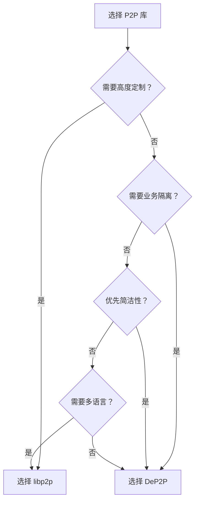
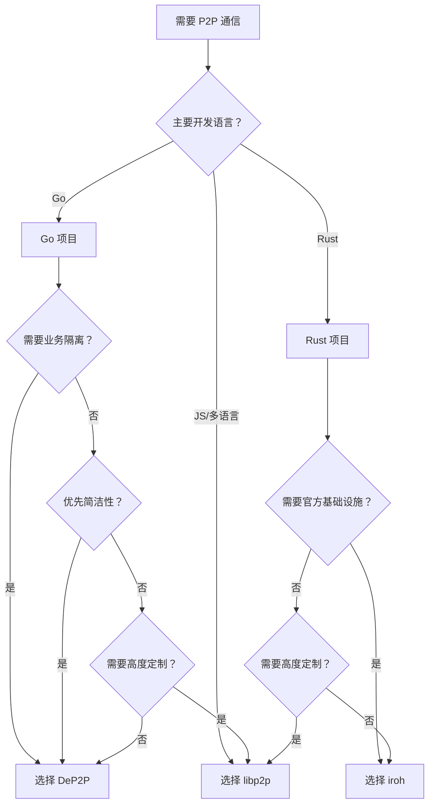

# 与其他库对比

本文档对比 DeP2P 与业界主流 P2P 库（libp2p、iroh），帮助你选择合适的库。

---

## 项目概览

| 项目 | 语言 | 主要应用 | 特点 |
|------|------|---------|------|
| **DeP2P** | Go | 区块链、分布式应用 | 极简 API、Realm 隔离 |
| **libp2p** | Go/Rust/JS | IPFS、Filecoin、Ethereum 2.0 | 模块化、协议丰富 |
| **iroh** | Rust | iroh-net、Dumbpipe | 简洁 API、MagicSock |

---

## DeP2P vs libp2p

### 核心对比

```
┌─────────────────────────────────────────────────────────────────────────────┐
│                        DeP2P vs libp2p                                       │
├─────────────────────────────────────────────────────────────────────────────┤
│                                                                              │
│  DeP2P                                   libp2p                              │
│  ──────────────────                      ──────────────────                  │
│                                                                              │
│  ✅ 极简 API                             ⚠️ API 复杂                         │
│  realm.Messaging().Send(ctx, nodeID, data)  需要配置 Host, Transport,        │
│  3 步走：启动→加入→发送                    Muxer, Security, Discovery...      │
│                                                                              │
│  ✅ Realm 业务隔离                        ⚠️ PSK (弱隔离)                     │
│  不同业务网络完全隔离                     需要手动管理隔离                    │
│  共享基础设施                                                                │
│                                                                              │
│  ✅ 预设配置                             ⚠️ 需要详细配置                      │
│  WithPreset(PresetDesktop)               需要逐项配置各个组件                │
│                                                                              │
│  ✅ 学习曲线平缓                         ⚠️ 学习曲线陡峭                      │
│  概念简单，快速上手                       概念繁多，需要深入理解              │
│                                                                              │
│  ⚠️ 定制能力适中                         ✅ 高度可定制                        │
│  适合大多数场景                           完全可插拔，组件可替换              │
│                                                                              │
│  ⚠️ 生态较新                             ✅ 生态成熟                          │
│  发展中                                   大量生产案例                        │
│                                                                              │
└─────────────────────────────────────────────────────────────────────────────┘
```

### 特性对比表

| 特性 | DeP2P | libp2p |
|------|-------|--------|
| **传输层** | QUIC (主) | TCP, QUIC, WebSocket, WebTransport |
| **加密** | TLS 1.3 | TLS 1.3, Noise Protocol |
| **多路复用** | QUIC 原生 | yamux, mplex, QUIC |
| **节点发现** | DHT, mDNS | DHT, mDNS, Rendezvous, Bootstrap |
| **NAT 穿透** | STUN, 打洞, 中继 | AutoNAT, Relay, Hole Punching, UPnP |
| **消息模式** | Stream, Request, PubSub | Stream, Request-Response, GossipSub |
| **业务隔离** | Realm ✅ | PSK (弱) |
| **连接管理** | 水位线 + 保护 | ConnectionManager + ResourceManager |
| **API 复杂度** | 低 | 高 |
| **学习曲线** | 平缓 | 陡峭 |

### 代码对比

**DeP2P 启动节点：**

```go
// DeP2P: 3 行代码启动节点并加入网络
node, _ := dep2p.StartNode(ctx, dep2p.WithPreset(dep2p.PresetDesktop))
realmKey := types.GenerateRealmKey()
realm, _ := node.JoinRealmWithKey(ctx, "my-realm", realmKey)
realm.Messaging().Send(ctx, peerID, "/my/protocol", data)
```

**libp2p 启动节点：**

```go
// libp2p: 需要配置多个组件
host, _ := libp2p.New(
    libp2p.ListenAddrStrings("/ip4/0.0.0.0/tcp/0"),
    libp2p.Transport(tcp.NewTCPTransport),
    libp2p.Transport(quic.NewTransport),
    libp2p.Security(noise.ID, noise.New),
    libp2p.Security(tls.ID, tls.New),
    libp2p.Muxer(yamux.ID, yamux.DefaultTransport),
    libp2p.NATPortMap(),
    libp2p.EnableRelay(),
    libp2p.EnableHolePunching(),
    // ... 更多配置
)
defer host.Close()

// 还需要手动配置 DHT、PubSub 等
dht, _ := dht.New(ctx, host)
ps, _ := pubsub.NewGossipSub(ctx, host)
```

### 选择建议



| 选择 DeP2P 如果... | 选择 libp2p 如果... |
|-------------------|---------------------|
| 需要快速上手 | 需要高度定制 |
| 需要业务网络隔离 | 需要多语言支持 |
| 优先简洁 API | 需要特定传输协议 |
| Go 项目 | 需要成熟生态 |

---

## DeP2P vs iroh

### 核心对比

```
┌─────────────────────────────────────────────────────────────────────────────┐
│                        DeP2P vs iroh                                         │
├─────────────────────────────────────────────────────────────────────────────┤
│                                                                              │
│  DeP2P                                   iroh                                │
│  ──────────────────                      ──────────────────                  │
│                                                                              │
│  ✅ Go 原生                              ⚠️ Rust (需要 FFI)                  │
│  Go 项目直接使用                          Go 项目需要绑定                     │
│                                                                              │
│  ✅ Realm 业务隔离                        ❌ 无业务隔离                        │
│  多租户网络隔离                           需要自己实现                        │
│                                                                              │
│  ✅ 三层架构                             ✅ 极简 API                          │
│  Layer 1 透明                            Endpoint API                        │
│  Layer 2 显式                                                                │
│  Layer 3 业务                                                                │
│                                                                              │
│  ⚠️ 自建基础设施                         ✅ 官方中继网络                      │
│  需要自己部署 Bootstrap/Relay             可使用 n0 基础设施                  │
│                                                                              │
│  ⚠️ 标准 DHT                             ✅ DNS 发现 + pkarr                  │
│  Kademlia DHT                            更适合公网发现                      │
│                                                                              │
└─────────────────────────────────────────────────────────────────────────────┘
```

### 特性对比表

| 特性 | DeP2P | iroh |
|------|-------|------|
| **语言** | Go | Rust |
| **传输层** | QUIC | QUIC |
| **连接策略** | 直连 → 打洞 → 中继 | MagicSock 智能路径 |
| **节点发现** | DHT, mDNS | DNS, DHT (可选), Local Swarm |
| **业务隔离** | Realm ✅ | 无 |
| **官方基础设施** | 无 | 中继网络 |
| **API 复杂度** | 低 | 低 |

### 代码对比

**DeP2P 启动节点：**

```go
// DeP2P (Go)
node, _ := dep2p.StartNode(ctx, dep2p.WithPreset(dep2p.PresetDesktop))
realmKey := types.GenerateRealmKey()
realm, _ := node.JoinRealmWithKey(ctx, "my-realm", realmKey)
realm.Messaging().Send(ctx, peerID, "/my/protocol", data)
```

**iroh 启动节点：**

```rust
// iroh (Rust)
let endpoint = Endpoint::builder()
    .discovery(DnsDiscovery::n0_dns())
    .bind()
    .await?;

let conn = endpoint.connect(node_id, ALPN).await?;
let mut send = conn.open_uni().await?;
send.write_all(data).await?;
```

### 选择建议

| 选择 DeP2P 如果... | 选择 iroh 如果... |
|-------------------|-------------------|
| Go 项目 | Rust 项目 |
| 需要业务隔离 | 需要官方基础设施 |
| 需要三层架构 | 需要 MagicSock 智能路径 |
| 自建网络 | 使用公网节点 |

---

## 能力对照表

### 完整对比

| 能力 | DeP2P | libp2p | iroh |
|------|-------|--------|------|
| **传输** | QUIC (主) | 多种 | QUIC |
| **加密** | TLS 1.3 | TLS/Noise | QUIC TLS |
| **多路复用** | QUIC 原生 | yamux/mplex | QUIC 原生 |
| **节点发现** | DHT/mDNS | DHT/mDNS/Rendezvous | DNS/DHT |
| **NAT 穿透** | STUN/打洞/中继 | AutoNAT/Relay | MagicSock |
| **消息模式** | Stream/Req/PubSub | 同左 | Stream |
| **业务隔离** | Realm ✅ | PSK (弱) | 无 |
| **连接管理** | 水位线/保护 | 完整 | 简单 |
| **API 复杂度** | 低 | 高 | 低 |
| **学习曲线** | 平缓 | 陡峭 | 平缓 |
| **语言** | Go | Go/Rust/JS | Rust |
| **生态成熟度** | 发展中 | 成熟 | 发展中 |

### DeP2P 独有能力

| 能力 | 说明 |
|------|------|
| **Realm 业务隔离** | 多租户网络隔离，共享基础设施，业务数据不会跨 Realm 泄露 |
| **三层架构** | Layer 1 透明（系统层）、Layer 2 显式（Realm）、Layer 3 业务（应用协议） |
| **严格单 Realm** | 节点同一时间只能属于一个 Realm，状态清晰，资源可控 |
| **Preset 预设配置** | 开箱即用，适应不同场景（Mobile/Desktop/Server/Minimal） |
| **身份第一性** | 所有连接以 NodeID 为目标，IP/端口只是拨号路径 |

---

## 选择决策树



---

## 迁移指南

### 从 libp2p 迁移到 DeP2P

1. **替换 Host 为 Node**
   - libp2p `Host` → DeP2P `Node`
   - 使用 `dep2p.WithPreset()` 替代详细配置

2. **添加 Realm**
   - 在使用业务 API 前调用 `JoinRealm()`
   - 这是 DeP2P 的核心差异

3. **调整消息发送**
   - libp2p `host.NewStream()` → DeP2P `realm.Messaging().Send()` 或 `realm.Messaging().Request()`

4. **简化 PubSub**
   - libp2p `pubsub.NewGossipSub()` → DeP2P `node.Subscribe()` / `node.Publish()`

```go
// Before (libp2p)
host, _ := libp2p.New(/* 大量配置 */)
dht, _ := dht.New(ctx, host)
ps, _ := pubsub.NewGossipSub(ctx, host)
topic, _ := ps.Join("my-topic")
topic.Publish(ctx, data)

// After (DeP2P)
node, _ := dep2p.StartNode(ctx, dep2p.WithPreset(dep2p.PresetDesktop))
node.Realm().JoinRealm(ctx, "my-realm")
node.Publish(ctx, "my-topic", data)
```

---

## 总结

```
┌─────────────────────────────────────────────────────────────────────────────┐
│                           选择建议总结                                       │
├─────────────────────────────────────────────────────────────────────────────┤
│                                                                              │
│  选择 DeP2P 如果：                                                           │
│  ─────────────────                                                          │
│  ✅ Go 项目                                                                  │
│  ✅ 需要业务网络隔离（Realm）                                                │
│  ✅ 优先简洁易用的 API                                                       │
│  ✅ 需要快速上手                                                             │
│  ✅ 区块链、分布式应用场景                                                   │
│                                                                              │
│  选择 libp2p 如果：                                                          │
│  ─────────────────                                                          │
│  ✅ 需要高度定制                                                             │
│  ✅ 需要多语言支持（Go/Rust/JS）                                             │
│  ✅ 需要特定传输协议                                                         │
│  ✅ 需要成熟生态和生产案例                                                   │
│                                                                              │
│  选择 iroh 如果：                                                            │
│  ─────────────────                                                          │
│  ✅ Rust 项目                                                                │
│  ✅ 需要官方中继基础设施                                                     │
│  ✅ 需要 MagicSock 智能路径选择                                              │
│  ✅ 简单的点对点通信                                                         │
│                                                                              │
└─────────────────────────────────────────────────────────────────────────────┘
```

---

## 下一步

- [DeP2P 是什么](what-is-dep2p.md) - 了解 DeP2P 的愿景和定位
- [核心概念总纲](core-concepts.md) - 深入理解核心概念
- [架构概览](architecture-overview.md) - 了解系统架构
- [5 分钟上手](../getting-started/quickstart.md) - 动手实践
