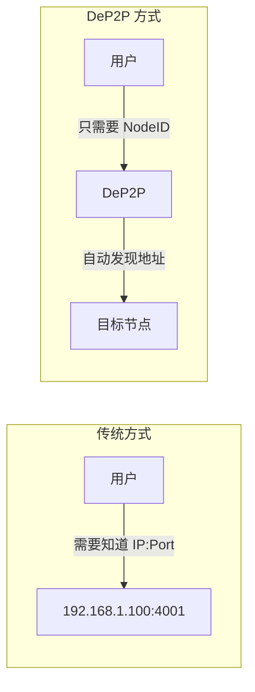
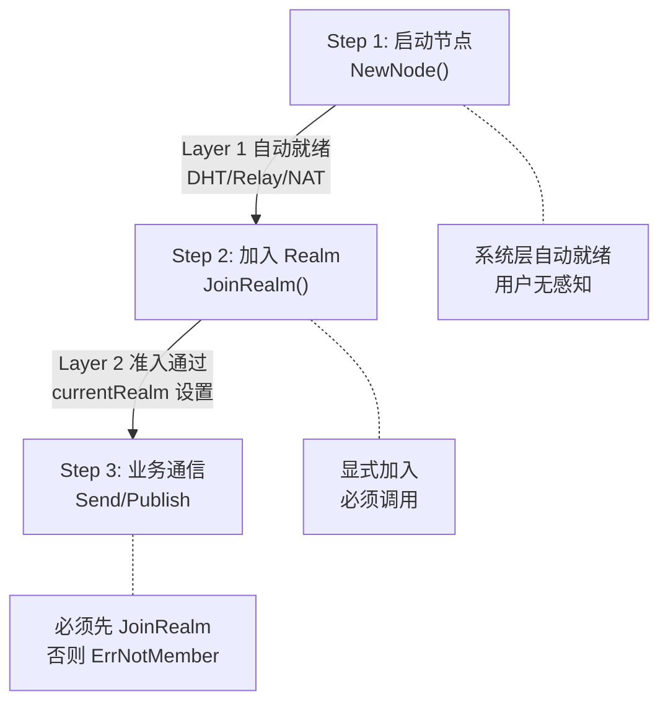
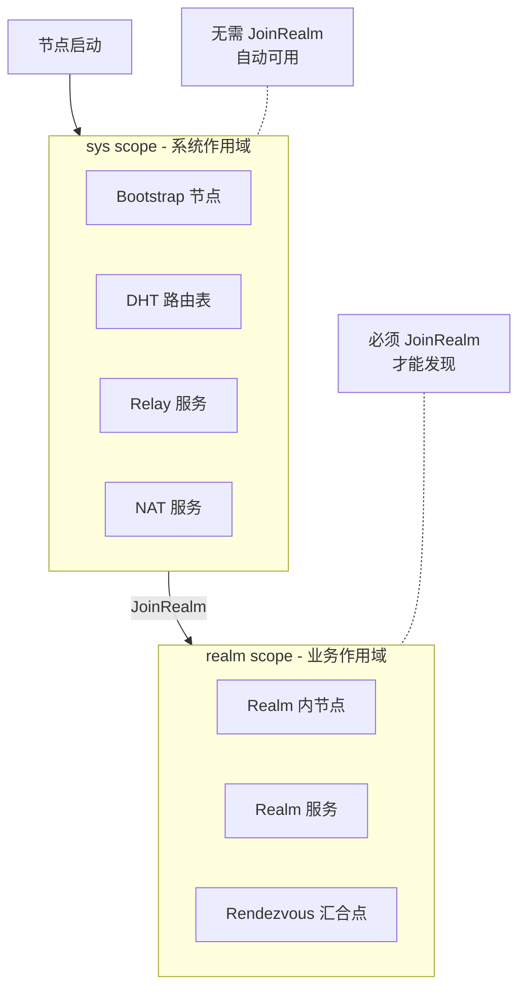
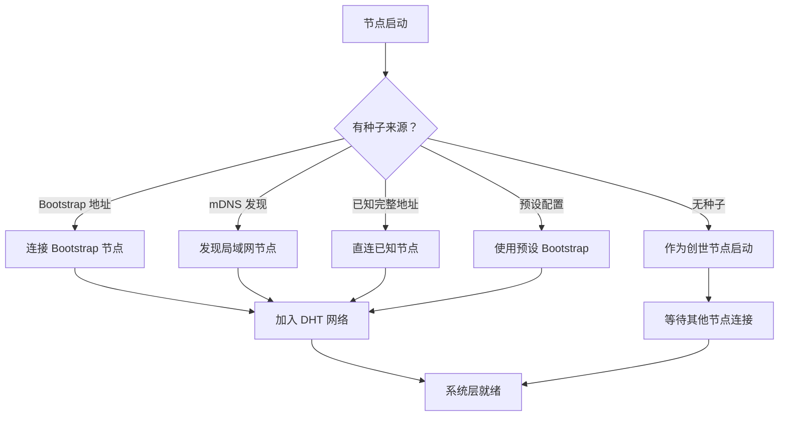

# 核心概念总纲

本文档介绍 DeP2P 的核心概念：身份第一性、三层架构、Realm 隔离和发现作用域。

---

## 身份优先（Identity First）

> **核心不变量**：在 DeP2P 中**不存在"纯 IP 连接"**；所有连接都以 **NodeID 为目标**，IP/端口只是**拨号路径（Dial Address）**。

这是 DeP2P 区别于传统网络库的核心特点。

```
┌─────────────────────────────────────────────────────────────────────────────┐
│                    身份第一性原则                                            │
├─────────────────────────────────────────────────────────────────────────────┤
│                                                                              │
│   传统方式: connect("192.168.1.100:4001")  // 连接到地址（无身份保证）       │
│   DeP2P:    connect(nodeID)                 // 连接到身份（自动查找地址）    │
│                                                                              │
│   ✅ DeP2P 的正确理解：                                                      │
│   ─────────────────────                                                      │
│   • 连接目标永远是 NodeID（公钥身份）                                       │
│   • IP/端口只是 Dial Address（拨号路径提示）                                │
│   • 任何连接都 MUST 验证 RemoteIdentity == ExpectedNodeID                   │
│                                                                              │
│   ❌ 不存在的概念：                                                          │
│   ─────────────────                                                          │
│   • "纯 IP 连接"（错误！没有身份目标）                                      │
│   • "无身份连接"（错误！DeP2P 不支持）                                      │
│                                                                              │
└─────────────────────────────────────────────────────────────────────────────┘
```

### 为什么身份优先？



| 优势 | 说明 |
|------|------|
| **简化用户使用** | 用户不需要关心对方的 IP 地址 |
| **适应动态网络** | IP 地址变化时，身份不变，连接自动适应 |
| **安全性** | 连接时自动验证身份，防止中间人攻击 |
| **灵活性** | 支持多种连接路径（直连、打洞、中继）自动回退 |

---

## 三条确定性连接语义（DialBy）

DeP2P 提供三条确定性的连接语义，所有连接都必须通过这三种方式之一建立：

```
┌─────────────────────────────────────────────────────────────────────────────┐
│                    DialBy 三种连接语义                                       │
├─────────────────────────────────────────────────────────────────────────────┤
│                                                                              │
│  1. DialByNodeID                                                             │
│     ─────────────────────────────────────────────────────────────────────   │
│     API:     Connect(nodeID)                                                 │
│     输入:    NodeID                                                          │
│     场景:    常规业务（DHT 查找地址）                                        │
│     推荐度:  ✅ 推荐（最常用）                                               │
│                                                                              │
│  2. DialByFullAddress                                                        │
│     ─────────────────────────────────────────────────────────────────────   │
│     API:     ConnectToAddr(fullAddr)                                         │
│     输入:    Full Address（包含 NodeID 和地址）                              │
│     场景:    冷启动/分享/Bootstrap                                           │
│     推荐度:  ✅ 推荐                                                         │
│                                                                              │
│  3. DialByNodeIDWithDialAddrs                                                │
│     ─────────────────────────────────────────────────────────────────────   │
│     API:     ConnectWithAddrs(nodeID, addrs)                                 │
│     输入:    NodeID + Dial Address                                           │
│     场景:    高级/运维/受控环境                                              │
│     推荐度:  ❌ 隐藏（不推荐普通用户使用）                                   │
│                                                                              │
└─────────────────────────────────────────────────────────────────────────────┘
```

### 使用示例

```go
// 1. DialByNodeID（推荐）
// 只需 NodeID，DeP2P 自动通过 DHT 查找地址
conn, err := node.Connect(ctx, remoteNodeID)

// 2. DialByFullAddress（冷启动场景）
// 完整地址包含 NodeID，常用于 Bootstrap 或分享
fullAddr := "/ip4/1.2.3.4/udp/4001/quic-v1/p2p/QmRemoteNodeID..."
conn, err := node.ConnectToAddr(ctx, fullAddr)

// 3. DialByNodeIDWithDialAddrs（高级场景）
// 明确知道对方地址，但仍验证身份
addrs := []string{"/ip4/1.2.3.4/udp/4001/quic-v1"}
conn, err := node.ConnectWithAddrs(ctx, remoteNodeID, addrs)
```

---

## 三层架构

DeP2P 采用**三层架构**设计，这是全库唯一的分层口径：

```
┌─────────────────────────────────────────────────────────────────────────────┐
│                           DeP2P 三层架构                                      │
├─────────────────────────────────────────────────────────────────────────────┤
│                                                                              │
│  ┌───────────────────────────────────────────────────────────────────────┐  │
│  │  Layer 3: 应用协议层 (Application Protocols)                           │  │
│  │  ═══════════════════════════════════════════════════════════════════  │  │
│  │                                                                        │  │
│  │   ┌─────────────────────────────┐  ┌─────────────────────────────┐   │  │
│  │   │      流协议 (Stream)         │  │     订阅协议 (PubSub)        │   │  │
│  │   │  ─────────────────────────  │  │  ─────────────────────────  │   │  │
│  │   │  Send: 单向发送             │  │  Publish: 主题发布          │   │  │
│  │   │  Request: 请求-响应         │  │  Subscribe: 主题订阅        │   │  │
│  │   │  OpenStream: 双向流         │  │  Query: 主题查询            │   │  │
│  │   └─────────────────────────────┘  └─────────────────────────────┘   │  │
│  │                                                                        │  │
│  │   [!] 必须加入 Realm 后才能使用，未加入返回 ErrNotMember              │  │
│  │                                                                        │  │
│  └───────────────────────────────────────────────────────────────────────┘  │
│                                       │                                      │
│                                       ▼                                      │
│  ┌───────────────────────────────────────────────────────────────────────┐  │
│  │  Layer 2: Realm 层 (Business Isolation)                                │  │
│  │  ═══════════════════════════════════════════════════════════════════  │  │
│  │                                                                        │  │
│  │   ┌──────────────┐  ┌──────────────┐  ┌──────────────┐               │  │
│  │   │   Realm A    │  │   Realm B    │  │   Realm C    │               │  │
│  │   │  (区块链)    │  │  (链游)      │  │  (存储)      │               │  │
│  │   │  ─────────  │  │  ─────────  │  │  ─────────  │               │  │
│  │   │  成员管理   │  │  成员管理   │  │  成员管理   │               │  │
│  │   │  准入控制   │  │  准入控制   │  │  准入控制   │               │  │
│  │   │  RealmAuth  │  │  RealmAuth  │  │  RealmAuth  │               │  │
│  │   └──────────────┘  └──────────────┘  └──────────────┘               │  │
│  │                                                                        │  │
│  │   [*] 用户显式加入，严格单 Realm（一次只能加入一个）                   │  │
│  │                                                                        │  │
│  └───────────────────────────────────────────────────────────────────────┘  │
│                                       │                                      │
│                                       ▼                                      │
│  ┌───────────────────────────────────────────────────────────────────────┐  │
│  │  Layer 1: 系统基础层 (Infrastructure)                                  │  │
│  │  ═══════════════════════════════════════════════════════════════════  │  │
│  │                                                                        │  │
│  │   ┌──────────────────────────────────────────────────────────────┐   │  │
│  │   │  传输子系统: QUIC / TCP / WebSocket + TLS/Noise Security      │   │  │
│  │   └──────────────────────────────────────────────────────────────┘   │  │
│  │                                                                        │  │
│  │   ┌────────────┐  ┌────────────┐  ┌────────────┐  ┌──────────────┐  │  │
│  │   │ System DHT │  │System Relay│  │    NAT     │  │   Bootstrap  │  │  │
│  │   │ 路由发现   │  │ 兜底通道   │  │  地址发现  │  │   引导节点   │  │  │
│  │   └────────────┘  └────────────┘  └────────────┘  └──────────────┘  │  │
│  │                                                                        │  │
│  │   [~] 节点启动自动就绪，用户完全无感知                                  │  │
│  │                                                                        │  │
│  └───────────────────────────────────────────────────────────────────────┘  │
│                                                                              │
└─────────────────────────────────────────────────────────────────────────────┘
```

### 各层职责与用户感知

| 层次 | 名称 | 职责 | 用户感知 | 协议前缀 |
|------|------|------|---------|---------|
| **Layer 3** | 应用协议层 | 流协议、订阅协议 | 完全感知 | `/dep2p/app/...` |
| **Layer 2** | Realm 层 | 业务隔离、成员管理、RealmAuth | 主动操作 | `/dep2p/sys/realm/...` |
| **Layer 1** | 系统基础层 | Transport/Security/DHT/Relay/NAT | 无感知 | `/dep2p/sys/...` |

### 三步走流程



---

## Realm 业务隔离

Realm 是 DeP2P 的核心概念之一，用于实现业务网络的隔离。

```
┌─────────────────────────────────────────────────────────────────────────────┐
│                           Realm 业务隔离模型                                  │
├─────────────────────────────────────────────────────────────────────────────┤
│                                                                              │
│   ┌─────────────────────────────────────────────────────────────────────┐   │
│   │                        共享基础设施（Layer 1）                        │   │
│   │              DHT 路由  │  Relay 中继  │  NAT 穿透                    │   │
│   └─────────────────────────────────────────────────────────────────────┘   │
│                                    │                                         │
│         ┌──────────────────────────┼──────────────────────────┐             │
│         │                          │                          │             │
│         ▼                          ▼                          ▼             │
│   ┌───────────┐             ┌───────────┐             ┌───────────┐        │
│   │  Realm A  │             │  Realm B  │             │  Realm C  │        │
│   │  区块链   │             │   链游    │             │  存储     │        │
│   ├───────────┤             ├───────────┤             ├───────────┤        │
│   │ 独立发现  │             │ 独立发现  │             │ 独立发现  │        │
│   │ 独立PubSub│             │ 独立PubSub│             │ 独立PubSub│        │
│   │ 准入控制  │             │ 准入控制  │             │ 准入控制  │        │
│   └───────────┘             └───────────┘             └───────────┘        │
│        ▲                         ▲                         ▲               │
│        │                         │                         │               │
│   不能发现 B/C              不能发现 A/C              不能发现 A/B         │
│                                                                              │
└─────────────────────────────────────────────────────────────────────────────┘
```

### Realm 类型

| 类型 | 说明 | 加入方式 | 适用场景 |
|------|------|---------|---------|
| **Public** | 公开 Realm | 任何节点可加入 | 开放社区、公共服务 |
| **Protected** | 受保护 Realm | 需要签名/凭证 | 会员制服务、联盟链 |
| **Private** | 私有 Realm | 需要邀请或白名单 | 企业内部、私有网络 |

### 严格单 Realm 规则

```go
// ❌ 错误：尝试同时加入多个 Realm
node.Realm().JoinRealm(ctx, "realm-a")
node.Realm().JoinRealm(ctx, "realm-b")  // 返回 ErrAlreadyJoined

// ✅ 正确：先离开再加入
node.Realm().JoinRealm(ctx, "realm-a")
node.Realm().LeaveRealm(ctx)
node.Realm().JoinRealm(ctx, "realm-b")  // OK
```

---

## 发现作用域

DeP2P 将节点发现分为两个作用域：**sys scope（系统作用域）** 与 **realm scope（业务作用域）**。

```
┌─────────────────────────────────────────────────────────────────────────────┐
│                        发现作用域模型                                         │
├─────────────────────────────────────────────────────────────────────────────┤
│                                                                              │
│   sys scope（系统作用域）               realm scope（业务作用域）            │
│   ────────────────────────              ────────────────────────             │
│   ├── DHT 路由表邻居                    ├── Realm 内节点                     │
│   ├── Bootstrap 节点                    ├── Realm 服务提供者                 │
│   ├── Relay / NAT 服务                  └── Realm Rendezvous 汇合点          │
│   └── 系统 Provider（sys/*）                                                 │
│                                                                              │
│   特点：                                特点：                               │
│   ────────                              ────────                             │
│   • 不依赖 JoinRealm                    • 必须 JoinRealm 后可用              │
│   • namespace: 简短形式（relay）        • key: dep2p/v1/realm/{id}/...       │
│   • 可发现大量节点，但不保证            • 只发现同 Realm 的业务节点          │
│     属于任何特定 Realm                                                       │
│                                                                              │
└─────────────────────────────────────────────────────────────────────────────┘
```

> **注意**：sys scope / realm scope 是**发现作用域**，与三层架构（Layer 1/2/3）是不同概念。

### 发现流程



---

## 五种网络自举场景

> **重要结论**：仅通过 NodeID 无法从零冷启动 DHT。节点必须具备至少一个"种子来源"。

```
┌─────────────────────────────────────────────────────────────────────────────┐
│                        五种网络自举场景                                       │
├─────────────────────────────────────────────────────────────────────────────┤
│                                                                              │
│  场景 1: 创世节点                                                            │
│  ─────────────────────────────────────────────────────────                  │
│  说明:   网络首个节点，无需连接其他节点                                       │
│  配置:   WithBootstrapPeers() // 空列表                                      │
│                                                                              │
│  场景 2: 直连已知地址                                                        │
│  ─────────────────────────────────────────────────────────                  │
│  说明:   已知完整地址（包含 NodeID）                                         │
│  API:    ConnectToAddr()                                                     │
│                                                                              │
│  场景 3: 仅 NodeID                                                           │
│  ─────────────────────────────────────────────────────────                  │
│  说明:   只知道公钥，需要 DHT 已连通                                         │
│  API:    Connect(nodeID)                                                     │
│  前提:   必须已有 DHT 连接                                                   │
│                                                                              │
│  场景 4: 局域网发现                                                          │
│  ─────────────────────────────────────────────────────────                  │
│  说明:   通过 mDNS 发现局域网内节点                                          │
│  配置:   自动启用                                                            │
│                                                                              │
│  场景 5: 预设 Bootstrap                                                      │
│  ─────────────────────────────────────────────────────────                  │
│  说明:   使用预设配置，自动连接公共引导节点                                   │
│  配置:   WithPreset(PresetDesktop/Mobile/Server)                            │
│                                                                              │
└─────────────────────────────────────────────────────────────────────────────┘
```

### 自举流程图



---

## 核心不变量

DeP2P 定义了若干核心不变量，这些是系统设计的硬性约束：

| 不变量 | 描述 |
|--------|------|
| **INV-001: 身份第一性** | 所有连接必须以 NodeID 为目标，不存在"纯 IP 连接" |
| **INV-002: 严格单 Realm** | 节点同一时间只能属于一个 Realm |
| **INV-003: Layer 3 需要 Realm** | 调用应用协议层 API 前必须 JoinRealm，否则返回 ErrNotMember |
| **INV-004: 身份验证强制** | 任何连接都必须验证 RemoteIdentity == ExpectedNodeID |
| **INV-005: Layer 1 透明** | 系统基础层对用户完全透明，无需手动配置 |

---

## 下一步

- [架构概览](architecture-overview.md) - 详细了解系统架构设计
- [与其他库对比](comparison.md) - 了解 DeP2P 与 libp2p/iroh 的区别
- [创建第一个节点](../getting-started/first-node.md) - 动手创建节点
- [加入第一个 Realm](../getting-started/first-realm.md) - 理解 Realm 操作
