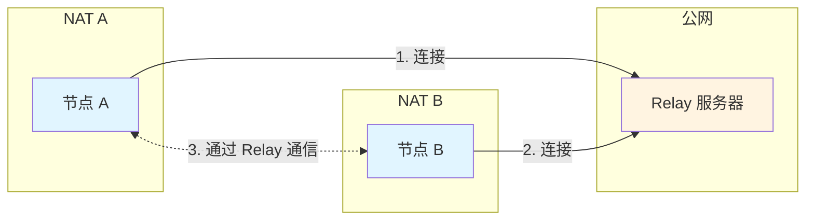
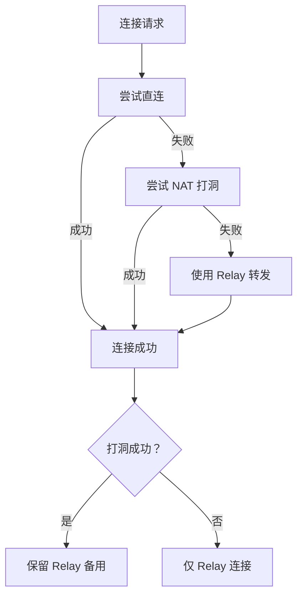
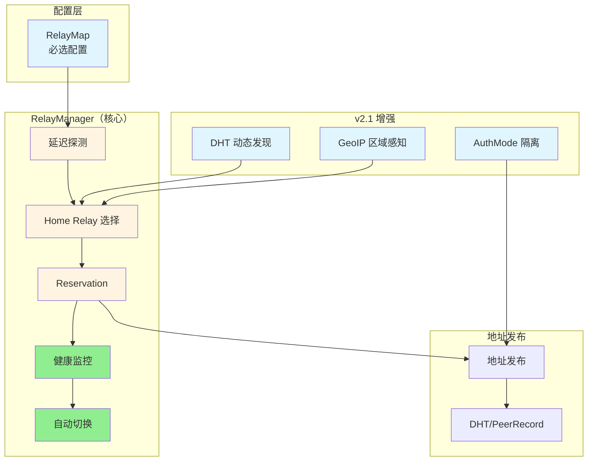
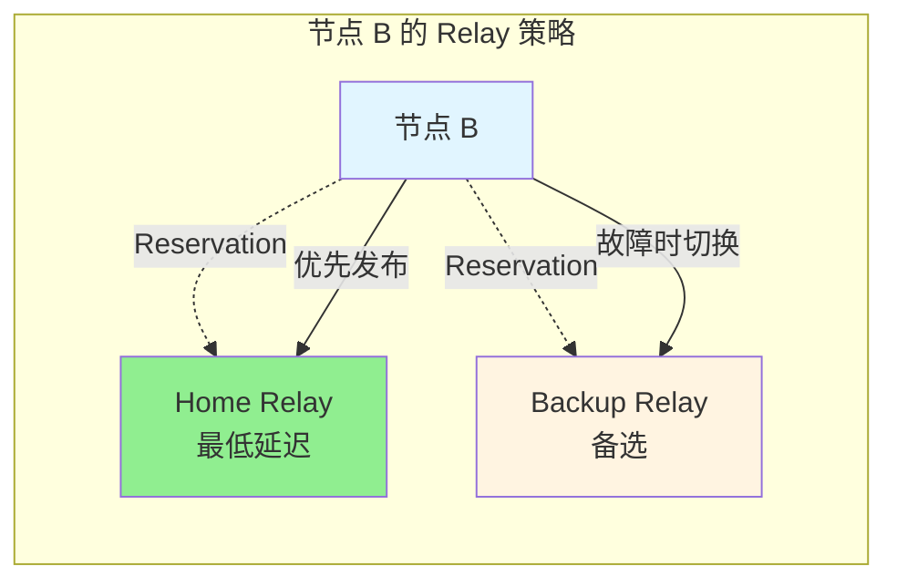
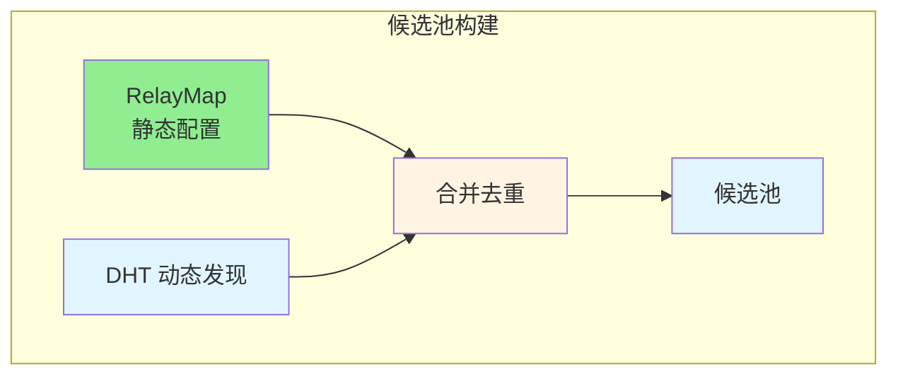
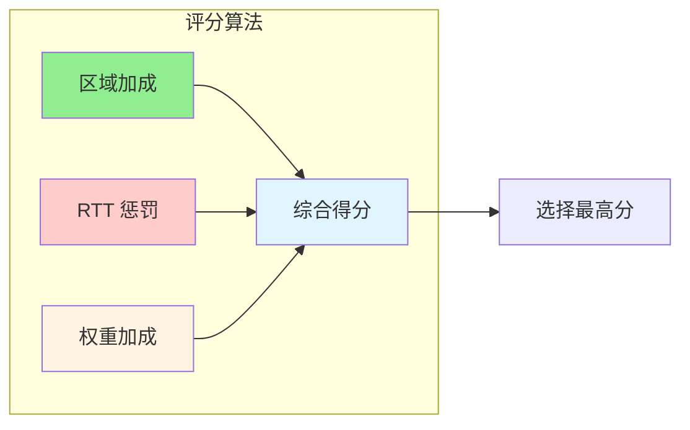
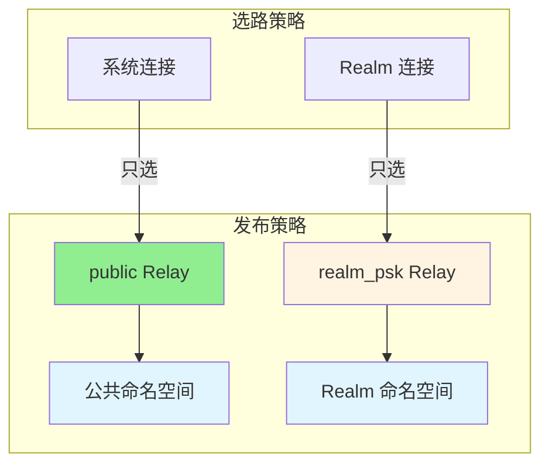

# Relay 中继架构

**最后更新**：2025-12-31  
**版本**：v2.0/v2.1

---

## 1. 什么是 Relay？

Relay（中继）是 P2P 网络中用于 NAT 穿透的服务器。当两个节点无法直接建立连接时（例如都在 NAT 后面），可以通过 Relay 服务器转发流量。



---

## 2. 为什么需要 Relay？

### 2.1 NAT 穿透的挑战

在 P2P 网络中，许多节点位于 NAT（网络地址转换）后面，无法被外部节点直接连接。常见的 NAT 穿透方法包括：

| 方法 | 说明 | 成功率 |
|------|------|--------|
| **UDP Hole Punching** | 利用 NAT 的端口映射规律 | ~70% |
| **UPnP/NAT-PMP** | 通过路由器协议自动映射 | ~30% |
| **Relay** | 通过第三方服务器转发 | ~99% |

当直连方法失败时，Relay 是最后的保障。

### 2.2 Relay 的工作原理

**Circuit Relay v2 协议**定义了 Relay 的工作方式：

1. **Reservation（预留）**：被拨号方（节点 B）在 Relay 上预留资源
2. **地址发布**：节点 B 的 Relay 地址被发布到 DHT，其他节点可发现
3. **连接建立**：拨号方（节点 A）通过 Relay 连接到节点 B

```mermaid
sequenceDiagram
    participant A as 节点 A
    participant DHT as DHT
    participant Relay as Relay 服务器
    participant B as 节点 B
    
    Note over B,Relay: 1. Reservation 阶段
    B->>Relay: Reserve()
    Relay-->>B: Reservation OK
    
    Note over B,DHT: 2. 地址发布阶段
    B->>DHT: 发布 Relay 地址<br/>/p2p/Relay/p2p-circuit/p2p/B
    
    Note over A,Relay: 3. 连接建立阶段
    A->>DHT: FindPeer(B)
    DHT-->>A: 返回 B 的地址<br/>（含 Relay 地址）
    A->>Relay: Connect(B)
    Relay->>Relay: 检查 B 的 Reservation
    Relay->>B: 建立 Relay 连接
    B-->>Relay: 连接确认
    Relay-->>A: 连接成功
    
    A<-->B: 通过 Relay 通信
```

---

## 3. dep2p Relay v2.0/v2.1 架构

### 3.1 Relay 三大职责（v2.0）

DeP2P v2.0 重新定义了 Relay 的职责模型：

```
┌─────────────────────────────────────────────────────────────────────┐
│                    Relay 三大职责 (v2.0)                             │
├─────────────────────────────────────────────────────────────────────┤
│                                                                     │
│  1. 缓存加速层（地址簿）                                              │
│     ─────────────────────                                           │
│     • Relay 地址簿是 DHT 的本地缓存                                  │
│     • DHT 是权威目录，存储签名 PeerRecord                            │
│     • 地址查询优先级：Peerstore → MemberList → DHT → Relay 地址簿    │
│                                                                     │
│  2. 打洞协调信令                                                     │
│     ─────────────────                                               │
│     • 提供 NAT 打洞的信令通道                                        │
│     • 双方通过 Relay 交换地址信息                                    │
│     • 打洞成功后保留 Relay 连接作为备用                              │
│                                                                     │
│  3. 数据通信保底                                                     │
│     ─────────────────                                               │
│     • 直连失败 → NAT 打洞失败 → Relay 转发                          │
│     • 确保任何情况下都能通信                                         │
│     • 约 99% 的连接成功率保障                                        │
│                                                                     │
└─────────────────────────────────────────────────────────────────────┘
```

### 3.2 连接策略：直连优先，中继兜底



### 3.3 核心设计理念

dep2p Relay v2.0/v2.1 采用 **RelayMap + RelayManager** 架构，参考 iroh 和 go-libp2p 的最佳实践：

| 设计原则 | 说明 |
|----------|------|
| **可靠性优先** | 强制配置 RelayMap，确保冗余 |
| **性能优化** | 启动时延迟测试，选择最优 Relay |
| **自动故障切换** | 健康监控 + 自动切换 |
| **区域感知** | v2.1 支持基于地理位置的选路 |
| **安全隔离** | v2.1 支持公共/私域 Relay 隔离 |

### 3.2 架构组件



### 3.3 Home Relay 策略

**Home Relay**：节点的主 Relay，具有以下特点：

- ✅ 启动时通过延迟测试选择（最低延迟）
- ✅ 地址优先发布到 DHT
- ✅ 持续健康监控
- ✅ 故障时自动切换到 Backup

**Backup Relay**：备选 Relay，用于故障切换



---

## 4. v2.1 增强功能

### 4.1 动态发现

**设计**：RelayMap（强制）+ DHT 动态发现（强制）的混合架构

- **RelayMap**：提供最小可用集合（至少 2 个）
- **DHT 动态发现**：自动发现更多候选 Relay
- **合并去重**：配置优先，DHT 补充



### 4.2 区域感知选路

**设计**：基于 GeoIP 和 RelayMapEntry.Region 的综合评分

**评分因素**：
- 区域亲和度（同区域 +50，同大洲 +20）
- RTT 延迟（越低越好）
- 权重配置（管理员调整）



### 4.3 AuthMode 公私分离

**设计**：根据 AuthMode 决定地址发布和选路策略

| AuthMode | 说明 | 地址发布 | 选路规则 |
|----------|------|----------|----------|
| **public** | 公共 Relay | 公共命名空间 | 系统/Realm 连接都可使用 |
| **realm_psk** | 私域 Relay | Realm 命名空间 | 仅 Realm 连接可使用 |



---

## 5. 关键概念

### 5.1 RelayMap

**定义**：预定义的 Relay 服务器集合配置

**要求**：
- 至少 2 个条目（确保冗余）
- 每个条目包含 NodeID 和地址
- 可选：区域、权重、RealmID、AuthMode

**示例**：
```go
relayMap := &relayif.RelayMap{
    Version: "2025.1",
    Entries: []relayif.RelayMapEntry{
        {
            NodeID:   relay1ID,
            Addrs:    []string{"/ip4/1.2.3.4/udp/4001/quic-v1"},
            Region:   "AS",
            AuthMode: relayif.AuthModePublic,
        },
        {
            NodeID:   relay2ID,
            Addrs:    []string{"/ip4/5.6.7.8/udp/4001/quic-v1"},
            Region:   "NA",
            AuthMode: relayif.AuthModePublic,
        },
    },
}
```

### 5.2 RelayManager

**职责**：管理节点的 Relay 连接和 Reservation

**生命周期**：
1. **启动**：延迟探测 → 选择 Home Relay → 建立 Reservation
2. **运行**：健康监控 → 故障切换 → 地址发布
3. **停止**：取消 Reservation → 清理资源

### 5.3 Reservation

**定义**：节点在 Relay 上预留的资源槽位

**特点**：
- 有 TTL（通常 1 小时），需定期刷新
- 数量有限（每个 Relay 通常 128-1024 个）
- 被拨号方必须持有 Reservation

---

## 6. 常见问题

### 6.1 为什么需要至少 2 个 Relay？

**答案**：确保冗余。如果只有一个 Relay，当它故障时节点将无法被连接。至少 2 个 Relay 可以：
- 提供故障切换能力
- 提高可用性（概率：\(1 - (1-p_r)^2\)）

### 6.2 节点 A 和 B 需要连接同一个 Relay 吗？

**答案**：不需要。节点 A 只需要：
- 能发现节点 B 的 Relay 地址
- 能连接到节点 B 选择的 Relay
- 节点 B 在该 Relay 上有有效的 Reservation

### 6.3 v2.0 为什么强制配置 RelayMap？

**答案**：可靠性优先。动态发现存在不确定性：
- DHT 质量依赖网络状态
- 发现的 Relay 可能不可靠
- 启动延迟不可预测

强制 RelayMap 确保：
- 可预测的 Relay 集合
- 启动时立即可用
- 运维可控

### 6.4 v2.1 的动态发现如何工作？

**答案**：混合架构。RelayMap 提供最小可用集合，DHT 动态发现补充更多候选：
- **配置优先**：RelayMap 中的 Relay 优先级更高
- **动态补充**：DHT 发现的 Relay 作为补充
- **去重合并**：同一 Relay 只保留一份

---

## 7. 性能指标

### 7.1 目标指标

| 指标 | v1.x | v2.0 | v2.1 |
|------|------|------|------|
| 中继成功率 | ~85% | ≥ 98% | ≥ 99% |
| 启动到可达时间 | 不确定 | ≤ 15s | ≤ 10s |
| 故障切换时间 | 无保证 | ≤ 30s | ≤ 20s |

### 7.2 资源消耗

- **Reservation 数量**：1 Home + 1 Backup（v2.0）
- **健康监控开销**：每 30s 一次延迟测试
- **DHT 发现开销**：启动时一次，运行时每 10 分钟刷新

---

## 8. 参考文档

- [使用指南](../how-to/use-relay.md) - 如何配置和使用 Relay
- [架构设计](../../design/architecture/relay-v2.md) - 详细架构设计
- [需求规范](../../design/requirements/REQ-RELAY-001.md) - 需求规范

