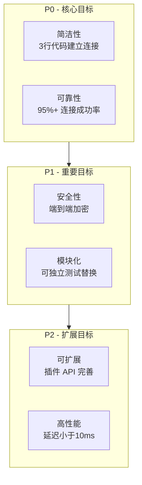
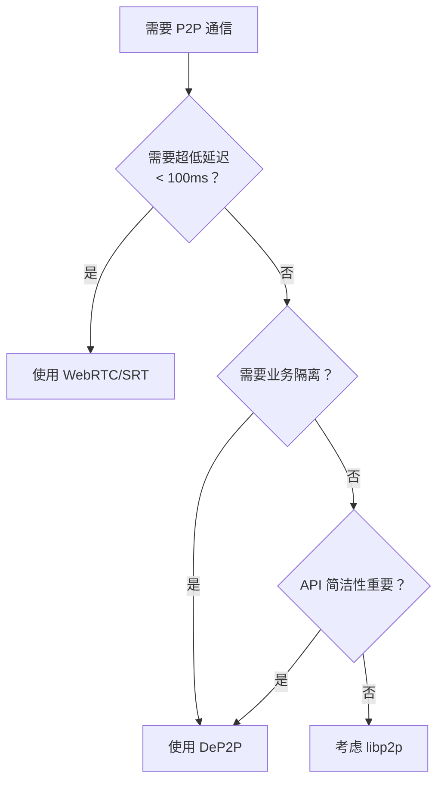

# DeP2P 是什么

本文档介绍 DeP2P 的核心愿景、设计目标和适用场景。

---

## 核心愿景

```
┌─────────────────────────────────────────────────────────────────────┐
│                                                                      │
│     让 P2P 连接像调用函数一样简单：给一个 NodeID，发个消息             │
│                                                                      │
└─────────────────────────────────────────────────────────────────────┘
```

> **NodeID** = 公钥身份的 Base58 编码表示。用户只需分享 NodeID，无需关心 IP 地址。

DeP2P 的目标是成为一个**简洁、可靠、安全**的 P2P 网络库，让开发者能够专注于业务逻辑，而不必关心复杂的网络细节。

---

## 为什么选择 DeP2P？

传统 P2P 库存在诸多痛点，DeP2P 针对这些问题提供了解决方案：

```
┌─────────────────────────────────────────────────────────────────────┐
│                    DeP2P 解决的 5 大问题                              │
├─────────────────────────────────────────────────────────────────────┤
│                                                                      │
│  问题 1：API 太复杂                                                  │
│  ────────────────────                                                │
│  传统 P2P: 需要配置 Host, Transport, Muxer, Security, Discovery... │
│  DeP2P:   realm.Messaging().Send(ctx, nodeID, data)  // 三步走：启动→加入→发送 │
│                                                                      │
│  问题 2：网络污染                                                    │
│  ────────────────────                                                │
│  公共网络: 连接引导节点 → 路由表充满不相关节点                        │
│  DeP2P:   Realm 隔离 → 只发现同业务的节点                           │
│                                                                      │
│  问题 3：冷启动困难                                                  │
│  ────────────────────                                                │
│  私有网络: 需要自建所有基础设施                                       │
│  DeP2P:   共享 DHT/中继，按 Realm 隔离                              │
│                                                                      │
│  问题 4：节点状态不明                                                │
│  ────────────────────                                                │
│  传统 P2P: 不知道节点是离线/崩溃/不稳定                              │
│  DeP2P:   三态模型 + 优雅下线 + 心跳检测                             │
│                                                                      │
│  问题 5：资源失控                                                    │
│  ────────────────────                                                │
│  无限连接: 连接数暴涨，资源耗尽                                      │
│  DeP2P:   连接管理 + 水位线裁剪 + 重要连接保护                       │
│                                                                      │
└─────────────────────────────────────────────────────────────────────┘
```

---

## 核心特性

| 特性 | 说明 |
|------|------|
| **极简 API** | 一行代码发消息，无需配置复杂组件 |
| **身份优先** | 连接目标是 NodeID（公钥），而非 IP 地址 |
| **Realm 隔离** | 业务网络独立，避免节点污染 |
| **智能连接** | 自动 NAT 穿透、地址发现、透明中继回退 |
| **节点状态感知** | 三态模型 + 心跳检测，网络状态透明 |
| **连接管理** | 水位线控制 + 重要连接保护 + 自动裁剪 |
| **QUIC 优先** | 现代传输协议，内置加密和多路复用 |
| **零配置启动** | 合理默认值，开箱即用 |

---

## 设计目标

DeP2P 的设计目标按优先级分为三个层次：



### P0 - 核心目标（必须实现）

| 目标 | 描述 | 验收标准 |
|------|------|----------|
| **简洁性** | 用户只需 NodeID 即可连接，库自动处理 NAT/穿透/中继 | 3 行代码建立连接 |
| **可靠性** | 多种连接路径自动回退（直连 → 打洞 → 中继） | 95%+ 连接成功率 |

### P1 - 重要目标（应该实现）

| 目标 | 描述 | 验收标准 |
|------|------|----------|
| **安全性** | 内置 TLS/Noise 加密，基于公钥的身份验证 | 端到端加密，身份不可伪造 |
| **模块化** | 核心最小化，功能可插拔，依赖清晰 | 各模块可独立测试和替换 |

### P2 - 扩展目标（可以实现）

| 目标 | 描述 | 验收标准 |
|------|------|----------|
| **可扩展** | 支持自定义传输、协议、发现机制 | 插件 API 完善 |
| **高性能** | 低延迟、高吞吐 | 延迟 < 10ms，吞吐 > 100MB/s |

---

## 设计原则

### 1. 简单优于复杂

- API 设计追求最小化，隐藏实现复杂性
- 合理的默认值，开箱即用
- 渐进式配置，简单场景简单用

```go
// 最简启动：一行代码
node, _ := dep2p.StartNode(ctx, dep2p.WithPreset(dep2p.PresetDesktop))

// 需要时才添加更多配置
node, _ := dep2p.StartNode(ctx,
    dep2p.WithPreset(dep2p.PresetDesktop),
    dep2p.WithIdentity(myKey),           // 可选
    dep2p.WithListenPort(8000),          // 可选
)
```

### 2. 显式优于隐式

- 错误处理明确，不吞错误
- 依赖关系清晰，无循环依赖
- 生命周期管理明确

```go
// 显式加入 Realm，不自动加入
if err := node.Realm().JoinRealm(ctx, "my-realm"); err != nil {
    return err // 错误明确返回
}

// 未加入 Realm 调用业务 API 会返回明确错误
realm, _ := node.JoinRealmWithKey(ctx, "my-realm", realmKey)
err := realm.Messaging().Send(ctx, peerID, "/my/protocol", data)
// 如果未加入 Realm，err == ErrNotMember（明确告知原因）
```

### 3. 组合优于继承

- 小接口，大组合
- 功能通过组合实现，而非继承
- 插件式扩展

```go
// 组件可独立使用和测试
transport := quic.NewTransport(...)
discovery := dht.NewDiscovery(...)
node := dep2p.NewNode(transport, discovery, ...)
```

### 4. 安全优先

- 默认加密，可选明文
- 身份验证强制
- 防御性编程

```go
// 所有连接默认加密
// 连接时自动验证对方身份
conn, _ := node.Connect(ctx, remoteNodeID)
// conn 已加密，且 remoteNodeID 已验证
```

---

## 商业价值：Web3 基础设施

DeP2P 不仅是一个 P2P 库，更是 **Web3 基础设施的核心网络层**。

### 三大核心场景

| 场景 | 说明 | DeP2P 方案 |
|------|------|-----------|
| **🔗 区块链网络** | 交易广播、区块同步、共识通信 | PubSub + Gossip + DHT |
| **💾 去中心化存储** | 文件分块、内容寻址、多源下载 | 块交换 + Merkle Proof |
| **📡 PCDN 内容分发** | 软件下载、静态站点、视频点播、直播 | 多形态支持 |

> 📖 **详细内容**：[应用场景与商业价值](use-cases.md) - 包含 PCDN 四大形态详解

---

## 适用场景

### 推荐场景

| 场景 | DeP2P 优势 | 推荐度 |
|------|-----------|--------|
| **区块链 / DeFi** | Realm 隔离 + 节点发现 + 交易广播 | ⭐⭐⭐⭐⭐ |
| **去中心化存储** | 多源下载 + 内容寻址 + 断点续传 | ⭐⭐⭐⭐⭐ |
| **链游 / GameFi** | 低延迟 + 业务隔离 + 状态同步 | ⭐⭐⭐⭐ |
| **即时通讯** | 简单 API + 可靠传输 + 端到端加密 | ⭐⭐⭐⭐ |
| **软件分发** | 大文件 + 多源并行 + 峰值分流 | ⭐⭐⭐⭐⭐ |

### 适用性评估

| 评估 | 场景 | 说明 |
|------|------|------|
| ✅ **非常适合** | 区块链、存储、即时通讯、协同编辑 | DeP2P 核心设计目标 |
| ⚠️ **部分适合** | 视频点播、物联网 | 延迟可接受，需评估资源占用 |
| ❌ **不适合** | 超低延迟直播(<100ms)、实时视频会议、云游戏 | 需要不可靠传输（WebRTC） |

### 选择决策



---

## 非目标

以下**不是** DeP2P 的设计目标：

| 非目标 | 说明 |
|--------|------|
| **不内置具体业务协议** | 提供应用协议承载框架，但不内置文件共享、聊天等具体协议 |
| **不是区块链专用** | 虽然可用于区块链，但设计为通用 P2P 库 |
| **不追求极致性能** | 优先保证正确性和易用性，性能是次要目标 |
| **不支持所有传输** | 优先支持 QUIC，其他传输按需添加 |
| **不支持不可靠传输** | 基于 QUIC 可靠传输，不适合需要丢包不重传的场景 |

---

## 一分钟速览

```go
package main

import (
    "context"
    "fmt"
    "github.com/dep2p/go-dep2p"
)

func main() {
    ctx := context.Background()
    
    // 1. 启动节点（系统层自动就绪）
    node, _ := dep2p.StartNode(ctx, dep2p.WithPreset(dep2p.PresetDesktop))
    defer node.Close()
    
    // 2. 加入业务网络（必须）
    node.Realm().JoinRealm(ctx, "my-app")
    
    // 3. 发送消息（只需 NodeID）
    realm, _ := node.JoinRealmWithKey(ctx, "my-realm", realmKey)
    realm.Messaging().Send(ctx, remoteNodeID, "/my/protocol/1.0", []byte("Hello!"))
    
    fmt.Println("就是这么简单！")
}
```

---

## 下一步

- [应用场景与商业价值](use-cases.md) - 了解 DeP2P 的 Web3 基础设施定位
- [核心概念总纲](core-concepts.md) - 深入理解身份优先、三层架构、Realm
- [架构概览](architecture-overview.md) - 了解系统架构设计
- [与其他库对比](comparison.md) - 了解 DeP2P 与 libp2p/iroh 的区别
- [5 分钟上手](../getting-started/quickstart.md) - 动手实践
